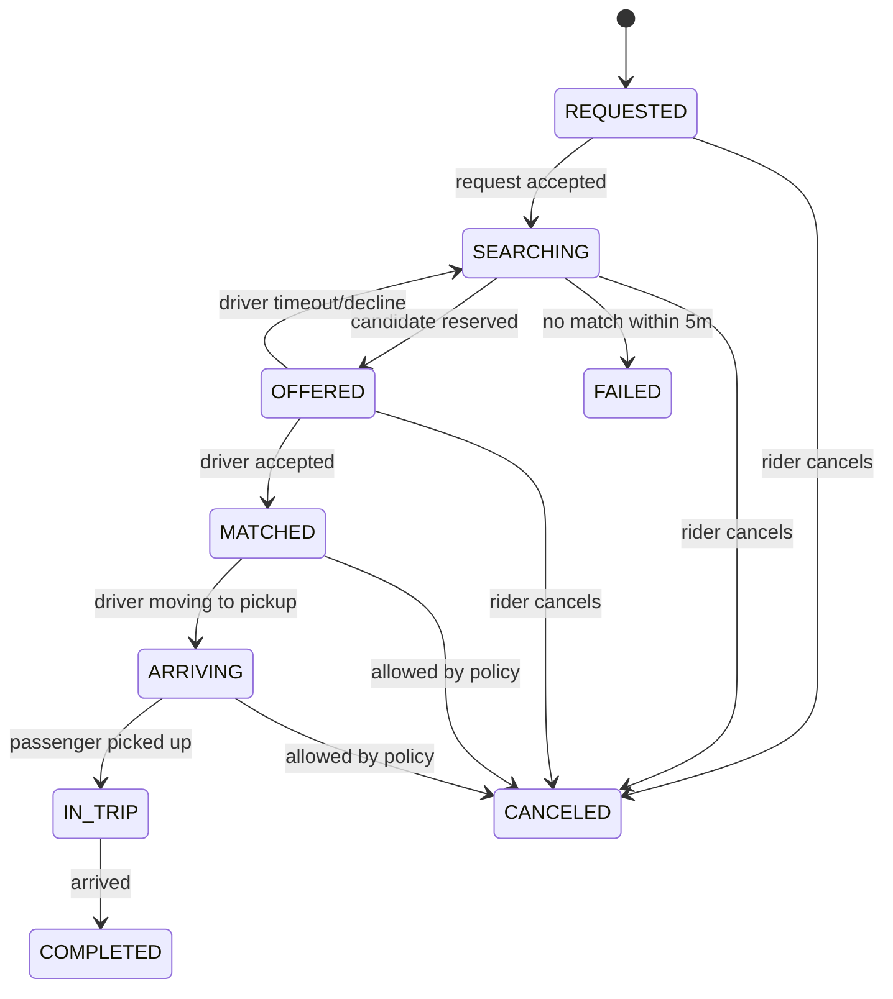

# Uber 서비스: User Flow 기반 DB 선택

## 서론

시스템 설계에서 **"이 데이터는 어떤 비즈니스 흐름(User Flow)에 속해 있는가?"** 를 먼저 정의해야 합니다.

데이터의 성격이 DB의 종류를 결정하기 때문입니다.

제 생각에 이러한 서비스를 구축할 때, 가장 중요한 것 중 하나가 어떤 DB를 선택하느냐 라고 생각합니다. 

따라서 이번 과제는 앱 플로우에 따라 어떤 DB를 선택해야 하는지를 중점적으로 살펴보려고 합니다.

---

## 1. 한눈에 보는 요약

| 단계                     | 데이터 성격                                 | 요구사항                          | 선택                          |
| :----------------------- | :------------------------------------------ | :-------------------------------- | :---------------------------- |
| **호출 생성**      | 상태 전이가 명확함 (REQUESTED -> SEARCHING) | 강한 정합성, 중복 방지            | **DynamoDB**            |
| **기사 위치 갱신** | 초당 수만 건 발생, 최신 값만 중요함         | 초저지연(ms), 자동 삭제(TTL)      | **Redis Cluster**       |
| **주변 기사 검색** | 지리적(Geo) 기반 조회                       | 위치 인덱싱, 빠른 읽기            | **Redis (GEO/H3)**      |
| **매칭 확정**      | 중복 배차 절대 금지 (Race Condition 방지)   | 트랜잭션, 원자적 쓰기             | **DynamoDB (Transact)** |
| **실시간 추적**    | 기사 위치를 승객 앱에 뿌려줌                | 높은 Fan-out, 일부 유실 허용      | **Redis + WebSocket**   |
| **위치 이력/기록** | 대량 데이터 누적, 나중에 다시 읽기(Replay)  | 순차적 기록, 저렴한 저장 비용     | **Kafka + S3**          |
| **운영/CS 검색**   | 다양한 조건(ID, 시간, 상태)으로 검색        | 전문 검색(Full-text), 유연한 쿼리 | **OpenSearch**          |

---

## 2. 왜 하나의 DB로 해결할 수 없을까?

Software에는 아쉽게도.. Silver Bullet는 없습니다.

같은 "위치 데이터"라도 흐름에 따라 성질이 완전히 다르기 때문입니다.

* **현재 위치:** "지금" 매칭을 위해 필요합니다. 1분만 지나도 필요 없는 데이터가 됩니다. (빠른 속도 중요 →  **Redis** )
* **위치 이력:** "어제" 사고가 났을 때 경로 분석을 위해 필요합니다. 양이 많습니다. (저렴한 저장 비용 중요 →  **S3** )

이 두 데이터를 하나의 RDBMS(예: PostgreSQL)에 넣고 초당 수만 번 업데이트하면, 인덱스 갱신 비용 때문에 전체 시스템에 문제가 생길 가능성이 높습니다.

---

## 3. 주요 Flow별 상세 분석 및 근거

### A. 호출 및 매칭 (Business Truth)

* **핵심:** 결제나 배차처럼 "돈"과 "신뢰"에 직결되는 데이터입니다.
* **선택: DynamoDB / RDBMS**
  * **이유:** `Conditional Write`가 필요합니다. (예: "이미 배차된 기사가 아닐 때만 수락 처리해라")
  * **차이점:** RDBMS도 가능하지만, Uber 규모의 급격한 트래픽 증가에는 관리형 서비스인 DynamoDB가 수평 확장에 유리합니다.

### B. 기사 위치 및 실시간 검색 (Hot State)

* **핵심:** 데이터가 쉴 새 없이 바뀌며, 아주 빨라야 합니다.
* **선택: Redis Cluster (with H3/GEO)**
  * **이유:** 기사는 매초 위치를 보냅니다. 이를 디스크 DB에 쓰면 부하를 견딜 수 없습니다. 인메모리 방식인 Redis로 최신 상태만 유지합니다.
  * **팁:** Uber는 지구를 육각형(H3 Cell)으로 나누어 관리합니다. 내 근처 육각형에 있는 기사만 찾으면 되므로 검색 범위를 극적으로 줄일 수 있습니다.

### C. 데이터 로깅 및 분석 (Event Stream)

* **핵심:** 지나간 데이터는 수정하지 않습니다(Append-only). 분석을 위해 쌓아둡니다.
* **선택: Kafka -> S3 (Data Lake)**
  * **이유:** 위치 이벤트를 Kafka에 던져두면, 하나는 실시간 추적 서버가 가져가고, 다른 하나는 S3에 저장합니다. 시스템 간 결합도를 낮추는 핵심 장치입니다.

### D. 운영 도구 (Secondary Index)

* **핵심:** 상담원이 "승객 ID로 지난주 호출 목록 보여줘"라고 할 때 필요합니다.
* **선택: OpenSearch**
  * **이유:** 전문적인 검색(필터링, 기간 조회 등)은 DynamoDB에서 비효율적입니다. 데이터를 비동기로 OpenSearch에 복제하여 검색 전용으로 사용합니다.

---

## 4. DB 선택을 위한 질문

다음 질문에 답하다 보면 최적의 DB를 정할 수 있습니다.

1. **이 데이터가 원본인가(Source of Truth)?**
   * 절대 유실되면 안 됨 → DynamoDB / RDBMS
   * 잠시 사라져도 다음 갱신 때 복구됨 → Redis
2. **최신 값만 필요한가, 이력이 중요한가?**
   * 최신 값만 중요 → Redis
   * 과거 기록 필수 → Kafka / S3 / Cassandra
3. **조회 패턴이 무엇인가?**
   * ID로 딱 하나만 조회 → DynamoDB / Key-Value
   * 반경 1km 이내 검색 → Redis GEO / H3
   * 여러 필드로 검색/필터링 → OpenSearch
4. **쓰기 부하가 얼마나 심한가?**
   * 초당 수만 건의 단순 업데이트 → Redis
   * 중요한 상태 변경 트랜잭션 → DynamoDB Transact

---

## 5. 결론: "User Flow가 DB를 결정한다"

Uber와 같은 대규모 시스템 설계의 핵심은 적재적소 라고 생각합니다.

* **정합성**이 중요한 곳엔 **DynamoDB**를,
* **속도**가 중요한 곳엔 **Redis**를,
* **저장량과 분석**이 중요한 곳엔 **S3**를

각각의 흐름에 맞춰 배치해야 합니다.
