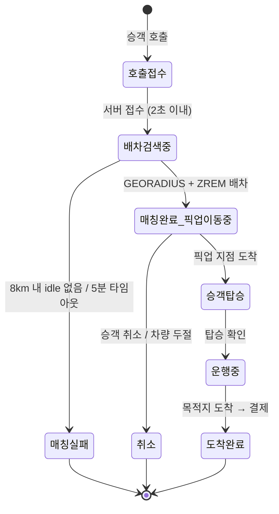
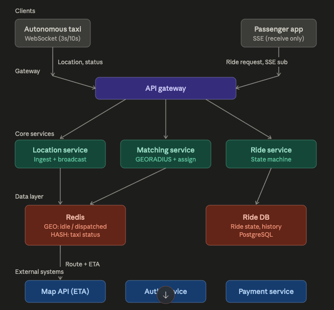

# 자율주행 택시 호출 서비스 시스템 설계

## 1. 문제 이해 및 설계 범위 확정

### 시나리오 구체화

자율주행 택시 호출 서비스를 설계한다. 인간 택시와의 핵심 차이점은 다음과 같다.

- **거절권이 없다**: 인간 기사는 콜을 수락/거절할 수 있지만, 자율주행 택시는 서버가 일방적으로 배차한다. 이로 인해 매칭 로직이 결정론적으로 단순해진다.
- **ETA를 차량 내비에서 직접 제공**: 자율주행 차량은 자체 경로 계획을 갖고 있으므로, 위치 업데이트 시 ETA를 함께 서버로 전송한다. 외부 지도 API에 대한 의존이 크게 줄어든다.

### 핵심 상태 전이



- **호출 접수 → 배차 검색 중**: 승객이 호출 버튼을 누르면 서버가 주변 idle 차량을 검색한다.
- **배차 검색 중 → 매칭 완료**: idle 풀에서 가장 가까운 차량을 원자적으로 배차한다.
- **매칭 완료 → 승객 탑승**: 차량이 픽업 지점까지 이동. 승객은 차량 위치 + 픽업 ETA를 실시간으로 확인한다.
- **승객 탑승 → 운행 중**: 승객이 탑승하면 추적 대상이 "픽업 지점"에서 "목적지"로 전환된다.
- **운행 중 → 도착 완료**: 목적지 도착 후 결제 처리.
- **매칭 실패 / 취소**: 이상 상황 시 차량은 idle 풀로 복귀, 승객에게 알림.

### 규모 산정

| 항목 | 수치 |
|------|------|
| 동시 운행 차량 | 10,000대 |
| 일일 호출 수 | 500,000건 |
| 피크 시간대 집중도 | 평균 대비 5배 |
| 위치 갱신 지연 목표 | 5초 이내 |
| 매칭 완료 시간 목표 | 평균 30초 이내, 5분 초과 시 실패 |

**쓰기 부하 산정 (위치 업데이트)**:
- 피크 시 10,000대 × 대부분 3초 주기 = 약 3,300~4,000 writes/sec
- Redis 단일 인스턴스 GEOADD 기준 수만 ops/sec 처리 가능 → 병목 아님

---

## 2. 개략적 설계안

### 핵심 설계 결정 두 가지

이 시스템의 기술적 핵심은 두 가지다.

1. **공간 검색 (매칭)**: 10,000대 중 "빈 차 + 가장 가까운 순"으로 빠르게 찾기
2. **실시간 위치 갱신**: 차량이 계속 위치를 보내고, 매칭된 승객에게 5초 이내로 전달하기

### 전체 아키텍처 구성


**데이터 흐름 요약**:
- 차량 → WebSocket → Location Service → Redis GEO 갱신 + Pub/Sub publish
- Pub/Sub → 승객 SSE가 붙은 서버가 subscribe → SSE push (서버 인스턴스 무관하게 동작)
- 승객 호출 → Matching Service → GEORADIUS + ZREM으로 원자적 배차
- Ride Service가 상태 머신 관리, 풀 전이는 Lua(ZREM+GEOADD 2개만)로 원자성 보장

### 통신 방식

| 구간 | 프로토콜 | 이유 |
|------|----------|------|
| 차량 → 서버 | WebSocket | 양방향, 지속 연결. 위치+상태+ETA를 주기적으로 전송 |
| 서버 → 승객 | SSE | 단방향 푸시. WebSocket보다 가볍고 위치 수신만 하면 충분 |

### 상태별 위치 업데이트 주기

| 차량 상태 | 주기 | 이유 |
|-----------|------|------|
| idle (대기 중) | 10초 | 매칭 정확도에 큰 영향 없음. 트래픽/배터리 절약 |
| dispatched (픽업 이동 중) | 3초 | 승객이 실시간으로 보고 있음 |
| occupied (운행 중) | 3초 | 승객이 실시간으로 보고 있음 |

---

## 3. 상세 설계

### 3.1 차량 위치 저장: Redis GEO + 상태별 풀 분리

차량 위치는 영속 저장할 필요 없이 현재 스냅샷만 유지하면 된다. Redis GEO를 사용하며, **상태별로 별도 GEO SET을 운영**한다.

#### Redis GEO의 내부 구조: Geohash

Redis GEO가 "반경 N km 내 가까운 순"이라는 질의를 효율적으로 처리할 수 있는 이유는 내부적으로 **Geohash** 기반 인덱싱을 사용하기 때문이다.

Geohash는 2차원 좌표(위도, 경도)를 1차원 문자열로 변환하는 기법이다. 지구 표면을 재귀적으로 사분할하면서 각 분할에 비트를 할당한다. 위도 범위를 반으로 나눠 상반이면 1, 하반이면 0을 부여하고, 경도도 마찬가지로 처리한 뒤, 경도 비트와 위도 비트를 번갈아 끼워 넣어(interleave) 하나의 정수로 합친다. 이 정수를 Base32로 인코딩하면 `wydm9q` 같은 문자열이 된다.

핵심 특성은 **접두사가 같으면 공간적으로 가깝다**는 점이다. `wydm9q`와 `wydm9r`은 인접한 셀을 나타낸다. 이 덕분에:

- Redis는 geohash 값을 Sorted Set의 score로 사용한다. `GEOADD`는 내부적으로 좌표를 52비트 geohash 정수로 변환한 뒤 `ZADD`를 실행하는 것이다.
- `GEORADIUS`는 중심점의 geohash를 계산하고, 반경에 해당하는 접두사 범위를 산출한 뒤, Sorted Set에서 해당 범위를 스캔한다. 전체 데이터를 순회하지 않고 범위 질의로 후보를 빠르게 좁힌다.
- 시간 복잡도는 O(N+log(M))이다. M은 Sorted Set 전체 크기, N은 반경 내 결과 수. 10,000대 규모에서는 사실상 즉시 응답한다.

**Geohash의 한계**: 경계 문제(edge case)가 존재한다. 물리적으로 매우 가까운 두 지점이 서로 다른 geohash 셀에 속할 수 있다. Redis의 `GEORADIUS`는 중심 셀뿐 아니라 인접 8개 셀까지 함께 검색하여 이 문제를 보완한다.

```
taxi:idle:locations        ← 배차 가능한 차량만
taxi:dispatched:locations  ← 픽업 이동 중인 차량
taxi:occupied:locations    ← 승객 탑승 중인 차량
```

차량 메타데이터는 별도 해시로 관리한다.

```
HSET taxi:status:{taxi_id} {
  status: "idle" | "dispatched" | "occupied",
  last_updated: timestamp,
  current_ride_id: "ride_xxx" | null,
  passenger_id: "user_xxx" | null
}
```

**왜 풀을 분리하는가?**
- 매칭 시 `taxi:idle:locations`만 검색하면 되므로 불필요한 필터링이 없다.
- `ZREM`이 원자적이므로, idle 풀에서의 제거 자체가 동시성 제어를 해결한다 (후술).

### 3.2 매칭 로직: 반경 점진 확장 + ZREM 원자적 배차

**반경 점진 확장 (Tiered Radius)**:
1. 1km → 3km → 8km 순으로 검색 반경을 확장한다.
2. 8km까지 idle 차량이 없으면 매칭 실패로 처리한다.
3. 5분 타임아웃 초과 시에도 실패.

**동시성 해결: ZREM 기반 낙관적 배차**:

두 승객이 동시에 같은 차량에 매칭되는 문제를 방지해야 한다. Lua 스크립트로 GEORADIUS + 상태 변경을 원자적으로 묶을 수 있지만, Lua 실행 중 Redis 전체가 블로킹되어 피크 시간대 병목이 될 수 있다.

대안으로 **ZREM 기반 낙관적 접근**을 사용한다:

```
1. GEORADIUS taxi:idle:locations <lng> <lat> 1km ASC COUNT 5
   → [taxi_42, taxi_87, taxi_15] (가까운 순)

2. ZREM taxi:idle:locations taxi_42
   → 1 (성공: 내가 이 차량을 잡았다)
   → 0 (실패: 다른 요청이 먼저 잡음 → taxi_87로 재시도)

3. GEOADD taxi:dispatched:locations <lng> <lat> taxi_42

4. HSET taxi:status:taxi_42 status dispatched ride_id ride_xxx
```

**왜 이게 동작하는가?**
- Redis GEO는 내부적으로 Sorted Set 기반이므로 `ZREM`으로 멤버를 제거할 수 있다.
- `ZREM`은 원자적 연산이므로, 먼저 성공한 요청만 `1`을 받고 나머지는 `0`을 받는다.
- Lua 스크립트 대비 Redis 블로킹 시간이 "전체 검색 + 상태 변경"이 아닌 "ZREM 1건"으로 최소화된다.

### 3.3 실시간 위치 전달: 차량 → 서버 → 승객

**차량 → 서버 (WebSocket)**:

차량은 상태에 따라 3초 또는 10초 주기로 위치를 전송한다. 자율주행 차량이므로 내비에서 ETA를 함께 보낸다.

```json
{
  "taxi_id": "taxi_42",
  "lat": 37.5665,
  "lng": 126.9780,
  "status": "dispatched",
  "eta_seconds": 180,
  "timestamp": 1717000000
}
```

**서버 → 승객 (SSE)**:

매칭 시점에 승객 클라이언트가 `taxi_id`를 받는다. 이후 SSE로 해당 차량의 위치 업데이트를 구독한다.

서버 내부에서는 `taxi_id → passenger_sse_connection` 매핑을 유지한다. Location Service가 차량으로부터 위치를 받으면, 매핑된 승객의 SSE 연결로 ETA와 함께 패스스루한다.

**ETA 전략**:
- **기본**: 차량 내비에서 계산한 ETA를 그대로 패스스루 (외부 API 호출 불필요)
- **폴백**: 차량 내비 ETA가 누락되거나 신뢰도가 낮을 경우, 외부 지도 API로 계산
- **갱신 빈도**: 차량 위치가 올 때마다 (3초) ETA도 함께 갱신. 별도 주기 계산 불필요

### 3.4 이상 상황 처리

아키텍처 관점에서 중요한 것은 세부 정책이 아니라 **감지 → 상태 전이 → 후속 처리** 파이프라인의 존재다.

#### 차량 통신 두절

**감지**: Heartbeat 모니터링 컴포넌트가 차량의 마지막 위치 보고 시각을 추적한다. 위치 업데이트 주기(3초/10초) 대비 일정 배수(예: 3~5배)를 임계치로 설정한다.

**일시적 단절**:
- 차량은 로컬에 위치 데이터를 캐싱하고, 재연결 시 벌크 전송한다.
- 승객 화면에는 "마지막 수신 위치"를 유지하면서 "위치 업데이트 지연 중" 표시.

**영구적 단절 (임계치 초과 시)**:
- 상태에 따라 심각도가 다르다:
  - `idle`: 매칭 풀에서 제거. 승객 영향 없음.
  - `dispatched`: 승객이 대기 중. 재매칭 트리거 + 승객 알림.
  - `occupied`: 승객이 차량 안에 탑승 중. 안전 관련 이슈이므로 운영팀 에스컬레이션.
- 세부 임계치와 정책은 설정값으로 분리하여 운영 단계에서 조정한다.

#### 승객 측 이상 상황

- **앱 종료**: SSE 연결이 끊기므로 위치 푸시만 중단. 운행 자체에는 영향 없음. 앱 재접속 시 현재 ride 상태를 조회하여 복원.
- **호출 취소**: 정책에 따라 환불 처리 후, 배차된 차량을 다시 idle 풀로 복귀. `GEOADD taxi:idle:locations`으로 재등록.
- **승객 미탑승 (노쇼)**: 정책 문제. 일정 시간 대기 후 자동 취소 및 과금 처리. 차량은 idle로 복귀.

### 3.5 외부 API 장애 대응

- **지도 API**: 차량 내비에서 ETA를 직접 제공하므로 의존도가 낮다. 초기 경로 표시 또는 경로 이탈 시 재계산 용도로만 사용. 장애 시에는 차량 내비 ETA만으로 운영 가능하며, 경로 표시는 직선 경로로 대체하거나 "경로 정보 일시 불가" 표시.
- **결제 API**: 도착 완료 시점에만 호출. 장애 시 결제 요청을 큐에 넣고 비동기 재시도. 운행 자체는 차단하지 않는다.
- **인증 API**: 호출 시점에 한 번 확인. 토큰 기반이라면 로컬 검증으로 장애 시에도 동작 가능.

### 3.6 수요 폭주 대응

행사 일정, 과거 패턴 등을 통해 수요 폭주를 사전 예측할 수 있는 상황을 가정한다. (예: 잠실 주경기장 콘서트 종료 직후 2만 건 호출)

**기술적 대응**:
- **사전 차량 배치**: 예측 지점 반경에 idle 차량을 미리 이동시켜 둔다. 자율주행이므로 서버 명령으로 차량 재배치가 가능하다 (인간 택시 대비 큰 장점).
- **매칭 서비스 스케일아웃**: 예측 시점에 맞춰 Matching Service 인스턴스를 사전 확장.
- **Redis 읽기 부하 분산**: 피크 시 GEORADIUS 쿼리가 동시에 몰린다. Redis Replica를 두고 읽기를 분산하거나, idle 풀의 스냅샷을 짧은 주기로 로컬 캐시에 복제.
- **Rate Limiting + 큐잉**: 초당 처리 가능 매칭 수를 초과하면 요청을 큐에 넣고 순차 처리. "대기 중 N번째" 표시.

**정책/운영 대응**:
- **서지 프라이싱**: 수요 폭주 지역/시간대에 요금 인상. 수요 억제 + 주변 차량 유인 효과.
- **대기열 + 예상 대기 시간 안내**: 즉시 매칭 불가 시 "현재 대기 약 15분" 표시. 승객이 대중교통 등 대안을 선택할 수 있게 한다.
- **사전 예약 유도**: 콘서트 종료 시각이 예측 가능하므로, 앱 내에서 사전 예약을 유도하여 수요를 시간대별로 분산.

---

## 4. 설계 장점

- **자율주행 특성 활용**: 기사 수락/거절 단계가 없어 매칭이 결정론적이고 빠르다. 차량 내비에서 ETA를 직접 제공하여 외부 API 의존도를 최소화했다. 수요 폭주 시 서버 명령으로 차량을 사전 배치할 수 있다.
- **ZREM 기반 동시성 제어**: Lua 스크립트 대비 Redis 블로킹 최소화. 개별 커맨드 조합으로 동시성 문제를 해결하면서도 로직이 명확하다.
- **상태별 풀 분리**: idle/dispatched/occupied를 별도 GEO SET으로 분리하여 매칭 시 불필요한 필터링을 제거하고, ZREM 자체가 동시성 제어를 겸한다.
- **통신 방식 차등**: 차량은 WebSocket (양방향, 상시 연결), 승객은 SSE (단방향, 경량). 역할에 맞는 프로토콜 선택으로 서버 리소스를 효율적으로 사용한다.

---

## 5. 설계 단점 / 트레이드오프

- **Redis 단일 장애점**: 현재 설계는 Redis 단일 인스턴스 기반. 장애 시 매칭과 위치 추적이 동시에 중단된다. Redis Sentinel 또는 Cluster 구성이 필요하지만, GEO 연산의 클러스터 호환성에 주의해야 한다 (동일 슬롯 내 키 관리 필요).
- **ZREM 기반 매칭의 재시도 오버헤드**: 피크 시 동일 차량에 동시 매칭 시도가 많으면 ZREM 실패 → 재시도 → 다음 후보 순회가 반복될 수 있다. 극단적 경합 시에는 Lua 스크립트 기반 원자적 매칭으로 전환하는 것이 나을 수 있다.
- **SSE 연결 관리**: 동시 활성 승객이 많아지면 서버가 유지해야 하는 SSE 연결 수가 부담이 될 수 있다. 연결 수 기준 수평 확장이 필요하며, 로드밸런서의 sticky session 또는 연결 레지스트리가 필요해진다.
- **차량 내비 ETA 의존**: 차량 내비의 ETA 정확도가 떨어지면 승객 경험이 직접적으로 악화된다. 내비 ETA와 실제 도착 시간의 오차를 모니터링하고, 임계치 초과 시 외부 지도 API 폴백으로 전환하는 로직이 필요하다.

---

## 6. 마무리

### 추가로 고려할 수 있는 주제들

- **Geofencing 기반 동적 주기 조정**: 특정 구역(공항, 역세권 등)에서는 차량 밀도가 높아 업데이트 주기를 낮추고, 외곽에서는 높이는 등 위치 기반 적응형 주기를 적용할 수 있다.
- **매칭 품질 개선**: 단순 직선 거리가 아닌 도로망 기반 실제 이동 시간을 기준으로 매칭하면 승객 경험이 개선된다. 이를 위해서는 차량이 보고하는 ETA를 매칭 기준으로 활용하는 것도 방법이다.
- **운행 이력 비동기 적재**: 현재 설계에서 Redis는 현재 스냅샷만 보유한다. 운행 이력, 이동 궤적 등은 별도 파이프라인(Kafka → Data Warehouse 등)으로 비동기 적재하여 분석에 활용할 수 있다.
- **멀티 리전 확장**: 현재는 단일 대도시권 가정이지만, 복수 도시로 확장 시 도시별 Redis 인스턴스 분리 + 글로벌 라우팅 레이어가 필요하다.