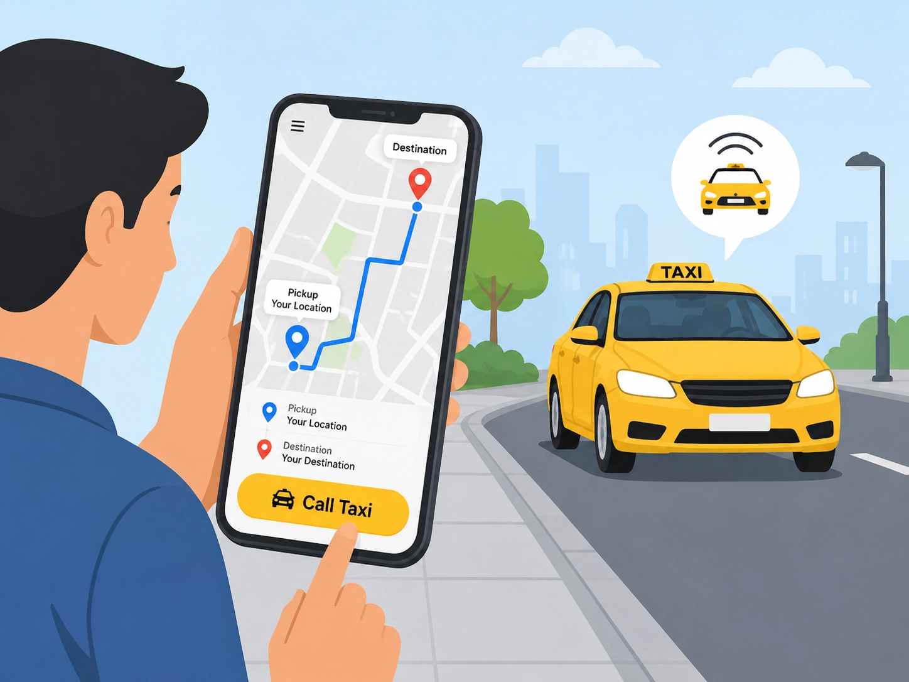
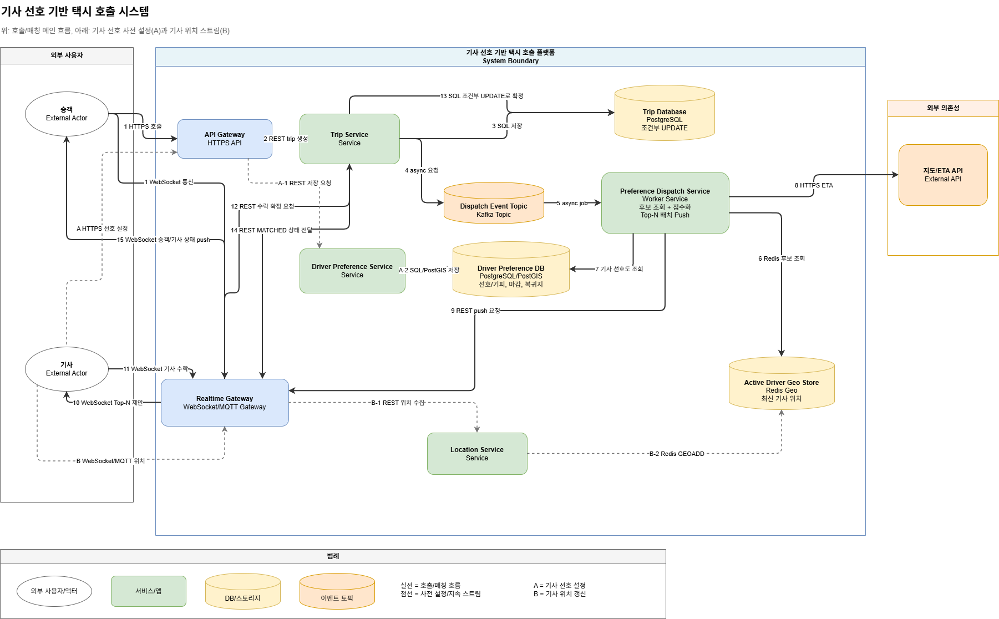

# Week 2 과제: 택시 호출 서비스 설계

## 1. 문제 이해 및 설계 범위 확정

### 시나리오

승객이 현재 위치와 목적지를 포함해 택시를 호출하면, 시스템은 주변의 운행 가능한 기사 후보를 찾고, 단순히 가까운 순서가 아니라 기사의 선호 지역, 기피 지역, 마감 시간, 복귀지를 함께 고려해 추천 콜을 제안한다.

기사 앱에는 미리 선호 조건을 입력할 수 있는 기능이 있고, 운행 중에는 기사 위치가 거의 실시간으로 서버에 업데이트된다. 매칭 이후 승객은 기사 수락 여부와 기사 위치를 실시간으로 확인할 수 있다.

이 설계의 핵심은 "가까운 택시 찾기"가 아니라, 승객 대기시간을 지키면서도 기사 선호와 마감 동선을 반영해 수락 가능성이 높은 기사에게 우선 제안하는 것이다.

### 설계 범위 (In / Out of Scope)

| 포함 (In Scope) | 제외 (Out of Scope) |
|---|---|
| 목적지 기반 택시 호출 | 회원가입, 인증, 기사 등록 절차 |
| 기사 위치 실시간 업데이트 | 요금 산정, 결제, 리뷰, 정산 |
| Redis Geo 기반 주변 기사 후보 조회 | 장기 이용 이력 분석 |
| 기사 선호조건 기반 점수화 | 복잡한 ML 추천 모델 |
| Top-N 기사 대상 콜 제안 | 자체 지도/경로 탐색 알고리즘 |
| 기사 수락 후 trip 상태 확정 | 외부 지도 서비스 장애 대응 상세 |
| 후보 0명/미수락 시 재시도와 실패 처리 |  |

### 시스템 구성 전제

- 승객과 기사는 이미 로그인된 상태라고 가정한다.
- 승객은 호출 시 목적지를 반드시 입력한다.
- 외부 지도/ETA API는 신뢰 가능하다고 가정한다.
- 지도 API는 도로 기반 ETA 계산에 사용하고, Redis Geo는 1차 후보 조회에만 사용한다.
- 결제, 리뷰, 정산은 이번 MVP 범위에서 제외한다.

### 기능 요구사항

- 기사 앱은 선호 지역, 기피 지역, 마감 시간, 복귀지를 설정할 수 있다.
- 기사 앱은 운행 중 위치를 WebSocket 또는 MQTT로 서버에 지속적으로 전송한다.
- 승객 호출 시 시스템은 Redis Geo에서 반경 내 운행 가능한 기사 후보를 조회한다.
- 시스템은 기사 위치, 목적지, ETA, 선호조건을 기반으로 후보 기사를 점수화한다.
- 시스템은 점수 상위 기사에게 Top-N 배치 방식으로 콜을 제안한다.
- 기사가 수락하면 Trip Service가 trip 상태를 `MATCHED`로 확정한다.
- 여러 기사가 동시에 수락해도 하나의 기사만 매칭되도록 보장한다.

### 비기능 요구사항 (시간 / 지연 목표)

| 항목 | 목표 |
|---|---|
| 호출 접수 응답 시간 | 호출 요청 -> "기사 검색 중" 진입까지 **2초 이내** |
| 매칭 완료 시간 | 평균 **30초 이내**, 5분 초과 시 실패 처리 |
| 위치 추적 갱신 지연 | 기사 위치 변화 -> 승객 화면 반영 평균 **5초 이내** |

### 개략적 규모 추정

| 항목 | 수치 |
|---|---|
| 서비스 지역 | 단일 대도시권 |
| 누적 가입 승객 | 약 2,000,000명 |
| MAU / DAU | 약 800,000명 / 약 200,000명 |
| 누적 가입 기사 | 약 50,000명 |
| 동시 운행 기사 | 약 10,000명 |
| 일일 호출 수 | 약 500,000건 |
| 피크 시간 호출 집중도 | 평균 대비 **5배 이상** |
| 피크 시간대 | 평일 출근 07:30-09:30 / 퇴근 18:00-20:00 / 금·토 심야 23:00-02:00 |


---

## 2. 개략적 설계안 제시 및 동의 구하기

### 핵심 흐름

1. 승객이 목적지를 포함한 현재 위치정보로 택시 호출을 요청한다.
2. Trip Service가 출발지에서 목적지까지의 택시 콜을 생성한다.
3. Trip Service가 trip 정보를 DB에 `REQUESTED` 상태로 저장한다.
4. Trip Service가 Kafka Topic에 `trip.requested` 이벤트를 발행하고, 승객에게는 "기사 검색 중" 상태를 응답한다.
5. Preference Dispatch Service가 Kafka 이벤트를 소비해 택시기사 후보를 조회하고 점수화한다.
6. Preference Dispatch Service가 Redis Geo에서 승객 주변 기사 위치를 조회한다.
7. Preference Dispatch Service가 기사 선호도 정보를 조회한다.
8. 지도 API를 사용해 후보 기사들의 ETA를 계산한다.
9. Preference Dispatch Service가 Realtime Gateway에 "이 기사들에게 이 콜을 WebSocket으로 보내줘"라고 API 요청을 보낸다.
10. Realtime Gateway가 기사 앱에 WebSocket으로 콜을 제안한다.
11. 기사가 수락한다.
12. Realtime Gateway가 Trip Service에 수락 확정 API를 호출한다.
13. Trip Service가 DB에서 조건부 UPDATE로 택시콜 정보를 업데이트한다.
14. Trip Service가 매칭된 상태를 Realtime Gateway에 전달한다.
15. Realtime Gateway가 승객에게 기사 수락 정보를 push한다.

### 개략적 아키텍처 다이어그램



---

## 3. 상세 설계

### 설계 대상 컴포넌트 사이의 우선순위 정하기 / 아키텍처 다이어그램

이번 설계에서 가장 중요한 컴포넌트는 다음 순서로 본다.

1. **Trip Service**
   - trip 상태의 source of truth
   - `REQUESTED`, `MATCHING`, `MATCHED`, `FAILED` 상태 전이 담당
   - 기사 수락 시 PostgreSQL 조건부 UPDATE로 first-accept-wins 보장

2. **Preference Dispatch Service**
   - Kafka에서 `trip.requested` 이벤트 소비
   - Redis Geo에서 후보 기사 조회
   - 기사 선호조건과 ETA를 기반으로 점수화
   - Top-N 배치 Push와 재시도 정책 담당

3. **Realtime Gateway**
   - 기사 앱과 승객 앱의 WebSocket 연결 유지
   - 기사에게 콜 제안
   - 기사 수락 이벤트 수신
   - 승객에게 매칭 상태와 기사 위치 push

4. **Location Service + Redis Geo**
   - 기사 위치 업데이트 수집
   - Redis Geo에 최신 기사 위치 저장
   - 매칭 가능한 기사 후보를 빠르게 찾기 위한 hot path

5. **Driver Preference Service + Preference DB**
   - 기사 선호 지역, 기피 지역, 마감 시간, 복귀지 저장
   - 점수화 시 선호조건 제공

---

### 3-1. 기사 위치 업데이트 주기

기사 위치는 상태에 따라 업데이트 주기를 다르게 둘 수 있다.

| 상태 | 위치 업데이트 주기 | 이유 |
|---|---:|---|
| 대기 중 | 5초 | 매칭 후보 조회에 필요한 최신성 확보 |
| 콜 제안 중 | 3-5초 | 제안 시점의 위치 신뢰도 확보 |
| 픽업 이동 중 | 2-3초 | 승객 화면에 기사 접근 상황 표시 |
| 운행 중 | 3-5초 | 승객 화면과 운영 모니터링에 사용 |

위치 업데이트가 한두 번 유실되어도 다음 위치가 곧 들어오기 때문에, 모든 위치 메시지에 강한 전달 보장을 요구하지는 않는다.

---

### 3-2. 기사 위치 저장 - Redis Geo

기사 위치는 Redis Geo에 저장한다.

```text
GEOADD active_drivers 127.098 37.511 driver_123
GEOADD active_drivers 127.091 37.505 driver_456
```

승객 호출 시에는 다음과 같이 반경 내 후보 기사를 조회한다.

```text
GEOSEARCH active_drivers
  FROMLONLAT 127.100 37.510
  BYRADIUS 3 km
  ASC
  COUNT 50
```

Redis Geo는 기사 최신 위치를 메모리에 저장하고, 승객 위치 기준 반경 내 후보 기사를 빠르게 찾기 위한 저장소다. 도로 기반 ETA까지 계산하지는 않으므로, Redis Geo는 1차 후보 조회에만 사용하고 최종 순위는 지도 API와 기사 선호조건으로 점수화한다.

PostgreSQL/PostGIS도 공간 질의를 지원하지만, 동시 운행 기사 10,000명이 5초마다 위치를 보내면 약 2,000 updates/sec가 발생할 수 있다. 최신 위치처럼 자주 바뀌고 오래 보관할 필요가 적은 데이터는 Redis Geo가 더 적합하다.

---

### 3-3. 검색 반경과 결과 처리

후보 기사 조회 결과가 0명이면 바로 실패시키지 않는다.

정책:

1. 최초 반경 3km에서 후보 조회
2. 후보 0명 또는 수락 없음이면 반경을 5km, 7km처럼 점진적으로 확대
3. 다음 Top-N 배치 기사에게 재시도
4. 5분이 지나도 매칭되지 않으면 `FAILED` 처리

도심에서는 작은 반경으로도 충분한 후보가 나오지만, 외곽에서는 후보가 적을 수 있으므로 반경 확대 정책이 필요하다.

---

### 3-4. 위치 · 경로 · ETA 전달 / 갱신 방식

기사 앱과 서버 사이의 실시간 통신은 WebSocket 또는 MQTT를 고려한다.

| 구분 | WebSocket | MQTT |
|---|---|---|
| 성격 | 양방향 연결 | pub/sub 메시징 |
| 사용 방식 | 앱과 서버가 직접 메시지 교환 | topic에 publish/subscribe |
| 브라우저 지원 | 좋음 | 브라우저는 보통 WebSocket 기반 MQTT 필요 |
| 모바일 위치 업데이트 | 가능 | 매우 적합 |
| 메시지 보장 | 직접 구현 필요 | QoS 제공 |
| 운영 난이도 | 상대적으로 익숙함 | Broker 운영 필요 |

MVP에서는 WebSocket으로 통일해도 충분하다. 다만 기사 위치 업데이트는 작고 빈번한 메시지이므로, 위치 스트림 부하가 커지면 MQTT Broker 기반 구조로 확장할 수 있다.

---

### 3-5. 매칭 대상 선정 전략

강남으로 가는 콜이 들어왔다고 해서 강남 선호 기사에게만 보내지는 않는다. 선호 지역은 hard filter가 아니라 soft scoring 요소로 둔다.

#### Hard filter

- 온라인이 아님
- 이미 운행 중
- 위치 정보가 너무 오래됨
- 픽업까지 너무 멂
- 마감 시간 안에 운행 불가능
- 명시적 기피 지역에 해당

#### Soft scoring

- 픽업 ETA가 짧은가
- 목적지가 선호 지역인가
- 목적지가 복귀 방향과 맞는가
- 운행 종료 예상 시각이 마감 시간과 맞는가
- 목적지가 기피 지역과 가까운가

예시:

```text
기사 A: 픽업 5분 + 강남 선호 + 마감 여유 있음 = 높은 점수
기사 B: 픽업 3분 + 선호 없음 = 중간 점수
기사 C: 픽업 4분 + 강남 기피 = 제외 또는 큰 감점
기사 D: 픽업 2분 + 마감 10분 전 = 제외
```

점수 상위 기사에게는 Top-N 배치 방식으로 제안한다.

```text
0~10초: 상위 3명에게 추천 콜 제안
10~20초: 응답 없으면 다음 5명에게 제안
20~30초: 반경 확대 후 추가 후보에게 제안
5분 초과: FAILED 처리
```

1명씩 순차 제안하면 평균 30초 매칭 목표를 맞추기 어렵고, 전체 기사에게 동시에 보내면 기사 경험이 나빠진다. Top-N 배치 Push는 승객 대기시간과 기사 선택권 사이의 절충안이다.

---

### 3-6. 이상 상황 판단 · 처리

| 상황 | 처리 |
|---|---|
| 기사 앱 연결 끊김 | Realtime Gateway가 연결 상태를 감지하고 후보에서 제외 |
| 기사 위치 오래됨 | 마지막 위치 업데이트가 일정 시간 이상 오래되면 후보에서 제외 |
| 기사 무응답 | 다음 Top-N 배치로 재시도 |
| 여러 기사 동시 수락 | Trip Service가 PostgreSQL 조건부 UPDATE로 1명만 확정 |
| 승객 호출 취소 | Trip Service가 상태를 `CANCELED`로 변경하고 기사 제안 중단 |
| 5분 초과 미매칭 | Trip Service가 상태를 `FAILED`로 변경 |

동시 수락 처리는 다음 SQL로 해결한다.

```sql
UPDATE trips
SET driver_id = :driver_id,
    status = 'MATCHED',
    matched_at = NOW()
WHERE trip_id = :trip_id
  AND status = 'MATCHING';
```

`affected_rows = 1`이면 해당 기사가 첫 수락자이고, `0`이면 이미 다른 기사가 먼저 수락한 것이다.

---

### 3-7. 외부 지도 / 경로 서비스 의존 관리

외부 지도 API는 ETA 계산에 사용한다. 단, 모든 기사에게 ETA를 계산하면 비용과 지연이 커지므로 다음 순서로 처리한다.

1. Redis Geo로 반경 내 후보 기사 50명 조회
2. 후보 기사에 대해서만 ETA batch 호출
3. ETA와 기사 선호조건을 함께 사용해 최종 점수화

이번 MVP에서는 외부 지도 API가 신뢰 가능하다고 가정한다. 장애 대응은 범위에서 제외하지만, 확장 시에는 ETA 캐싱, circuit breaker, 직선거리 기반 fallback을 고려할 수 있다.

---

### 3-8. 수요 폭주 예측 시 대응

잠실 콘서트 종료처럼 특정 지역과 시간에 호출이 몰리는 상황에서는 다음 전략을 고려한다.

- 해당 지역 Dispatch Worker 사전 증설
- Redis Geo 조회 반경과 후보 수 동적 조정
- 기사 앱에 사전 인센티브 또는 선호 지역 이동 추천
- ETA API batch 호출량 제한
- 호출 실패 전 대기열 또는 재시도 정책 강화

---

## 4. 설계 장점

- 호출 접수와 매칭 계산을 Kafka로 분리해 2초 이내 응답 목표를 달성하기 쉽다.
- Redis Geo를 사용해 주변 기사 후보를 빠르게 조회할 수 있다.
- 기사 선호도와 마감 동선을 반영해 기사 수락률과 만족도를 높일 수 있다.
- Top-N 배치 Push로 승객 대기시간과 기사 선택권을 균형 있게 다룬다.
- PostgreSQL 조건부 UPDATE로 추가 Redis Lock 없이 동시 수락 문제를 단순하게 해결한다.

---

## 5. 설계 단점

- 단순 거리 기반 매칭보다 점수화 로직이 복잡하다.
- 기사 선호도를 과하게 반영하면 승객 대기시간이 늘어날 수 있다.
- Kafka, Redis Geo, WebSocket 등 운영해야 할 컴포넌트가 늘어난다.
- 외부 지도 API 비용과 지연을 계속 관리해야 한다.
- 선호도 기반 추천 결과가 기사에게 불투명하게 느껴질 수 있다.

---

## 6. 마무리

이번 설계는 단순히 "가까운 기사"를 찾는 택시 호출 시스템이 아니라, 기사 선호 지역과 마감 동선을 반영해 수락 가능성이 높은 기사에게 우선 제안하는 시스템이다.

핵심 설계 판단은 다음과 같다.

- 최신 기사 위치는 Redis Geo로 관리한다.
- trip 상태의 정합성은 Trip Service와 PostgreSQL이 책임진다.
- 후보 조회와 점수화는 Kafka 뒤의 Dispatch Worker가 비동기로 처리한다.
- 앱과의 실시간 통신은 Realtime Gateway가 담당한다.
- first-accept-wins는 MVP에서 PostgreSQL 조건부 UPDATE로 처리한다.

대규모 시스템 설계에서 중요한 점은 처음부터 모든 최적화 계층을 넣는 것이 아니라, 현재 규모에서 필요한 컴포넌트와 나중에 확장할 컴포넌트를 구분하는 것이라고 생각했다.

---

## 📚 참고 자료

- 가상 면접 사례로 배우는 대규모 시스템 설계 기초
- Redis GEO 명령어: `GEOADD`, `GEOSEARCH`
- Kafka Topic과 Consumer 기반 비동기 처리
- WebSocket / MQTT 실시간 메시징 비교
