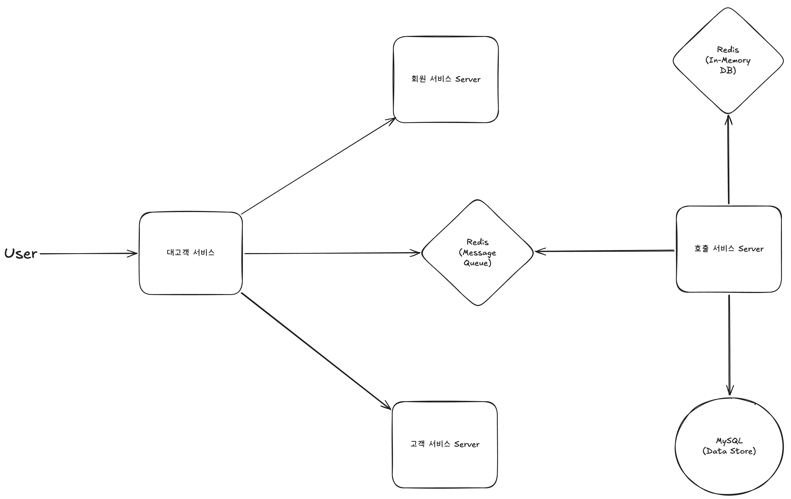

# Week 2 과제: 택시 호출 서비스 설계
## 1. 문제 이해 및 설계 범위 확정

### 시나리오

승객이 호출하면 주변 빈 택시를 찾아 매칭하고, 매칭된 택시가 픽업 지점에 도착할 때까지 승객은 택시 위치와 도착 예상 시간을 실시간으로 확인한다. 픽업 이후 목적지에 도착할 때까지 위치 추적이 이어진다.

그외 시나리오는 자유롭게 구체화해도 좋다.
자율주행택시, 빵택시, AI택시 등 OK.
브랜드 이름 지어도 됩니다 (본인 이름 등)

### 설계 범위 (In / Out of Scope)

| 포함 (In Scope) | 제외 (Out of Scope) |
|---|---|
| 호출 시점부터 도착 완료 시점까지의 실시간 흐름 | 회원가입 · 인증 · 기사 등록 절차 |
| 기사·승객 위치 추적 | 이용 이력 |
| 매칭 로직 | 운행 종료 후 요금 산정 · 결제 · 리뷰 · 정산 |
| 이상 상황 처리 (앱 종료, 네트워크 단절, 취소 등) | 도로망 데이터 / 경로 탐색 알고리즘 |

### 시스템 구성 전제
- 우리가 설계할 오로지 택시 호출 서비스(OOO택시)이다.
- 외부 의존: 지도 시스템(OOO맵, 경로·ETA), 회원 시스템, 결제 시스템
- 기사·승객 모두 로그인 상태, 결제 수단 등록 완료 상태로 가정
- 외부 시스템 의존에서 오는 문제는 본 서비스가 책임진다

### 기능 요구사항
- 기사 위치를 서버에 저장하고, 승객 호출 시 반경 내 빈 택시를 가까운 순으로 매칭
- 매칭 후 픽업 이동 중: 승객 화면에 택시 위치 + 픽업 지점까지 경로·ETA 실시간 표시
- 운행 중: 승객 화면에 현재 위치 + 목적지까지 경로·ETA 실시간 표시
- 이상 상황(앱 종료·네트워크 단절·호출 취소)에서 시스템이 일관된 상태 유지

### 비기능 요구사항 (시간 / 지연 목표)

| 항목 | 목표 |˘˘
|---|---|
| 호출 접수 응답 시간 | 호출 요청 → "기사 검색 중" 진입까지 **2초 이내** |
| 매칭 완료 시간 | 평균 **30초 이내**, 5분 초과 시 실패 처리 |
| 위치 추적 갱신 지연 | 기사 위치 변화 → 승객 화면 반영 평균 **5초 이내** |

### 개략적 규모 추정 _(기준값 — 본인 가정으로 변경 가능)_

| 항목 | 수치 |
|---|---|
| 서비스 지역 | 단일 대도시권 |
| 누적 가입 승객 | 약 2,000,000명 |
| MAU / DAU | 약 800,000명 / 약 200,000명 |
| 누적 가입 기사 | 약 50,000명 |
| 동시 운행 기사 | 10,000명 |
| 일일 호출 수 | 약 500,000건 |
| 피크 시간 호출 집중도 | 평균 대비 **5배 이상** |
| 피크 시간대 | 평일 출근 07:30–09:30 / 퇴근 18:00–20:00 / 금·토 심야 23:00–02:00 |

### 본인이 추가로 둔 가정
- 서버는 무한대로 스케일 아웃, 스케일 업이 가능 해야 한다.
- 서버 비용에 제한이 없다.

---

## 2. 개략적 설계안 제시 및 동의 구하기

### 핵심 흐름 (필수)

####  택시 기사 흐름

1. 기사는 운행 가능한 상태로 변경한 경우 대고객 서비스에 요청을 보낸다.
2. 대고객 서비스는 기사의 요청이 변경된 것을 보고, 호출 서비스 내에 등록가능한 기사라고 상태를 변경한다.
3. 호출 서비스는 In-Memory DB 내에 기사의 정보를 등록 한다.
4. 콜이 잡힌 경우 운행 중으로 상태가 변경 되며, 위치 정보를 실시간으로 In-Memory DB에 저장합니다.
5. 운행이 종료된 경우 운행 종료 버튼을 눌러, 운행 정보 및 기록을 MySQL에 저장합니다. 이후 대기 중인 경우 따로 In-Memory 내에 추가적으로 상태 등록을 하지 않고, 매칭 중으로 변경할 경우 호출 서비스에 다시 요청을 진행합니다. 이떄 기존의 In-Memory DB 내의 데이터는 삭제됩니다.

#### 고객 흐름
1. 승객이 대고객 서비스에 매칭 요청을 보냅니다.
2. 대고객 서비스에서는 MQ(Message Queue) 내에 승객 매칭 정보를 전송합니다.
3. 호출 서비스 내에서는 이를 FIFO 순서로 요청을 수신합니다.
4. 호출 서비스에서는 요청 수신 후 기사와 매칭을 진행합니다.
5. 매칭이 이루어지는 경우, 호출 시스템에서 매칭 된 내용을 In-Memory 내에 저장을 완료하면 클라이언트에게 Key 값을 전송합니다.
6. 운행 중에는 Key를 통해서, 위치를 실시간으로 확인합니다.
7. 운행이 종료된 경우 호출 서비스는 

### 개략적 아키텍처 다이어그램 (필수)

## 3. 상세 설계

### 설계 대상 컴포넌트 사이의 우선순위 정하기 / 아키텍처 다이어그램 (필수)

- 컴포넌트 사이의 우선순위
1. Redis
2. MySQL
3. 웹 서버(대고객, 회원, 고객)

> 아래 8가지 질문은 답변 **선택**이지만, 본인이 짚고 넘어가는 부분을 1~2개 골라 깊이 있게 다루는 것을 권장.

### 3-1. 기사 위치 업데이트 주기
- 상태별(대기 중 · 매칭 중 · 픽업 이동 중 · 운행 중)로 어떻게 다르게 둘 것인가?
    - 대기 중 -> 아무 상태 X
    - 매칭 중 -> In-Memory 내에 기사 데이터 등록
    - 픽업 이동 중, 운행중 -> In-Memory 내에 위치 데이터 등록

### 3-6. 이상 상황 판단 · 처리
- 기사 측 : 매칭 중의 TTL은 상당히 짧게 유지(1m) 정도로 하고, 휴대폰의 화면이 계속 유지되는 경우 TTL을 갱신하도록 로직 작성
- 승객 측 : 호출 취소를 한 경우 즉시 메시지 큐 내에 요청 삭제, 앱 종료의 경우에는 매칭이 된 경우 계속 상태를 유지하며, 만약 고의로 종료한 경우 앱 내에 종료 hook 설정

### 3-8. 수요 폭주 예측 시 대응 _(예: 잠실 콘서트 종료 30분 내 2만 건 호출)_
- 사전에 행사가 계획 된 경우 사전에 Replicas를 스케일 아웃 시켜두기
- 시간대 별로의 피크는 Keda와 같은 스케일링 도구를 사용하여, 시간 대 별로 스케일 아웃을 진행하기

---

## 4. 설계 장점

- 빠른 스케일 아웃,업 가능
- 단순한 아키텍처

---

## 5. 설계 단점

- Redis 장애 시 모든 시스템 장애 시 

---

## 6. 마무리

### 개인적 의견 / 사례 공유 / 추가 학습
- 아키텍처는 최대한 단순하게 짜려고 하는게 개인적으로 항상 가지고 있는 생각입니다.
- 사례는 예전에 배달의 민족 치킨 이벤트 봤던 거를 기억해서... 작성한건데 블로그를 못 찾겠네요 

#### Redis 벤치마크 참고
- https://aws.amazon.com/ko/blogs/tech/amazon-elasticache-version-8-0-for-valkey-brings-faster-scaling-and-improved-memory-efficiency/
- https://aws.amazon.com/ko/blogs/database/achieve-over-500-million-requests-per-second-per-cluster-with-amazon-elasticache-for-redis-7-1/

---

## 📚 참고 자료

- ex. 가상 면접 사례로 배우는 대규모 시스템 설계 기초 N장
- 
