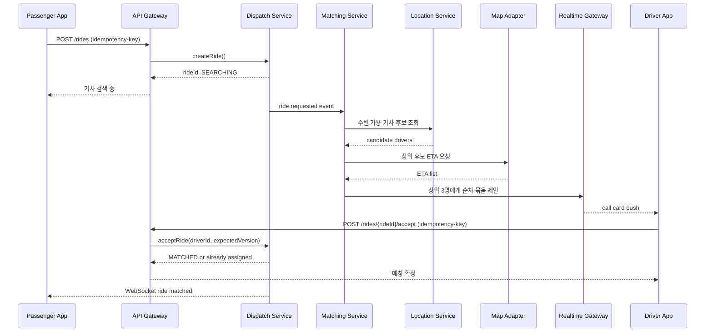
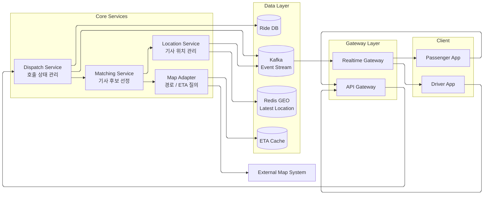
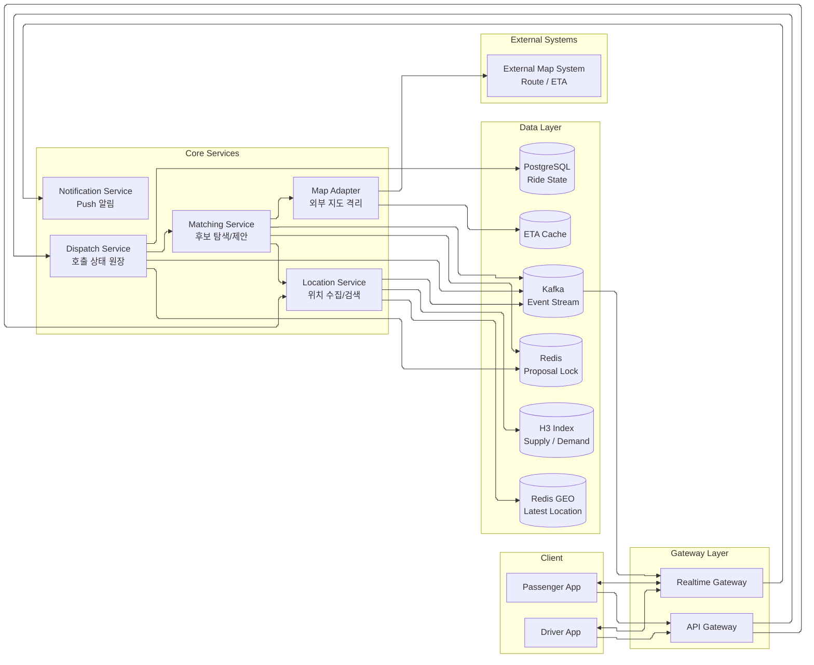
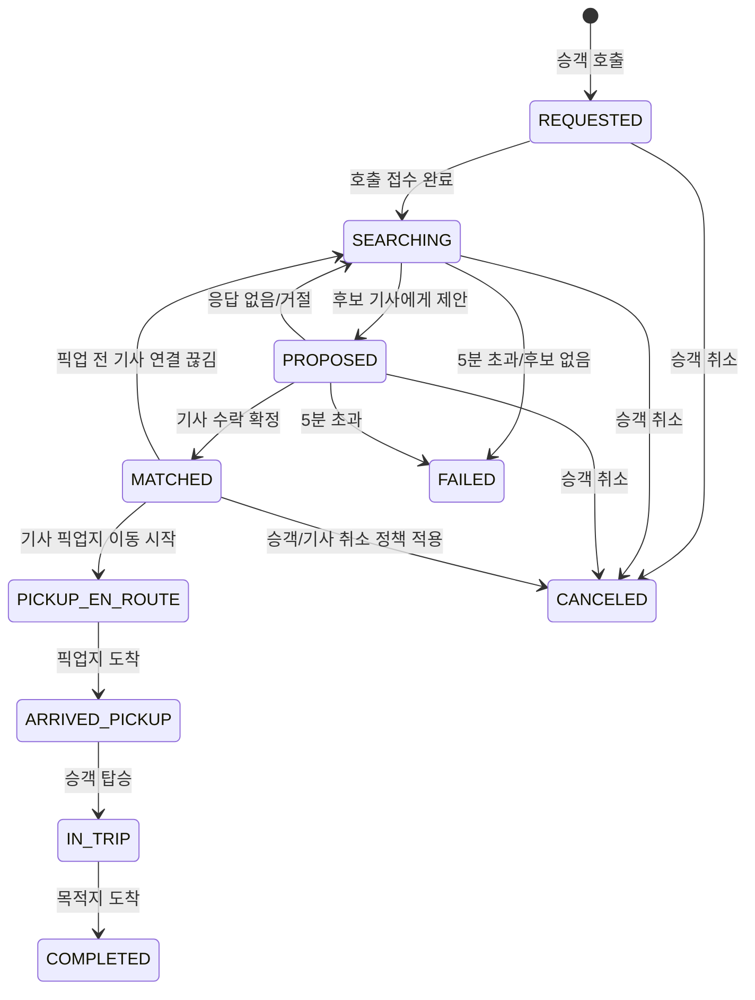

# Week 2 과제: 택시 호출 서비스 설계

## 0. 과제 개요

### 과제: 택시 호출 서비스 설계

#### 시나리오

택시 호출 서비스를 만든다. 승객이 호출하면 주변의 빈 택시를 찾아 매칭하고, 매칭된 택시가 픽업 지점에 도착할 때까지 승객은 택시 위치와 도착 예상 시간을 실시간으로 확인한다. 픽업 이후 목적지에 도착할 때까지 위치 추적이 이어진다.

> 그 외 시나리오는 자유롭게 구체화해도 좋다. 
> 자율주행택시, 빵택시, AI택시 등도 가능하다. 
> 브랜드 이름을 지어도 된다(본인 이름 등).

#### 범위

이번 과제는 **호출 시점부터 도착 완료 시점까지의 실시간 흐름**에 집중한다.

다음 항목은 주의 깊게 다루지 않아도 된다.

- 회원가입·인증·기사 등록 절차
- 이용 이력
- 운행 종료 후 요금 산정
- 결제
- 리뷰
- 정산

기사와 승객은 모두 정상적으로 앱에 로그인한 상태이며, 결제 수단 등은 이미 등록되어 있다고 가정한다.

### 시스템 구성 전제

우리가 설계할 대상은 오로지 택시 호출 서비스(OOO택시)이다.

- 이미 존재하는 **지도 시스템**에 의존한다. 도로망 데이터, 경로 탐색, 도착 예상 시간 계산을 제공하는 외부 시스템(OOO맵)이라고 가정한다. 즉, 도로망 위에서의 경로 탐색 알고리즘이나 지도 데이터 관리는 설계 범위가 아니다.
- 이미 존재하는 **회원 시스템**, **결제 시스템**에 의존한다.
- 외부 시스템에 의존하면서 생기는 문제는 호출 서비스가 책임진다.

### 요건

- 기사 위치를 서버에 저장하고, 승객이 호출하면 반경 안의 빈 택시를 가까운 순으로 찾아 매칭한다.
- 매칭 후, 픽업 이동 중에는 승객 화면에 택시 위치와 픽업 지점까지의 경로·도착 예상 시간이 실시간으로 표시된다.
- 운행 중에는 승객 화면에 현재 위치와 목적지까지의 경로·도착 예상 시간이 실시간으로 표시된다.
- 호출·매칭·추적이 진행되는 동안 기사 또는 승객 측에서 발생할 수 있는 이상 상황(앱 종료, 네트워크 단절, 호출 취소 등)에 대해 시스템이 일관된 상태를 유지해야 한다.

#### 규모 가정

> 이 수치는 기준값이며, 본인이 다른 가정을 세워 설계해도 된다.

- 서비스 지역: 단일 대도시권
- 누적 가입 승객: 약 2,000,000명
- 월 활성 승객(MAU): 약 800,000명
- 일일 활성 승객(DAU): 약 200,000명
- 누적 가입 기사: 약 50,000명
- 동시 운행 중인 기사: 10,000명
- 일일 호출 수: 약 500,000건
- 피크 시간대 호출 집중도: 평균 대비 5배 이상
  - 평일 출근(07:30–09:30)
  - 평일 퇴근(18:00–20:00)
  - 금·토 심야(23:00–02:00)

#### 시간/지연 목표

- 호출 접수 응답 시간: 호출 요청부터 "기사 검색 중" 상태 진입까지 2초 이내
- 매칭 완료 시간 목표: 호출 시점부터 평균 30초 이내에 매칭 완료
- 매칭이 5분 동안 안 되면 실패로 처리
- 위치 추적 갱신 지연 목표: 기사 위치 변화가 승객 화면에 반영되기까지 평균 5초 이내

### 고민해볼 질문

1. **기사 위치 업데이트 주기를 어떻게 설계할 것인가?**
   - 대기 중·매칭 중·픽업 이동 중·운행 중처럼 상태에 따라 다른 주기를 쓸 수 있다.
2. **기사 위치를 어디에, 어떤 형태로 저장할 것인가?**
   - "반경 N km 내 빈 택시를 가까운 순으로"라는 질의를 효율적으로 처리하려면 어떤 저장 방식이 적절할까?
   - 쓰기 부하와 읽기 부하를 함께 고려해야 한다.
3. **검색 반경과 결과 처리를 어떻게 다룰 것인가?**
   - 지역에 따라 택시 밀도가 다르다.
   - 결과가 0건이면 어떻게 처리할 것인가?
4. **위치·경로·도착 예상 시간을 어떻게 전달하고, 갱신할 것인가?**
   - 기사→서버와 서버→승객은 트래픽과 신뢰성 요구가 다르다.
5. **호출이 들어왔을 때 매칭 대상을 어떻게 고를 것인가?**
   - 순차로 제안할지, 동시에 제안할지
   - 동시에 매칭을 수락하면 어떻게 할지
   - "가까운"의 기준은 무엇인지
6. **진행 중인 호출에서 이상 상황을 어떻게 판단·처리할 것인가?**
   - 기사: 앱 종료, 먹통, 모바일 데이터 끊김, 폰 방전, 앱 삭제 등
   - 승객: 앱 종료, 호출 취소
   - 판단 기준은 위치 보고 주기와 어떻게 연결되는가?
7. **외부 지도/경로 서비스 의존을 어떻게 다룰 것인가?**
   - 누가, 언제, 얼마나 자주 질의할 것인가?
   - 결과를 재사용할 수 있는가?
   - 외부 서비스가 느려지거나 장애가 나면 어떻게 할 것인가?
8. **수요 폭주를 예측할 수 있는 상황에서, 어떤 대응을 할 수 있을까?**
   - 기술적 대응뿐 아니라 정책·운영 차원의 대응도 가능하다.
   - 예: 잠실 주경기장 아이유 콘서트 종료 직후 30분 내 2만 건 이상 호출 예상

---

## 1. 문제 이해 및 설계 범위 확정

### 1-1. 설계 대상

과제 안내의 택시 호출 서비스를 Uber로 구체화한다. 서비스명은 `Uber Seoul`로 두고, 서비스 지역은 서울권으로 가정한다. (여기서 서울권은 서울을 중심으로 경기 일부와 인천 일부까지 포함하는 하나의 이동 생활권을 의미한다.)

### 1-2. 설계 범위 (In / Out of Scope)

#### 포함 범위 (In Scope)

- 호출 시점부터 도착 완료 시점까지의 실시간 흐름
- 기사 위치 저장 및 주변 기사 검색
- 호출 생성, 기사 매칭, 호출 상태 관리
- 승객 화면으로 위치, 경로, ETA 실시간 전달
- 앱 종료, 네트워크 단절, 취소, 외부 지도 장애 대응

#### 제외 범위 (Out of Scope)

- 회원가입, 인증, 기사 등록 절차
- 운행 종료 후 요금 산정, 결제, 리뷰, 정산
- 도로망 데이터 관리, 경로 탐색 알고리즘 구현
- 장기 데이터 분석, 추천, 광고
- Uber Pool(합승), surge pricing(수요>공급일 때 할증), 다중 국가/다중 리전 운영

### 1-3. 기능 요구사항

- 기사 앱은 현재 위치와 운행 상태를 서버에 주기적으로 보고한다.
- 승객이 호출하면 주변의 가용 기사 후보를 찾고, 가까운 순서가 아니라 **ETA와 배차 품질 점수가 좋은 순서**를 우선으로 매칭한다.
- 매칭 후 픽업 이동 중에는 승객 화면에 차량 위치, 픽업 지점까지의 경로, ETA가 실시간으로 표시된다.
- 운행 중에는 승객 화면에 현재 위치, 목적지까지의 경로, ETA가 실시간으로 표시된다.
- 호출, 매칭, 픽업, 운행 중 발생하는 취소, 앱 종료, 위치 보고 끊김, 외부 지도 장애에도 호출 상태가 일관되게 유지되어야 한다.

> ETA(Estimated Time of Arrival): 예상 도착 시간

### 1-4. 비기능 요구사항 (품질 관련)

| 항목 | 목표 |
|---|---|
| 호출 접수 응답 시간 | 호출 요청부터 `"기사 검색 중"` 상태 진입까지 2초 이내 |
| 매칭 완료 시간 | 평균 30초 이내, 5분 초과 시 실패 처리 |
| 위치 추적 갱신 지연 | 기사 위치 변화가 승객 화면에 반영되기까지 평균 5초 이내 |
| 상태 일관성 | 한 호출이 동시에 두 기사에게 확정되지 않아야 함 |
| 장애 복구 | 위치/알림/지도 장애가 호출 상태 전체를 깨뜨리지 않아야 함 |

### 1-5. 개략적 규모 추정

과제 안내의 기준값을 그대로 사용한다. (실제로 수치가 꽤 비슷하다.)

| 항목 | 수치 |
|---|---|
| 서비스 지역 | 서울시 전역과 인접 출퇴근권 일부 |
| 누적 가입 승객 | 약 2,000,000명 |
| MAU / DAU | 약 800,000명 / 약 200,000명 |
| 누적 가입 기사 | 약 50,000명 |
| 동시 운행 기사 | 10,000명 |
| 일일 호출 수 | 약 500,000건 |
| 피크 시간 호출 집중도 | 평균 대비 5배 이상 |
| 피크 시간대 | 평일 출근 07:30-09:30 / 퇴근 18:00-20:00 / 금·토 심야 23:00-02:00 |

### 본인이 추가로 둔 가정

| 확인이 필요한 부분 | 이번 설계에서의 가정 | 이유 |
|---|---|---|
| 매칭 기준(가까운 기사의 기준) | 직선거리보다 ETA 우선. 1차 후보 탐색은 반경 기반, 최종 정렬은 ETA/기사 상태/수락률/취소율 기반 | 실제 호출 경험에서는 물리적 거리보다 도착 시간이 더 중요하다 |
| 호출 제안 방식 | 전체 동시 제안이 아니라 3명 단위 순차 묶음 제안 | 중복 수락과 기사 경험 저하를 줄이면서 평균 매칭 시간을 관리하기 위함이다 |
| 기사 응답 제한 시간 | 기사 1회 제안의 유효 시간은 10초 | 평균 30초 내 매칭 목표를 맞추려면 한 후보군에 오래 머무를 수 없다 |
| 재매칭 허용 여부 | 기사 위치 보고가 일정 시간 이상 끊기면 현재 매칭을 무효화하고 다시 기사 탐색을 시작한다(상태 `STALE -> SEARCHING`) | 호출을 즉시 실패시키지 않고 승객이 배차를 받을 수 있게 시도한다 |
| 위치 업데이트 정책 | 기사 상태별로 보고 주기를 다르게 둔다. 대기 중 5초, 매칭 제안 중 3초, 픽업/운행 중 2~3초 | 모든 기사가 1초마다 보고하면 쓰기 부하가 과도하고, 상태별 중요도가 다르다 |
| ETA 갱신 정책 | 위치 갱신과 ETA 재계산은 분리한다. ETA는 픽업/운행 상태에서 10~15초 주기로 재계산하고, 경로 이탈이나 정체 변화가 크면 즉시 재계산한다 | 위치 변화마다 외부 지도 시스템을 호출하면 비용과 지연이 커지기 때문이다 |
| 데이터 보존 | 최신 위치는 Redis에 TTL 기반 저장, 운행 이벤트와 상태 변경은 PostgreSQL/Kafka에 보존 | 최신 위치 검색과 이력/정합성 관리는 요구 특성이 다르다 |
| 수요 폭주 시 우선 정책 | 검색 반경을 점진적으로 확장하고, 후보 수와 제안 묶음 크기는 상한을 두고 제한적으로만 늘린다. 일정 시간 안에 품질 기준을 만족하지 못하면 실패 처리하거나 재시도를 안내한다 | 폭주 시 무제한 탐색은 전체 시스템 장애로 이어질 수 있다 |

## 2. 개략적 설계안 제시 및 동의 구하기

### 2-1. 핵심 흐름

1. 승객 앱이 호출 요청을 보낸다.
2. `Dispatch Service`가 호출을 `REQUESTED` 상태로 생성하고 즉시 응답한다.
3. `Marketplace Matching Service`가 Redis GEO와 H3 cell 인덱스로 주변 기사 후보를 조회한다.
4. `Map Adapter`를 통해 상위 후보의 ETA를 계산하고, 기사 상태/수락률/취소율을 반영해 후보를 정렬한다.
5. 상위 후보에게 3명 단위로 순차 묶음 제안을 보낸다.
6. 가장 먼저 수락한 기사 1명만 `Dispatch Service`의 상태 전이 검증으로 확정한다.
7. 확정 이후 위치 이벤트는 Kafka를 거쳐 `Realtime Gateway`로 전달되고, 승객 앱은 WebSocket으로 최신 위치를 받는다.
8. ETA는 위치 이벤트마다 재계산하지 않고, 일정 주기 또는 경로 변화가 큰 경우에만 `Map Adapter`를 통해 다시 계산한다.

> #### Redis GEO, H3 cell, WebSocket 선택 이유
> `Redis GEO`는 위도/경도를 저장하고 "현재 위치 기준 반경 N km 안의 기사"를 빠르게 찾기 위한 저장 방식이다. 실시간 배차에서는 모든 기사 위치를 DB에서 하나씩 비교할 수 없기 때문에, 최신 위치 기반의 반경 검색을 Redis GEO가 담당한다.
>
> `H3 cell 인덱스`는 지도를 육각형 격자로 나누고 각 위치를 특정 cell에 매핑하는 방식이다. Redis GEO가 "지금 주변 기사 찾기"에 적합하다면, H3는 "강남역 주변 공급 부족", "잠실 콘서트 종료 후 특정 권역 수요 폭주"처럼 권역 단위 집계와 피크 대응에 유용하다.
>
> 승객 앱은 `WebSocket`으로 서버 push를 받는다. 승객이 계속 새로고침하거나 앱이 주기적으로 물어보는 polling 방식보다, 서버가 택시 위치와 ETA 변화를 즉시 밀어주는 편이 5초 이내 위치 반영 목표에 더 잘 맞고 불필요한 요청도 줄일 수 있다.

### 2-2. 호출 생성부터 매칭 확정까지의 흐름



### 2-3. 개략적 아키텍처 다이어그램



## 3. 상세 설계

이번 상세 설계에서는 과제로 주어진 선택 질문 중 다음 3가지를 중심으로 다룬다.

- `3-2. 기사 위치 저장`
- `3-5. 매칭 대상 선정 전략`

### 3-1. 설계 대상 컴포넌트 사이의 우선순위 정하기

이번 시스템의 핵심은 "빠르게 호출을 접수하고, 정확하게 한 명의 기사만 매칭하고, 이후 위치를 안정적으로 전달하는 것"이다. 따라서 상세 설계 우선순위는 아래와 같이 둔다.

| 우선순위 | 컴포넌트 | 이유 |
|---|---|---|
| 1 | Dispatch Service | 호출 상태의 원장(source of truth)이다. 한 호출이 두 기사에게 확정되지 않도록 보장해야 한다 |
| 2 | Location Service | 주변 가용 기사 검색의 성능을 결정한다. 쓰기 부하도 가장 크다 |
| 3 | Matching Service | 후보 선정, 제안, 수락 경합 처리를 담당한다. 매칭 품질과 평균 매칭 시간을 좌우한다 |
| 4 | Realtime Gateway | 기사/승객 앱과 실시간 연결을 유지한다. 위치 반영 지연 목표 5초에 직접 영향이 있다 |
| 5 | Map Adapter | 외부 지도 시스템 의존을 격리한다. 장애와 비용을 통제해야 한다 |

### 3-2. 상세 아키텍처



### 3-3. 호출 상태 모델

호출 상태는 `rides` 테이블에 저장하고, 모든 상태 변경은 `expected_version` 기반의 optimistic locking으로 처리한다.

> #### optimistic locking을 사용하는 이유
> 현재 설계에서는 `rides.version`을 조건으로 update하는 optimistic locking을 사용한다.
>
> 예를 들어 기사 A와 B가 같은 호출을 거의 동시에 수락하면, A가 먼저 `version = 3` 조건의 update에 성공하면서 상태를 `MATCHED`, version을 `4`로 바꾼다. 이후 B의 요청은 같은 `version = 3` 조건으로 update를 시도하지만 이미 version이 바뀌었기 때문에 update row 수가 0이 된다. 이 경우 B에게는 "이미 다른 기사에게 배정됨"을 응답하고, B의 상태는 다시 `AVAILABLE`로 되돌린다.
>
> 비관적 락을 쓰지 않은 이유는 피크 시간대에 수락 요청이 몰릴 때 DB lock 대기와 connection 점유가 커질 수 있기 때문이다. 특히 락을 잡은 트랜잭션 안에서 다른 검증이나 이벤트 처리가 길어지면 지연이 전파될 수 있다. 낙관적 락도 update 순간에는 DB row lock을 짧게 잡지만, 실패한 요청을 기다리게 하지 않고 바로 실패 처리할 수 있어 이 문제에 더 단순하게 맞는다.
>
> 분산락도 사용할 수 있지만, 이 문제에서는 최종 매칭 결과가 결국 `rides` DB에 저장된다. Redis 락을 먼저 잡고 다시 DB에 저장하는 방식은 락 획득, TTL, 락 해제, 서버 장애 같은 예외를 추가로 관리해야 한다. 반면 DB의 `version` 조건으로 update하면 "이미 다른 기사가 배정됐는지"를 저장 시점에 바로 확인할 수 있다. 그래서 Redis 락으로 한 번 막고 DB에 또 저장하기보다, 최종 결과를 저장하는 DB에서 한 번에 성공/실패를 판단한다.
>
> 트레이드오프는 충돌이 발생한 요청이 재시도 또는 실패 처리를 해야 한다는 점이다. 충돌률이 매우 높다면 실패 update가 많아져 DB write 낭비가 생길 수 있다. 하지만 한 호출 제안은 보통 소수 후보에게만 보내고, 성공해야 하는 요청은 1건뿐이므로 이 설계에서는 복잡한 락 시스템보다 낙관적 락의 단순성과 복구 용이성을 우선했다.



상태 전이의 핵심 규칙은 다음과 같다.

- `MATCHED`는 반드시 `ride_id` 기준으로 한 번만 성공해야 한다.
- 기사가 동시에 수락해도 `compare-and-set(ride_id, expected_version)`에 성공한 1명만 확정된다.
- 픽업 전 기사 연결이 끊기면 재매칭 가능하지만, 운행 시작 후에는 안전/고객센터 플로우로 전환한다.
- 모든 상태 변경은 Kafka 이벤트로 발행해서 승객 앱, 기사 앱, 알림, 모니터링이 같은 흐름을 구독하게 한다.

### 3-2. 기사 위치 저장 — 어디에, 어떤 형태로?
- "반경 N km 내 빈 택시를 가까운 순으로" 질의를 효율적으로 처리할 자료구조 / 저장소
- 후보: Redis GEO / Geohash / Quadtree / R-tree / PostGIS …
- 쓰기 부하 vs 읽기 부하 trade-off

최신 위치 검색 저장소는 Redis GEO를 사용한다. PostgreSQL/PostGIS는 강력하지만, 초당 수천~수만 건의 최신 위치 업데이트와 낮은 지연의 반경 검색을 동시에 처리하는 hot path에는 Redis가 더 단순하고 빠르다.

위치 보고 주기는 상태별로 다르게 둔다. 대기 중인 기사는 5초, 제안 수신 중인 기사는 3초, 픽업/운행 중인 기사는 2~3초 주기로 보고한다. 동시 기사 10,000명이 평균 3초마다 위치를 보낸다고 보면 약 3,300 writes/sec이고, 피크와 재시도를 고려해 Location Service와 Redis는 10,000~20,000 writes/sec 수준을 감당하도록 잡는다.

#### 저장 방식

```text
GEO key: available_drivers:seoul
member: driver_id
score: Redis 내부 geospatial score

HASH key: driver:state:{driver_id}
fields:
  status = AVAILABLE | PROPOSED | MATCHED | PICKUP_EN_ROUTE | IN_TRIP | OFFLINE
  lat
  lng
  heading
  speed
  last_seen_at
  active_ride_id
```

Redis GEO에는 **검색 가능한 가용 기사만** 넣는다.

- `AVAILABLE`이면 `available_drivers:seoul`에 추가/갱신한다.
- `PROPOSED` 상태는 짧은 시간 동안 후보 중복 노출을 막기 위해 별도 상태로 두고, 기본 검색에서는 제외한다.
- `MATCHED`, `PICKUP_EN_ROUTE`, `IN_TRIP`, `OFFLINE`은 Redis GEO 검색 집합에서 제거한다.
- 상태와 위치가 어긋나는 것을 막기 위해 Location Service가 위치 업데이트 시 `driver:state`를 먼저 확인한다.

#### Redis GEO와 H3 역할 분리

| 기술 | 사용 위치 | 장점 | 한계 |
|---|---|---|---|
| Redis GEO | 실시간 반경 검색 | 구현이 단순하고 빠르다 | 권역별 장기 집계/분석에는 부적합 |
| H3 Cell | 공급/수요 집계, 폭주 감지 | 지도 영역을 균일한 cell로 다룰 수 있다 | 정확한 가까운 순 검색 자체는 Redis GEO보다 번거롭다 |
| PostgreSQL/PostGIS | 운영 도구, 이력 분석, 사후 검증 | 정교한 공간 질의 가능 | 실시간 hot path로 쓰면 비용이 크다 |

이번 설계에서는 Redis GEO를 배차의 hot path로 두고, H3는 "강남역 cell에 호출은 많은데 가용 기사가 부족하다" 같은 운영 판단에 사용한다.

#### Redis 장애 대비

- Redis는 shard를 나누고 replica를 둔다.
- Redis GEO 데이터는 최신 위치 캐시이므로 영구 저장소로 보지 않는다.
- Redis 장애 또는 재시작 시 기사 앱의 주기적 위치 보고로 몇 초 안에 자연 복구된다.
- 특정 shard 장애 시 해당 권역은 검색 품질이 떨어질 수 있으므로, 승객에게 "주변 기사 확인 중" 상태를 유지하고 재시도한다.

### 3-5. 매칭 대상 선정 전략
- 순차 제안 vs 동시 제안 (동시 수락 시 처리?)
- "가까운"의 기준 (직선거리? 도로 거리? ETA?)

이번 설계는 **3명 단위 순차 묶음 제안**을 사용한다.

전체 동시 제안은 빠르지만 여러 기사가 동시에 수락할 수 있고, 늦게 실패 응답을 받은 기사 경험이 나빠진다. 완전 순차 제안은 중복 수락은 줄지만 평균 매칭 시간이 길어진다. 따라서 3명 단위로 묶어 제안하고, 가장 먼저 수락한 기사만 확정한다.

#### 후보 점수

```text
score =
  ETA 점수
  + 기사 수락률 점수
  - 최근 취소율 페널티
  - 위치 신선도 페널티
  - 픽업 난이도 페널티
```

여기서 `가까운 기사`는 직선거리가 가장 짧은 기사가 아니라 **픽업 ETA가 짧고 수락 가능성이 높은 기사**로 본다.

#### 후보 검색과 반경 확장

매칭 후보는 한 번에 큰 반경을 뒤지지 않고 1km에서 시작해 2km, 3km, 5km 순서로 확장한다. 각 단계에는 후보 상한을 둔다.

| 단계 | 반경 | 후보 상한 | 처리 |
|---|---:|---:|---|
| 1차 | 1km | 20명 | 도심 기본 검색 |
| 2차 | 2km | 40명 | 후보 부족 시 확장 |
| 3차 | 3km | 60명 | 외곽/심야 대응 |
| 4차 | 5km | 80명 | 마지막 탐색 |

검색 결과는 다음 순서로 줄인다.

1. Redis GEO로 반경 안의 `AVAILABLE` 기사 후보를 조회한다.
2. 너무 오래된 위치(`last_seen_at > 15초`)는 제외한다.
3. 이미 다른 호출의 `PROPOSED`/`MATCHED` 상태인 기사는 제외한다.
4. 상위 후보 20~40명에 대해서만 Map Adapter로 ETA를 계산한다.
5. ETA와 기사 품질 점수를 합산해 정렬한다.
6. 상위 3명에게 먼저 제안하고, 10초 안에 수락이 없으면 다음 3명에게 제안한다.

외부 지도 API는 후보 전체가 아니라 상위 후보에게만 호출한다. 지도 API가 느리면 ETA Cache 또는 직선거리 기반 추정 ETA를 임시로 사용하고, 매칭 이후 ETA는 10~15초 주기 또는 경로 이탈 시에만 다시 계산한다.

#### 매칭 확정 경합 처리

1. Matching Service가 `ride:proposal:{ride_id}`에 제안 후보군과 만료 시간을 기록한다.
2. 기사 앱은 수락 시 `POST /rides/{rideId}/accept`를 보낸다.
3. Dispatch Service는 `rides.version`을 이용해 `SEARCHING/PROPOSED -> MATCHED` 전이를 시도한다.
4. 가장 먼저 DB update에 성공한 기사만 확정된다.
5. 늦게 수락한 기사에게는 "이미 다른 기사에게 배정됨" 응답을 주고 상태를 `AVAILABLE`로 되돌린다.

예시 SQL은 다음과 같다.

```sql
UPDATE rides
SET status = 'MATCHED',
    driver_id = :driver_id,
    version = version + 1,
    updated_at = now()
WHERE ride_id = :ride_id
  AND status IN ('SEARCHING', 'PROPOSED')
  AND version = :expected_version;
```

업데이트된 row가 1개이면 매칭 성공, 0개이면 이미 다른 전이가 일어난 것이다.

---

## 4. 설계 장점

- 호출 상태 원장을 Dispatch Service와 DB에 두어, 한 호출이 두 기사에게 확정되는 문제를 막을 수 있다.
- Redis GEO를 사용해 주변 가용 기사 검색을 낮은 지연으로 처리할 수 있다.
- H3 cell 집계를 함께 사용해 권역별 공급/수요 불균형과 수요 폭주를 감지할 수 있다.
- 위치 갱신과 ETA 재계산을 분리해 실시간성은 유지하면서 외부 지도 API 비용을 줄인다.
- WebSocket 기반 push로 승객 화면의 위치 반영 지연 5초 목표를 달성하기 쉽다.
- 외부 지도 시스템을 Map Adapter 뒤에 숨겨 매칭 후보 정렬 시 발생하는 지도 API 의존을 통제할 수 있다.

---

## 5. 설계 단점

- Redis GEO가 최신 위치의 핵심 hot path라 Redis shard 장애 시 특정 권역의 매칭 품질이 떨어질 수 있다.
- 3명 단위 순차 묶음 제안은 전체 동시 제안보다 평균 매칭 시간이 조금 길어질 수 있다.
- ETA 기반 정렬은 외부 지도 시스템 품질에 영향을 많이 받는다.
- WebSocket 연결을 대규모로 유지해야 하므로 Realtime Gateway의 운영 복잡도가 높다.
- 위치 이벤트는 최신값 중심으로 처리하기 때문에 모든 이동 궤적을 완벽하게 보존하는 설계는 아니다.
- 수요 폭주 상황에서는 시스템이 정상이어도 실제 공급 부족으로 배차 실패가 늘어날 수 있다.

---

## 📚 참고 자료

- 가상 면접 사례로 배우는 대규모 시스템 설계 기초