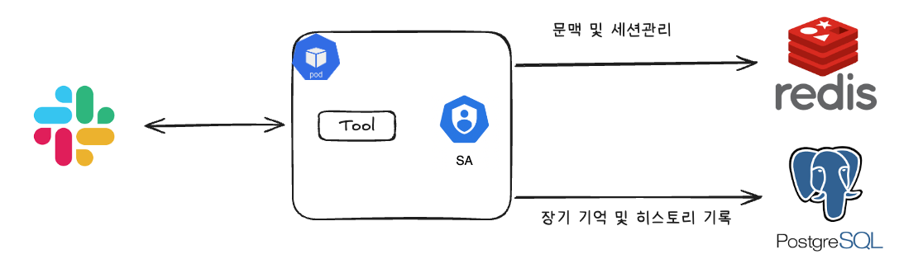
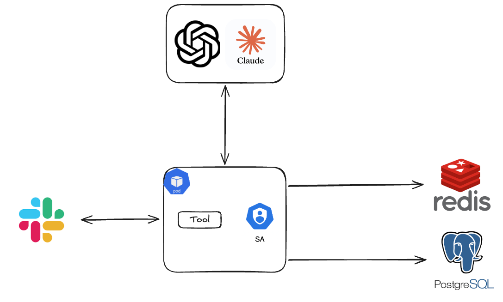

# ⒈ 문제 이해 및 설계 범위 확정

**시나리오**

- 모니터링 및 장애 대응 에이전트
- 장애 나는 상황에 대해서 모니터링 하며 만약 장애가 발생한 경우 사용자에게 장애 상황을 요약하여 전달한다.
- 만약 간단한 수준의 장애 대응(리소스 량 증가, 파트 재시작)은 먼저 진행한 후 사용장에게 전달한다.

## 설계 범위 (In / Out of Scope)

---

| 포함 (In Scope) | 제외 (Out of Scope) |
| --- | --- |
| 사용자 요청 처리 흐름 | LLM 자체 학습 |
| Agent 실행 흐름 | 모델 파인튜닝 |
| Tool Calling 구조 | GPU 인프라 |
| 파일 탐색 / 코드 수정 | Transformer 구조 |
| 명령 실행 / 결과 검증 | 벡터 모델 구현 |
| 스트리밍 응답 | IDE 자체 구현 |
| 장시간 작업 처리 | 실제 컨테이너 런타임 구현 |
| 작업 상태 관리 | 운영체제 구현 |
| Sandbox / 권한 제어 | 완전한 보안 솔루션 개발 |
| 실패 복구 및 재시도 | 자체 LLM 개발 |

## 시스템 구성 전제

---

- 외부 LLM API(OpenAI, Claude 등)를 사용한다고 가정
- Tool 실행용 Sandbox(Container)는 이미 준비되어 있다고 가정
- 사용자는 로그인 상태라고 가정
- 파일 저장소 및 Git Repository는 외부 시스템 사용 가능
- AI 서비스는 Tool orchestration과 상태 관리를 책임진다

## 기능 요구사항

---

- 사용자의 자연어 요청을 처리할 수 있어야 한다
- AI Agent는 상황에 따라 여러 Tool을 호출할 수 있어야 한다
- Tool 실행 결과를 기반으로 추가 작업을 수행할 수 있어야 한다
- 작업 진행 상황을 사용자에게 실시간 스트리밍할 수 있어야 한다
- 긴 작업을 비동기로 처리할 수 있어야 한다
- 작업 실패 시 재시도 또는 복구가 가능해야 한다
- 여러 사용자의 동시 작업을 처리할 수 있어야 한다
- Tool 실행 권한 범위를 제한할 수 있어야 한다

## 비기능 요구사항

---

| 항목 | 목표 |
| --- | --- |
| 첫 응답 시작 시간 | 3초 이내 |
| 스트리밍 지연 | 평균 1초 이하 |
| Tool 실행 실패 복구 | 자동 재시도 가능 |
| 장시간 작업 처리 | 최대 수십 분 |
| 작업 상태 복구 | 서버 재시작 이후에도 유지 |
| 동시 실행 작업 수 | 수천 개 이상 |
| Agent 응답 일관성 | 동일 작업 중복 실행 방지 |

## 대략적 규모 추정 *(기준값 — 본인 가정으로 변경 가능)*

---

| 항목 | 수치 |
| --- | --- |
| MAU / DAU | 약 500,000명 / 약 100,000명 |
| 일일 Agent 작업 수 | 약 2,000,000건 |
| 평균 Tool 호출 횟수 | 작업당 5~20회 |
| 평균 작업 시간 | 30초 ~ 10분 |
| 장시간 작업 비율 | 약 10% |
| 동시 실행 작업 수 | 약 20,000건 |
| 평균 스트리밍 연결 유지 시간 | 약 2~5분 |
| 피크 시간대 | 평일 업무 시간대 |

# 2. 개략적 설계안 제시 및 동의 구하기

---

## 핵심 흐름 (필수)

1. 사용자는 Slack이나 혹은 별도의 도구를 통해서 에이전트에 질문을 한다.
2. 만약 사전에 장애가 발생한 경우에는 장애 심각도 파악 후 선조치 후보고 혹은 사용자가 인지할 수 있도록 알람을 전송한다.
3. 에이전트는 cli도구(aws-cli, kubectl 등을) 통해서 서버의 로그 혹은 상태를 확인한다.
4. 서버의 로그를 확인 한 후 LLM에게 원인 분석을 맞긴다. Tool Calling을 통해서 웹 검색, 이전 장애 히스토리 파악을 통해서 원인 분석을 진행한다.
5. 만약 SLI/SLO 기준으로 크리티컬한 장애인 경우에는 즉각적으로 사용자를 호출한다.
6. 간단하게 장애 대응이 가능한 경우 즉각적으로 장애 대응 후 장애 요약본을 사용자에게 전달한다.
7. 장애가 해결된  경우 장애 리포트를 기록한다.

## 개략적 아키텍처 다이어그램 (필수)

# 3. 상세 설계

---

## 설계 대상 컴포넌트 사이의 우선순위 정하기 / 아키텍처 다이어그램 (필수)

** 우선순위 **
1. 데이터베이스
2. 애플리케이션

---

## 3-3. 장시간 작업 처리

- 비동기 작업의 경우 작업에 ID를 부여한 후 클라이언트에서 주기적으로 확인하도록 클라이언트 로직 구성
- 재시도 전략은 3회 이상, 타임아웃 설정이 필요
- 상태관리는 무조건 DB에서 관리

---

## 3-6. Sandbox 및 권한 제어 (보안 문제)

- Tool 실행 권한을 어떻게 제한할 것인가? => Service Account 기준으로 권한을 관리
- 위험 명령 실행은 어떻게 차단할 것인가? => SandBox 구성을 통해서, 위험 명령을 실행해도 운영환경 및 데이터에 영향없도록 구성
- 사용자별 작업 환경 격리는 어떻게 수행할 것인가? => RBAC를 통한 격리

---

# 4. 설계 장점

- LLM과 DB만 가용성이 보장된다면, 유저수가 무제한으로 수용이 가능
- 간단한 아키텍처로 인해서, 사람들이 이해하기 쉬움

---

# 5. 설계 단점

- DB 장애 시 전부 장애

---

# 6. 마무리

## 개인적 의견 / 사례 공유 / 추가 학습

** open ai **
- https://openai.com/ko-KR/index/scaling-postgresql/ 

## 참고 자료

- AI Agent 개발 완전 가이드 2025: Tool Calling, ReAct, Multi-Agent, MCP까지
    
    [AI Agent 개발 완전 가이드 2025: Tool Calling, ReAct, Multi-Agent, MCP까지](https://www.youngju.dev/blog/culture/2026-03-25-ai-agent-development-tool-calling-guide-2025)