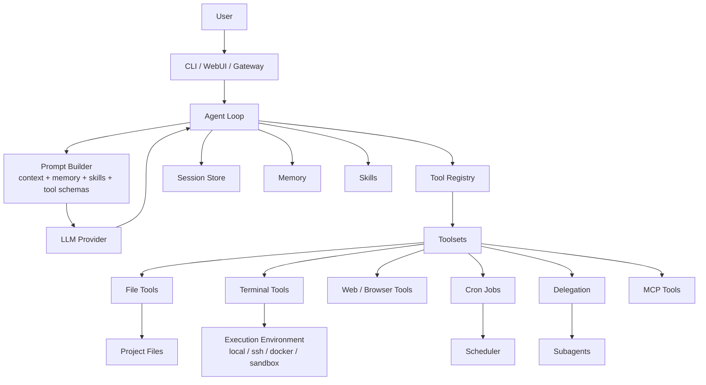
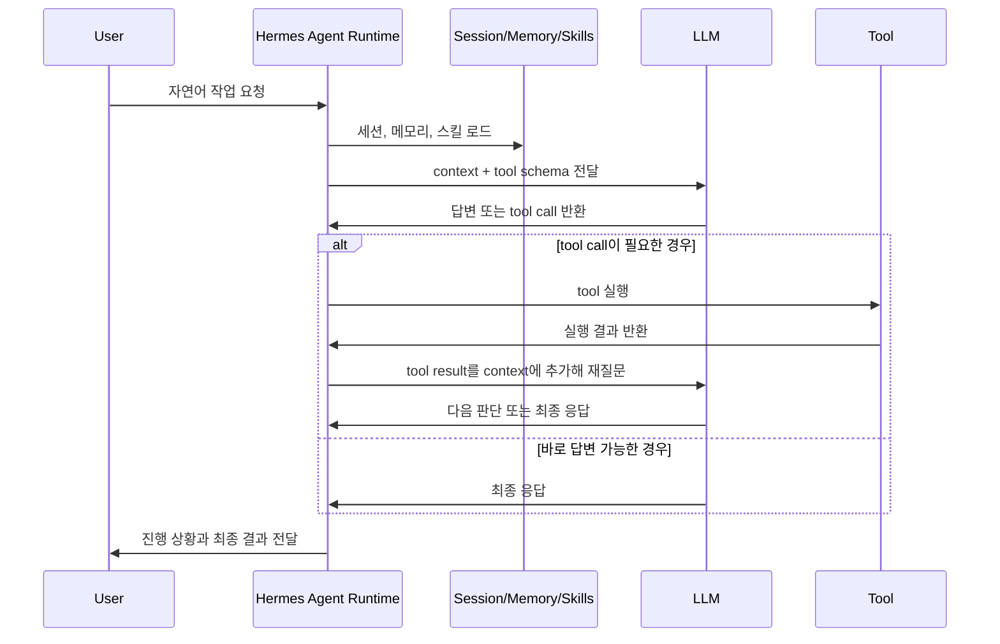
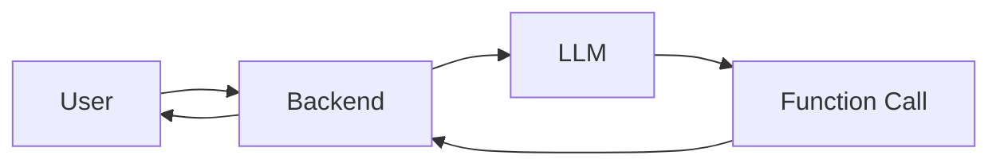
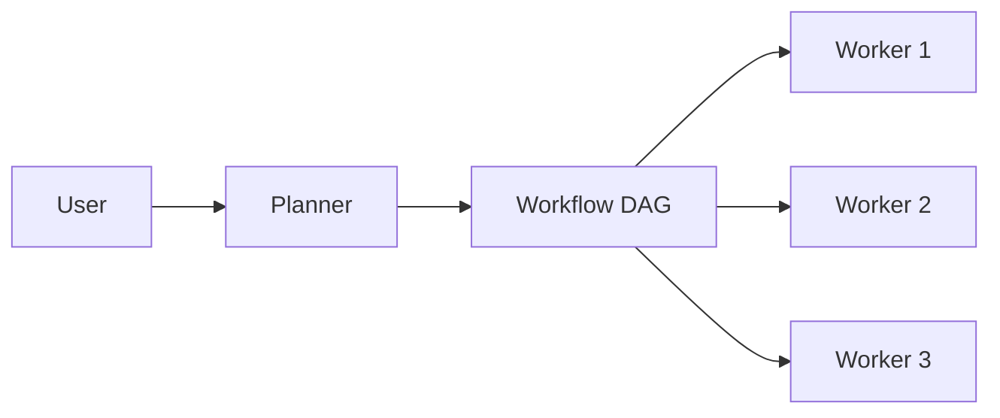
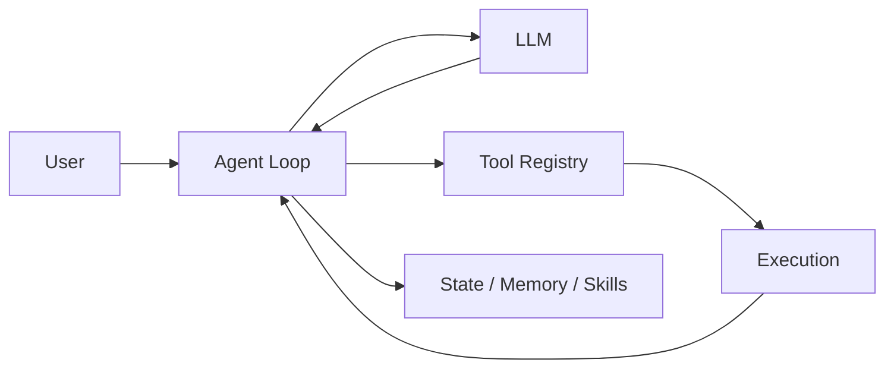

# Hermes Agent 아키텍처 분석

> 목표: Hermes Agent를 사례로 삼아, AI Agent 시스템이 왜 단순 Chatbot이 아니라 **도구 실행과 상태 관리를 책임지는 Agent Runtime**이 되는지 설명한다.

---

## 0. 이 문서의 질문

이 문서는 다음 질문에서 출발한다.

> Hermes Agent는 어떤 아키텍처일까?

하지만 이 질문은 조금 더 정확하게 바꿔야 한다.

> 사용자의 자연어 요청을 실제 시스템 작업으로 바꾸기 위해, AI Agent는 어떤 아키텍처를 가져야 하며 Hermes Agent는 이 문제를 어떻게 풀고 있는가?

테라폼 apply

-> IAM 권한이 부족해서

IAM 권한부족 에러

-> IAM 권한을 주면 되겟구나

-> 리소스명이 겹쳐서, 아니면 등등등 오류

-> 고치고

_> 실행하고

단순히 “LLM API를 호출한다”로는 AI Agent를 설명할 수 없다. 사용자가 “Docker 실행 오류 수정해줘”, “Redis 연결 실패 원인 분석해줘”, “테스트 코드 작성하고 실행해줘”라고 요청하면, Agent는 텍스트만 생성하는 것이 아니라 실제 작업을 수행해야 한다.

예를 들어 “테스트 코드 작성하고 실행해줘”라는 요청에는 다음 작업이 포함된다.

1. 프로젝트 구조를 파악한다.
2. 관련 파일을 읽는다.
3. 테스트 파일을 수정하거나 새로 만든다.
4. 명령어를 실행한다.
5. 실패 로그를 분석한다.
6. 코드를 다시 수정한다.
7. 다시 테스트한다.
8. 최종 결과를 사용자에게 설명한다.

즉 AI Agent는 **대화 시스템**이면서 동시에 **작업 실행 시스템**이다.

CoT = Chain of Thoughts

생각의 흐름 -> -> -> -> -> ->

Hermes Agent의 핵심은 여기에 있다. Hermes Agent는 LLM에게 단순히 prompt를 전달하는 wrapper가 아니라, LLM의 판단을 실제 tool 실행으로 연결하고, 그 결과를 다시 LLM의 다음 판단으로 되돌리는 **Agent Runtime**이다.

---

## 1. 사실 / 전제 / 가설

### 사실

* Hermes Agent는 CLI, WebUI, Gateway를 통해 사용자 요청을 받는다.
* Hermes Agent는 LLM provider를 호출해 다음 행동을 판단한다.
* Hermes Agent는 file, terminal, browser, web, cron, delegation, memory, session, skills 같은 tool 또는 시스템 기능을 가진다.
* Hermes Agent의 Agent loop는 LLM 응답이 tool call이면 tool을 실행하고, 그 결과를 다시 conversation context에 추가한 뒤 다음 판단을 이어간다.
* Hermes Agent는 session, memory, skills, cron, delegation 같은 구조를 통해 단발성 대화보다 긴 작업과 반복 작업을 지원한다.

### 전제

* 이 문서는 Hermes Agent의 내부 코드를 세부 구현 단위로 분석하는 문서가 아니라, System Architecture 관점에서 주요 컴포넌트와 trade-off를 설명하는 문서다.
* 설명 대상은 “LLM 자체 학습”이나 “Transformer 구조”가 아니라, LLM을 이용해 실제 작업을 수행하는 Agent 실행 시스템이다.
* 독자는 AI Agent 개념은 어느 정도 알고 있지만, Agent Runtime이 왜 필요한지는 아직 명확하지 않다고 가정한다.

### 가설

* AI Agent 아키텍처에서 가장 중요한 문제는 “모델이 얼마나 똑똑한가”보다 “모델의 판단을 실제 작업으로 어떻게 안전하고 지속적으로 연결할 것인가”다.
* Hermes Agent의 본질은 LLM wrapper가 아니라, tool orchestration, state management, execution isolation, progress visibility를 다루는 runtime이다.

---

## 2. 한 문장 요약

Hermes Agent는 사용자의 자연어 요청을 받아 LLM에게 판단을 맡기되, 실제 파일 읽기, 코드 수정, 명령 실행, 브라우저 조작, 예약 작업, 하위 Agent 위임 같은 행동은 Hermes Runtime이 tool로 실행하고 관리하는 구조다.

비유하면 다음과 같다.

> LLM은 “두뇌”에 가깝고, Hermes Agent는 “작업실 관리자”에 가깝다.
>
> 두뇌가 “파일을 확인해야겠다”고 판단하면, 작업실 관리자는 실제 파일 시스템 도구를 호출한다.
>
> 두뇌가 “테스트를 실행해야겠다”고 판단하면, 작업실 관리자는 terminal backend에서 명령을 실행한다.
>
> 중요한 것은 LLM이 직접 파일 시스템이나 shell을 만지는 것이 아니라, Hermes Runtime이 그 사이에서 도구 실행을 중재한다는 점이다.

---

## 3. 전체 아키텍처



이 그림에서 중요한 점은 LLM이 시스템 전체의 전부가 아니라는 것이다. LLM은 판단을 담당하지만, 실제 실행과 상태 관리는 Hermes Runtime이 담당한다.

| 구성요소              | 역할                                                           |
| --------------------- | -------------------------------------------------------------- |
| CLI / WebUI / Gateway | 사용자가 Agent와 만나는 입구                                   |
| Agent Loop            | LLM 호출, tool call 실행, 결과 반영, 반복 판단을 관리          |
| Prompt Builder        | 현재 대화, memory, skills, tool schema 등을 묶어 LLM 입력 구성 |
| LLM Provider          | 다음 응답 또는 tool call 결정                                  |
| Tool Registry         | 사용 가능한 tool과 실행 handler 등록                           |
| Toolsets              | file, terminal, browser, web, cron 등 도구 묶음                |
| Execution Backend     | 실제 명령이 실행되는 환경                                      |
| Session Store         | 대화와 작업 맥락 저장                                          |
| Memory                | 장기적으로 기억할 사용자 선호와 환경 정보 저장                 |
| Skills                | 반복 가능한 작업 절차를 문서로 저장한 procedural memory        |
| Cron                  | 예약/반복 작업 처리                                            |
| Delegation            | 하위 Agent에게 독립 작업 위임                                  |
| MCP                   | 외부 도구 서버와 연결하는 확장 구조                            |

---

## 4. 핵심 실행 흐름

Hermes Agent의 기본 실행 흐름은 다음과 같다.



이 구조는 ReAct 스타일과 비슷하게 볼 수 있다.

```text
Reason → Act → Observe → Reason → Act → Observe → Final
```

* Reason: LLM이 현재 상황을 보고 다음 행동을 판단한다.
* Act: Hermes Runtime이 tool을 실행한다.
* Observe: tool 실행 결과가 다시 context에 들어간다.
* Repeat: 필요한 만큼 반복한다.
* Final: 최종 답변을 사용자에게 전달한다.

여기서 중요한 설계 포인트는 “Act”가 LLM 내부에서 일어나는 것이 아니라 Hermes Runtime에서 일어난다는 점이다.

---

## 5. 왜 단순 Chatbot으로는 부족한가?

처음에는 이렇게 생각할 수 있다.

> “LLM API에 function calling만 붙이면 Agent 아닌가?”

작은 기능에서는 맞을 수 있다. 예를 들어 날씨 조회, 간단한 DB 검색, 단일 API 호출 정도라면 function calling만으로 충분하다.

하지만 AI 코딩 Agent나 DevOps Agent는 다르다.

사용자가 “Docker 실행 오류 수정해줘”라고 말하면 필요한 작업은 다음처럼 이어진다.

```text
프로젝트 구조 확인
→ Dockerfile / docker-compose.yml 읽기
→ 실행 명령 시도
→ 실패 로그 분석
→ 관련 설정 파일 수정
→ 다시 실행
→ 다른 오류 발생 시 추가 분석
→ 최종 원인과 수정 내용 설명
```

이 흐름에는 단일 function call이 아니라 여러 번의 판단과 실행이 필요하다. 또한 각 단계는 실패할 수 있다. 파일을 잘못 읽을 수도 있고, 명령이 timeout될 수도 있고, 수정 후 테스트가 실패할 수도 있다.

따라서 Agent 시스템에는 다음이 필요하다.

* 여러 tool 호출을 순차적으로 연결하는 loop
* tool 실행 결과를 다음 판단에 반영하는 context 관리
* 긴 작업을 유지하는 session/state
* 실패 시 재시도 또는 복구 전략
* 위험한 tool 실행에 대한 권한 제어
* 사용자에게 진행 상황을 보여주는 streaming/event 구조

이 모든 것이 합쳐져 Agent Runtime이 된다.

---

## 6. 가장 치열하게 고민해야 하는 부분들

### 6-1. Stateless Agent vs Stateful Agent

#### 문제

LLM API 자체는 기본적으로 stateless에 가깝다. 매 요청마다 필요한 context를 넣어줘야 한다. 하지만 Agent 작업은 stateful하다.

예를 들어 테스트 수정 작업을 하다가 중간에 실패했다면 Agent는 다음을 기억해야 한다.

* 어떤 파일을 읽었는가?
* 어떤 파일을 수정했는가?
* 어떤 명령을 실행했는가?
* 어떤 에러가 발생했는가?
* 다음에 무엇을 시도해야 하는가?

#### 선택지

| 방식      | 설명                       | 장점                      | 단점                                  |
| --------- | -------------------------- | ------------------------- | ------------------------------------- |
| Stateless | 매 요청을 독립적으로 처리  | 단순함, scale-out 쉬움    | 긴 작업, 복구, 맥락 유지에 약함       |
| Stateful  | session과 작업 상태를 유지 | 장시간 작업과 복구에 유리 | 구현 복잡도 증가, 중복 실행 관리 필요 |

#### Hermes식 선택

Hermes Agent는 session store, memory, skills를 통해 완전한 stateless 구조보다 더 stateful한 방향을 택한다.

* Session은 현재 대화와 작업 흐름을 유지한다.
* Memory는 장기적으로 유지할 사용자 선호나 환경 정보를 저장한다.
* Skills는 반복 가능한 절차를 문서화해 다음 작업에서 재사용한다.

#### Trade-off

이 방식의 장점은 Agent가 단발성 답변이 아니라 “작업 흐름”을 이어갈 수 있다는 점이다. 반면 상태가 생기면 복잡도도 커진다. 어떤 정보를 session에 둘지, 어떤 정보를 memory에 저장할지, 오래된 context를 언제 압축할지 같은 문제가 생긴다.

#### 비유

Stateless Agent는 매번 처음 출근하는 임시직 직원에 가깝다. 일을 시키려면 매번 모든 배경을 설명해야 한다.

Stateful Agent는 작업 노트를 들고 있는 담당자에 가깝다. 어제 어디까지 했는지 기억하지만, 노트가 너무 많아지면 정리 비용이 생긴다.

---

### 6-2. Tool Calling은 누가 통제하는가?

#### 문제

Tool calling은 단순 함수 호출이 아니다. Agent가 호출하는 tool은 실제 side effect를 만든다.

* 파일을 읽거나 쓸 수 있다.
* shell command를 실행할 수 있다.
* 브라우저를 조작할 수 있다.
* 메시지를 외부 플랫폼으로 보낼 수 있다.
* cron job을 만들 수 있다.

따라서 “LLM이 원하면 아무 tool이나 실행한다”는 구조는 위험하다.

#### 선택지

| 방식          | 설명                                          | 장점                     | 단점                      |
| ------------- | --------------------------------------------- | ------------------------ | ------------------------- |
| LLM 자유 실행 | LLM이 tool 이름과 인자를 생성하면 그대로 실행 | 유연함                   | 안전성 낮음, 예측 어려움  |
| Runtime 중재  | 등록된 schema와 권한 범위 안에서만 실행       | 안전성, 관찰 가능성 높음 | 구현 복잡도 증가          |
| Workflow 고정 | 미리 정해진 순서로만 실행                     | 예측 가능성 높음         | 자유로운 문제 해결에 약함 |

#### Hermes식 선택

Hermes Agent는 Tool Registry와 Toolsets를 둔다.

* Tool Registry는 어떤 tool이 있는지, 어떤 schema를 갖는지, 어떤 handler로 실행되는지 관리한다.
* Toolsets는 file, terminal, web, browser, cron, delegation처럼 도구를 기능 단위로 묶는다.
* 세션이나 플랫폼에 따라 사용할 toolset을 제한할 수 있다.

즉 LLM이 판단은 하지만, 실제 실행 가능 범위는 Hermes Runtime이 제공하는 tool schema와 권한 경계 안에 있다.

#### Trade-off

이 구조는 안전성과 확장성을 높인다. 새로운 tool을 추가할 때 registry에 등록하면 되고, 플랫폼별로 toolset을 다르게 노출할 수 있다.

반면 tool schema 설계가 부실하면 LLM이 tool을 잘못 사용하거나, 너무 많은 tool이 노출되어 판단이 흐려질 수 있다. 따라서 tool은 “많을수록 좋은 것”이 아니라 “현재 작업에 필요한 만큼 정확히 노출되는 것”이 중요하다.

#### 비유

LLM에게 모든 도구가 들어 있는 창고 열쇠를 주는 것이 아니라, 작업실 관리자가 “이번 작업에 필요한 공구함”만 건네주는 구조에 가깝다.

---

### 6-3. 장시간 작업은 어떻게 유지할 것인가?

#### 문제

Agent 작업은 항상 짧게 끝나지 않는다.

* 테스트 실행이 오래 걸릴 수 있다.
* 서버를 띄워놓고 확인해야 할 수 있다.
* 여러 파일을 분석해야 할 수 있다.
* 예약된 시간에 반복 작업을 해야 할 수 있다.
* 하위 Agent에게 독립적인 조사를 맡겨야 할 수 있다.

이런 작업을 단순 HTTP request-response 안에 넣으면 timeout, 연결 끊김, 중복 실행 문제가 생긴다.

#### 선택지

| 방식               | 설명                  | 적합한 경우             | 한계                        |
| ------------------ | --------------------- | ----------------------- | --------------------------- |
| 동기 실행          | 요청 하나 안에서 끝냄 | 짧은 질의               | 긴 작업에 취약              |
| Background Process | 별도 프로세스로 실행  | 테스트, 빌드, 서버 실행 | 상태 추적 필요              |
| Scheduler/Cron     | 정해진 시간에 실행    | 반복 모니터링, 리마인더 | 중복 방지와 전달 관리 필요  |
| Delegation         | 하위 Agent에게 위임   | 병렬 조사, 독립 작업    | parent-child 경계 관리 필요 |

#### Hermes식 선택

Hermes Agent는 여러 시간 스케일을 분리한다.

* 현재 대화 안에서 끝나는 작업은 일반 Agent loop에서 처리한다.
* 오래 걸리는 shell 작업은 background process로 관리할 수 있다.
* 예약/반복 작업은 cron job으로 분리한다.
* 독립적인 reasoning-heavy 작업은 delegation으로 하위 Agent에게 맡길 수 있다.

이 설계는 “모든 작업을 하나의 loop에 우겨넣지 않는다”는 점이 중요하다.

#### Trade-off

작업 유형에 맞는 실행 경로를 고를 수 있다는 장점이 있다. 하지만 사용자는 하나의 Agent에게 요청했다고 느끼기 때문에, 내부적으로 background, cron, delegation으로 나뉜 작업 상태를 일관되게 보여주는 문제가 생긴다.

#### 비유

식당에서 모든 주문을 한 명의 요리사가 즉석에서 처리하면 단순하지만, 주문이 많고 조리 시간이 길면 망가진다. 그래서 즉석 조리, 오븐에 넣어두는 작업, 예약 주문, 다른 파트에 넘기는 작업을 분리해야 한다.

---

### 6-4. Streaming: 토큰을 보여줄 것인가, 작업 상태를 보여줄 것인가?

#### 문제

일반 Chatbot에서 streaming은 보통 token streaming을 의미한다.

```text
안
안녕
안녕하세요...
```

하지만 Agent 작업에서 사용자가 진짜 궁금한 것은 종종 “문장이 생성되고 있는가?”가 아니라 “지금 실제로 무엇을 하고 있는가?”다.

```text
[파일 읽는 중]
[테스트 실행 중]
[오류 로그 분석 중]
[코드 수정 중]
[다시 테스트 중]
```

#### 선택지

| 방식            | 설명                                  | 장점             | 단점                              |
| --------------- | ------------------------------------- | ---------------- | --------------------------------- |
| Token Streaming | LLM 응답 토큰을 바로 보여줌           | 체감 속도 좋음   | 실제 작업 진행 상태는 알기 어려움 |
| Event Streaming | tool 실행 상태와 작업 이벤트를 보여줌 | 신뢰도 높음      | 이벤트 설계 필요                  |
| Hybrid          | token과 event를 모두 전달             | 사용자 경험 좋음 | 구현 복잡도 증가                  |

#### Hermes식 관점

Agent 시스템에서는 작업 이벤트 스트리밍이 중요하다. 사용자는 Agent가 멈춘 것인지, 명령을 실행 중인지, 실패해서 재시도 중인지 알아야 한다.

특히 코딩 Agent나 DevOps Agent에서는 다음 정보가 중요하다.

* 어떤 파일을 읽고 있는가?
* 어떤 명령을 실행하고 있는가?
* 실패했는가?
* 재시도 중인가?
* 사용자의 승인이 필요한가?

#### Trade-off

작업 이벤트를 자세히 보여주면 신뢰도가 올라간다. 하지만 너무 많은 raw log를 그대로 보여주면 사용자는 오히려 피로해진다. 따라서 “진행 상황 요약”과 “필요할 때 자세히 볼 수 있는 log”를 분리하는 것이 좋다.

#### 비유

택배 앱에서 중요한 것은 트럭 엔진 소리를 실시간으로 듣는 것이 아니다. 사용자가 알고 싶은 것은 “상품 준비 중”, “배송 중”, “도착 예정”, “배송 완료” 같은 상태다. Agent도 마찬가지다.

---

### 6-5. Context Window는 어떻게 관리할 것인가?

#### 문제

Agent가 tool을 많이 호출하면 context가 빠르게 커진다.

* 파일 내용
* 명령 실행 결과
* 에러 로그
* 테스트 출력
* 이전 대화
* 수정한 내용

이 모든 것을 매번 LLM에게 넣을 수는 없다. context window에는 한계가 있고, 불필요한 정보가 많아지면 모델 판단도 흐려진다.

#### 선택지

| 방식              | 설명                        | 장점                  | 단점                              |
| ----------------- | --------------------------- | --------------------- | --------------------------------- |
| 전체 context 유지 | 모든 기록을 계속 넣음       | 정보 손실 적음        | 비용 증가, 한도 초과, 노이즈 증가 |
| 요약/압축         | 오래된 내용을 요약          | 길이 제어 가능        | 요약 손실 가능                    |
| Retrieval         | 필요한 정보만 검색해서 넣음 | 대형 프로젝트에 적합  | 검색 품질에 의존                  |
| 작업 메모리 분리  | session/memory/skill을 구분 | 정보 성격별 관리 가능 | 설계 기준 필요                    |

#### Hermes식 관점

Hermes Agent는 session, memory, skills를 구분한다.

* Session: 현재 대화와 작업 진행 맥락
* Memory: 장기적으로 반복 사용될 사실
* Skills: 반복 가능한 절차와 workflow

이 구분은 중요하다. 모든 것을 memory에 넣으면 memory가 오염되고, 모든 것을 session에만 두면 다음 작업에서 재사용할 수 없다.

#### Trade-off

Context 관리는 Agent 품질에 직접 영향을 준다. 좋은 context 관리는 모델을 더 똑똑하게 만드는 것처럼 보일 수 있다. 반대로 나쁜 context 관리는 좋은 모델도 바보처럼 행동하게 만든다.

---

### 6-6. 실패 복구와 중복 실행

#### 문제

Agent 작업은 실패한다.

* tool call이 실패할 수 있다.
* 명령이 timeout될 수 있다.
* LLM이 잘못된 인자를 만들 수 있다.
* 네트워크가 끊길 수 있다.
* 사용자가 중간에 같은 요청을 다시 보낼 수 있다.

특히 위험한 것은 중복 실행이다. “배포해줘” 같은 요청이 두 번 실행되면 실제 장애가 날 수 있다.

#### 선택지

| 방식                | 설명                     | 장점             | 단점                  |
| ------------------- | ------------------------ | ---------------- | --------------------- |
| 실패 즉시 중단      | 실패하면 사용자에게 넘김 | 단순함           | Agent 자율성이 낮음   |
| 자동 재시도         | 일시적 실패를 재시도     | 사용자 경험 좋음 | 중복 side effect 위험 |
| Checkpoint/Rollback | 변경 전 상태를 저장      | 복구 가능성 높음 | 구현 비용 증가        |
| Idempotency Key     | 동일 작업 중복 방지      | 안정성 높음      | 설계 복잡도 증가      |

#### Hermes식 관점

Hermes Agent는 tool 실행과 session을 runtime이 관리하므로, 실패를 단순히 “LLM 답변 실패”로 보지 않고 “작업 실행 실패”로 다룰 수 있다.

Agent 시스템에서 실패 복구는 선택 기능이 아니라 핵심 기능에 가깝다. 왜냐하면 Agent는 실제 시스템에 side effect를 만들기 때문이다.

#### Trade-off

자동 재시도는 편리하지만, 모든 작업에 안전하지 않다. 읽기 작업은 재시도해도 되지만, 쓰기 작업이나 외부 전송 작업은 중복 실행을 조심해야 한다.

---

## 7. 대안 아키텍처 비교

### 대안 A. 단순 Chatbot + Function Calling



#### 장점

* 구현이 단순하다.
* 작은 서비스에는 충분하다.
* 운영 복잡도가 낮다.

#### 단점

* 긴 작업 처리에 약하다.
* 여러 tool 호출의 흐름 관리가 어렵다.
* 작업 상태, 재시도, 권한 제어가 뒤늦게 붙으면서 복잡해진다.

#### 적합한 경우

* 날씨 조회
* 단일 API 검색
* 간단한 사내 FAQ
* side effect가 작고 짧은 작업

---

### 대안 B. Workflow Engine 기반 Agent



#### 장점

* 실행 흐름이 명시적이다.
* 재시도, 관찰, 복구가 쉽다.
* 정해진 업무 자동화에 강하다.

#### 단점

* 자유로운 탐색형 문제 해결에는 답답할 수 있다.
* 모든 작업을 workflow로 모델링해야 한다.
* 사용자의 애매한 자연어 요청에 유연하게 대응하기 어렵다.

#### 적합한 경우

* 정형화된 배치 작업
* 데이터 파이프라인
* 승인 단계가 명확한 업무 프로세스
* 반복적인 운영 자동화

---

### 대안 C. Hermes식 Agent Runtime



#### 장점

* 자연어 요청에 유연하게 대응할 수 있다.
* tool 사용, 상태 유지, 장시간 작업, 외부 플랫폼 연동을 하나의 runtime에서 다룰 수 있다.
* CLI, WebUI, Gateway, Cron, Delegation 같은 다양한 실행 맥락을 지원할 수 있다.

#### 단점

* 구조가 복잡하다.
* 상태 관리, context 관리, 권한 제어, 실패 복구가 어렵다.
* workflow engine보다 실행 경로가 예측하기 어렵다.

#### 적합한 경우

* AI Coding Agent
* DevOps Agent
* Browser Agent
* Research Agent
* 문서 자동화 Agent
* 여러 tool을 사용해 탐색적으로 문제를 해결해야 하는 작업

---

## 8. Hermes Agent 아키텍처의 장점

### 8-1. LLM과 실행 환경을 분리한다

LLM은 판단을 담당하고, Hermes Runtime은 실행을 담당한다. 이 분리는 중요하다. LLM이 직접 shell이나 file system을 만지는 것이 아니라, runtime이 schema, 권한, backend를 통해 실행을 중재한다.

### 8-2. 다양한 interface를 하나의 Agent Runtime에 연결한다

CLI, WebUI, Telegram, Discord, Slack 같은 여러 입구가 있어도 내부 Agent loop는 같은 방식으로 동작할 수 있다. 사용자는 다른 interface를 쓰지만, Agent의 핵심 실행 모델은 공유된다.

### 8-3. Toolset 기반으로 기능 노출을 제어할 수 있다

모든 상황에서 모든 tool을 열어두는 것은 위험하다. Toolset 단위로 필요한 기능만 노출하면 안전성과 사용성을 동시에 높일 수 있다.

### 8-4. Memory와 Skills로 반복 작업을 축적한다

Agent가 매번 처음부터 시작하지 않고, 사용자 선호와 반복 workflow를 축적할 수 있다. 특히 Skills는 “LLM이 기억하는 것”이 아니라 “문서화된 절차”라는 점에서 재사용성이 높다.

### 8-5. 장시간/예약/위임 작업을 분리할 수 있다

모든 작업을 하나의 request-response loop에 넣지 않고, background process, cron, delegation 등으로 나누어 처리할 수 있다.

---

## 9. Hermes Agent 아키텍처의 단점과 리스크

### 9-1. Runtime 복잡도가 높다

Agent loop, tool registry, toolsets, session, memory, skills, gateway, cron, delegation이 함께 움직인다. 기능이 강력한 만큼 시스템 전체를 이해하기 어렵다.

### 9-2. 상태 관리 기준이 중요하다

무엇을 session에 둘지, 무엇을 memory에 둘지, 무엇을 skill로 만들지 기준이 흐려지면 정보가 오염된다. 예를 들어 일회성 작업 결과를 memory에 저장하면 미래 작업에 방해가 될 수 있다.

### 9-3. Tool 권한과 side effect 관리가 어렵다

file write, shell command, messaging, cron 생성은 실제 side effect가 있다. 따라서 tool 실행은 항상 권한, 승인, scope, rollback 가능성을 고려해야 한다.

### 9-4. LLM 판단의 비결정성이 남아 있다

Workflow engine처럼 정해진 DAG를 실행하는 구조가 아니기 때문에, 같은 요청이라도 매번 조금 다른 경로를 택할 수 있다. 유연성은 장점이지만, 운영 시스템에서는 예측 가능성 문제가 된다.

### 9-5. 관찰 가능성이 없으면 신뢰하기 어렵다

Agent가 내부에서 무엇을 하는지 보이지 않으면 사용자는 불안해진다. 긴 작업일수록 progress event, tool log, 상태 요약이 중요해진다.

---

## 10. 가장 중요한 설계 판단

Hermes Agent 같은 시스템을 설계할 때 가장 치열하게 고민해야 하는 부분은 다음 하나로 압축할 수 있다.

> LLM에게 얼마나 많은 자율성을 줄 것인가, 그리고 Runtime은 어디까지 통제할 것인가?

자율성을 많이 주면 Agent는 유연해진다. 예상하지 못한 문제도 스스로 탐색할 수 있다. 하지만 안전성과 예측 가능성은 낮아진다.

반대로 Runtime이 모든 흐름을 고정하면 안전하고 관찰하기 쉽다. 하지만 Agent의 장점인 유연한 문제 해결 능력이 줄어든다.

따라서 좋은 Agent 아키텍처는 둘 중 하나를 고르는 것이 아니라, 경계를 설계한다.

* LLM은 판단한다.
* Runtime은 실행을 중재한다.
* Tool Registry는 가능한 행동을 제한한다.
* Session은 현재 작업 상태를 유지한다.
* Memory는 장기적으로 유효한 사실만 보관한다.
* Skills는 반복 가능한 절차를 축적한다.
* Cron과 Delegation은 시간과 작업 단위를 분리한다.

이 경계 설계가 Agent 시스템의 핵심이다.

---

## 11. 결론

Hermes Agent의 본질은 “LLM에 tool을 몇 개 붙인 chatbot”이 아니다.

Hermes Agent는 사용자의 자연어 요청을 실제 시스템 작업으로 바꾸기 위한 Agent Runtime이다. 이 Runtime은 LLM의 판단을 받아 tool을 실행하고, 실행 결과를 다시 판단에 반영하며, session, memory, skills, cron, delegation을 통해 작업의 시간과 상태를 관리한다.

AI Agent 아키텍처에서 어려운 부분은 모델 호출 자체가 아니다. 진짜 어려운 부분은 다음이다.

* 어떤 tool을 노출할 것인가?
* tool 실행 권한을 어떻게 제한할 것인가?
* 긴 작업의 상태를 어떻게 유지할 것인가?
* 실패와 재시도를 어떻게 다룰 것인가?
* context가 커질 때 무엇을 기억하고 무엇을 버릴 것인가?
* 사용자가 Agent의 진행 상황을 어떻게 신뢰하게 만들 것인가?

그래서 Hermes Agent 아키텍처를 한 문장으로 정리하면 다음과 같다.

> Hermes Agent는 LLM을 두뇌로 사용하되, 실제 작업 실행과 상태 관리는 Runtime이 책임지는 도구 오케스트레이션 시스템이다.

처음 배우는 입장에서는 “LLM이 똑똑해서 다 한다”고 이해하기 쉽다. 하지만 실제 시스템 관점에서는 반대에 가깝다.

LLM은 판단을 만든다.

Agent Runtime은 그 판단이 현실 세계에서 안전하고 지속 가능한 작업이 되도록 만든다.

---

## 12. 다음에 보강할 부분

* Hermes Agent 실제 코드 기준으로 `run_agent.py`, `model_tools.py`, `toolsets.py`, `tools/registry.py`, `hermes_state.py`, `gateway/`, `cron/`의 책임을 더 구체적으로 매핑하기
* 실제 요청 예시 하나를 정해서 end-to-end 흐름 추적하기

  * 예: “테스트 코드 작성하고 실행해줘”
  * 예: “Docker 실행 오류 수정해줘”
* SSE/WebSocket 기반 progress event 설계안 추가하기
* Sandbox/권한 제어를 별도 심화 섹션으로 분리하기
* 대규모 동시 작업 처리 관점에서 queue, worker, rate limit, graceful degradation 보강하기
