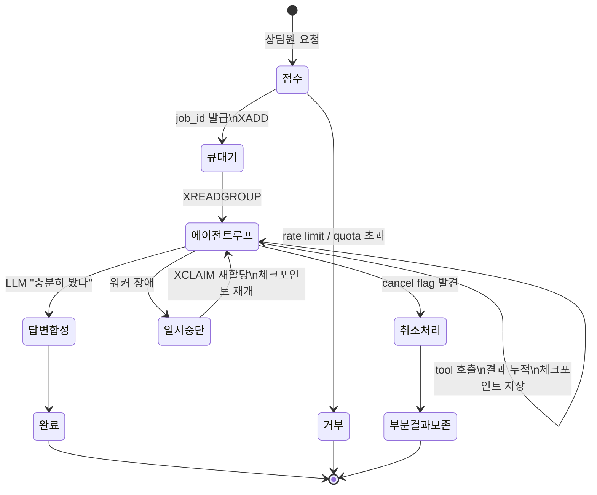
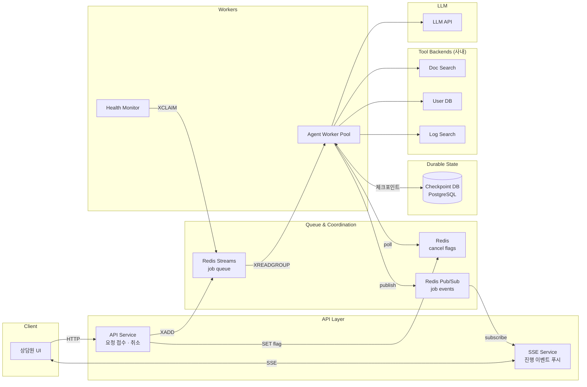

# CS Copilot — 사내 상담원 보조 에이전트 시스템 설계

## 1. 문제 이해 및 설계 범위 확정

### 시나리오

사내 상담원이 고객 응대 중 도움을 요청하면, 에이전트가 사내 데이터(문서, 티켓 이력, 사용자 DB, 운영 로그, 정책)를 동적으로 탐색하여 답변을 제공한다.

**예시 요청**:
- "이 사용자 결제 실패 원인 찾아줘"
- "비슷한 환불 케이스에서 어떻게 처리했어?"
- "이 고객이 가입할 때 우리 시스템에 장애 있었나?"

**페르소나**: 사내 상담원. 상담원이 답변 검토 후 고객에게 전달 (에이전트가 직접 고객 응대 X).

### 시스템 구성 전제

- 외부 LLM API (OpenAI, Claude) 사용
- 사내 데이터 소스는 이미 존재 (Doc Search, User DB read replica, Log Search 등)
- Tool 은 모두 read-only
- 인프라: Redis, PostgreSQL 가용

### 규모 산정

| 항목 | 수치 |
|------|------|
| 동시 활성 상담원 (피크) | 약 3,000명 |
| 일일 에이전트 호출 수 | 약 500,000건 |
| 평균 tool 호출 (호출당) | 3 ~ 15회 (평균 8회) |
| 평균 응답 시간 | 첫 토큰 3초, 완료 10초 ~ 3분 |
| 동시 실행 작업 수 (피크) | 약 2,000건 |
| 평균 SSE 연결 유지 시간 | 30초 ~ 3분 |
| 피크 신규 작업 처리율 | 약 85 req/sec (평균 17 × 피크 5배) |

### 컴포넌트별 예상 로드 (피크 기준)

| 컴포넌트 | 예상 로드 | 권장 구성 |
|----------|----------|----------|
| API Service | 95 req/sec (신규 85 + 취소 10) | 2~3 인스턴스 |
| SSE Service | 동시 3,000 연결, 8K events/sec | 3~5 인스턴스 (라우팅 분산) |
| Redis Streams | ~170 ops/sec (XADD + XACK) | 단일 + Sentinel HA |
| Agent Workers | 동시 2,000 작업 | 40~50 pods (async, pod 당 50 작업) |
| Checkpoint DB | ~700 write/sec, 25 GB/일 | Primary + 2 Replica, findings 별도 테이블 분리 필수 |
| Redis (cancel/PubSub/routing) | ~8,000 ops/sec (대부분 SSE routing HGET) | 단일 + Sentinel, routing 분리 가능 |
| LLM API | ~770 calls/sec, 25B tokens/일 | Enterprise tier + 다중 provider fallback |

**병목 가능성 우선순위**:
1. LLM API rate limit (단일 provider Tier 한도 초과 가능성 큼)
2. Checkpoint DB write 부하 (JSONB UPDATE 가 크면 위험 → findings 분리로 완화)
3. Redis SSE routing HGET (워커 측 routing 캐싱으로 완화 가능)

### 비기능 요구사항

| 항목 | 목표 |
| --- | --- |
| 첫 응답 시작 시간 | 3초 이내 |
| 작업 상태 복구 | 워커 재시작 이후에도 유지 (durable) |
| 장시간 작업 처리 | 최대 수 분 |
| 동시 실행 작업 수 | 수천 개 |
| 취소 응답 시간 | 평균 3초 이내 (다음 step 시작 전 중단) |

---

## 2. 개략적 설계안

### 핵심 흐름

상담원 메시지 → 답변까지의 큰 흐름:

```
1. 요청 접수: HTTP → job_id 즉시 발급 → 큐에 enqueue → SSE 연결 시작
2. 워커 할당: 큐에서 픽업 → 체크포인트 로드 (재시작 시)
3. 에이전트 루프:
   - LLM 추론 "다음에 뭐 할까?"
   - tool 호출 → 결과 누적
   - 체크포인트 저장 (매 step)
   - 진행 이벤트 publish
   - 취소 확인
   - 종료 판단
4. 답변 합성: 최종 답변 + 출처 인용 → 영속 저장 → SSE 종료
```

### 상태 전이



### 개략적 아키텍처



### 컴포넌트 책임

| 컴포넌트 | 책임 |
|----------|------|
| API Service | 요청 접수, job 생성, 취소 flag 설정, quota 검증 |
| SSE Service | 진행 이벤트를 상담원 UI 에 푸시 (별도 분리해서 수평 확장) |
| Redis Streams | 작업 큐. consumer group 으로 fair 분배 + PEL 로 진행 추적 |
| Agent Worker Pool | 에이전트 루프 실행 (LLM + tool orchestration) |
| Health Monitor | 좀비 작업 감지 + 재할당 |
| Checkpoint DB | 작업 상태 + 누적 결과. 워커 장애 시 복구 기반 |

#### Redis Streams 와 Pub/Sub 의 역할 분리

이 설계는 Redis 의 두 가지 기능을 서로 다른 목적으로 함께 사용한다.

**Redis Streams — 작업 큐**

작업은 절대 유실되면 안 된다. 워커가 작업을 받아 처리하다 죽어도, 다른 워커가 마지막 진행 지점부터 이어받아야 한다. 이를 위해 다음 보장이 필요하다:

- 메시지 영속성 — 디스크에 기록되어 워커가 죽어도 보존
- ACK 기반 처리 추적 — 누가 어떤 메시지를 처리 중인지 PEL (Pending Entries List, 아직 ACK 안 된 메시지 목록) 로 추적
- 좀비 회수 — 워커가 60초 넘게 응답 없으면 다른 워커가 XCLAIM 으로 가져감

Streams 는 정확히 이 요구사항을 만족한다. consumer group + PEL + XCLAIM 이 분산 작업 큐의 표준 구성요소다.

**Redis Pub/Sub — 진행 이벤트 broadcast**

작업이 한 step 끝날 때마다 워커는 "이런 진행 상황이 있다" 를 SSE Service 로 전달해야 한다. 이 이벤트의 특성은 작업 큐와 정반대다:

- 빠르게 전달되는 게 중요 (사용자가 실시간으로 보고 있음)
- 영속성은 별로 중요하지 않음 (잠시 후의 step 이벤트가 곧 도착)
- 누락되어도 큰 문제 아님 (Checkpoint DB 가 진실 소스, 재접속 시 catch-up 으로 복구)

Pub/Sub 는 in-memory broadcast 라 매우 빠르고 가볍다. at-most-once 라는 약점이 있지만, 어차피 SSE 재접속 시 Checkpoint DB 에서 진행 상황을 다시 가져오므로 누락이 사용자 경험에 영향을 거의 주지 않는다.

**왜 둘 다 쓰나 — 한 줄 요약**

> "잃으면 안 되는 것 (작업)" 은 Streams 로, "빠르게 흘려보내는 것 (진행 이벤트)" 은 Pub/Sub 로.

만약 단일 인프라로 통일하고 싶다면 Pub/Sub 을 Streams 로 옮길 수 있지만 (단점 섹션 참고), 현 규모에서는 두 도구의 특성을 살리는 게 더 적절하다.

---

## 3. 상세 설계

핵심 토픽 5개:

### 3-1. 에이전트 실행 흐름

ReAct 기반의 단순 루프. LLM 이 매 step "다음 행동"을 결정한다.

```python
def agent_loop(job_id):
    state = checkpoint_db.load(job_id) or AgentState.new(job_id)

    while not state.is_terminal():
        # 취소 확인 (매 step 시작 시)
        if redis.exists(f"cancel:job:{job_id}"):
            cancel_and_save_partial(state)
            return

        # 무한 루프 방지: step hard cap + 직전 행동 중복 검사
        if state.step >= MAX_STEPS or is_repeating(state):
            terminate_with_partial(state)
            return

        # LLM 에게 다음 행동 묻기
        action = llm_plan_next(state)

        if action.is_done():
            state.answer = synthesize(state.findings)
            state.status = "done"
            checkpoint_db.save(state)
            publish_event(job_id, "done", state.answer)
            return

        # tool 실행 (timeout + retry)
        result = execute_tool_with_retry(action)
        state.findings.append(result)

        # 체크포인트 + 진행 이벤트
        state.step += 1
        checkpoint_db.save(state)
        publish_event(job_id, "step_completed", action.summary)
```

**핵심 설계 결정**:

- **Stateless Worker / Stateful Job**: 모든 상태는 Checkpoint DB. 워커는 메모리 상태 없음 → 어떤 워커가 픽업해도 동일 동작.
- **Tool Registry**: 각 tool 마다 schema + timeout + retry policy 등록. LLM 에게는 schema 만 노출 (function calling 표준).
- **Sequential tool execution**: 한 step = 1 tool call. LLM 의 parallel tool call 기능은 사용하지 않음 — 체크포인트 모델 단순성 유지. 필요 시 병렬 step 으로 확장 가능.
- **무한 루프 방지**: max step (예: 30) + 직전 N step 의 action signature 중복 검사. 비용 폭주의 마지막 방어선.

### 3-2. Durable Execution

**Redis Streams 기반 큐**:

```bash
XADD jobs * job_id <uuid> payload <json>        # API: enqueue
XREADGROUP GROUP agent worker-3 ... STREAMS jobs >   # Worker: 픽업
XACK jobs agent <message_id>                     # Worker: 완료
XPENDING jobs agent IDLE 60000                   # Monitor: 좀비 감지
XCLAIM jobs agent worker-7 60000 <message_id>   # Monitor: 재할당
```

**장애 복구 흐름**:
1. 워커 죽음 → 작업이 PEL 에 남음
2. Health Monitor 가 idle 60초 초과 작업을 XPENDING 으로 감지
3. XCLAIM 으로 다른 워커에 재할당
4. 새 워커가 Checkpoint DB 에서 마지막 state 로드 → 이어서 실행

**재실행 안전성 (Idempotency)**:

워커가 LLM 응답을 받고 체크포인트 저장 직전에 죽으면, 다른 워커가 같은 step 을 다시 실행할 수 있다 (이중 LLM 비용). 방지책:

- 각 step 에 deterministic ID 부여 (`step_id = hash(job_id, step_number, action)`)
- LLM/tool 호출 결과를 step_id 키로 저장
- 재실행 시 같은 step_id 가 이미 있으면 캐시된 결과 사용

**Split-brain 방지 (Fencing Token)**:

XCLAIM 은 PEL ownership 만 옮길 뿐, 옛 워커가 실제로 멈췄는지 보장하지 않는다. 옛 워커가 살아있으면 두 워커가 동시 실행 가능.

- 작업 시작 시 단조 증가 lease ID 발급 (`INCR job:42:lease`)
- 모든 체크포인트 write 에 lease ID 포함 (WHERE lease_id = $1)
- 새 워커가 takeover 하면 lease 증가 → 옛 워커의 write 는 거부됨
- 옛 워커는 write 실패로 자기가 좀비임을 인지하고 종료

### 3-3. 취소 처리

**3가지 취소 시나리오**:
1. 명시적 (사용자 Stop 버튼)
2. 암묵적 (SSE 미복귀 자동 만료)
3. 시스템 (관리자 강제 종료)

**메커니즘**:

```bash
# API Service
SET cancel:job:<id> 1 EX 86400  # 24h TTL (긴 큐 대기 대비)

# Worker (매 step 시작 시)
EXISTS cancel:job:<id>          # 발견 시 부분결과 저장 후 종료
```

**왜 polling 인가**:
- 워커가 LLM 호출 중에는 인터럽트 불가 (응답 받을 때까지 대기)
- "다음 step 시작 전 확인" 이 자연스러움
- Pub/Sub 푸시도 가능하지만 단순함 + 신뢰성 면에서 polling 우위

**시점별 처리**:

| 시점 | 처리 |
|------|------|
| 큐 대기 중 | 워커가 픽업 시 즉시 cancelled 처리 |
| LLM 호출 중 | 응답 받은 후 다음 step 전 중단 |
| Tool 호출 중 | 짧은 timeout 후 다음 step 전 중단 |
| 답변 합성 중 | 그냥 완료까지 진행 (짧음) |
| 이미 완료 | 무시 (멱등성) |

**Race condition 방지**:

체크포인트 저장과 cancel 확인이 atomic 해야 한다. 그렇지 않으면 "Stop 눌렀는데 완료로 표시" 같은 race 발생.

```sql
UPDATE agent_jobs
SET status = 'done', state = $1
WHERE job_id = $2
  AND NOT EXISTS (SELECT 1 FROM redis WHERE key = 'cancel:job:' || $2);
-- (실제로는 트랜잭션 내에서 cancel flag 확인 + UPDATE 한 묶음)
```

**부분 결과 보존**: 취소 시 누적된 findings 를 Checkpoint DB 에 저장하고 UI 에 "취소되었습니다. 그동안 발견한 정보:" 형태로 노출. 5분간 모은 정보를 그냥 버리면 사용자 손해.

### 3-4. 대용량 동시 처리

**Consumer Group 기반 분배**:
- 메시지 1개는 그룹 내 1 consumer 에게만 → 자동 부하 분산
- 워커 추가는 같은 그룹에 join

**Worker Autoscaling**:
- 스케일링 기준: 큐 길이 (CPU 만 보면 LLM 응답 대기 중인 워커가 idle 로 보임)
- 스케일 다운은 보수적으로 (graceful shutdown 필수)
- 워커 구조: pod 당 asyncio 로 동시 작업 50개 처리 (LLM 응답 대기가 대부분이라 가능). 동시 2,000 작업 → 약 40~50 pods.

**공정성 (동시성 안전 처리)**:

- **사용자별 quota**: `INCR quota:user:{id} EX 60` 로 60초간 N회 제한.
- **사용자별 동시 실행 제한**: "한 사용자 동시 작업 ≤ 5".

단, 두 제한 모두 "현재 값 확인 후 증가" 형태라 다중 API 인스턴스에서 race condition 가능 (예: 6개 요청이 동시에 도착해서 모두 limit 통과). 이를 방지하기 위해 **Lua script 로 atomic check-and-act**:

```lua
-- KEYS[1]: concurrent:user:<id>, ARGV[1]: limit
local current = redis.call("INCR", KEYS[1])
if current > tonumber(ARGV[1]) then
    redis.call("DECR", KEYS[1])
    return 0  -- 거부
end
return 1  -- 허용
```

**중복 enqueue 방지 (Idempotency Key)**:

사용자가 "전송" 버튼을 빠르게 두 번 누르거나 네트워크 재시도로 같은 요청이 두 번 도착할 수 있다. 그대로 두면 같은 query 가 동시에 두 작업으로 실행되어 비용/혼란 발생.

```
클라이언트: POST /api/jobs 시 X-Idempotency-Key 헤더 (요청별 uuid)
API Service: SET idempotency:{key} <job_id> NX EX 300
  - NX 로 atomic: 이미 있으면 SET 실패 → 기존 job_id 반환
  - 없으면 새 job_id 발급
```

이로써 짧은 시간 (5분) 내의 중복 요청은 같은 작업으로 통합되고, 작업당 책임이 명확해진다.

**외부 API Rate Limit**:
- LLM API 의 TPM/RPM 을 중앙에서 추적 (Token bucket on Redis)
- Tool backend 별로 별도 bucket

**Graceful Degradation** (큐 길이 기반 자동 단계 전환):
1. 큐잉 (정상)
2. 작은 모델로 다운그레이드
3. quota 강화
4. 신규 거부 (503)

**비용 통제**:
- 작업당 max budget (예: $0.50). 누적 비용 초과 시 강제 종료 + 부분 결과.
- 사용자별 일일 한도. 어뷰징 조기 감지 + 자동 차단.

**외부 의존 격리**:
- 각 외부 호출 (LLM, tool) 마다 timeout + retry
- 한 의존이 죽어도 다른 의존은 영향 없음
- LLM 은 fallback 체인 (단, 모델 교체는 작업 시작 시점에만 — 중간 교체는 동작 불일치)

### 3-5. SSE 확장 (라우팅 레지스트리)

동시 SSE 연결 수천 개를 처리하려면 SSE Service 를 수평 확장해야 한다. 단순한 Pub/Sub 패턴 구독은 fanout 증폭 (인스턴스 N개 × 채널 수) 문제가 있다.

**해결: 라우팅 레지스트리**:

```
# 클라이언트 SSE 연결 시
SSE Service 인스턴스 X 가 클라이언트 수신
→ HSET sse_routing job:42 instance:X (TTL 300s, heartbeat 갱신)

# Worker 가 이벤트 발생 시
HGET sse_routing job:42 → "instance:X"
PUBLISH instance:X:events {job_id: 42, event: ...}
# instance:X 만 이 메시지 수신
```

- Pub/Sub 채널은 SSE 인스턴스 수만큼만 (N=10 정도) → fanout 폭주 없음
- 메시지가 정확히 1번 라우팅됨
- 인스턴스 죽으면 TTL 로 routing 엔트리 자동 정리 → 클라이언트 재접속 시 다른 인스턴스로

**HGET 핫스팟 완화**: 워커가 매 이벤트마다 HGET 호출하면 피크 8K ops/sec 의 Redis 부하 발생. 워커 측에서 job_id → instance 매핑을 메모리에 캐싱 (TTL 1초) → HGET 부하 1/10 수준으로 감소. SSE 연결이 바뀌어도 1초 내 갱신되므로 사용자 영향 미미.

#### SSE 연결 시점 불일치 & 재접속 누락 처리

**문제 1**: 사용자가 SSE 연결하기 전에 워커가 이미 첫 step 을 시작/완료할 수 있음. 그 사이 publish 된 이벤트는 구독자가 없어 사라진다.

**문제 2**: 사용자가 탭을 닫았다 다시 열면 SSE 재접속. 그동안의 이벤트도 마찬가지로 사라진 상태.

**해결: SSE 연결 시 Checkpoint DB 에서 catch-up**

SSE 연결을 수락하면 Pub/Sub 구독을 시작하기 전에 먼저 Checkpoint DB 에서 현재 상태를 조회해 클라이언트에게 초기 푸시:

```python
@route("/api/jobs/<job_id>/stream")
def stream(job_id, last_event_id=None):
    # 1. 라우팅 등록 + 구독 (실시간 이벤트 받기 위해)
    register_routing(job_id)
    subscribe_to_instance_channel()

    # 2. Checkpoint DB 에서 현재까지 진행상황 조회
    state = checkpoint_db.load(job_id)

    # 3. 초기 catch-up 푸시
    yield f"data: {{ 'type': 'snapshot', 'step': {state.step}, ... }}\n\n"
    for step in state.completed_steps[last_event_id or 0:]:
        yield f"data: {step.to_event()}\n\n"

    # 4. 그 시점 이후의 실시간 이벤트는 Pub/Sub 으로 받음
    while not disconnected:
        event = await my_instance_queue.get()
        if event.job_id == job_id and event.step > state.step:
            yield f"data: {event.to_event()}\n\n"
```

**핵심 아이디어**:
- 구독 등록을 catch-up 보다 먼저 → catch-up 도중 들어온 실시간 이벤트는 큐에 쌓임
- catch-up 완료 후 큐에서 처리 → 중복 가능성은 step 번호로 dedup
- 클라이언트는 `?last_event_id=N` 으로 재접속 가능 → 그 이후만 받음

**완료된 작업 조회**: 작업이 이미 끝난 상태에서 SSE 연결하면 Checkpoint DB 에서 최종 답변을 한 번에 푸시 후 연결 종료.

이 메커니즘으로 SSE 의 at-most-once 약점이 보완되어, 실제로는 **at-least-once** 가 보장됨.

---

## 4. 설계 장점

- **취소가 깔끔하게 풀림**: 체크포인트 + Redis flag polling 조합으로 "다음 step 전 중단"이 자연스럽게 보장. 부분 결과 보존, 멱등성, race 방지 모두 같은 메커니즘.
- **장애 복구가 단순**: 워커 stateless + Checkpoint DB. XCLAIM + lease + step ID 캐싱으로 split-brain 과 중복 실행 모두 방어.
- **Redis Streams 의 표준 기능 활용**: fair 분배, 좀비 감지, 재할당이 모두 내장. 추가 인프라 불필요.
- **점진적 graceful degradation**: 큐잉 → 다운그레이드 → quota → 거부의 4단계로 폭주에도 시스템 생존.
- **외부 의존 격리**: 각 의존마다 독립 timeout + retry. 한 의존 장애가 전체로 전파되지 않음.
- **SSE 재접속 안전**: Pub/Sub 의 at-most-once 약점을 Checkpoint DB catch-up 으로 보완. SSE 끊김 / 재접속 / 늦은 연결 시점 모두 누락 없이 처리.
- **에이전트 로직과 인프라 분리**: 루프는 단순 코드, 복잡한 처리는 인프라가 흡수.

---

## 5. 설계 단점 / 트레이드오프

- **체크포인트 부하**: 매 step PostgreSQL UPDATE → 초당 수백 write. findings 가 큰 JSONB 면 TOAST + autovacuum 부담. 보완: findings 를 별도 append-only 테이블로 분리.
- **취소 응답 지연**: LLM 호출 중에는 응답 받을 때까지 (최대 수십 초) 취소 적용 안 됨. 완전한 즉시 취소는 LLM 호출 abort 가 필요하지만 이미 발생한 토큰 비용은 회수 불가.
- **Redis 단일 장애점 확대**: 큐, cancel flag, Pub/Sub, sse_routing 모두 Redis. Sentinel HA 필수.
- **Pub/Sub 의 at-most-once 한계 (부분 보완됨)**: 실시간 이벤트 자체는 손실 가능하지만 Checkpoint DB catch-up 으로 SSE 재접속 시점에 보완. 다만 step 사이 중간 토큰 스트리밍 같은 fine-grained 이벤트는 catch-up 으로 복원 불가 — 완벽한 보장이 필요하면 Pub/Sub → Streams 로 변경 검토.
- **LLM API 의존도**: 모든 LLM provider 가 동시 장애 (실제 사례 있음) 시 답변 불가. 자체 호스팅 fallback 가능하나 인프라 부담 큼.
- **Redis 의존 한계**: 현 규모에서는 Redis Streams 가 충분하지만, 처리량이 10배 이상 늘거나 / 이벤트를 다른 팀·시스템과 공유해야 하거나 / 작업 이력을 며칠~몇 주 단위로 replay 해야 하는 경우 Kafka 같은 본격적인 브로커로 전환 고려.
- **직접 구현 부담**: idempotency, fencing, 좀비 감지, 비용 추적 등 디테일이 많음. 프로덕션이면 Temporal / Cadence 같은 검증된 엔진 채택 우선 검토.

### 메시지 유실 가능성 분석

이 설계에서 발생 가능한 유실 지점과 영향:

| 단계 | 유실 가능성 | 영향 | 복구 방법 |
|------|-----------|------|----------|
| API → Redis 큐 | 매우 낮음 (orphan job) | 작업 시작 안 됨 | 주기적 cleanup job (status='queued' 인데 N분 진척 없으면 재투입) |
| Redis Streams 자체 | 낮음 (Sentinel failover 시 1초 미만 lag) | 일부 작업 유실 | 사용자 재시도 |
| Worker 처리 중 | 없음 | — | PEL + XCLAIM 으로 자동 복구 |
| Worker → Pub/Sub | 항상 가능 (at-most-once) | 진행 이벤트 누락 | SSE catch-up 으로 보완 |
| SSE → 브라우저 | 가능 (네트워크 끊김) | 진행 이벤트 누락 | EventSource 자동 재연결 + catch-up |
| Checkpoint DB | 없음 | — | PostgreSQL ACID |

**핵심**: 작업 자체의 유실 가능성은 매우 낮고 (orphan job 정도, cleanup 으로 해소), 중간 진행 이벤트의 유실은 항상 가능하지만 catch-up 으로 자동 복구되어 사용자 체감은 거의 없다. 단, step 내부의 fine-grained 토큰 스트리밍 이벤트는 catch-up 으로 복원 불가하므로 완벽한 보장이 필요하면 Pub/Sub → Streams 로 변경 검토.

---

## 6. 마무리

### 개인적 의견

이 시스템에서 가장 인상적인 부분은 **취소 처리가 시스템 전반을 끌어당기는 힘**이라는 점이다. "Stop 버튼" 하나를 제대로 풀려면:

- 비동기 작업 구조여야 의미가 있고
- 체크포인트가 있어야 부분 결과 보존이 가능하고
- Fencing token 이 있어야 split-brain 이 없고
- Idempotent 한 step 이어야 retry 와 취소가 동시 안전

이 모든 게 연결되어 있어서, 취소를 제대로 풀면 시스템 전체가 견고해진다.

또한 **에이전트 루프 자체는 단순**해야 한다. 복잡한 분기와 에러 처리를 루프 안에 넣으면 디버깅 불가능해진다. 루프는 단순하게, 복잡한 처리는 인프라(체크포인트, 재시도, 큐)에서 흡수하는 게 본질.

### 프로덕션 고려사항

- **검증된 엔진**: Temporal / Cadence 가 같은 토픽을 잘 풀어놨음. 학습 목적이 아니면 우선 검토.
- **관측성**: 각 step 의 LLM input/output + tool call + latency 를 trace 로 저장 (Langfuse, LangSmith).
- **권한 격리 / PII**: 도메인 특화 이슈로 본 설계 범위 외이지만, 외부 LLM 으로 전송되는 데이터의 마스킹 / 감사 로그 필수.

### 참고 사례

- **Temporal / Cadence**: durable execution 의 표준
- **Redis Streams**: 큐로서의 design pattern
- **LangGraph**: 에이전트 워크플로우 + 체크포인트 패턴
- **Anthropic Claude Code**: 에이전트 시스템의 좋은 사례

---

## 부록: Redis 명령어 정리

본 설계에서 사용된 Redis 명령어 모음. 카테고리별로 정리.

### Streams (작업 큐)

| 명령어 | 용도 | 본 설계에서 사용 위치 |
|--------|------|---------------------|
| `XADD <stream> * <field> <value> ...` | Stream 끝에 새 메시지 추가 (`*` 은 자동 ID) | API Service 가 작업 enqueue 시 |
| `XREADGROUP GROUP <group> <consumer> COUNT <n> BLOCK <ms> STREAMS <stream> >` | Consumer group 으로 새 메시지 픽업. `>` 은 "아직 안 본 메시지" | Worker 가 작업 픽업 시 |
| `XACK <stream> <group> <message_id>` | 메시지 처리 완료 ACK → PEL 에서 제거 | Worker 가 작업 완료 후 |
| `XPENDING <stream> <group> IDLE <ms> - + <count>` | 일정 시간 idle 인 PEL 메시지 조회 | Health Monitor 가 좀비 감지 |
| `XCLAIM <stream> <group> <new_consumer> <min_idle_ms> <message_id>` | 메시지 ownership 을 다른 consumer 로 이전 | Health Monitor 가 좀비 재할당 |

**Stream 의 흐름**:
```
XADD → 메시지 stream 에 들어감
XREADGROUP → Worker 가 픽업, 메시지가 PEL 에 들어감
(처리 중)
XACK → PEL 에서 제거 (정상 완료)
또는
XPENDING + XCLAIM → 좀비 회수 (Worker 죽었을 때)
```

### Key-Value (취소 flag, quota)

| 명령어 | 용도 | 본 설계에서 사용 위치 |
|--------|------|---------------------|
| `SET <key> <value> EX <seconds>` | 키 설정 + TTL | API Service 가 cancel flag 설정 |
| `EXISTS <key>` | 키 존재 여부 확인 | Worker 가 매 step cancel flag 확인 |
| `INCR <key>` | 카운터 증가. 키가 없으면 0 에서 시작 후 +1 | quota 추적, lease ID 발급 |

**예시**:
```bash
# 취소 flag (24시간 TTL)
SET cancel:job:abc-123 1 EX 86400

# Worker 가 매 step 확인
EXISTS cancel:job:abc-123   # → 1 (존재), 0 (없음)

# 사용자 quota (60초 윈도우)
INCR quota:user:user_42 EX 60   # → 1, 2, 3 ... 초과 시 거부
```

### Hash (SSE 라우팅 레지스트리)

| 명령어 | 용도 | 본 설계에서 사용 위치 |
|--------|------|---------------------|
| `HSET <key> <field> <value>` | Hash 의 field 에 value 설정 | SSE Service 가 라우팅 등록 |
| `HGET <key> <field>` | Hash 의 field 값 조회 | Worker 가 publish 전 인스턴스 조회 |

**예시**:
```bash
# SSE Service 인스턴스 X 가 job_42 클라이언트 받음
HSET sse_routing job:42 instance:X

# Worker 가 이벤트 publish 전에 조회
HGET sse_routing job:42   # → "instance:X"
```

### Pub/Sub (진행 이벤트)

| 명령어 | 용도 | 본 설계에서 사용 위치 |
|--------|------|---------------------|
| `PUBLISH <channel> <message>` | 채널에 메시지 broadcast | Worker 가 진행 이벤트 전송 |

**예시**:
```bash
# Worker 가 인스턴스 X 채널로 이벤트 publish
PUBLISH instance:X:events '{"job_id":42,"type":"step_completed",...}'

# SSE Service 는 시작 시 자기 채널 SUBSCRIBE 로 구독
# (코드 상 미리 구독, 명령어로는 SUBSCRIBE instance:X:events)
```

### 주요 데이터 구조 한눈에 보기

```
Redis 키 네임스페이스:

jobs                                  ← Stream (작업 큐)
  └ consumer group: agent-workers
      └ consumers: worker-1, worker-2, ...
      └ PEL: 처리 중인 메시지 목록

cancel:job:<job_id>                   ← String (취소 flag, TTL 24h)
quota:user:<user_id>                  ← Counter (사용자별 quota, TTL 60s)
concurrent:user:<user_id>             ← Counter (사용자별 동시 작업 수)
idempotency:<key>                     ← String → job_id (중복 enqueue 방지, TTL 5m)
job:<job_id>:lease                    ← Counter (fencing token)

sse_routing                           ← Hash
  ├ job:<job_id> → "instance:<id>"
  └ ...

instance:<id>:events                  ← Pub/Sub 채널
```