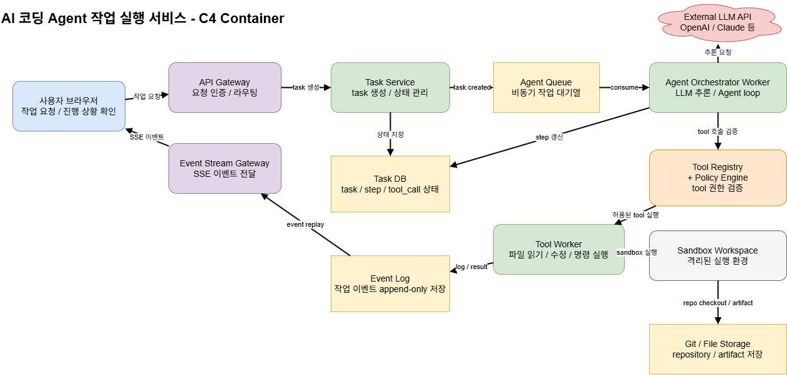
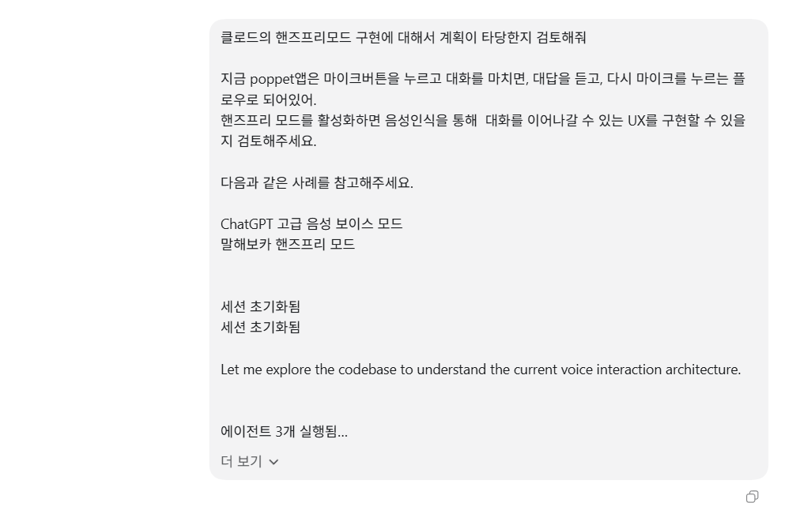
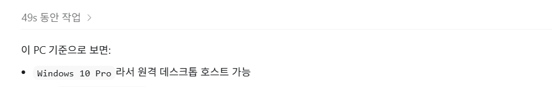

# Week 3 과제: AI 코딩 Agent 작업 실행 서비스 설계

## 1. 문제 이해 및 설계 범위 확정

### 시나리오

사용자는 웹 화면에서 AI 코딩 Agent에게 자연어로 개발 작업을 요청한다.

예를 들어 다음과 같은 요청이 들어올 수 있다.

```text
"테스트 실패 원인 찾아서 고쳐줘"
"Redis 연결 오류가 왜 나는지 분석해줘"
"이 프로젝트 구조 설명해줘"
"간단한 테스트 코드 작성하고 실행해줘"
```

이때 AI는 단순히 답변 텍스트만 생성하지 않는다. 프로젝트 파일을 탐색하고, 필요한 파일을 읽고, 코드를 수정하고, 명령어를 실행하고, 테스트 결과를 다시 읽은 뒤 다음 행동을 결정한다.

이번 설계는 Claude Code 같은 실제 제품의 내부 구조를 그대로 분석하는 것이 아니라, **Claude Code류의 AI 코딩 Agent가 동작하기 위해 필요한 최소한의 작업 실행 플랫폼**을 설계하는 데 초점을 둔다. 즉, 핵심은 LLM 자체가 아니라 LLM이 여러 tool을 안전하게 호출하고, 긴 작업을 안정적으로 이어가며, 사용자에게 진행 상황을 실시간으로 보여주는 구조다.

### 설계 범위

| 포함 (In Scope) | 제외 (Out of Scope) |
|---|---|
| 사용자 자연어 요청 처리 | LLM 자체 학습 |
| Agent 실행 루프 | 모델 파인튜닝 |
| Tool calling 구조 | GPU 인프라 |
| 파일 탐색 / 파일 읽기 / 코드 수정 | IDE 자체 구현 |
| 명령 실행 / 테스트 실행 | 실제 컨테이너 런타임 구현 |
| 작업 진행 상황 스트리밍 | 완전한 보안 솔루션 개발 |
| 장시간 작업 상태 저장과 복구 | 자체 LLM 개발 |
| Sandbox와 권한 제한 | 복잡한 멀티 Agent 협업 |
| 실패 시 재시도와 중복 실행 방지 | 대규모 코드 검색 모델 구현 |

### 시스템 구성 전제

- 사용자는 로그인된 상태라고 가정한다.
- 외부 LLM API를 사용한다고 가정한다.
- Tool 실행용 sandbox container는 이미 준비되어 있다고 가정한다.
- Git 저장소나 파일 저장소는 외부 시스템을 사용할 수 있다고 가정한다.
- AI 서비스는 모델 학습이 아니라 **Agent orchestration, tool 실행 관리, 상태 저장, 스트리밍 전달**을 책임진다.
- 이번 주는 시간이 많지 않으므로, 하나의 프로젝트에서 하나의 Agent 작업을 수행하는 MVP 수준으로 설계를 단순화한다.

### 기능 요구사항

- 사용자는 자연어로 코딩 작업을 요청할 수 있어야 한다.
- Agent는 상황에 따라 파일 읽기, 파일 수정, 명령 실행, 테스트 실행 tool을 호출할 수 있어야 한다.
- Tool 실행 결과를 바탕으로 다음 행동을 이어갈 수 있어야 한다.
- 사용자는 작업 진행 상황과 주요 로그를 실시간으로 볼 수 있어야 한다.
- 작업이 오래 걸려도 비동기로 계속 실행되어야 한다.
- 사용자가 중간에 연결을 끊었다가 다시 접속해도 이전 상태를 복구할 수 있어야 한다.
- 위험한 명령이나 허용되지 않은 파일 접근은 제한할 수 있어야 한다.
- 실패한 tool 실행은 정책에 따라 재시도하거나 사용자에게 실패 원인을 보여줄 수 있어야 한다.

### 비기능 요구사항

| 항목 | 목표 |
|---|---|
| 첫 응답 시작 시간 | 3초 이내에 task 생성 및 "작업 시작" 이벤트 전달 |
| 스트리밍 지연 | 평균 1초 이하 |
| 평균 작업 시간 | 30초 ~ 10분 |
| 장시간 작업 처리 | 최대 30분 |
| 상태 복구 | 서버 재시작 이후에도 task 상태 유지 |
| 동시 실행 작업 수 | MVP 기준 수천 개, 확장 시 수만 개 |
| 중복 실행 방지 | 같은 tool call이 중복 반영되지 않도록 idempotency key 사용 |

### 개략적 규모 추정

이번 설계는 과제 기준값보다 조금 작은 MVP 서비스로 가정한다.

| 항목 | 수치 |
|---|---:|
| MAU / DAU | 약 100,000명 / 약 20,000명 |
| 일일 Agent 작업 수 | 약 100,000건 |
| 평균 Tool 호출 횟수 | 작업당 5~10회 |
| 평균 작업 시간 | 1~5분 |
| 장시간 작업 비율 | 약 10% |
| 동시 실행 작업 수 | 약 2,000건 |
| 평균 스트리밍 연결 유지 시간 | 약 2~5분 |
| 피크 시간대 | 평일 업무 시간대 |

---

## 2. 개략적 설계안 제시 및 동의 구하기

### 핵심 흐름



1. 사용자가 웹 UI에서 자연어 작업을 요청한다.

2. API Gateway가 요청을 받아 Task Service로 전달한다.
3. Task Service는 `task_id`를 생성하고 Task DB에 `CREATED` 상태로 저장한다.
4. Task Service는 Agent Queue에 `task.created` 메시지를 발행한다.
5. 사용자에게는 3초 이내에 `task_id`와 "작업 시작됨" 응답을 반환한다.

6. 사용자는 Event Stream Gateway에 연결해 작업 이벤트를 SSE로 구독한다.
7. Agent Orchestrator Worker가 queue에서 task를 가져온다.
8. Agent Orchestrator는 LLM API에 현재 요청과 컨텍스트를 전달한다.
9. LLM은 직접 파일을 수정하지 않고, `read_file`, `edit_file`, `run_command`, `run_tests` 같은 tool 호출 의도를 반환한다.
```
-- tool 호출 가능한 구조화된 JSON 형태의 응답을 반환한다.

{
  "type": "tool_use",
  "name": "run_command",
  "input": {
    "command": "npm test"
  }
}
```
10. Agent Orchestrator는 Tool Registry와 Policy Engine을 통해 호출 가능한 tool인지 검증한다.
11. Tool Worker가 sandbox 안에서 실제 tool을 실행한다.
12. Tool 실행 로그와 결과는 Event Log와 Task DB에 저장되고 사용자에게 실시간 스트리밍된다.
13. Agent Orchestrator는 tool 결과를 다시 LLM에 전달해 다음 행동을 결정한다.
14. 더 이상 실행할 tool이 없으면 최종 응답을 생성하고 task를 `COMPLETED`로 변경한다.

---

## 3. 상세 설계

1. Agent 실행 흐름과 Tool Calling
2. 장시간 작업 처리와 상태 복구
3. 스트리밍 응답 구조와 Sandbox 권한 제어

### 3-1. Agent 실행 흐름과 Tool Calling

Agent는 한 번의 LLM 호출로 끝나지 않는다. 다음과 같은 반복 루프를 가진다.

```text
사용자 요청
-> LLM 추론
-> tool 호출 결정
-> tool 권한 검증
-> tool 실행
-> tool 결과 저장
-> 결과를 다시 LLM 컨텍스트에 추가
-> 다음 행동 결정
```

중요한 점은 **LLM이 직접 파일이나 서버를 조작하지 않는다**는 것이다. LLM은 "어떤 tool을 어떤 인자로 호출하고 싶다"는 의도를 반환하고, 실제 실행 여부는 Agent Orchestrator와 Policy Engine이 결정한다.

대표 tool은 다음과 같이 둔다.

| Tool | 역할 |
|---|---|
| `list_files` | 프로젝트 파일 목록 조회 |
| `read_file` | 특정 파일 내용 읽기 |
| `edit_file` | 허용된 파일에 patch 적용 |
| `run_command` | sandbox 안에서 명령 실행 |
| `run_tests` | 테스트 명령 실행 |
| `summarize_result` | 긴 로그나 파일 내용을 요약 |

Agent task 상태는 다음처럼 관리한다.

| 상태 | 의미 |
|---|---|
| `CREATED` | 작업이 생성됨 |
| `RUNNING` | Agent가 추론 또는 tool 실행 중 |
| `WAITING_APPROVAL` | 위험 명령 등에 대해 사용자 승인을 기다림 |
| `COMPLETED` | 작업 성공 |
| `FAILED` | 복구 불가능한 실패 |
| `CANCELED` | 사용자가 취소 |

Agent 자체는 사용자 관점에서는 stateful하게 보인다. 이전에 읽은 파일, 실패한 테스트, 수정한 파일을 기억하며 이어서 작업하기 때문이다. 하지만 서버 구조는 worker를 stateless하게 두고, 상태는 Task DB와 Event Log에 저장한다.

이렇게 하면 특정 Agent Worker가 죽어도 다른 worker가 task 상태를 읽고 이어받을 수 있다. 즉, **사용자 경험은 stateful, 인프라 구조는 stateless worker + persistent state**로 가져가는 절충안이다.

### 3-2. 장시간 작업 처리와 상태 복구

AI 코딩 작업은 수십 초 안에 끝나기도 하지만, 테스트 설치, 빌드, 디버깅이 포함되면 몇 분 이상 걸릴 수 있다. 따라서 사용자의 HTTP 요청 하나에서 모든 작업을 동기적으로 처리하면 안 된다.

이번 설계에서는 작업 생성과 실제 실행을 분리한다.

```text
사용자 요청
-> Task Service가 task 생성
-> Queue에 작업 등록
-> 사용자에게 task_id 즉시 반환
-> Agent Worker가 비동기 실행
```

Task DB에는 다음 정보를 저장한다.

| 데이터 | 설명 |
|---|---|
| task_id | 작업 식별자 |
| user_id | 요청 사용자 |
| repo_id | 대상 프로젝트 |
| status | 현재 작업 상태 |
| current_step | 현재 진행 중인 step |
| created_at / updated_at | 생성 및 갱신 시각 |
| idempotency_key | 중복 요청 방지 |

Event Log에는 append-only 방식으로 작업 이벤트를 저장한다.
Agent 작업은 긴 시간 동안 여러 tool을 실행하기 때문에 현재 상태만 저장하면 복구와 디버깅이 어려움. 그래서 이벤트를 덮어쓰지 않고 append-only로 남겨, 재접속 시 replay하고 장애 시 마지막 성공 지점을 찾으며 감사 로그로도 활용할 수 있게 설계했습니다.

```text
task.created
agent.started
tool.started
tool.log
tool.finished
agent.message
approval.required
task.completed
task.failed
```

이 구조의 장점은 reconnect가 쉽다는 점이다. 사용자가 브라우저를 닫았다가 다시 들어오면 `task_id`로 현재 상태를 조회하고, 마지막으로 받은 event id 이후의 이벤트만 다시 스트리밍하면 된다.

Worker 장애가 발생했을 때는 lease 기반으로 복구한다.

1. Worker가 task를 가져갈 때 일정 시간 lease를 획득한다.
2. 실행 중에는 heartbeat로 lease를 연장한다.
3. Worker가 죽으면 heartbeat가 끊긴다.
4. 다른 worker가 만료된 task를 다시 가져와 마지막 완료 step 이후부터 재개한다.

단, 모든 tool을 무조건 재실행하면 위험하다. 예를 들어 파일 수정 tool이 두 번 실행되면 같은 patch가 중복 적용될 수 있다. 그래서 각 tool call에는 `tool_call_id`와 idempotency key를 부여한다.

```text
task_id + step_no + tool_call_id
```

이미 성공한 tool call은 다시 실행하지 않고 저장된 결과를 재사용한다. 이를 통해 장애 복구와 중복 실행 방지를 같이 해결한다.

### 3-3. 스트리밍 응답 구조와 Sandbox 권한 제어

사용자는 긴 작업 중에 "AI가 멈췄는지", "무엇을 하고 있는지", "어디서 실패했는지"를 알고 싶다. 그래서 최종 답변만 보여주는 방식은 적합하지 않다.

이번 설계에서는 WebSocket보다 SSE를 우선 선택한다.

| 방식 | 장점 | 단점 | 판단 |
|---|---|---|---|
| HTTP Polling | 구현이 단순함 | 지연과 요청 수 증가 | 실시간성이 부족 |
| SSE | 서버에서 클라이언트로 이벤트 전달이 단순함 | 클라이언트 -> 서버 양방향에는 부적합 | 진행 상황 스트리밍에 적합 |
| WebSocket | 양방향 통신에 적합 | 연결 관리가 더 복잡함 | 추후 터미널 상호작용이 필요하면 고려 |

AI 코딩 Agent의 기본 진행 상황은 서버가 사용자에게 보내는 단방향 이벤트가 대부분이다. 사용자의 추가 입력이 필요한 경우에는 별도 HTTP API로 승인 또는 취소 요청을 보내면 된다. 그래서 MVP에서는 SSE가 충분하다고 판단했다.

스트리밍 이벤트는 토큰 스트림과 작업 이벤트 스트림을 구분한다.

| 이벤트 타입 | 예시 |
|---|---|
| `assistant_token` | AI가 최종 설명을 생성하는 토큰 |
| `tool_started` | `pytest 실행 중` |
| `tool_log` | 테스트 로그 일부 |
| `tool_finished` | 테스트 성공 또는 실패 |
| `approval_required` | 위험 명령 실행 전 사용자 승인 필요 |
| `task_completed` | 작업 완료 |

Tool 실행 로그는 전부 실시간으로 보내지 않고, 기본적으로는 중요한 단위로 잘라 보낸다.

- tool 시작
- 핵심 로그 일부
- 에러 로그
- 종료 코드
- 실행 시간

너무 긴 로그는 그대로 LLM 컨텍스트에 넣지 않고 요약해서 저장한다. 사용자 화면에는 원본 로그 다운로드 또는 펼쳐보기 형태로 제공할 수 있다.

Sandbox 권한 제어는 다음 원칙으로 설계한다.

| 제어 항목 | 정책 |
|---|---|
| 파일 접근 | 사용자의 workspace root 하위만 허용 |
| 쓰기 권한 | 허용된 프로젝트 파일에만 patch 적용 |
| 명령 실행 | allowlist 기반으로 시작하고 위험 명령은 승인 필요 |
| 네트워크 | 기본 차단, dependency install 등은 승인 후 허용 |
| 실행 시간 | tool별 timeout 설정 |
| 리소스 | CPU, memory, disk limit 설정 |
| 비밀 정보 | 로그와 LLM 입력 전 secrets redaction |

예를 들어 `npm test`, `pytest`, `gradle test`는 일반적으로 허용할 수 있지만, `rm -rf`, 시스템 디렉터리 접근, 외부로 파일을 전송하는 명령은 차단하거나 사용자 승인을 요구한다.

이 설계의 핵심은 "AI를 믿고 모든 권한을 주는 것"이 아니라, **AI는 제안하고 시스템이 검증한 뒤 제한된 환경에서 실행한다**는 점이다.

---

## 4. 설계 장점

- 요청 접수와 Agent 실행을 queue로 분리해 첫 응답을 빠르게 줄 수 있다.
- Agent Worker를 stateless하게 두고 상태를 DB/Event Log에 저장하므로 장애 복구가 쉽다.
- SSE 기반 이벤트 스트리밍으로 긴 작업 중에도 사용자에게 진행 상황을 보여줄 수 있다.
- Tool Registry와 Policy Engine을 통해 LLM의 tool 호출을 통제할 수 있다.
- Sandbox에서 tool을 실행하므로 파일 접근, 명령 실행, 네트워크 사용 범위를 제한할 수 있다.
- `tool_call_id`와 idempotency key를 사용해 중복 실행 문제를 줄일 수 있다.

---

## 5. 설계 단점

- 단순 채팅 서비스보다 Task DB, Queue, Event Log, Worker, Sandbox 등 운영 컴포넌트가 많다.
- SSE는 단방향 스트리밍에는 좋지만, 완전한 터미널 상호작용 같은 기능에는 WebSocket이 더 적합할 수 있다.
- Sandbox와 권한 정책을 잘못 설계하면 보안 위험이 남는다.
- 긴 로그와 많은 파일 내용을 모두 LLM 컨텍스트에 넣을 수 없으므로 요약과 컨텍스트 선별 품질이 중요하다.
- LLM API rate limit이나 비용 문제가 병목이 될 수 있다.
- 자동 코드 수정은 실패했을 때 rollback 또는 diff 검토 UX가 필요하다.

---

## 6. 마무리

Codex같은 느낌으로 코딩에이전트가 동작하기 위해 필요한 최소한의 서버 구조를 설계.

- LLM은 직접 실행 주체가 아니라 tool 호출을 제안하는 추론 엔진으로 둔다.(사용자의 의도를 파악)
- 실제 tool 실행은 Agent Orchestrator, Policy Engine, Tool Worker, Sandbox가 통제한다.
- 긴 작업은 queue 기반 비동기로 처리하고, 상태는 Task DB와 Event Log에 남긴다.
- 사용자는 SSE로 작업 진행 상황을 실시간 확인하고, 재접속 시 이벤트를 이어받는다.
- Worker는 stateless하게 두되, task와 tool call 상태를 영속화해 장애 복구가 가능하게 한다.

대규모 시스템 설계 관점에서 중요한 고민은 "AI가 똑똑한가"보다 "AI가 수행하는 행동을 시스템이 어떻게 안전하고 복구 가능하게 관리하는가"라고 생각했다. 특히 Agent 서비스는 일반 채팅 서비스보다 실행 시간이 길고 외부 부작용이 많기 때문에, streaming, state management, sandbox, idempotency가 핵심 설계 포인트가 된다.

---

## 📚 참고 자료

- 가상 면접 사례로 배우는 대규모 시스템 설계 기초
- Queue 기반 비동기 작업 처리 패턴
- SSE / WebSocket 실시간 이벤트 전달 방식
- Tool Calling 기반 Agent 실행 패턴
