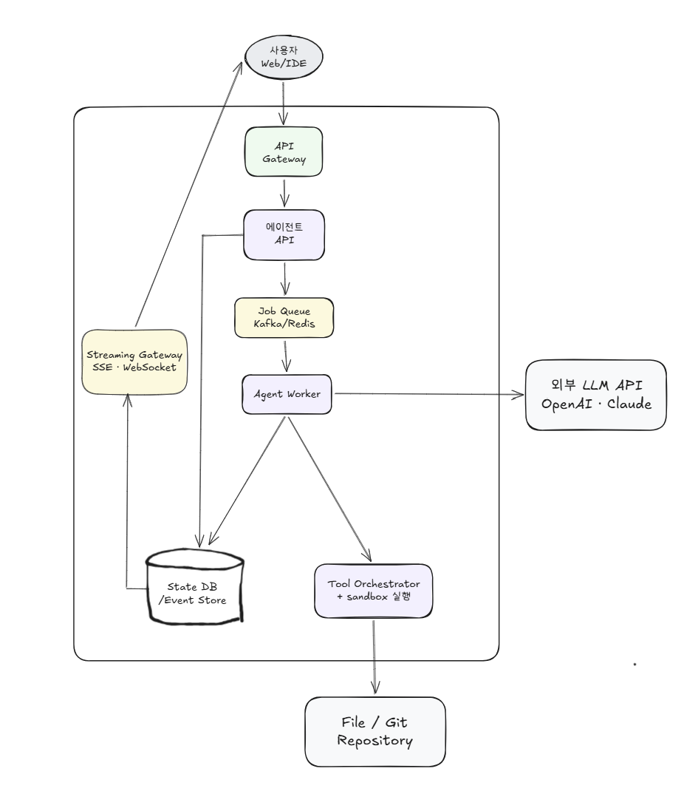
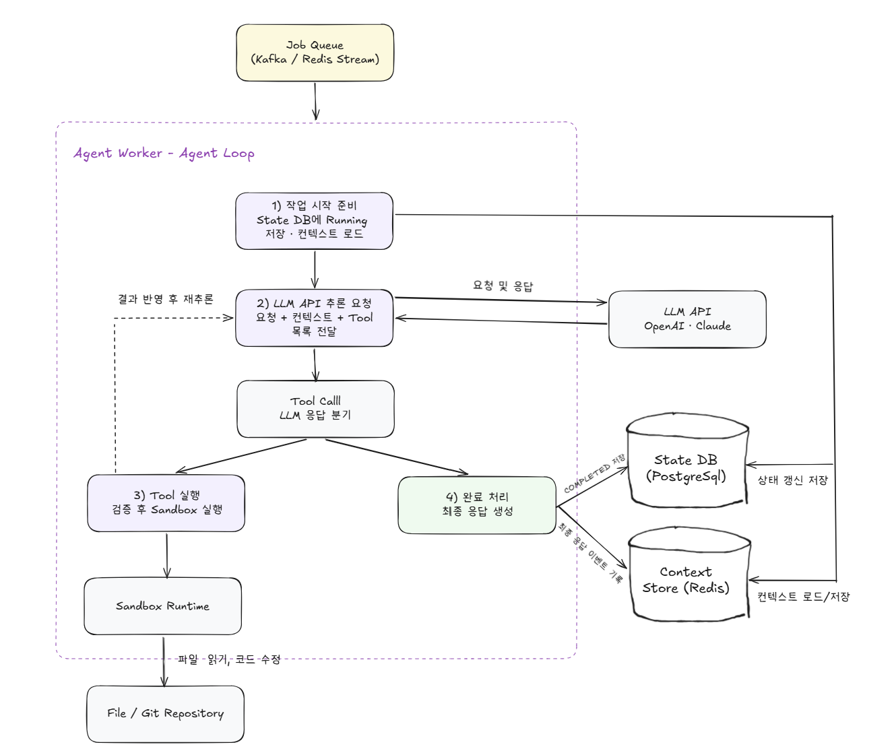

# Week 3 과제: AI 서비스 및 Agent 도구 시스템 설계

---

## 1. 문제 이해 및 설계 범위 확정

### 시나리오

본 설계에서는 사용자가 자연어로 개발 작업을 요청하면, AI Agent가 프로젝트 파일을 탐색하고, 코드를 수정하고, 명령어를 실행하고, 테스트 결과를 검증하는 **AI Coding Agent 서비스, Codigent**를 설계한다.

Codigent는 단순히 LLM이 텍스트 답변만 생성하는 서비스가 아니다. 사용자의 요청을 이해한 뒤, 필요한 Tool을 순차적으로 호출하며 실제 개발 작업을 수행하는 Agent 도구 시스템이다.

예를 들어 사용자가 다음과 같이 요청할 수 있다.

```xml
- "Docker 실행 오류 수정해줘"
- "Redis 연결 실패 원인 분석해줘"
- "테스트 코드 작성하고 실행해줘"
- "이 프로젝트 구조 설명해줘"
```

## 설계 범위 (In / Out of Scope)

---

| 포함 (In Scope) | 제외 (Out of Scope) |
| --- | --- |
| 사용자 요청 처리 흐름 | LLM 자체 학습 |
| Agent 실행 흐름 | 모델 파인튜닝 |
| Tool Calling 구조 | GPU 인프라 |
| 파일 탐색 / 코드 수정 | Transformer 구조 |
| 명령 실행 / 결과 검증 | 벡터 모델 구현 |
| 스트리밍 응답 | IDE 자체 구현 |
| 장시간 작업 처리 | 실제 컨테이너 런타임 구현 |
| 작업 상태 관리 | 운영체제 구현 |
| Sandbox / 권한 제어 | 완전한 보안 솔루션 개발 |
| 실패 복구 및 재시도 | 자체 LLM 개발 |

## 시스템 구성 전제

---

- Codigent는 외부 LLM API(OpenAI, Claude 등)를 사용한다고 가정한다.
- LLM 자체 학습, 파인튜닝, GPU 인프라 구성은 설계 범위에서 제외한다.
- Tool 실행용 Sandbox(Container)는 이미 준비되어 있다고 가정한다.
- 사용자는 로그인 상태라고 가정한다.
- 파일 저장소 및 Git Repository는 외부 시스템을 사용할 수 있다.
- 사용자의 프로젝트 파일은 Codigent가 허용된 범위 안에서만 접근할 수 있다.
- AI 서비스는 Tool orchestration과 작업 상태 관리를 책임진다.
- 사용자는 작업 진행 상황을 Web 또는 IDE Plugin에서 실시간으로 확인할 수 있다.
- 긴 작업 도중 사용자의 연결이 끊겨도 Agent 작업은 서버 측에서 계속 진행될 수 있어야 한다.

## 기능 요구사항

---

- 사용자의 자연어 요청을 처리할 수 있어야 한다.
- AI Agent는 상황에 따라 여러 Tool을 호출할 수 있어야 한다.
- Tool 실행 결과를 기반으로 추가 작업을 수행할 수 있어야 한다.
- 프로젝트 파일을 탐색하고 필요한 파일을 읽을 수 있어야 한다.
- 허용된 범위 안에서 코드 수정이 가능해야 한다.
- 명령 실행, 테스트 수행, 결과 검증이 가능해야 한다.
- 작업 진행 상황을 사용자에게 실시간 스트리밍할 수 있어야 한다.
- 긴 작업을 비동기로 처리할 수 있어야 한다.
- 작업 실패 시 재시도 또는 복구가 가능해야 한다.
- 여러 사용자의 동시 작업을 처리할 수 있어야 한다.
- Tool 실행 권한 범위를 제한할 수 있어야 한다.
- 사용자가 재접속했을 때 기존 작업 상태와 로그를 다시 확인할 수 있어야 한다.

## 비기능 요구사항

---

| 항목 | 목표 |
| --- | --- |
| 첫 응답 시작 시간 | 3초 이내 |
| 스트리밍 지연 | 평균 1초 이하 |
| Tool 실행 실패 복구 | 자동 재시도 가능 |
| 장시간 작업 처리 | 최대 수십 분 |
| 작업 상태 복구 | 서버 재시작 이후에도 유지 |
| 동시 실행 작업 수 | 수천 개 이상 |
| Agent 응답 일관성 | 동일 작업 중복 실행 방지 |

## 대략적 규모 추정

---

| 항목 | 수치 |
| --- | --- |
| MAU / DAU | 약 500,000명 / 약 100,000명 |
| 일일 Agent 작업 수 | 약 2,000,000건 |
| 평균 Tool 호출 횟수 | 작업당 5~20회 |
| 평균 작업 시간 | 30초 ~ 10분 |
| 장시간 작업 비율 | 약 10% |
| 동시 실행 작업 수 | 약 20,000건 |
| 평균 스트리밍 연결 유지 시간 | 약 2~5분 |
| 피크 시간대 | 평일 업무 시간대 |

# 2. 개략적 설계안 제시 및 동의 구하기

## 설계 방향
Codigent는 하나의 사용자 요청을 처리하기 위해 여러 단계의 작업을 수행한다.

예를 들어 사용자가 `"Redis 연결 실패 원인 분석해줘"`라고 요청하면, Agent는 단순히 답변을 생성하는 것이 아닌, 다음과 같은 흐름으로 작업을 수행한다.

```text
1. 프로젝트 구조 탐색
2. Redis 관련 파일 검색
3. 설정 파일 읽기
4. Docker 설정 확인
5. 로그 확인 명령 실행
6. 원인 추론
7. 필요 시 코드 또는 설정 수정
8. 테스트 실행
9. 결과 검증
10. 최종 응답 생성
```
따라서, Codigent의 핵심 설계 방향을 하기와 같이 잡았다.
- 사용자 요청은 즉시 처리하지 않고, Agent 작업으로 등록
- Agent 작업은 Queue 기반으로 비동기 처리
- Agent Worker는 LLM 호출과 Tool 호출을 반복하는 Agent loop를 수행
- Tool 실행은 Tool Orchestrator를 통해 검증하고, Sandbox Runtime에서 격리 실행된다.
- 작업 상태와 실행 이벤트는 저장소에 남긴다.
- Streaming Gateway는 저장된 이벤트를 사용자에게 실시간으로 전달한다.
- 사용자가 연결을 끊었다가 다시 접속해도 작업 상태와 로그를 복구할 수 있어야 한다.

---
## 개략적 아키텍처 다이어그램 


Codigent는 사용자의 자연어 요청을 장시간 Agent 작업으로 변환하고, 이를 비동기로 실행하는 구조를 가진다.

사용자는 Web 또는 IDE Plugin을 통해 작업을 요청하고, 요청은 API Gateway를 거쳐 Agent API로 전달된다.
Agent API는 작업을 생성하고, 작업 상태를 State DB / Event Store에 저장한 뒤, Job Queue에 실행 요청을 등록한다.
이때 사용자에게 `taskId`를 반환한다.

Agent Worker는 Job Queue에서 작업을 가져와 Agent Loop를 실행한다.
이 Agent Worker가 외부 LLM API를 호출해 다음 행동을 결정하고, Tool 호출이 필요하면 Tool Orchestrator를 통해 Sandbox Runtime에서 Tool을 실행한다.
그럼 Tool은 프로젝트 파일을 읽거나 수정하고, 명령어를 실행하여 테스트를 수행할 수 있다.

작업 상태와 실행 이벤트는 State DB / Event Store에 저장된다. Streaming Gateway는 이 이벤트를 사용자에게 SSE 또는 WebSocket으로 전달한다.
또한, 사용자가 연결을 끊었다가 다시 접속해도 `taskId`를 기준으로 작업 상태와 로그를 복구할 수 있다.

### 핵심 컴포넌트 정리

| 컴포넌트                   | 역할                                  |
| ---------------------- | ----------------------------------- |
| 사용자 Web / IDE          | 자연어로 Agent 작업 요청, 진행 상황 확인          |
| API Gateway            | 인증, 라우팅, rate limiting, 공통 진입점      |
| Agent API              | 작업 생성, 상태 조회, taskId 발급, Queue 등록   |
| Job Queue              | Agent 작업 비동기 처리, 피크 트래픽 완충          |
| Agent Worker           | Agent loop 실행, LLM 호출, Tool 호출 조율   |
| 외부 LLM API             | 사용자 요청 이해, 다음 행동 결정, 최종 응답 생성       |
| Tool Orchestrator      | Tool 호출 검증, 권한 확인, timeout/retry 제어 |
| Sandbox Runtime        | Tool을 안전하게 실행하는 격리 환경               |
| File / Git Repository  | 프로젝트 파일 및 Git 저장소                   |
| State DB / Event Store | 작업 상태와 실행 이벤트 저장                    |
| Streaming Gateway      | 작업 진행 상황과 로그를 사용자에게 실시간 전달          |

### 기술 선택 방향

| 영역         | 선택                                            |
| ---------- | --------------------------------------------- |
| 작업 상태 저장   | PostgreSQL 등 RDBMS                            |
| 이벤트/로그 저장  | 초기에는 RDBMS 테이블, 규모 증가 시 별도 Event Store로 분리    |
| 비동기 작업 큐   | Kafka / Redis Stream / RabbitMQ / SQS 중 선택 가능 |
| 실시간 스트리밍   | SSE 우선, 양방향 상호작용이 많으면 WebSocket               |
| Tool 실행 환경 | Sandbox Container                             |
| LLM        | OpenAI, Claude 등 외부 LLM API                   |
| 파일 저장소     | 외부 Git Repository 또는 File Store               |


## 핵심 흐름 

### 1. 작업 생성 흐름

```text
사용자 Web/IDE
→ API Gateway
→ Agent API
   ├─→ State DB / Event Store
   └─→ Job Queue
```

1. 사용자가 Web/IDE에서 자연어로 작업을 요청한다
2. API Gateway에서 인증·라우팅·rate limiting 수행
3. Agent API가 요청을 받아 작업을 생성한다
4. State DB에 작업 상태를 QUEUED로 저장하고 taskId를 발급한다
5. Job Queue에 작업 실행 요청을 등록한다
6. 사용자에게 taskId와 초기 상태를 즉시 응답한다

### 2. Agent 실행 흐름
```text
Job Queue
→ Agent Worker
   ├─→ 외부 LLM API (추론 요청·응답 반복)
   └─→ Tool Orchestrator
          └─→ Sandbox Runtime
                 └─→ File / Git Repository
```
**Agent Loop 구조**

1. Agent Worker는 Job Queue에서 작업을 가져온다.
2. 작업 상태를 `RUNNING`으로 변경한다.
3. Agent Worker는 사용자 요청과 현재 컨텍스트를 외부 LLM API에 전달한다.
4. LLM은 다음 행동을 결정한다.
5. Tool 호출이 필요한 경우 Agent Worker는 Tool Orchestrator에 Tool 실행을 요청한다.
6. Tool Orchestrator는 Tool 이름, 입력값, 권한, timeout 정책을 검증한다.
7. Sandbox Runtime에서 파일 탐색, 코드 수정, 명령 실행, 테스트 수행 등의 작업이 실행된다.
8. Tool 실행 결과는 Agent Worker로 반환된다.
9. Agent Worker는 Tool 결과를 다시 LLM에 전달해 다음 행동을 결정한다.
10. 최종 답변 또는 작업 완료 조건이 만족될 때까지 이 과정을 반복한다.

### 3. Tool Calling 흐름
```text
Agent Worker
→ Tool Orchestrator
   └─→ Sandbox Runtime
          └─→ File / Git Repository
          └─← 실행 결과 반환
← Tool Orchestrator (결과 반환)
```
1. LLM은 직접 Tool을 실행하지 않고, 어떤 Tool을 어떤 인자로 호출할지 결정한다.
2. Agent Worker는 LLM이 제안한 Tool 호출을 Tool Orchestrator에 전달한다.
3. Tool Orchestrator는 해당 Tool이 허용된 Tool인지 검증한다.
4. Tool 입력 값이 schema에 맞는지 확인한다.
5. 위험 명령이나 허용되지 않은 파일 접근은 차단한다.
6. 허용된 Tool은 Sandbox Runtime에서 실행된다.
7. 실행 결과는 Agent Worker에게 반환되고, 다음 LLM 추론의 입력으로 사용된다.

예시 Tool은 다음과 같다.

| Tool | 역할 |
|------|------|
| `file_search` | 프로젝트 내 파일 검색 |
| `file_read` | 파일 내용 읽기 |
| `file_write` | 코드 또는 설정 파일 수정 |
| `shell_exec` | 명령 실행 |
| `test_runner` | 테스트 실행 |
| `git_diff` | 변경 사항 확인 |
| `log_reader` | 실행 로그 확인 |

### 4. 작업 이벤트 저장 및 스트리밍 흐름
```text
Agent Worker → State DB / Event Store → Streaming Gateway → 사용자 Web/IDE
```
1. Agent Worker는 작업 단계마다 실행 이벤트를 생성한다.
2. 작업 상태와 실행 이벤트는 State DB / Event Store에 저장된다.
3. Streaming Gateway는 해당 작업의 이벤트를 읽어 사용자에게 실시간으로 전달한다.
4. 사용자는 Agent가 현재 어떤 파일을 읽고 있는지, 어떤 명령을 실행 중인지, 어떤 오류를 발견했는지 확인할 수 있다.
5. 사용자의 연결이 끊기더라도, 이벤트는 저장소에 남는다.
6. 사용자가 재접속하면 `taskId`를 기준으로 기존 이벤트를 다시 조회하고, 이후 새 이벤트를 이어서 스트리밍한다.

스트리밍 이벤트 예시는 하기와 같다.
```text
[작업 시작]
[프로젝트 파일 탐색 중]
[docker-compose.yml 읽는 중]
[Redis 설정 확인 중]
[docker compose logs 실행 중]
[원인 발견: Redis host 설정 불일치]
[설정 파일 수정 중]
[테스트 실행 중]
[작업 완료]
```

### 5. 상태 복구 흐름
```text
사용자 재접속
→ Streaming Gateway
   └─→ State DB / Event Store (이전 이벤트 조회)
→ 사용자 Web/IDE (이벤트 복구 후 스트리밍 재개)
```

1. 사용자가 작업 도중 브라우저 또는 IDE 연결을 끊는다.
2. Agent Worker는 서버 측에서 작업을 계속 수행한다.
3. 작업 상태와 실행 이벤트는 계속 저장된다.
4. 사용자가 다시 접속하면 `taskId`로 현재 작업 상태를 조회한다.
5. Streaming Gateway는 이전 이벤트를 복구해 보여주고, 이후 새 이벤트를 이어서 전달한다.

Worker 장애가 발생한 경우에는 오래된 `RUNNING` 작업을 감지해 재시도 가능한 작업을 Queue에 다시 넣을 수 있다.
이때 동일 작업의 중복 실행을 막기 위해 `idempotencyKey` 또는 작업 상태 조건을 사용할 수 있다.


# 3. 상세 설계

개략 설계에서는 전체 흐름을 한눈에 보여주기 위해 `State DB / Event Store`를 하나의 논리 저장소처럼 표현했다. 이는 Agent 작업 상태와 실행 이벤트가 모두 “작업 복구와 스트리밍”에 사용되기 때문이다. 사용자는 `taskId`를 기준으로 현재 작업 상태를 조회하고, 지금까지 발생한 이벤트와 로그를 다시 확인해야 한다.

다만 실제 상세 설계에서는 두 저장소의 역할을 분리해서 바라볼 필요가 있다.

- `State DB`는 작업의 현재 상태를 저장한다.
- `Event Store`는 작업 중 발생한 이벤트와 로그를 시간순으로 저장한다.
- `Context Store`는 LLM 추론에 필요한 최근 대화, Tool 실행 결과 요약, 작업 메모리를 빠르게 불러오기 위한 캐시 역할을 한다.

예를 들어 `State DB`는 “이 작업이 현재 RUNNING인지, COMPLETED인지, FAILED인지”를 저장하고, `Event Store`는 “파일을 읽음, 테스트를 실행함, 오류를 발견함”과 같은 진행 이벤트를 저장한다. `Context Store`는 다음 LLM 호출에 필요한 최근 컨텍스트를 저장한다.

초기 구현에서는 `State DB`와 `Event Store`를 모두 PostgreSQL 같은 RDBMS에 저장할 수 있다. 이 경우 `tasks` 테이블은 작업 상태를 저장하고, `task_events` 테이블은 작업 이벤트를 저장한다. 이렇게 하면 구현이 단순하고 트랜잭션 처리가 쉬우며, 서버 재시작 이후에도 작업 상태와 로그를 복구할 수 있다.

반면 `Context Store`는 LLM 호출마다 자주 읽히는 최근 컨텍스트를 빠르게 제공해야 하므로 Redis 같은 인메모리 저장소를 사용할 수 있다. 다만 Redis는 빠른 조회를 위한 캐시 성격으로 보고, 전체 실행 이력과 복구 가능한 로그는 Event Store에 저장한다.

규모가 커지면 Event Store는 별도 저장소로 분리하는 것이 적절하다. Agent 작업은 하나의 작업당 5~20회 이상의 Tool 호출을 수행하고, 각 Tool 실행 로그와 토큰 스트리밍 이벤트까지 저장하면 이벤트 쓰기량이 빠르게 증가한다. 따라서 대규모 환경에서는 다음과 같이 분리할 수 있다.

| 저장 대상 | 초기 설계 | 규모 증가 시 확장 |
|---|---|---|
| 작업 현재 상태 | PostgreSQL `tasks` 테이블 | PostgreSQL Primary/Replica, Sharding 고려 |
| 작업 이벤트/로그 | PostgreSQL `task_events` 테이블 | Kafka + OpenSearch/S3 등 |
| 최근 컨텍스트 캐시 | Redis | Redis Cluster, TTL 기반 캐시 관리 |
| 실시간 스트리밍 버퍼 | RDBMS 조회 또는 Redis | Redis Stream / Kafka topic |
| 장기 로그 보관 | PostgreSQL | Object Storage(S3) 또는 Data Lake |

이번 상세 설계에서는 모든 선택 질문을 깊게 다루기보다, Codigent의 핵심인 `Agent 실행 흐름 관리`에 집중한다. AI Coding Agent의 본질은 한 번의 LLM 응답 생성이 아니라, LLM 추론과 Tool 실행을 반복하며 문제를 해결하는 Agent Loop에 있기 때문이다.

---

## 상세 설계 주제 선정

이번 과제에서는 선택 질문 중 아래 한 가지를 중심으로 다룬다.

```text
- 3-1. Agent 실행 흐름 관리
```

사용자의 요청은 여러 번의 LLM 호출과 Tool 호출을 거친다. Agent는 파일을 읽고, 명령을 실행하고, 실행 결과를 다시 해석한 뒤 다음 행동을 결정한다. 따라서 본 설계에서는 Agent Worker 내부에서 LLM 추론과 Tool 실행이 어떻게 반복되는지, Tool 결과가 어떻게 다음 추론의 컨텍스트로 연결되는지, 그리고 Agent 작업을 Stateful하게 관리하되 Worker는 어떻게 Stateless하게 확장 가능하도록 설계할 수 있는지를 중심으로 다룬다.

다만 3-1을 설명하는 과정에서 Tool Calling 구조, Context Store, State DB, Event Store, Sandbox 권한 제어, 스트리밍과 작업 복구 관점도 필요한 수준으로 함께 언급한다.


## 3-1. Agent 실행 흐름 관리

Codigent의 Agent Worker는 Job Queue에서 작업을 가져온 뒤 Agent Loop를 수행한다. Agent Loop는 한 번의 LLM 호출로 끝나는 구조가 아니라, LLM 추론과 Tool 실행을 반복하면서 최종 응답에 도달하는 흐름이다.

사용자의 요청이 단순 질의응답이라면 LLM 응답만으로 종료될 수 있지만, 코딩 Agent의 작업은 파일 탐색, 코드 수정, 명령 실행, 테스트 수행 등 여러 Tool 호출을 포함할 수 있다. 따라서 Agent Worker는 각 단계의 상태와 컨텍스트를 유지하면서 작업을 진행해야 한다.




> 본 다이어그램은 Agent Worker 내부의 실행 루프를 설명하기 위한 그림이므로, 이벤트 저장소를 별도 박스로 표현하지 않았다. 실행 이벤트와 로그는 개략 설계의 `State DB / Event Store` 영역에 저장되는 것으로 보고, 본 상세 다이어그램에서는 Agent Loop에 직접 관여하는 `State DB`와 `Context Store`만 표시했다. 즉, `State DB`는 작업 상태를 저장하고, `Context Store`는 다음 LLM 추론에 필요한 최근 컨텍스트를 빠르게 로드하기 위한 캐시 역할을 한다.


### 1. 작업 시작 준비

Agent Worker는 Job Queue에서 작업 메시지를 가져오면 먼저 작업 상태를 `RUNNING`으로 변경한다. 이 상태는 State DB에 저장된다.

이후 Context Store에서 이전 대화, 작업 요약, 최근 Tool 실행 결과 등 LLM 추론에 필요한 컨텍스트를 로드한다.

```text
Job Queue → Agent Worker → State DB에 RUNNING 저장 → Context Store에서 컨텍스트 로드
```

### 2. LLM API 추론 요청

Agent Worker는 사용자 요청, 현재 컨텍스트, 사용 가능한 Tool 목록을 외부 LLM API에 전달한다.

```text
Agent Worker → LLM API 요청 + 컨텍스트 + Tool 목록 전달
```


LLM은 일반 텍스트 답변만 반환하는 것이 아니라, 필요한 경우 구조화된 Tool Call을 반환한다.

예를 들어 다음과 같은 형태가 될 수 있다.
```text
{
  "tool": "file_read",
  "args": 
    {
        "path": "src/main.py"
    }
}
```


이 구조는 OpenAI의 function calling, Claude의 tool use와 유사한 방식이다. LLM은 직접 파일을 읽거나 명령어를 실행하지 않고, 어떤 Tool을 어떤 인자로 호출할지 판단한다.

### 3. LLM 응답 분기

LLM 응답은 크게 두 가지로 나뉜다.

| 응답 유형        | 처리                            |
| ------------ | ----------------------------- |
| Tool Call    | Tool Orchestrator를 통해 Tool 실행 |
| Final Answer | 최종 응답 생성 후 작업 완료 처리           |


LLM이 Tool Call을 반환하면 Agent Worker는 Tool Orchestrator로 실행을 요청한다. 반대로 LLM이 더 이상 Tool 호출이 필요 없다고 판단하고 최종 응답을 반환하면 완료 흐름으로 이동한다.

이 분기 지점이 Agent Loop의 핵심이다.
```text
LLM 응답
├─ Tool Call → Tool 실행 루프
└─ Final Answer → 완료 처리
```

### 4. Tool 실행 루프

Tool Call이 필요한 경우 Agent Worker는 Tool Orchestrator에 Tool 실행을 요청한다.

Tool Orchestrator는 다음 항목을 검증한다.

- 요청한 Tool이 허용된 Tool인지
- 입력값이 Tool schema에 맞는지
- 접근하려는 파일이 허용 범위 안에 있는지
- 위험 명령어가 포함되어 있지 않은지
- timeout과 retry 정책이 적절한지

검증을 통과한 Tool은 Sandbox Runtime에서 실행된다. Sandbox Runtime은 격리된 실행 환경이며, 파일 읽기, 코드 수정, 명령 실행, 테스트 수행 등을 처리한다.
```text
Agent Worker
→ Tool Orchestrator
→ Sandbox Runtime
→ File / Git Repository
```

### 5. 완료 처리

LLM이 최종 응답을 반환하면 Agent Worker는 최종 응답을 생성하고 작업을 완료 처리한다.

```text
Final Answer → 최종 응답 생성 → State DB에 COMPLETED 저장 → Event Store에 최종 응답 이벤트 기록
```

작업이 정상적으로 끝나면 State DB의 상태는 COMPLETED가 된다. 만약 Tool 실행 실패, LLM API 오류, timeout 등으로 더 이상 진행할 수 없다면 FAILED 상태로 저장하고 실패 이벤트를 기록한다.

이 구조를 통해 Codigent는 단순 텍스트 응답이 아니라, Tool 실행 결과를 기반으로 다음 행동을 결정하는 반복적인 Agent 작업을 수행할 수 있다.


### Stateful vs Stateless 관점

Agent 작업 자체는 stateful하다. 하나의 작업이 여러 번의 LLM 호출과 Tool 실행을 거치기 때문에, 이전 대화, 읽었던 파일, Tool 실행 결과, 실패한 테스트 로그 등을 기억해야 한다.

하지만 Agent Worker 인스턴스가 모든 상태를 메모리에만 들고 있으면 장애 복구와 수평 확장이 어렵다. Worker가 죽으면 작업 상태를 잃게 되고, 특정 Worker에 작업이 묶이면 확장성도 떨어진다.

따라서 본 설계에서는 Agent Worker를 가능한 stateless하게 유지하고, 작업 상태와 컨텍스트를 외부 저장소에 저장한다.

- 작업의 현재 상태는 State DB에 저장한다.
- 최근 컨텍스트와 Tool 결과 요약은 Context Store에 저장한다.
- 전체 실행 이벤트와 로그는 Event Store에 저장한다.

즉, Agent 작업은 stateful하지만, Worker는 외부 저장소를 통해 상태를 복구하는 stateless 실행자에 가깝게 설계한다.

작업이 정상적으로 끝나면 State DB의 상태는 COMPLETED가 된다. 만약 Tool 실행 실패, LLM API 오류, timeout 등으로 더 이상 진행할 수 없다면 FAILED 상태로 저장하고 실패 이벤트를 기록한다.

이 구조를 통해 Codigent는 단순 텍스트 응답이 아니라, Tool 실행 결과를 기반으로 다음 행동을 결정하는 반복적인 Agent 작업을 수행할 수 있다.

---

# 4. 설계 장점

### 1. 단순 LLM 응답이 아닌 실제 작업 수행이 가능하다

Codigent는 사용자의 요청에 대해 단순히 텍스트 답변만 생성하지 않는다. Agent Worker가 LLM 추론과 Tool 실행을 반복하며 파일 탐색, 코드 수정, 명령 실행, 테스트 수행 같은 실제 작업을 수행할 수 있다.

즉, 사용자의 자연어 요청을 실제 개발 작업 흐름으로 변환할 수 있다.

```text
사용자 요청 → LLM 추론 → Tool 실행 → 결과 반영 → 재추론 → 최종 응답
```
### 2. Agent Loop 구조가 명확하다

Agent Worker 내부에서 
```text
LLM 추론 → Tool Call 판단 → Tool 실행 → 결과 반영 → 재추론
```
흐름을 반복하도록 설계했다.

LLM은 직접 파일을 읽거나 명령어를 실행하지 않고, 구조화된 Tool Call을 반환한다. 그리고 Agent Worker는 이를 해석해 Tool Orchestrator를 호출하고, 실행 결과를 다시 LLM 추론의 입력으로 사용한다.

이렇게 하면 LLM의 판단과 실제 실행 책임을 분리할 수 있다.

| 역할         | 담당                |
| ---------- | ----------------- |
| 다음 행동 판단   | LLM API           |
| Tool 호출 제어 | Agent Worker      |
| Tool 검증    | Tool Orchestrator |
| 실제 실행      | Sandbox Runtime   |


### 3. Worker를 Stateless하게 확장하기 쉽다

Agent 작업 자체는 Stateful하지만, Agent Worker 인스턴스는 가능한 Stateless하게 설계했다.

Worker가 모든 상태를 메모리에만 들고 있으면 특정 Worker에 작업이 묶이고, 장애 발생 시 복구가 어렵다. 

반면 작업 상태와 컨텍스트를 외부 저장소에 저장하면 Worker는 Queue에서 작업을 가져와 상태를 로드한 뒤 실행하는 구조가 된다.

이렇게 하면 Worker 인스턴스 수평 확장이 쉽고, 피크 시간대에는 Worker 수를 늘려 더 많은 Agent 작업을 처리할 수 있다.

### 4. Tool 실행을 Sandbox로 격리할 수 있다

AI Coding Agent는 파일 수정, 명령 실행, 테스트 수행처럼 위험할 수 있는 작업을 수행한다. 따라서 LLM이 요청한 Tool Call을 그대로 실행하면 보안 문제가 발생할 수 있다.

본 설계에서는 Tool Orchestrator가 Tool 이름, 입력값, 권한, timeout 정책을 먼저 검증하고, 실제 실행은 Sandbox Runtime에서 수행하도록 했다.

이를 통해 다음과 같은 제어가 가능하다.

- 허용되지 않은 파일 접근 차단
- 위험 명령어 실행 차단
- 실행 시간 제한
- 사용자별 작업 환경 격리
- 프로젝트 단위 접근 범위 제한
### 5. 스트리밍과 작업 실행을 분리할 수 있다

Agent 작업은 수십 초에서 수분 이상 걸릴 수 있다. 따라서 사용자는 작업이 진행되는 동안 현재 상황을 실시간으로 확인할 수 있어야 한다.

본 설계에서는 Agent Worker가 실행 이벤트를 저장하고, Streaming Gateway가 이를 사용자에게 전달하는 구조를 둔다.

이를 통해 사용자의 브라우저나 IDE 연결이 잠시 끊겨도 Agent 작업 자체는 계속 진행될 수 있고, 사용자는 다시 접속해 이전 로그와 현재 상태를 확인할 수 있다.

---

# 5. 설계 단점
### 1. 일반적인 Chat 서비스보다 구조가 복잡하다

단순 Chat 서비스라면 사용자 요청을 LLM API로 전달하고 응답을 반환하는 구조로 충분할 수 있다.

하지만 Codigent는 Tool Calling, Sandbox 실행, 상태 저장, 컨텍스트 관리, 이벤트 스트리밍이 필요하다. 따라서 다음과 같은 컴포넌트가 추가된다.

- Agent API
- Job Queue
- Agent Worker
- Tool Orchestrator
- Sandbox Runtime
- State DB
- Context Store
- Event Store
- Streaming Gateway

이로 인해 구현과 운영 복잡도가 증가한다.

---

### 2. 실행 이벤트와 로그 저장 전략이 추가로 필요하다

3-1 상세 다이어그램에서는 Agent Loop를 중심으로 표현했기 때문에 Event Store를 별도 컴포넌트로 분리하지 않았다. 그러나 실제 운영에서는 Tool 실행 로그, LLM 토큰 스트리밍, 최종 응답 이벤트 등을 저장해야 한다.

초기에는 PostgreSQL의 `task_events` 테이블로 관리할 수 있지만, 작업 수와 Tool 호출 수가 증가하면 이벤트 쓰기량이 빠르게 커질 수 있다. 이 경우 Kafka를 통해 이벤트를 흘려보내고, OpenSearch나 S3 같은 별도 로그 저장소로 분리하는 전략이 필요하다.

---

### 3. Event Store의 쓰기 부하가 커질 수 있다

Agent 작업은 여러 번의 Tool 호출과 실행 로그를 생성한다. 작업당 평균 5~20회 Tool 호출이 발생하고, 각 Tool이 여러 로그 이벤트를 만든다면 Event Store의 쓰기량은 빠르게 증가한다.

초기에는 PostgreSQL의 `task_events` 테이블로 충분할 수 있지만, 규모가 커지면 Kafka, OpenSearch, S3 같은 별도 이벤트/로그 저장 구조가 필요하다.

---

### 4. Tool 실행 보안 설계가 어렵다

AI Coding Agent는 파일 수정과 명령 실행을 수행할 수 있기 때문에 보안 위험이 크다.

예를 들어 LLM이 잘못된 Tool Call을 생성하거나, 사용자의 요청에 위험 명령이 포함될 수 있다. 따라서 Tool Orchestrator와 Sandbox에서 강한 제한이 필요하다.

고려해야 할 요소는 다음과 같다.

- 파일 접근 범위 제한
- 외부 네트워크 접근 제한
- 위험 명령어 차단
- 비밀키, 환경 변수 접근 제한
- 실행 시간 제한
- 사용자별 Sandbox 격리

이번 설계에서는 Sandbox가 이미 준비되어 있다고 가정했기 때문에, 완전한 보안 설계까지는 다루지 못했다.

### 5. Agent Loop가 무한 반복될 위험이 있다

Agent가 Tool 실행 결과를 보고 계속 다음 Tool을 호출하다 보면 종료 조건을 찾지 못하고 반복할 수 있다.

따라서 다음과 같은 제한이 필요하다.

- 작업당 최대 Tool 호출 횟수
- 작업당 최대 실행 시간
- 동일 Tool 반복 호출 제한
- 실패 반복 시 중단
- 사용자 승인 대기 상태 전환

---

# 6. 마무리

## 개인적 의견 

이번 AI Agent 시스템 설계를 진행하면서 가장 크게 느낀 점은, AI Agent가 단순히 LLM API를 한 번 호출하는 서비스가 아니라는 점이었다.

처음에는 “ChatGPT나 Claude 같은 LLM을 호출하면 되는 구조인가?”라고 생각했지만, 요구사항을 분석하면서 이번 설계의 핵심은 LLM 자체가 아니라 **LLM이 Tool을 활용해 실제 작업을 수행하도록 만드는 실행 플랫폼**이라는 것을 알게 되었다.

특히 Codigent 같은 AI Coding Agent에서는 다음 흐름이 중요했다.

```text
LLM 추론
→ Tool Call 생성
→ Tool 실행
→ 결과 반영
→ 다시 LLM 추론
```

이 반복 구조를 Agent Loop로 이해할 수 있었다.

또한 Agent 작업은 여러 단계로 진행되기 때문에 상태 관리가 중요하다는 점도 배웠다. 

일반적인 요청/응답 API처럼 한 번의 요청으로 끝나는 것이 아니라, 작업 상태, 최근 컨텍스트, 실행 이벤트를 계속 관리해야 했다.

## 개념
- AI Agent와 LLM의 차이
- Agent Loop
- Tool Calling
- Tool Orchestrator
- Sandbox Runtime
- State DB와 Event Store의 차이
- Context Store의 역할
- Stateful Agent와 Stateless Worker의 차이

아직 Tool Calling, Context 관리, Sandbox 보안, Event Store 확장 전략을 완전히 깊게 이해했다고 보기는 어렵다. 특히 실제 AI Coding Agent를 운영하려면 Tool 실행 권한 제어, LLM API 비용 관리, 컨텍스트 압축, 작업 중단/재시도 정책까지 더 정교하게 설계해야 한다고 느꼈다.

그래도 이번 과제를 통해 AI Agent 시스템을 바라볼 때 “LLM이 무엇을 답변하는가”보다 “LLM의 판단을 시스템이 어떻게 안전하게 실행하고, 그 결과를 다시 추론에 연결하는가”가 중요하다는 관점을 배울 수 있었다.

다음 설계에서는 Agent Loop뿐만 아니라, Context 관리와 Sandbox 보안, 장시간 작업 복구까지 더 깊게 다뤄보고 싶다.

## 참고 자료

## 참고 자료

- [AI Agent 개발 완전 가이드 2025: Tool Calling, ReAct, Multi-Agent, MCP까지](https://www.youngju.dev/blog/culture/2026-03-25-ai-agent-development-tool-calling-guide-2025)

- [OpenAI Function Calling / Tool Calling 공식 문서](https://developers.openai.com/api/docs/guides/function-calling)

- [OpenAI Tools 공식 문서](https://developers.openai.com/api/docs/guides/tools)

- [Anthropic Claude Tool Use 공식 문서](https://platform.claude.com/docs/en/agents-and-tools/tool-use/overview)  

- [MDN Server-Sent Events 문서](https://developer.mozilla.org/en-US/docs/Web/API/Server-sent_events) (서버가 클라이언트로 작업 진행 이벤트를 지속적으로 전달하는 방식으로 SSE를 사용할 수 있음을 참고했다.)
- [Redis Streams 공식 문서](https://redis.io/docs/latest/develop/data-types/streams/)

- [Spring Data Redis Streams 문서](https://docs.spring.io/spring-data/redis/reference/redis/redis-streams.html)  
  (Redis Streams가 로그형 데이터 구조이며, 이벤트를 append하고 consume하는 방식으로 활용될 수 있음을 참고했다.)