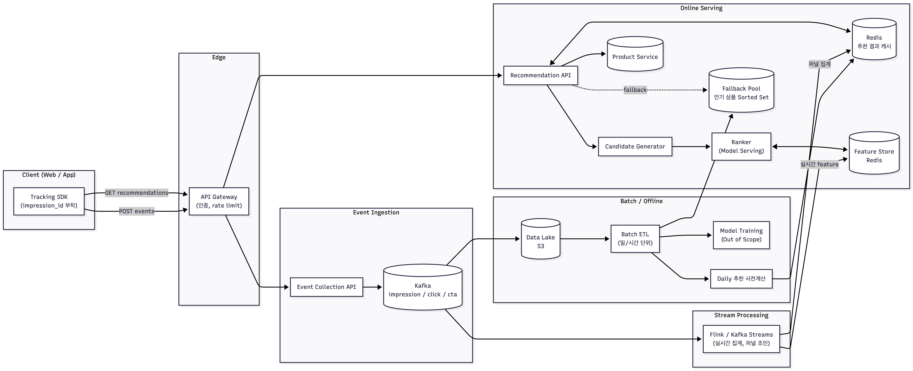
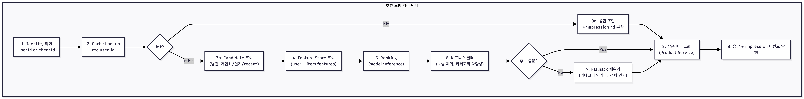
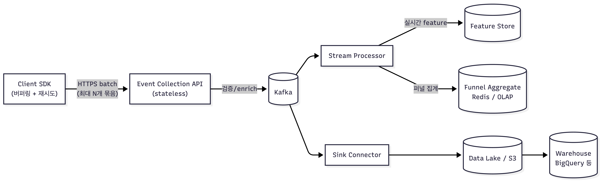
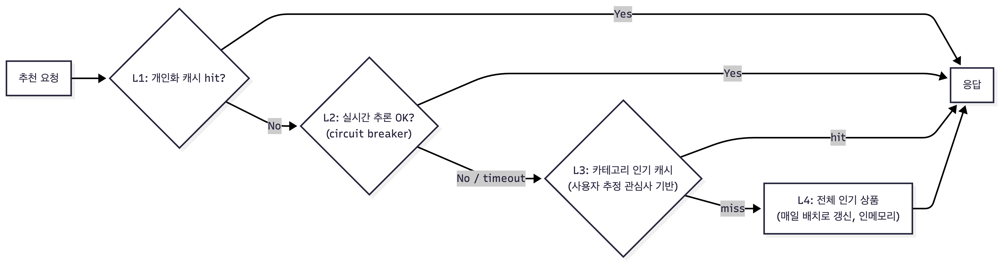
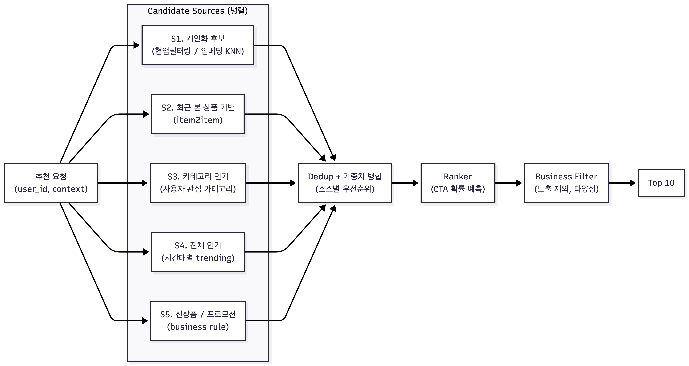
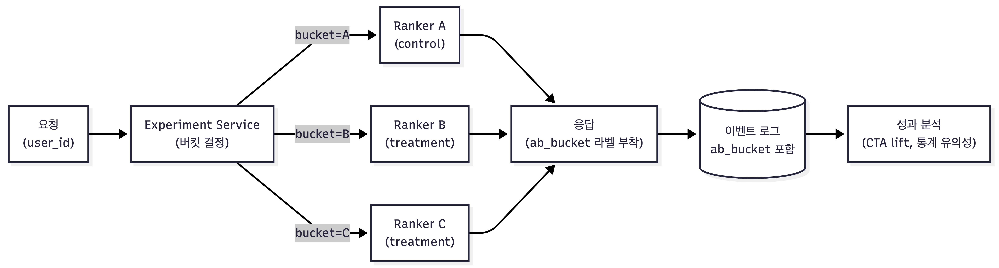

# Week 4 과제: 커머스 추천 지면 시스템 설계

- 상품 조회, 클릭, 장바구니 담기 같은 사용자 행동 이벤트가 추천 결과에 어떻게 반영되는지 설계합니다.
- 후보 상품 생성, 랭킹, 캐시, 메시지 큐, 이벤트 처리, 장애 대응 전략을 비교합니다.
- 대량 트래픽 상황에서 개인화 추천 지면을 안정적으로 제공하는 구조를 확인합니다.

---

## ⒈ 문제 이해 및 설계 범위 확정

### 시나리오

나는 커머스 플랫폼의 추천시스템 조직에서 일하고 있다. 메인 페이지에 신규 추천 지면을 추가하는 업무를 맡았으며, 이 지면은 사용자가 관심을 가질 가능성이 높은 상품을 그리드 형태로 노출한다. (2 X 5)

- 추천 지면의 핵심 성과 지표는 CTA(장바구니 담기)이다.
- 사용자의 조회, 클릭, 장바구니 담기 이벤트를 수집할 수 있어야 한다.
- 수집된 이벤트는 이후 추천 후보 생성과 상품 우선순위 산정에 반영되어야 한다.
- 로그인 사용자와 비로그인 사용자를 모두 고려하되, 과제에서는 사용자 식별 및 노출 전략을 다룬다.

### 설계 범위 (In / Out of Scope)

| 포함 (In Scope) | 제외 (Out of Scope) |
| --- | --- |
| 사용자 이벤트 수집 및 처리 흐름 | 추천 모델 학습 파이프라인 |
| 추천 컴포넌트의 배치 | 추천 알고리즘의 수식/모델 구현 |
| 로그인/비로그인 사용자 식별 전략 | 결제/주문 시스템 상세 설계 |
| 추천 후보 상품 생성 흐름 | 상품 이미지/콘텐츠 제작 |
| 추천 지면에 노출되는 상품의 우선순위 산정 | 추천 지면의 UI 디자인 |
| 2 X 5 추천 지면 응답 API | 추천 지면이 플랫폼 별로 노출되는 크기 |
| 장바구니 담기(CTA) 성과 측정 | 장바구니 상품의 상세 옵션 |

### 시스템 구성 전제

- 사용자는 로그인 상태와 비로그인 상태를 모두 가질 수 있다.
- 상품, 재고, 가격, 카테고리 정보는 별도 상품 시스템에서 조회할 수 있다고 가정한다.
- 추천 모델은 별도 학습 파이프라인을 통해 주기적으로 전달된다고 가정한다.
- 추천시스템은 이벤트 수집, 추천 후보 조회, 랭킹, 응답 제공, 성과 측정을 책임진다.
- 추천 지면은 메인 페이지에서 호출되며, 한 번의 요청에 최대 10개 상품을 반환한다.
- 품절, 판매 중지, 노출 불가 상품은 없다고 가정한다.

### 기능 / 비기능 요구사항

기능 요구사항과 비기능 요구사항은 원본 명세를 그대로 따른다. 본 설계에서 특히 강하게 작용하는 제약은 다음과 같다.

- **저지연 (p95 200ms)**: `p95`는 응답 시간을 빠른 순서대로 정렬했을 때 **95번째 백분위(percentile) 값**을 뜻한다. 즉 "전체 요청 중 95%는 200ms 이내에 응답해야 한다 (= 상위 5%의 느린 요청도 200ms 를 넘지 않아야 한다)" 는 의미. 평균(avg)이 아니라 꼬리 지연(tail latency)을 잡는 지표이며, 평균 100ms 라도 p95 가 500ms 면 20명 중 1명은 체감 지연을 겪게 되므로 사용자 경험 관점에서 평균보다 더 엄격한 기준이다. 후보 조회와 랭킹을 한 요청 내에 끝내려면 캐시와 비동기 사전 계산이 필수.
- **이벤트 유실 < 0.1%**: 동기 호출이 아니라 메시지 큐 + at-least-once 처리 + 멱등 처리 필요.
- **준실시간 반영 (1분 이내)**: 배치만으로는 불가능. 스트림 처리 파이프라인이 필요.
- **fallback 의무화**: 추론 의존 경로를 완전히 우회할 수 있는 대체 경로가 반드시 존재해야 함.

### 대략적 규모 추정 (검토)

원본 추정치 중 본 설계에서 의미 있는 의미를 가지는 값을 점검해본다.

| 항목 | 값 | 설계 시사점 |
| --- | --- | --- |
| 일일 추천 API 요청 | ~1,000,000 | 평균 ~11.6 QPS. 평시 부하는 작음. |
| 피크 추천 API QPS | 150 ~ 300 | 평시 대비 약 25배. 캐시 워밍과 오토스케일 필수. |
| 일일 이벤트 수 | ~15,000,000 | 평균 ~174 QPS, 1KB 가정 시 ~15GB/일. |
| 피크 이벤트 QPS | 1,000 ~ 3,000 | Kafka로 흡수, 컨슈머 측 백프레셔 고려. |

> **가정 변경 사항**: 노출 이벤트가 클릭/장바구니보다 압도적으로 많기 때문에 1일 1,500만 이벤트 중 약 80%는 노출(impression), 15%는 클릭, 5% 미만이 장바구니 담기로 가정한다. CTR 3~8%, CTA 0.5~2% 범위와 일치한다.

---

## 2. 개략적 설계안 제시 및 동의 구하기

### 핵심 흐름

추천 시스템은 크게 두 개의 독립된 데이터 경로(**조회 경로**와 **이벤트 경로**)로 분리한다. 두 경로를 분리하는 이유는 (1) SLA가 다르고 (조회 200ms / 이벤트 100ms), (2) 부하 특성이 다르며 (조회: 적은 QPS·복잡한 로직 / 이벤트: 많은 QPS·단순한 처리), (3) 한쪽 장애가 다른 쪽으로 전파되지 않도록 격리하기 위해서다.

**가. 추천 노출 흐름 (조회 경로 / Online)**

1. 사용자가 메인 페이지에 진입하면 클라이언트가 `GET /v1/recommendations/main` 호출.
2. API Gateway에서 인증 토큰을 확인해 로그인 상태면 `userId`, 비로그인이면 `clientId`(쿠키/디바이스 기반)를 추출.
3. Recommendation API 서버가 Redis에서 `rec:<userId|clientId>` 키로 사전 계산된 추천 결과를 조회.
   - **Cache hit**: 후처리(상품 메타 조인, 노출 제외 필터) 후 즉시 응답.
   - **Cache miss**: Candidate Generator에서 후보군(수백 개)을 조회 → Ranker에서 점수 산정 → 상위 N개 선택.
4. 추론 경로가 실패하거나 후보가 부족하면 Fallback (카테고리 인기 → 전체 인기) 적용.
5. 최종 10개 상품과 함께 `impression_id`(UUID, 노출-클릭-CTA를 잇는 공통 key) 반환.
6. 응답과 동시에 비동기로 노출(impression) 이벤트를 Kafka에 발행.

**나. 이벤트 수집 흐름 (이벤트 경로 / Logging + Streaming)**

1. 클라이언트 SDK가 노출/클릭/장바구니 담기 이벤트를 캡처. 모든 이벤트에는 `impression_id`, `userId|clientId`, `productId`, `eventType`, `timestamp`가 포함됨.
2. Event Collection API가 수신 → 스키마 검증 → Kafka 토픽에 publish (응답은 큐 인입까지로 끊어 100ms 이내 보장).
3. Stream 처리 계층 (Kafka Streams 또는 Flink) 이 토픽을 소비.
   - **실시간 경로**: 사용자 최근 상호작용 윈도우(예: 최근 30분)를 Redis Feature Store에 갱신 → 다음 추천 요청부터 반영 (지연 1분 이내 목표).
   - **퍼널 결합**: `impression_id` 기준으로 노출-클릭-CTA를 조인해 성과 지표 집계.
4. 원본 이벤트는 Sink Connector를 통해 Data Lake (S3/HDFS)에 적재 → 모델 학습/리포트.

### 개략적 아키텍처 다이어그램



### 아키텍처 설명

위 다이어그램은 추천 시스템을 **조회 경로(읽기)** 와 **이벤트 경로(쓰기)** 로 분리한 구조다. 두 경로는 API Gateway 만 공유하고 그 이후로는 독립적으로 동작한다.

**가. 조회 경로 (Online Serving)** — 사용자에게 추천 결과를 200ms 이내에 돌려주는 핫 패스다.

- **Client → API Gateway**: 클라이언트 SDK 가 `GET /recommendations` 호출. Gateway 는 인증/레이트리밋만 처리하고 비즈니스 로직은 갖지 않는다.
- **Recommendation API**: 요청 진입점. 먼저 Redis(추천 결과 캐시)에서 사전 계산된 결과를 조회한다. Hit 면 즉시 응답(가장 빠른 경로).
- **Candidate Generator + Ranker**: 캐시 미스 시에만 진입하는 추론 경로. Candidate Generator 가 다양한 소스(개인화, 인기, 카테고리 등)에서 후보군을 모으고, Ranker 가 Feature Store 에서 사용자/상품 feature 를 가져와 점수를 매긴다.
- **Product Service**: 상위 N개 후보가 정해지면 상품 메타(이름, 가격, 이미지 등) 를 조인한다.
- **Fallback Pool**: 추론 경로가 실패하거나 후보가 부족할 때 점선 경로로 사용되는 안전망. "빈 응답을 절대 내보내지 않는다" 원칙의 마지막 보루.

**나. 이벤트 경로 (Ingestion + Stream + Batch)** — 사용자 행동을 수집하여 추천 품질을 개선하는 콜드 패스다.

- **Client → Event Collection API → Kafka**: 노출/클릭/장바구니 이벤트를 수집한다. API 는 Kafka 인입까지만 책임지고 즉시 응답하여 100ms SLA 를 확보한다. Kafka 는 이벤트 유형별로 토픽이 분리되어 있다.
- **Stream Processing (Flink / Kafka Streams)**: Kafka 에서 이벤트를 실시간 소비하여 두 갈래로 처리한다.
  - **실시간 feature** → Feature Store: 사용자의 최근 30분~24시간 행동 윈도우를 갱신하여 **다음 추천 요청부터 1분 이내에 반영**된다. 이 경로가 준실시간 반영 요구사항을 충족시키는 핵심.
  - **퍼널 집계** → Cache: `impression_id` 기준으로 노출-클릭-CTA 를 조인하여 성과 지표를 산출.
- **Batch / Offline**: Kafka 의 원본 이벤트는 Data Lake(S3) 에 적재된 뒤 일/시간 단위 배치 ETL 에서 가공된다. 결과는 (1) 모델 학습(Out of Scope), (2) Daily 추천 사전계산(→ 캐시 워밍), (3) Fallback Pool 갱신에 사용된다.

**다. 두 경로가 만나는 지점**

- **Feature Store**: 스트림이 쓰고, 온라인 Ranker 가 읽는다. 학습 시점과 서빙 시점의 feature 일관성(skew 방지) 이 추천 품질의 결정적 요소.
- **Cache**: 배치(`REC_BATCH`)가 사전 계산 결과를 채워 넣고, 스트림(`FLINK`)이 퍼널 집계를 갱신하며, 온라인 API 가 읽는다. 가장 트래픽이 몰리는 핵심 자원.
- **Fallback Pool**: 배치가 인기 상품 풀을 갱신하고, 추론 경로 장애 시 온라인 API 가 사용.

이 구조의 의도는 **부하 격리** (이벤트 폭증이 추천 응답을 흔들지 않음), **SLA 분리** (조회 200ms / 이벤트 100ms 를 각자 최적화), **품질 회복력** (다단계 fallback 으로 빈 응답 차단) 세 가지를 동시에 만족시키는 것이다.

---

## 3. 상세 설계

### 설계 대상 컴포넌트 사이의 우선순위

p95 200ms / 99.9% 가용성 / 이벤트 유실 0.1% 라는 비기능 요구사항을 동시에 만족시키려면, 컴포넌트별로 **장애가 사용자 경험에 미치는 영향**과 **요구 SLA의 엄격함** 을 기준으로 우선순위를 매긴다.

| 우선순위 | 컴포넌트 | 이유 |
| --- | --- | --- |
| P0 | Recommendation API + Cache | 사용자 응답 경로. 캐시 미스 시 p95 200ms 위험. |
| P0 | Event Collection + Kafka | 유실 0.1% 요건. 손실 시 학습/지표 모두 망가짐. |
| P0 | Fallback Pool | 추론 장애 시 매출 직결. 명세에 명시된 요구. |
| P1 | Candidate Generator | 개인화 품질 결정. 다단계 fallback으로 흡수 가능. |
| P1 | Ranker (모델 서빙) | 품질 결정. Stateless 라 수평 확장 용이. |
| P1 | Feature Store | 실시간 반영의 핵심. Redis 가용성에 의존. |
| P1 | Stream Processing | 준실시간 1분 반영. 지연되어도 fallback 가능. |
| P2 | Batch / Data Lake | 모델 재학습용. 일 단위 허용. |
| P2 | A/B 분배기 | 실험용. 없어도 동작. |

### 상세 아키텍처



### 상세 아키텍처 설명

위 다이어그램은 **단일 추천 요청이 들어왔을 때 내부에서 어떤 단계를 거쳐 응답이 만들어지는지** 를 9단계로 펼쳐 보인 것이다. 개략 아키텍처가 컴포넌트 간 정적 관계를 보여줬다면, 이 다이어그램은 **요청 단위의 동적 흐름**과 **분기 조건**을 보여준다.

**가. 공통 진입 단계 (S1~S2)**

- **S1. Identity 확인**: 요청에서 사용자 식별자를 결정한다. 로그인이면 `userId`, 비로그인이면 `clientId`(쿠키/디바이스 기반). 이후의 모든 캐시 키와 feature 조회가 이 식별자에 종속된다.
- **S2. Cache Lookup**: `rec:<userId|clientId>` 키로 사전 계산된 추천 결과를 Redis 에서 조회한다. 전체 흐름 중 가장 저렴한 단계로, 여기서 끝나는 것이 최선.

**나. 분기점 (S3): 캐시 hit 여부**

캐시 hit/miss 에 따라 흐름이 두 갈래로 갈라진다. 캐시 hit 비율이 곧 시스템의 평균 비용과 지연을 결정한다.

- **Hit 경로 (S4 → S11 → S12)**: 사전 계산된 ranked list 가 있으므로 추론을 건너뛴다. `impression_id` 만 새로 부착하고 상품 메타 조인 후 응답. p95 200ms 예산의 대부분이 남는 빠른 경로.
- **Miss 경로 (S5~S10)**: 실시간 추론 파이프라인을 전부 거친다. 신규 사용자, TTL 만료, 사전 계산 범위 밖의 사용자에서 발생.

**다. 실시간 추론 파이프라인 (S5~S8)**

- **S5. Candidate 조회**: 여러 소스(개인화 KNN, 인기, 최근 본 상품, 카테고리 인기 등) 를 **병렬 호출**하여 수백 개 후보를 모은다. 병렬 호출이 핵심으로, 직렬화하면 200ms 예산을 못 맞춘다.
- **S6. Feature Store 조회**: Ranker 입력에 필요한 사용자 feature(최근 행동 윈도우) 와 상품 feature 를 가져온다. 스트림 처리 계층이 갱신해 둔 값을 읽는다.
- **S7. Ranking**: 모델 추론으로 후보 점수를 매긴다. CTA 확률 예측이 일반적. 배치 추론(여러 후보를 한 번에) 으로 비용을 절감.
- **S8. 비즈니스 필터**: 이미 노출한 상품 제외, 같은 카테고리/브랜드 쏠림 방지(다양성 재랭킹), 사용자가 dismiss 한 상품 제거 등 추천 알고리즘 외적 요구를 흡수.

**라. 두 번째 분기점 (S9): 후보 충분 여부**

비즈니스 필터를 거친 뒤에도 응답 슬롯(10개) 을 채울 후보가 부족할 수 있다 (신규 사용자, 좁은 관심사, 필터가 너무 많이 걸러낸 경우).

- **충분하면 (Yes)**: 바로 S11 로 진행.
- **부족하면 (No)** → **S10. Fallback 채우기**: 카테고리 인기 → 전체 인기 순으로 빈 슬롯을 메운다. "빈 응답을 절대 내보내지 않는다" 원칙의 보장 지점.

**마. 응답 조립 (S11~S12)**

- **S11. 상품 메타 조회**: 확정된 productId 리스트를 Product Service 로 조인하여 이름/가격/이미지/재고 등 노출에 필요한 정보를 채운다. 이 단계는 hit/miss/fallback 모든 경로의 공통 출구다.
- **S12. 응답 + impression 이벤트 발행**: 클라이언트에 응답을 돌려보내는 동시에 노출 이벤트를 Kafka 로 비동기 발행(fire-and-forget). 이벤트 발행이 응답 지연에 영향을 주지 않는다.

**바. 이 흐름이 만족시키는 비기능 요구**

- **p95 200ms**: hit 경로가 빠르고, miss 경로는 병렬 호출 + 타임아웃 예산 분배(Cache 10ms / Candidate 50ms / Feature 30ms / Rank 60ms / Filter+조립 50ms) 로 200ms 안에 끝난다.
- **빈 응답 방지**: S9 분기에서 부족 시 자동으로 fallback 으로 채워지므로 어떤 입력이든 10개 응답이 보장된다.
- **장애 격리**: S7(Ranker) 가 죽어도 S5 의 인기/카테고리 후보만으로 응답 가능. Candidate 한두 소스가 죽어도 다른 소스로 채워짐.
- **퍼널 추적**: S4/S12 에서 부착되는 `impression_id` 가 이후 모든 클릭/CTA 이벤트에 전파되어 사후 퍼널 결합이 가능.

#### 보충: "퍼널 추적"이 정확히 무슨 의미인가?

**퍼널(funnel)** 이란 사용자가 추천을 받은 뒤 거치는 단계의 순서를 의미한다. 본 시스템에서 핵심 퍼널은 다음 3단계다.

```
노출(impression) → 클릭(click) → 장바구니 담기(add_to_cart, = CTA)
```

이 세 단계는 서로 **다른 시점, 다른 API, 다른 이벤트** 로 발생한다. 노출은 추천 응답 직후, 클릭은 사용자가 상품을 누른 뒤, CTA 는 상세 페이지에서 한참 뒤에 발생할 수 있다. 따라서 단순히 시각 순서대로 늘어놓는 것만으로는 "어떤 노출이 어떤 클릭과 어떤 CTA 로 이어졌는지" 를 알 수 없다.

**왜 묶어야 하는가?**

이 세 이벤트를 한 줄로 묶지 못하면 다음 질문에 답할 수 없다.

- "이번 추천(모델 v17, A/B 버킷 B) 의 CTA 전환율은 얼마인가?" → 노출과 CTA 를 같은 추천 단위로 묶어야 계산 가능.
- "그리드 3번째 위치의 상품이 1번째보다 CTA 가 높은가?" → 노출 시점의 `position` 정보를 CTA 이벤트에 연결해야 알 수 있음.
- "모델 학습용 (positive sample = 클릭/CTA 된 상품, negative sample = 노출됐지만 클릭 안 된 상품)" → 같은 노출 슬롯 안에서 어떤 게 클릭되고 어떤 게 안 됐는지 묶여야 함.

**`impression_id` 가 하는 일**

`impression_id` 는 **한 번의 추천 응답(= 한 번의 노출 그룹)에 부여되는 고유 UUID** 다. S4/S12 에서 추천 응답을 만들 때 발급해서:

1. **응답 body 에 포함** → 클라이언트 SDK 가 받음.
2. **노출 이벤트(impression)에 포함**되어 Kafka 로 발행.
3. SDK 는 이 `impression_id` 를 **메모리에 보관** 했다가, 사용자가 그 추천 그리드의 상품을 클릭하면 → 클릭 이벤트에 같은 값을 실어 보냄.
4. 클릭으로 진입한 상세 페이지에서 장바구니 담기를 누르면 → CTA 이벤트에도 같은 값을 실어 보냄.

결과적으로 **하나의 추천에서 파생된 모든 후속 이벤트가 동일한 `impression_id` 를 공유**하게 된다.

**"사후 퍼널 결합"이란?**

이벤트는 발생 즉시 따로따로 Kafka 토픽에 떨어진다 (`evt.impression`, `evt.click`, `evt.cta`). 나중에 Stream Processor 또는 배치 ETL 이 이 토픽들을 **`impression_id` 기준으로 JOIN** 한다.

```
impression(id=abc, productId=p1, position=3, model=v17)
   ⨝ click(id=abc, productId=p1, t=+12s)
   ⨝ cta(id=abc, productId=p1, t=+45s)
   → 하나의 퍼널 레코드
```

이 결합 작업은 추천 응답 시점이 아니라 **이벤트들이 모두 도착한 뒤(사후)** 수행되므로 "사후 퍼널 결합" 이라 부른다. 만약 `impression_id` 같은 공통 키가 없다면 (userId, productId, timestamp) 같은 약한 매칭에 의존해야 하고, 여러 추천에 같은 상품이 노출되거나 사용자가 빠르게 여러 번 클릭하면 잘못 결합될 위험이 크다.

**왜 S4 와 S12 에서 부착하는가?**

- **S4 (Cache hit 경로)**: 캐시된 결과를 재사용하더라도 **이번 노출은 이전 노출과 별개** 이므로 매 요청마다 새 `impression_id` 가 필요. 캐시에 저장된 값을 재발급하는 게 아니라, 응답 조립 시점에 새로 발급해서 부착한다.
- **S12 (응답 + 이벤트 발행)**: 응답을 클라이언트에 돌려보내는 바로 그 순간에 같은 `impression_id` 를 Kafka 의 impression 이벤트에도 실어 발행. 클라이언트와 서버 양쪽이 동일한 id 를 시작점으로 갖게 된다.

---

### 3-1. 사용자 이벤트 수집은 어떻게 할 것인가? (Deep Dive)

#### 이벤트 스키마 표준화

노출(impression) → 클릭(click) → 장바구니 담기(add_to_cart) 의 퍼널을 사후에 결합하려면 **공통 추적 key**가 필수다. 이를 위해 추천 응답 시점에 발급한 `impression_id`를 모든 후속 이벤트에 전파한다.

**왜 공통 추적 key 가 필요한가?**

세 이벤트는 발생 시점, 호출 경로, 적재 토픽이 모두 다르다 — 노출은 추천 응답 직후, 클릭은 사용자가 상품을 누른 뒤, CTA 는 상세 페이지에 도착한 뒤 한참 후에 발생할 수 있다. 이벤트들이 따로따로 Kafka 의 서로 다른 토픽(`evt.impression`, `evt.click`, `evt.cta`) 으로 떨어지기 때문에, **나중에 "어떤 노출이 어떤 클릭과 어떤 CTA 로 이어졌는가" 를 알아내려면 같은 ID 로 묶어야** 한다.

공통 key 없이 (userId, productId, timestamp) 같은 약한 매칭에 의존하면 다음과 같은 결합 오류가 생긴다.

- **같은 상품의 중복 노출 충돌**: 사용자가 한 세션 안에서 메인 추천 지면을 두 번 방문해 상품 A 를 두 번 노출받은 뒤 그중 한 번을 클릭했을 때, 두 노출 중 어느 쪽의 클릭인지 구분할 수 없다.
- **여러 지면 동시 노출**: 메인/검색/상품 상세 페이지 추천 등 같은 시점에 여러 지면에서 동일 상품이 노출될 수 있다. 어느 지면의 노출이 클릭으로 이어졌는지 모르면 지면별 CTA 비교가 무의미해진다.
- **빠른 재클릭**: 사용자가 1초 이내에 같은 상품을 여러 번 클릭하면 timestamp 매칭이 부정확.
- **A/B 실험 분석 오염**: 클릭/CTA 이벤트만으로는 그 사용자가 그 순간 어떤 모델 버전·실험 버킷의 추천을 받았는지 알 수 없다. 노출 시점의 `rank_version`/`ab_bucket` 라벨을 후속 이벤트에 연결해야 군별 lift 를 계산할 수 있다.

공통 key 가 있을 때 비로소 가능한 분석은 다음과 같다.

- **전환율 측정 (CTR, CTA conversion)**: 분모(노출 수)와 분자(클릭 수, CTA 수) 가 같은 추천 단위로 묶여야 비율이 의미를 갖는다.
- **위치 편향(position bias) 분석**: 그리드 1번 슬롯의 CTA 가 5번 슬롯보다 높은가? 같은 노출 안에서 슬롯별 성과를 비교해야 답할 수 있다.
- **모델 학습용 라벨링**: positive sample(클릭/CTA 된 상품) 과 negative sample(같이 노출됐지만 클릭 안 된 상품) 을 한 그룹으로 묶어야 학습 데이터로 쓸 수 있다.
- **이상 탐지**: 노출 없이 발생한 클릭(스푸핑/봇), 노출-클릭 시간 차이가 비정상적인 경우 등 검출.

`impression_id` 는 **한 번의 추천 응답(= 노출 그룹) 에 부여되는 UUID** 다. 추천 응답 시점에 한 번만 발급하고, 그 응답에서 비롯된 모든 노출·클릭·CTA 이벤트가 이 값을 그대로 가져간다. 결과적으로 사후 JOIN 의 키가 단순해지고(`impression_id` 기준 equi-join), 위에서 언급한 약한 매칭의 모든 문제가 사라진다.

```json
{
  "event_id": "uuid",
  "event_type": "impression|click|add_to_cart",
  "event_time": "2025-05-27T10:21:33.456Z",
  "client_event_time": "2025-05-27T10:21:33.412Z",

  "impression_id": "uuid-from-recommendation-response",
  "placement_id": "main_grid_2x5",
  "position": 3,
  "rank_version": "model_v17",
  "ab_bucket": "exp_2025_05_b",

  "user_id": "u-1234 or null",
  "client_id": "cookie-or-device-id",
  "session_id": "s-9999",

  "product_id": "p-5678",
  "category_id": "c-200",

  "context": {
    "platform": "web|ios|aos",
    "user_agent": "...",
    "referrer": "..."
  }
}
```

- `event_id`: 클라이언트에서 발급. **멱등 처리**의 key. 컨슈머 측에서 중복 제거에 사용 (예: Redis 24h TTL set).
- `event_time` vs `client_event_time`: 서버 수신 시각과 클라이언트 발생 시각을 둘 다 보존. 모바일 네트워크 지연/오프라인 큐잉 대응.
- `impression_id`: 퍼널의 핵심. 같은 노출에서 발생한 클릭/CTA는 모두 이 값을 공유.
- `rank_version`, `ab_bucket`: 어떤 모델/실험군에서 발생한 이벤트인지 사후 분석을 위한 라벨.

#### 장바구니 담기 전후의 보조 이벤트

CTA 성과를 정밀하게 측정하려면 단일 add_to_cart 이벤트만으로는 부족하다. 다음의 보조 이벤트를 함께 수집한다.

- **장바구니 담기 직전**: `product_view` (상세 페이지 진입), `option_selected` (옵션 선택), `quantity_changed`.
- **장바구니 담기 시점**: `add_to_cart` (필수 CTA 지표).
- **장바구니 담기 직후**: `cart_view` (장바구니 페이지 진입), `checkout_started`, `purchase_completed` (다운스트림 전환).

이 보조 이벤트들은 (a) CTA 직전 이탈 지점 분석, (b) CTA 이후 진짜 매출 기여도 측정(장바구니에만 담고 구매 안 한 경우), (c) 추천 모델 학습 시 negative/positive sample 보강에 사용된다.

#### 수집 파이프라인



**수집 파이프라인 설명**

위 다이어그램은 **클라이언트에서 발생한 사용자 이벤트(노출/클릭/CTA)가 어떻게 흘러서 어디에 적재되는지**를 보여준다. 핵심은 단일 경로가 아니라 Kafka 를 분기점으로 **실시간(스트림)** 과 **장기 저장(배치)** 두 갈래로 분리된다는 점이다.

**가. 수집 단계 (SDK → Event Collection API → Kafka)**

- **Client SDK (버퍼링 + 재시도)**: 매 이벤트마다 HTTP 호출을 보내지 않는다. 이벤트를 클라이언트 메모리 큐에 모아 두었다가 최대 N개씩 묶어 HTTPS batch 로 전송한다. 이유는 (a) 모바일 환경에서 네트워크 호출 수를 줄여 배터리/데이터 절약, (b) 대량 이벤트(노출이 클릭의 약 5~10배)를 한 번의 RTT 에 압축, (c) 네트워크 단절 시 로컬 스토리지에 임시 저장해 후속 재시도 가능.
- **Event Collection API (stateless)**: 받은 batch 를 풀어 스키마 검증과 enrich(서버 시각 부착, IP/UA 정규화 등) 만 수행하고 **Kafka 인입까지만 책임진다**. Producer ack 받으면 즉시 200 응답 → 다운스트림 장애가 클라이언트로 전파되지 않음. Stateless 이므로 수평 확장이 자유롭다.
- **Kafka**: 모든 이벤트의 단일 진실 공급원(single source of truth). 이벤트 타입별로 토픽이 분리되어(`evt.impression`/`evt.click`/`evt.cta`) 컨슈머가 각자의 처리 속도/우선순위로 소비할 수 있다. 여기에 들어오면 유실 0.1% 미만이 보장된다.

**나. Kafka 이후의 두 갈래**

Kafka 는 동일 이벤트를 **여러 컨슈머가 독립적으로 읽을 수 있는 fan-out** 구조다. 본 시스템에서는 두 컨슈머가 같은 토픽을 병렬로 소비한다.

- **Stream Processor (실시간 경로)**: Flink / Kafka Streams 가 윈도우 집계, 상태 저장(state store), 토픽 간 join 을 수행한다. 결과는 두 곳으로 흘러간다.
  - **→ Feature Store**: 사용자 최근 30분~24시간 행동 윈도우(예: 최근 본 카테고리, 최근 클릭 상품 N개) 를 갱신. 다음 추천 요청의 Ranker 가 이 값을 읽어 **준실시간 1분 이내 반영** 요구를 충족.
  - **→ Funnel Aggregate (Redis/OLAP)**: `impression_id` 기준으로 노출-클릭-CTA 를 join 하여 CTR/CTA 전환율을 실시간 집계. 대시보드와 가드레일 알림이 이 값을 읽는다.
    - *Funnel Aggregate 가 뭔가?* — 퍼널 단계별 카운트(노출 수 / 클릭 수 / CTA 수) 와 그 비율(CTR, CTA 전환율) 을 모델 버전·실험 버킷·지면 단위로 미리 합산해 놓은 **집계 결과 저장소**다. 원본 이벤트가 아니라 "지금 v17 모델의 CTA 전환율은 1.8%" 같은 **숫자만** 들어있다. Redis (실시간 단순 카운터) 또는 OLAP DB(ClickHouse/Druid 같은 다차원 분석용 DB) 에 저장하며, 대시보드가 매번 원본을 다시 집계하지 않아도 즉시 조회할 수 있다.
- **Sink Connector (장기 저장 경로)**: Kafka Connect 가 원본 이벤트를 그대로 S3 Data Lake 에 적재(보통 Parquet 포맷, 시간 단위 파티션). 가공하지 않은 **원본을 보존하는 것이 핵심** — 나중에 새로운 분석/모델 학습 요구가 생겨도 원본에서 다시 시작할 수 있다. S3 의 데이터는 Warehouse(BigQuery 등) 로 ETL 되어 분석/리포트에 사용된다.

**다. 이 분리 구조의 의도**

- **속도 vs 보존의 trade-off 분리**: Stream 경로는 1분 이내 반영을 위해 빠르지만 상태가 휘발성/단기. Batch 경로는 느리지만 영구 보존되어 모델 재학습과 회고적 분석을 가능케 함. 같은 이벤트가 두 경로로 동시에 흘러 양쪽 요구를 모두 만족.
- **장애 격리**: Stream Processor 가 죽어도 Kafka 에는 이벤트가 그대로 쌓여 있고, Sink Connector 가 죽어도 Stream 경로는 영향 없음. 한쪽 복구가 다른 쪽을 멈추게 하지 않는다.
- **재처리 가능성**: 새 feature 정의를 추가하거나 집계 로직이 잘못된 게 발견되면, Kafka retention 기간 내라면 Stream Processor 를 재기동해 다시 흘리고, retention 을 넘어선 과거는 S3 Data Lake 에서 backfill 할 수 있다. **원본 보존이 재처리의 전제 조건**.

**핵심 설계 결정**

1. **클라이언트 측 버퍼링**: SDK가 이벤트를 메모리 큐에 쌓고 최대 N개씩 묶어 전송. 페이지 이탈 시 `sendBeacon` 으로 마지막 flush. 네트워크 단절 시 로컬 스토리지에 저장 후 재시도.
2. **수집 API는 큐 인입까지만 책임**: Kafka producer ack 받으면 200 응답. 다운스트림 처리는 비동기. → p95 100ms SLA 달성 가능.
3. **at-least-once + 멱등 컨슈머**: Kafka는 at-least-once 가 기본. 중복은 컨슈머에서 `event_id` 기준으로 제거. 유실 0.1% 미만은 producer `acks=all` + `retries` 설정으로 달성.
4. **이벤트 타입별 토픽 분리**: `evt.impression`, `evt.click`, `evt.cta` 로 분리. (a) 노출은 양이 많아 retention 정책이 다르고, (b) 컨슈머 그룹별 처리 우선순위를 다르게 줄 수 있음.
5. **파티션 키**: `userId || clientId` 로 파티션. 같은 사용자의 이벤트 순서를 보장 → 퍼널 결합 로직 단순화.

#### 저장 형태

| 저장소 | 용도 | 보존 기간 |
| --- | --- | --- |
| Kafka | 스트리밍 버퍼 | 7일 |
| Redis (Feature Store) | 사용자 최근 행동 윈도우 (30분~24시간) | 슬라이딩 |
| Redis / OLAP (Funnel) | 추천 결과 지표 집계 | 30일 |
| S3 (Data Lake, Parquet) | 원본 이벤트 (모델 학습/분석용) | 1~2년 |
| Warehouse | 분석/대시보드용 가공 데이터 | 1년+ |

---

### 3-2. 시스템 장애에 대한 fallback 처리는 어떻게 할 것인가? (Deep Dive)

추천 영역의 노출 실패는 매출 하락과 직결되므로, **"빈 응답은 절대 내보내지 않는다"** 를 설계 원칙으로 한다. 다단계 fallback을 구성한다.



**Fallback 다이어그램 설명**

위 다이어그램은 추천 요청이 들어왔을 때 **L1 → L2 → L3 → L4** 순서로 내려가며 어디서든 응답이 만들어지면 즉시 빠져나가는 **계단식(cascading) 강등 구조**다. 위로 갈수록 개인화 품질은 높지만 비용/지연/실패 가능성이 크고, 아래로 갈수록 품질은 떨어지지만 거의 항상 응답 가능하다.

- **L1 (개인화 캐시)**: 가장 이상적 경로. 사전 계산된 개인화 추천이 캐시에 있으면 그대로 응답. **품질 최고 / 지연 최저**.
- **L2 (실시간 추론)**: 캐시 miss 시 진입. 실패하면 끝없이 재시도하지 않고 **Circuit Breaker** 가 일정 임계치(실패율/지연) 초과 시 차단하여 자동으로 L3 로 강등. 추론 장애가 사용자 응답을 지연시키지 않게 막는 핵심 장치.
- **L3 (카테고리 인기)**: 추론이 죽어도 사용자의 **최근 관심 카테고리**(Feature Store 의 최근 행동) 기반으로 인기 상품을 보여줌. 완전한 개인화는 아니지만 "이 사용자가 어느 영역에 관심 있는지" 정도는 반영되는 **준개인화 수준**.
- **L4 (전체 인기)**: 마지막 보루. Redis 까지 죽어도 동작하도록 **인메모리에도 적재**해 둔다. 모든 사용자에게 같은 인기 상품이 나가지만 "빈 응답은 절대 내보내지 않는다" 원칙이 여기서 보장된다.

**왜 이렇게 단계를 쌓는가?** — 추천 응답 실패는 단순한 에러가 아니라 그 자리에 노출됐어야 할 매출이 사라지는 것이다. 하나의 거대한 추천 로직이 "성공/실패" 두 상태만 갖게 두면 한 군데 장애가 전체 실패로 직결된다. 단계를 나누면 **상위 단계가 죽어도 하위 단계가 응답을 만들어내므로**, 최악의 경우에도 품질만 낮아질 뿐 응답 자체는 끊기지 않는다.

**각 단계의 설계**

- **L1 (개인화 캐시)**: 일 1회 또는 수 시간 단위로 배치 사전 계산된 결과. Redis 에 `rec:<userId>` 키로 저장. TTL은 5~10분 (요건상 상품 상태 변경 5분 반영). DAU 의 일정 비율(예: 상위 활성 사용자)만 사전 계산해서 비용을 통제.
- **L2 (실시간 추론)**: Candidate Generator + Ranker. **Circuit Breaker** (예: Hystrix/Resilience4j 패턴) 로 보호 — 실패율 50% 초과 또는 지연 임계치 초과 시 자동으로 차단하고 L3로 강등.
- **L3 (카테고리 인기)**: 사용자의 최근 카테고리 관심사(Feature Store에 보존된 최근 행동)를 기반으로 해당 카테고리의 인기 상품 풀. Sorted Set 으로 점수 정렬.
- **L4 (전체 인기)**: 최후의 보루. 메모리/로컬 캐시에도 적재해 Redis 장애 시에도 동작. 매일 배치로 갱신.

**관련 패턴/안전장치**

- **타임아웃 예산 분배**: 전체 200ms 예산을 컴포넌트별로 분배 (Cache 10ms / Candidate 50ms / Feature 30ms / Rank 60ms / Filter+조립 50ms). 각 단계가 예산 초과 시 즉시 다음 단계로 강등.
- **부분 실패 허용**: Candidate Generator는 여러 소스를 병렬 호출하므로 일부 소스(예: 협업 필터링 인덱스)가 실패해도 다른 소스(인기 상품, 최근 본 상품)만으로 응답 가능.
- **빈 후보 가드**: 어떤 경우에도 응답 상품 수가 10개 미만이면 안 됨. 부족 시 fallback pool에서 채움.
- **상품 메타 조회 실패 대응**: Product Service 장애 시 Redis 에 캐시된 상품 메타 사용. TTL 만료된 항목은 제외하고 응답.

---

### 3-3. 지면의 용도 변경에 자유로울 수 있는가?

API 와 도메인 모델을 **"지면(placement)"** 단위로 추상화해서 UI 구조 변화에 응답 스키마가 영향을 받지 않도록 설계한다.

**API 설계**

```
GET /v1/placements/{placement_id}/recommendations
?count=10
&context=...
```

- `placement_id` 가 (a) 노출 상품 수, (b) 사용 가능한 모델/실험, (c) 비즈니스 필터 정책을 결정.
- 응답은 단순한 ranked list:

```json
{
  "impression_id": "uuid",
  "placement_id": "main_grid_2x5",
  "items": [
    { "product_id": "...", "rank": 1, "score": 0.92, "reason_tag": "personalized" },
    ...
  ],
  "fallback_used": false,
  "model_version": "v17"
}
```

- 응답은 **순위가 있는 리스트일 뿐**, "2행 5열" 같은 UI 구조 정보를 포함하지 않음. 그리드/배너/페이징 같은 표현은 클라이언트 결정.
- count 파라미터로 노출 개수 변경에 대응. 페이징은 `cursor` 파라미터를 추가 (`/recommendations?count=10&cursor=...`).
- 지면별 정책은 **Placement Config** 에 분리 저장 (어떤 모델, 어떤 fallback, 어떤 필터). 코드 배포 없이 운영 변경 가능.

---

### 3-4. 상품 노출 레이턴시

p95 200ms 를 달성하기 위한 layered 전략.

**1) 통신 프로토콜**

- **클라이언트 ↔ API Gateway**: HTTPS / HTTP/2. 클라이언트 호환성 우선.
- **내부 서비스 간 (Recommendation API ↔ Candidate / Ranker / Feature Store)**: **gRPC**. HTTP/1.1 대비 짧은 헤더, 멀티플렉싱, 바이너리 직렬화로 내부 RPC 지연을 줄임. Connection pooling 으로 연결 비용 제거.

**2) 다층 캐싱**

| 계층 | 위치 | 용도 | TTL |
| --- | --- | --- | --- |
| L0 CDN | Edge | 비로그인 익명 사용자의 동일 응답 (지역/디바이스 단위) | 30s~1m |
| L1 In-Process | API 서버 메모리 (Caffeine 등) | 인기 상품 풀, 상품 메타 | 1~5m |
| L2 Redis | 공유 캐시 | 개인화 추천 결과 (rec:userId) | 5~10m |
| L3 Storage | DB/Feature Store | 원천 데이터 | - |

- **상품 메타 데이터** 같이 자주 안 변하는 정보는 in-process 캐시 최우선.
- **Cache stampede 방지**: 만료 시 다수 요청이 동시에 후단으로 떨어지지 않게 single-flight (예: `redis SET NX` lock 또는 probabilistic early refresh).

**3) 사전 계산 (pre-computation)**

- 활성 사용자에 대해 배치/스트림으로 사전 계산해 Redis 에 적재. 캐시 hit ratio 가 높을수록 실시간 추론 비용을 줄임.
- "오늘 처음 보는 사용자"만 실시간 추론 경로로 진입.

**4) 병렬 호출 + 타임아웃 예산**

- Candidate Generator의 여러 소스는 병렬로 호출 (fan-out → join).
- 각 호출에 짧은 타임아웃 (예: 30~50ms). 일부 실패해도 가용한 소스로 응답.

**5) 비동기 처리**

- 노출 이벤트 발행은 응답 후 비동기. fire-and-forget queue 에 넣고 응답을 먼저 보냄.

---

### 3-5. 사용자 식별과 개인화 기준은 어떻게 잡을 것인가?

추천 품질은 식별의 일관성에 비례한다. 식별 ID 의 계층을 다음과 같이 정의한다.

| 식별자 | 발급 시점 | 수명 | 용도 |
| --- | --- | --- | --- |
| `user_id` | 회원 가입 | 영구 | 로그인 상태의 최우선 키 |
| `client_id` | 첫 방문 | 영구 (쿠키/Keychain 등에 영속) | 비로그인 식별의 기본 키 |
| `device_id` | 앱 첫 실행 | 앱 재설치 전까지 | 앱 사용자 식별 |
| `session_id` | 세션 시작 | 30분 비활성 시 만료 | 단기 컨텍스트 (지금 이 방문) |

**식별 적용 규칙**

- 로그인 상태: `user_id` 우선. 추가로 `client_id` 도 함께 로깅해서 이력 추적.
- 비로그인 상태: `client_id` 를 키로 추천 제공. session 컨텍스트는 보조 신호.
- **Identity Stitching (계정 연결)**: 비로그인 → 로그인 전환 시점에 `client_id ↔ user_id` 매핑을 Identity Service 에 기록. 이전 비로그인 행동 데이터를 user_id 에 병합 (단, 공용 디바이스 가능성 때문에 너무 오래된 매핑은 가중치를 낮춤).
- **PII 분리**: tracking 이벤트에는 user_id 만 사용. 이름/이메일/연락처는 절대 포함하지 않음.

**Cold Start 처리**

- 신규 사용자 (이력 부족): 카테고리 인기 / 전체 인기 / 지역·시간대 트렌드 기반.
- 신규 상품 (이력 부족): 콘텐츠 기반 (카테고리·속성 유사도) 후보군으로 cold-start 보강.

---

### 3-6. 후보 상품은 어떻게 반영할 것인가? (Deep Dive)

**Candidate Generation 은 multi-source fan-out 구조**로 구성한다. 단일 알고리즘으로는 다양성/cold-start/실시간성을 모두 만족시킬 수 없다.



**파이프라인 설명**

위 다이어그램은 **하나의 추천 요청이 최종 10개 상품 리스트가 되기까지** 거치는 4 단계를 보여준다. 구조의 핵심은 **여러 후보 소스를 병렬로 띄워 모은 뒤 → 모델이 정렬 → 비즈니스 규칙으로 다듬는** 순서다.

**가. Candidate Sources (S1~S5, 병렬)**

수백 개 후보를 만들기 위해 **5개 소스를 동시에** 호출한다. 단일 소스만으로는 다양성/cold-start/실시간성을 모두 만족할 수 없기 때문에 서로 다른 신호를 보는 소스를 섞는다.

- **S1. 개인화 후보**: 협업필터링/임베딩 KNN. 사용자의 장기 취향에서 비롯된 후보 — **품질의 핵심**.
- **S2. 최근 본 상품 기반(item2item)**: 직전 행동에서 파생된 후보 — **단기 관심사·실시간성** 담당.
- **S3. 카테고리 인기**: 사용자가 자주 보는 카테고리의 인기 상품 — **준개인화**.
- **S4. 전체 인기 / trending**: 모든 사용자에게 안전한 후보 — **cold-start 와 다양성 보강**.
- **S5. 신상품 / 프로모션**: 알고리즘 외적 비즈니스 요구를 흡수 — **노출 보장 슬롯**.

병렬 호출이라 한 소스가 죽거나 느려도 다른 소스로 후보 풀을 채울 수 있고, 전체 지연은 가장 느린 소스 하나에만 영향받는다.

**나. Dedup + 가중치 병합**

5개 소스가 같은 상품을 동시에 후보로 올릴 수 있으므로 `productId` 기준으로 **중복 제거**한 뒤, 소스별 우선순위(예: S1 > S2 > S3 > S4 > S5) 와 소스 내부 점수를 결합해 단일 풀로 만든다. 이 단계 출력은 보통 수십~수백 개.

**다. Ranker (CTA 확률 예측)**

병합된 후보들을 **모델 추론으로 재정렬**한다. 입력은 (사용자 feature + 상품 feature + 컨텍스트), 출력은 각 후보의 CTA 확률. 이 단계가 "어떤 상품이 가장 장바구니로 이어질 가능성이 높은가" 를 결정하므로 **품질의 결정적 단계**다.

**라. Business Filter → Top 10**

순수 점수 순으로만 자르면 같은 카테고리/브랜드가 그리드에 몰리거나, 이미 본 상품이 또 노출되는 문제가 생긴다. 따라서 모델 출력 뒤에:

- 이미 노출한 상품 제외(Bloom Filter 기반 `seen` 리스트)
- 사용자가 dismiss 한 상품 제거
- 다양성 재랭킹(MMR 등) 으로 카테고리/브랜드 쏠림 방지
- S5(신상품/프로모션) 슬롯 1~2개 보장

을 적용한 뒤 **상위 10개를 최종 응답으로 확정**한다.

**왜 이 순서인가?** — Candidate 단계에서 폭넓게 잡고, Ranker 가 좁히고, Filter 가 다듬는 **funnel 구조**다. 단계가 내려갈수록 후보 수가 줄고 단가는 비싸진다(수백 → 수십 → 10). 가장 비싼 모델 추론을 가장 적은 후보에만 적용해 **품질과 비용을 동시에 최적화**한다.

**소스별 구현 메모**

- **S1 (개인화)**: 학습된 사용자/상품 임베딩의 ANN(Approximate Nearest Neighbor) 검색. FAISS / ScaNN / Vespa 같은 인덱스 사용. 학습 파이프라인은 out-of-scope.
  - *이게 무슨 말인가?* — **임베딩(embedding)** 은 사용자/상품을 수백 차원짜리 숫자 벡터로 변환한 표현이다. 추천 모델이 "취향이 비슷한 사용자/상품은 벡터 공간에서 가까이 위치하도록" 학습시킨 결과물. 따라서 한 사용자의 벡터와 가장 가까운 상품 벡터들을 찾으면 → 그게 곧 그 사용자가 좋아할 만한 상품이 된다.
  - **Nearest Neighbor 검색**이란 "수백만 개 상품 벡터 중 내 사용자 벡터와 가장 가까운 K개" 를 찾는 연산이다. 정확하게 풀려면 모든 상품과 거리를 계산해야 해서 너무 느리다 (수백만 × 수백 차원 = 수억 번 연산, 추천 1회당 200ms 안에 불가능).
  - **ANN(Approximate Nearest Neighbor)** 은 "정확히 1등은 아니어도 상위 K개에 들어갈 만한 후보를 빠르게" 찾는 근사 검색이다. 일부 정확도를 양보(보통 95~99% recall) 하는 대신 **수~수십 ms 안에 후보를 반환**한다.
  - **FAISS / ScaNN / Vespa** 는 이런 ANN 검색을 빠르게 해주는 **인덱스(검색 자료구조) 라이브러리/엔진** 이다. 미리 상품 벡터들을 클러스터링/양자화하여 인덱스로 만들어두면, 검색 시 전체가 아니라 관련 클러스터만 훑어 후보를 뽑는다. FAISS(Facebook), ScaNN(Google) 은 라이브러리, Vespa 는 검색 엔진 형태. **DB 의 B-Tree 인덱스가 정확한 키 검색을 빠르게 해주듯, ANN 인덱스는 벡터 유사도 검색을 빠르게 해준다**고 이해하면 된다.
- **S2 (최근 본 상품)**: Feature Store 에서 사용자의 최근 본 상품 N개를 가져온 뒤, 사전 계산된 item-to-item 유사 상품 테이블에서 후보 확장.
- **S3 (카테고리 인기)**: 카테고리별 Sorted Set (`pop:cat:<categoryId>`, score=인기점수). 사용자의 최근 관심 카테고리 기준으로 조회.
- **S4 (전체 인기)**: 시간대별 trending. 1시간 윈도우 스트림 집계로 갱신.
- **S5 (비즈니스 룰)**: 신상품 노출, 프로모션 우선 노출 등. 비추천 알고리즘적 요구를 흡수.

**정렬 주체와 자료구조**

- **Sorted Set (Redis ZSET)**: S3, S4 같이 score 기반 인기 목록에 적합. `ZREVRANGEBYSCORE` 로 빠른 top-N 조회.
- **Ranker (모델 서빙)**: 후보를 모은 뒤 최종 정렬은 모델이 담당. 학습된 모델은 사용자 feature + 상품 feature + 컨텍스트로 CTA 확률을 예측.
- **다양성 보장**: 같은 카테고리/브랜드가 그리드에 몰리지 않도록 MMR (Maximal Marginal Relevance) 같은 다양성 재랭킹을 후처리에 적용.

**후보 부족 시 채우는 순서**

1. 개인화 후보 (S1) → 부족하면
2. 최근 본 상품 기반 (S2) → 부족하면
3. 사용자 관심 카테고리 인기 (S3) → 부족하면
4. 전체 인기 / 시간대 trending (S4) → 최후
5. 비즈니스 룰 후보 (S5) 는 항상 일정 슬롯 보장 (예: 10개 중 1~2개).

이미 노출했거나 사용자가 dismiss 한 상품은 제외 리스트 (Bloom Filter 로 메모리 효율적으로 관리) 로 필터.

---

### 3-7. 추론 모델에 대한 A/B 테스팅을 진행한다면?

**1) 트래픽 분배 방식**

- **Sticky bucketing**: `hash(user_id or client_id) % N` 으로 일관된 버킷 할당. 같은 사용자는 항상 같은 실험군에 속하도록 — 사용자 경험 일관성과 분석 무결성 확보.
  - *Sticky bucketing 이 무슨 말인가?* — "sticky" 는 "한 번 정해지면 달라붙어 있다" 는 뜻으로, 같은 사용자가 언제 어느 서버로 요청을 보내든 **항상 같은 실험 버킷**에 떨어지게 만드는 방식이다. 매 요청마다 무작위 추첨하면(random bucketing) 같은 사용자가 페이지를 두 번 새로고침할 때 한 번은 A 모델, 한 번은 B 모델 추천을 받는 일이 생기는데, sticky 는 이를 막는다.
  - *왜 hash 인가?* — DB 에 "user → bucket" 매핑을 따로 저장하지 않아도 `hash(user_id) % N` 만 계산하면 **모든 서버가 같은 결과를 즉시 도출**할 수 있다. 결정적(deterministic) 함수라서 같은 입력에 항상 같은 출력. 결과적으로 매핑 저장소 없이도 sticky 가 보장된다 (Stateless).
  - *왜 sticky 가 중요한가?* — 두 가지 이유.
    1. **사용자 경험 일관성**: 같은 사용자가 모델 A 의 결과를 봤다가 B 의 결과를 봤다가 하면, 추천이 매번 바뀌는 것처럼 느껴져 신뢰가 떨어진다.
    2. **분석 무결성**: A/B 실험의 통계 검정은 "사용자 단위로 군이 고정되어 있다" 는 전제 위에서 동작한다. 한 사용자의 행동 데이터가 A 와 B 양쪽에 섞이면 군별 lift 계산이 오염되고, p-value 계산의 독립성 가정이 깨진다.
  - *예시* — `hash("user-1234") % 100 = 37` 이면 37번 슬롯에 항상 떨어진다. 버킷 비율이 A=0~49, B=50~74, C=75~99 라면 이 사용자는 영원히 A 군. 실험 종료 시점까지 같은 모델만 본다.
- **계층화된 실험 (Layered Experiments)**: 직교한(orthogonal) 차원에서 독립 실험 동시 진행. 모델 layer, UI layer, ranking layer 각각 독립 버킷.

**2) 아키텍처**



**A/B 테스팅 아키텍처 설명**

위 다이어그램은 **하나의 추천 요청이 어느 모델(Ranker) 로 라우팅되고, 결과가 어떻게 다시 성과 분석으로 환류되는지** 를 보여주는 end-to-end 루프다. 핵심은 **요청 분기(Experiment Service) → 처리(Ranker A/B/C) → 라벨 부착(응답) → 라벨 보존(이벤트) → 라벨 기반 집계(분석)** 가 하나의 끊기지 않는 체인으로 연결된다는 점이다.

**가. Experiment Service (버킷 결정)**

요청이 들어오면 가장 먼저 통과하는 분기점이다. `hash(user_id) % N` 같은 **결정적(deterministic) 해시**로 사용자를 버킷에 할당한다.

- **왜 해시인가?** 같은 user_id 는 어느 서버, 어느 시점에 들어와도 항상 같은 버킷에 떨어진다 (sticky). 사용자가 페이지를 새로고침할 때마다 다른 모델을 보면 경험이 깨지고 분석도 오염되기 때문.
- 버킷 비율(A 50% / B 25% / C 25%), 실험명, 시작/종료일 같은 설정은 Config Service 에서 읽는다 → 새 실험 시작/종료에 **코드 배포가 필요 없다**.

**나. Ranker A / B / C (분기 처리)**

버킷에 따라 다른 모델이 호출된다.

- **A = control (대조군)**: 현재 운영 중인 모델. 비교 기준점.
- **B, C = treatment (실험군)**: 새 모델, 새 feature, 새 정책 등 비교 대상. 동시에 여러 treatment 를 두면 한 번의 실험으로 여러 가설을 검증 가능.

추론 경로만 다르고 그 외(캐시, fallback, 비즈니스 필터) 는 공유 → **변수는 모델 하나뿐**이라 lift 가 모델 효과인지 다른 변수 때문인지 헷갈리지 않는다.

**다. 응답 (`ab_bucket` 라벨 부착)**

각 Ranker 의 결과가 응답으로 합쳐지는 지점에서 `ab_bucket` 값이 응답 body 와 `impression_id` 컨텍스트에 함께 실린다. 이 라벨이 다이어그램의 핵심 — 라벨 없이는 이후 분석에서 "이 클릭이 어느 군의 추천에서 나왔는지" 알 수 없다.

**라. 이벤트 로그 (`ab_bucket` 포함)**

클라이언트 SDK 가 받은 `ab_bucket` 을 후속 클릭/CTA 이벤트에 그대로 실어 Kafka 로 보낸다. 이로써 노출-클릭-CTA 퍼널의 모든 이벤트가 **자기가 어느 군에서 발생했는지를 자신과 함께 들고 다니게** 된다.

**마. 성과 분석 (CTA lift, 통계 유의성)**

이벤트 로그를 `ab_bucket` 으로 group by 하여 군별 지표(노출 수, 클릭 수, CTA 수, CTR, CTA 전환율) 를 산출한다.

- **CTA lift**: treatment 의 CTA 전환율이 control 대비 몇 % 높은지 (예: A=1.5%, B=1.8% → lift = +20%).
- **통계 유의성**: 단순 평균 차이가 우연인지 진짜 효과인지를 t-test, chi-square 같은 통계 검정으로 판정. 표본이 너무 작으면 +20% 라도 통계적으로 무의미할 수 있어 **표본 수와 p-value 도 함께 본다**.

**바. 이 루프가 의미하는 것**

이 다이어그램은 곧 **"의사결정 가능한 추천 시스템" 의 최소 단위**다. 분기 없는 시스템은 새 모델을 배포해도 "더 좋아졌는지" 를 증명할 수 없다. 분기는 있지만 라벨이 전파되지 않으면 데이터가 섞여 분석이 안 된다. 라벨까지 있어도 사용자가 매번 다른 버킷에 떨어지면 결과가 흔들린다. 위 다이어그램은 이 세 함정을 모두 막아 **새 모델의 가치를 숫자로 증명**할 수 있게 만드는 골격이다.

- 응답의 `ab_bucket` 라벨이 모든 후속 이벤트에 전파되어 사후 분석에서 군별 지표를 계산.
- 실험 설정 (실험명, 버킷 비율, 종료일) 은 Config Service 로 관리. 새 실험 시작/종료에 배포 불필요.

**3) 안전장치**

- **Holdout 그룹**: 모든 실험에서 제외되는 통제군을 일정 비율 (예: 5%) 유지 → 누적 변화 효과 측정.
- **Guardrail metrics**: CTA 외에도 응답 지연, 에러율, 매출 같은 가드레일 지표를 함께 모니터링. 악화 시 자동 롤백 가능하도록 알림.

---

### 3-8. 대규모 트래픽과 데이터 증가 처리

**병목 예상 지점과 대응**

| 병목 후보 | 원인 | 대응 |
| --- | --- | --- |
| Recommendation API CPU | 캐시 미스 시 직렬화/RPC 폭증 | Cache hit ratio ≥ 90%, 수평 오토스케일 |
| Redis 캐시 | hot key (인기 상품 풀) | replica 읽기 분산, hot key 는 클라이언트 in-memory 캐시 |
| Ranker (모델 서빙) | 추론 비용 | 배치 추론(여러 후보 한 번에), 모델 경량화, GPU/SIMD |
| Kafka | 파티션 부족 | 파티션 증설, 컨슈머 그룹 병렬도 ↑ |
| Stream Processor | 윈도우 집계 상태 | Flink RocksDB state backend, checkpoint 튜닝 |

**추천 요청과 이벤트 수집의 서버 분리**

- **분리한다.** 이유: (a) SLA 가 다름, (b) 부하 패턴이 다름, (c) 장애 격리. 같은 클러스터를 쓰면 이벤트 폭증 시 추천 응답이 영향받을 위험.

**플랫폼 이벤트 (평시 대비 수십 배 피크) 대응**

- **사전 캐시 워밍**: 이벤트 시작 전에 활성 사용자 추천 결과를 미리 사전 계산해서 Redis 에 적재.
- **추론 경로 강등 (Brownout)**: 극심한 피크에는 일부 트래픽을 의도적으로 fallback(인기 상품) 으로 강등. 100% 개인화 < 100% 응답.
- **오토스케일 + 사전 스케일링**: 피크 시간대 (07-10, 12-13, 18-19, 00-01) 전에 미리 스케일 업 (scheduled scaling).
- **Rate Limit**: per-user / per-IP 한도로 봇/이상 트래픽 차단.

**실시간 vs 배치 구분**

| 처리 유형 | 대상 | 이유 |
| --- | --- | --- |
| 실시간 (스트림) | 사용자 최근 행동 윈도우, 노출-클릭 퍼널, 시간대별 trending | 1분 이내 반영 요구 |
| 배치 (일 단위) | 모델 학습, 일일 인기 상품, 사전 계산 추천, 코호트 분석 | 무거운 집계, 비용 효율 |

**캐시 키 / TTL 전략**

| Key 패턴 | 값 | TTL | 비고 |
| --- | --- | --- | --- |
| `rec:u:<userId>` | 사전 계산 추천 목록 | 5~10m | 활성 사용자에 한정 |
| `rec:c:<clientId>` | 비로그인용 추천 | 5~10m | 익명 사용자 |
| `feat:user:<userId>` | 최근 행동 feature | 24h | 스트림으로 갱신 |
| `pop:cat:<categoryId>` | 카테고리 인기 ZSET | 1h | 배치 + 스트림 보강 |
| `pop:global` | 전체 인기 ZSET | 1h | 매시간 갱신 |
| `prod:<productId>` | 상품 메타 | 5m | 명세상 "상품 상태 5분 반영" 충족 |
| `seen:<userId>:<placement>` | 노출 이력 (Bloom Filter) | 1d | 중복 노출 방지 |

---

## 4. 설계 장점

- **읽기/쓰기 경로 분리**로 SLA 와 장애 격리가 모두 깔끔. 이벤트 폭증이 추천 응답에 영향을 주지 않음.
- **다단계 fallback** (개인화 캐시 → 실시간 추론 → 카테고리 인기 → 전체 인기) 으로 빈 응답 가능성 사실상 제거. "광고/추천 노출 실패 = 매출 하락" 명제에 정합.
- **공통 `impression_id`** 로 노출-클릭-CTA 퍼널을 별도 조인 작업 없이 자연스럽게 결합. 모델 라벨링과 KPI 측정에 동일 데이터를 사용 가능.
- **지면(placement) 추상화**로 2x5 외 다른 UI (배너, 페이징, 다른 개수) 변경 시 백엔드 변경 최소.
- **Multi-source candidate generation**으로 cold start, 다양성, 실시간성을 동시 충족. 한 소스 장애도 전체 품질 저하로 이어지지 않음.
- **Layered experiment** 구조로 모델/UI/룰을 직교 실험 가능. 새 모델 배포 = 새 버킷 추가로 단순화.
- **gRPC + 다층 캐시 + 사전 계산**의 조합으로 p95 200ms SLA 달성 가능성이 높음.

---

## 5. 설계 단점

- **다단계 fallback의 관측 어려움**: 어느 단계까지 fallback 이 발동했는지, 그 비율이 적정한지 모니터링이 복잡. fallback 의존도가 은밀히 증가하면 "겉으로는 잘 동작하지만 사실 추천 품질이 망가진" 상태가 됨. → `fallback_used`, fallback 단계 라벨을 응답과 이벤트에 명시 노출하고 대시보드 필수.
- **사전 계산 추천의 신선도 한계**: 배치/스트림 사전 계산이 핵심 최적화지만, 사용자가 방금 본 상품이 즉시 반영되려면 결국 실시간 추론 경로가 동작해야 함. cache hit 률과 신선도가 trade-off.
- **Redis 의존도 과다**: 캐시, Feature Store, 인기 ZSET, 노출 이력까지 Redis 에 몰림. Redis 장애가 광범위한 영향. → 용도별 클러스터 분리 + 인메모리 L1 캐시로 일부 완화.
- **Identity stitching의 모호함**: 공용 디바이스/계정 전환 시 잘못된 매핑이 추천 품질을 더 떨어뜨릴 수 있음. 보수적 정책이 필요.
- **A/B 실험 분석의 통계적 함정**: sticky bucketing은 사용자 단위 분석에는 좋지만, 사용자 행동의 분포가 한쪽으로 치우치면 표본 편향 발생. 실험 종료 기준과 SRM(Sample Ratio Mismatch) 모니터링이 필요.
- **운영 복잡도**: Recommendation API, Event API, Kafka, Flink, Redis, Feature Store, Data Lake, 모델 서빙 — 컴포넌트가 많아 SRE 부담이 큼. 작은 조직에서는 일부 통합(예: Kafka Streams 로 Flink 대체)로 단순화 필요.
- **비용**: ANN 인덱스, Redis 클러스터, Kafka, Flink, 모델 서빙 GPU/CPU 등 인프라 비용이 평시 부하 대비 상당함. 캐시 hit 비율과 사전 계산 범위에 따라 비용을 조절해야 함.

---

## 6. 마무리

### 개인적 의견 / 사례 공유 / 추가 학습


### 참고 자료
