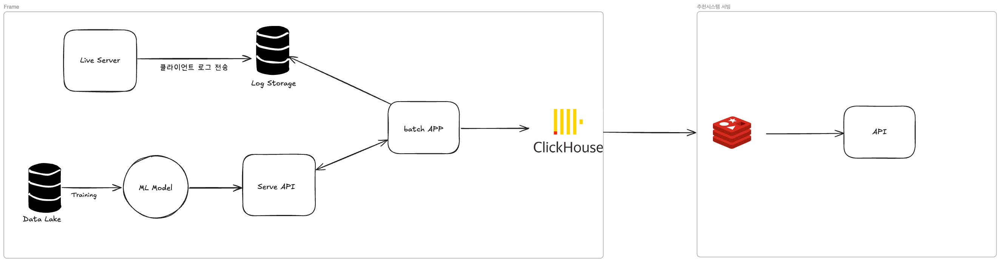

# Week 4 과제: 커머스 추천 지면 시스템 설계

- 상품 조회, 클릭, 장바구니 담기 같은 사용자 행동 이벤트가 추천 결과에 어떻게 반영되는지 설계합니다.
- 후보 상품 생성, 랭킹, 캐시, 메시지 큐, 이벤트 처리, 장애 대응 전략을 비교합니다.
- 대량 트래픽 상황에서 개인화 추천 지면을 안정적으로 제공하는 구조를 확인합니다.

---

#### ⒈ 문제 이해 및 설계 범위 확정

**시나리오**

당신은 커머스 플랫폼의 추천시스템 조직에서 일하고 있다. 메인 페이지에 신규 추천 지면을 추가하는 업무를 맡았으며, 이 지면은 사용자가 관심을 가질 가능성이 높은 상품을 그리드 형태로 노출한다. (2 X 5)

- 추천 지면의 핵심 성과 지표는 CTA(장바구니 담기)이다.
- 사용자의 조회, 클릭, 장바구니 담기 이벤트를 수집할 수 있어야 한다.
- 수집된 이벤트는 이후 추천 후보 생성과 상품 우선순위 산정에 반영되어야 한다.
- 로그인 사용자와 비로그인 사용자를 모두 고려하되, 과제에서는 사용자 식별 및 노출 전략을 다룬다.

## 설계 범위 (In / Out of Scope)

---

| 포함 (In Scope) | 제외 (Out of Scope) |
| --- | --- |
| 사용자 이벤트 수집 및 처리 흐름 | 추천 모델 학습 파이프라인 |
| 추천 컴포넌트의 배치 | 추천 알고리즘의 수식/모델 구현 |
| 로그인/비로그인 사용자 식별 전략 | 결제/주문 시스템 상세 설계 |
| 추천 후보 상품 생성 흐름 | 상품 이미지/콘텐츠 제작 |
| 추천 지면에 노출되는 상품의 우선순위 산정 | 추천 지면의 UI 디자인 |
| 2 X 5 추천 지면 응답 API | 추천 지면이 플랫폼 별로 노출되는 크기 |
| 장바구니 담기(CTA) 성과 측정 | 장바구니 상품의 상세 옵션 |

## 시스템 구성 전제

---

- 사용자는 로그인 상태와 비로그인 상태를 모두 가질 수 있다.
- 상품, 재고, 가격, 카테고리 정보는 별도 상품 시스템에서 조회할 수 있다고 가정한다.
- 추천 모델은 별도 학습 파이프라인을 통해 주기적으로 전달된다고 가정한다.
- 추천시스템은 이벤트 수집, 추천 후보 조회, 랭킹, 응답 제공, 성과 측정을 책임진다.
- 추천 지면은 메인 페이지에서 호출되며, 한 번의 요청에 최대 10개 상품을 반환한다.
- 품절, 판매 중지, 노출 불가 상품은 없다고 가정한다.

## 기능 요구사항

---

- 사용자의 상품 조회, 클릭, 장바구니 담기 이벤트를 수집할 수 있어야 한다.
- 로그인/비로그인 사용자에 대한 이벤트를 연결할 수 있어야 한다.
- 수집된 이벤트는 추천 후보 생성 또는 상품 우선순위 산정에 활용될 수 있어야 한다.
- 추천 API는 메인 페이지 추천 지면에 노출할 상품 목록을 2 X 5 형태로 반환할 수 있어야 한다.
- 추천 후보가 부족하거나 추론부의 장애 상황에서도 추천 결과를 제공할 수 있어야 한다.
- 추천 결과 노출, 클릭, 장바구니 담기 이벤트를 연결해 CTA 성과를 측정할 수 있어야 한다.

## 비기능 요구사항

---

| 항목 | 목표 |
| --- | --- |
| 추천 API 응답 시간 | p95 200ms 이하 |
| 이벤트 수집 응답 시간 | p95 100ms 이하 |
| 추천 결과 가용성 | 월 99.9% 이상 |
| 이벤트 유실 허용 범위 | 0.1% 이하 |
| 이벤트 반영 지연 | 준실시간 이벤트는 1분 이내 반영 |
| 추천 결과 최신성 | 상품 상태 변경은 5분 이내 반영 |
| 피크 트래픽 대응 | 평시 대비 3배 트래픽 처리 가능 |
| 피크 트래픽 시간대 | 07 ~ 10시, 12 ~ 13시, 18 ~ 19시, 00 ~ 01시 |
| 중복 이벤트 처리 | 누락 이벤트 처리 |
| 장애 대응 | 추천 후보 조회 실패 시 fallback 응답 제공 |
| 데이터 정합성 | 노출, 클릭, 장바구니 이벤트를 추적 가능한 공통 key로 연결 |

## 대략적 규모 추정 *(기준값 — 본인 가정으로 변경 가능)*

---

| 항목 | 수치 |
| --- | --- |
| MAU / DAU | 약 10,000,000명 / 약 500,000명 |
| 회원 MAU / DAU | 약 6,000,000명 / 약 300,000명 |
| 비회원·미로그인 MAU / DAU | 약 4,000,000명 / 약 200,000명 |
| 일일 메인 페이지 방문 수 | 약 1,000,000회 |
| 일일 추천 API 요청 수 | 약 800,000 ~ 1,000,000건 |
| 과제 내 추천 지면당 노출 상품 수 | 10개 |
| 일일 추천 상품 노출 수 | 약 8,000,000 ~ 10,000,000건 |
| 일일 사용자 이벤트 수 | 약 10,000,000 ~ 15,000,000건 |
| 평균 클릭률(CTR) | 약 3 ~ 8% |
| 평균 장바구니 담기 전환율(CTA) | 약 0.5 ~ 2% |
| 평균 추천 API QPS | 약 10 ~ 12 QPS |
| 피크 추천 API QPS | 약 150 ~ 300 QPS |
| 피크 이벤트 수집 QPS | 약 1,000 ~ 3,000 QPS |

# 2. 개략적 설계안 제시 및 동의 구하기

---

## 핵심 흐름 (필수)

### 시스템 파이프라인 흐름
1. 클라이언트(웹/앱)에서 발생한 사용자 행동 로그(조회, 클릭, 장바구니 담기)를 수집 API로 전송합니다.
2. 수집된 로그는 Log Storage에 저장됩니다.
3. Batch Application이 Data Lake에 적재된 대규모 로그 데이터를 기반으로 사용자 및 상품 통계(인기 상품, CTA 등)를 빠르게 집계합니다.
4. 집계된 데이터를 바탕으로 Training 파이프라인을 거쳐 ML Model이 개인화 추천 후보 상품을 생성합니다.
5. ML Model이 생성한 개인화 추천 결과와 Batch App이 집계한 인기 상품(Fallback 용도) 목록을 빠른 조회를 위해 ClickHouse에 적재합니다.
6. ClickHouse에서 Redis에 사용자 별 추천 목록 적재 진행
7. 사용자가 메인 페이지에 진입하면, Serve API(Live Server)가 Redis에서 해당 사용자의 추천 목록을 가져와 2x5 형태로 빠르게(p95 200ms 이하) 응답합니다.

### 사용자 행동 흐름 (User Flow)
1. 사용자가 커머스 플랫폼 메인 페이지에 접속합니다.
2. Serve API가 반환한 10개의 추천 상품이 2x5 그리드 형태로 화면에 노출되고, 노출(Impression) 이벤트가 클라이언트에서 서버로 전송됩니다.
3. 사용자가 관심 있는 상품을 클릭하여 상품 상세 페이지로 이동하며, 클릭(Click) 이벤트가 전송됩니다.
4. 상세 페이지에서 상품을 장바구니에 담으면 핵심 성과 지표인 장바구니 담기(Add-to-cart) 이벤트가 전송됩니다.
5. 그 후 사용자가 메인 페이지에 다시 접속하면, 추천 서버에서 사용자에 맞게 추천 데이터를 추천해줍니다.

# 3. 상세 설계

---

## 설계 대상 컴포넌트 사이의 우선순위 정하기 / 아키텍처 다이어그램 (필수)

-

---

## 3-1. 사용자 이벤트 수집은 어떻게 할 것인가?

- 사용자가 행동을 하면, API 백엔드에서 로그를 기록
- 일/시간 단위로 배치프로세스를 통해 Data Lake에 저장
- Data Lake는 해당 데이터를 가지고 ML Model 학습

---

## 3-2. 시스템 장애에 대한 fallback 처리는 어떻게 할 것인가?

- 추천 서비스 전체 장애 프론트 엔드 레벨에서의 캐싱(로컬 스토리지)

---

## 3-4. 상품 노출 레이턴시

- 상품 노출 DB의 경우 정합성이 그렇게 중요하지 않으므로, NoSQL 기반의 DB를 사용하서 데이터 적재
- 만약 장애가 발생하는 경우에는 임시 데이터를 보여주는 방식으로 진행

---

# 4. 설계 장점

- Batch Application 스케일 아웃에 따른, 추천 시스템 속도 증가 가능
- 데이터베이스 관리가 상대적으로 쉬움

---

# 5. 설계 단점

- ClickHouse 장애 혹은 Redis 장애 시에 추천 시스템 장애 발생

---

# 6. 마무리

## 개인적 의견 / 사례 공유 / 추가 학습

- Batch 시스템에 대해 잘 몰라서, 이번 기회에 학습할 수 있는 기회를 가지게 되어서 좋았다.
- clickhouse를 최근에 POC하고있던 중이였는데, OLAP이라는 개념에 대해서 학습할 수 있게 되어서 좋았다.

## 참고 자료

- (성과지표) https://blog.naver.com/bestmcg/222941438614 

- [AWS Programmatic advertising network](https://advertising.amazon.com/ko-kr/library/guides/ad-network#12)

- https://deview.kr/data/deview/session/attach/[145]%EC%8B%A4%EC%8B%9C%EA%B0%84%20%EC%B6%94%EC%B2%9C%20%EC%8B%9C%EC%8A%A4%ED%85%9C%EC%9D%84%20%EC%9C%84%ED%95%9C%20Feature%20Store%20%EA%B5%AC%ED%98%84%EA%B8%B0.pdf

- https://www.youtube.com/watch?v=r1ELaD1DiU0