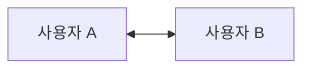
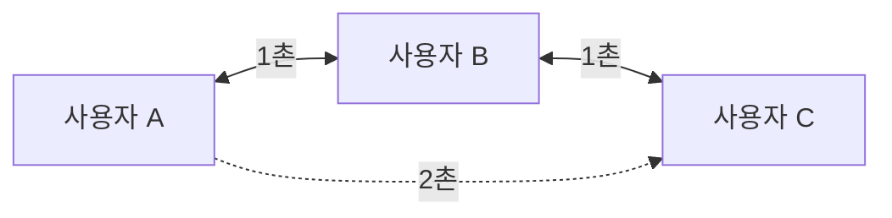
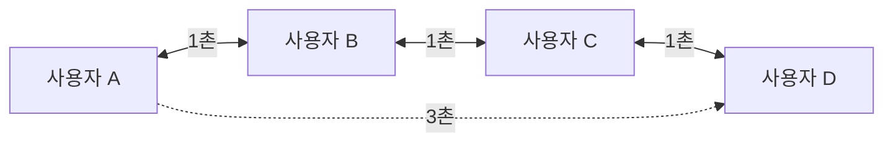
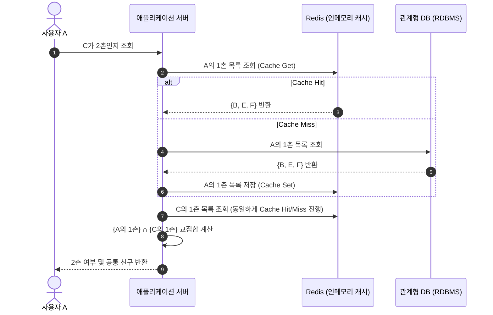
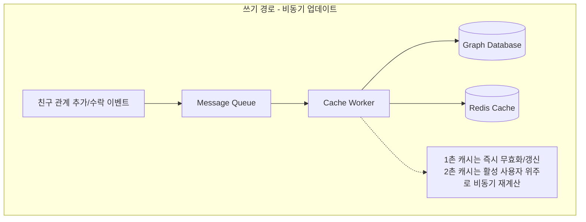
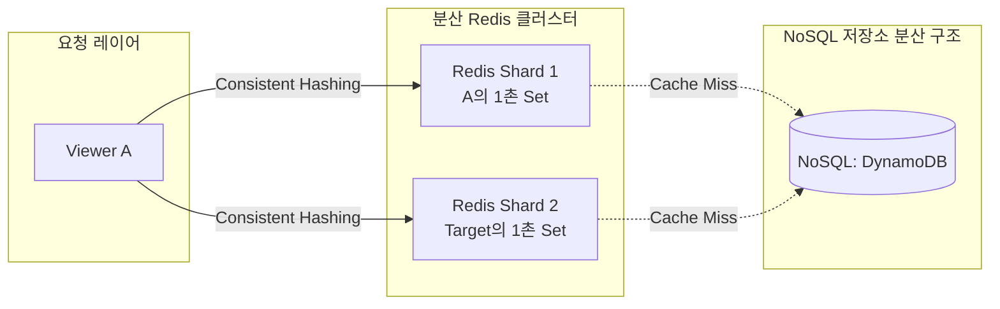
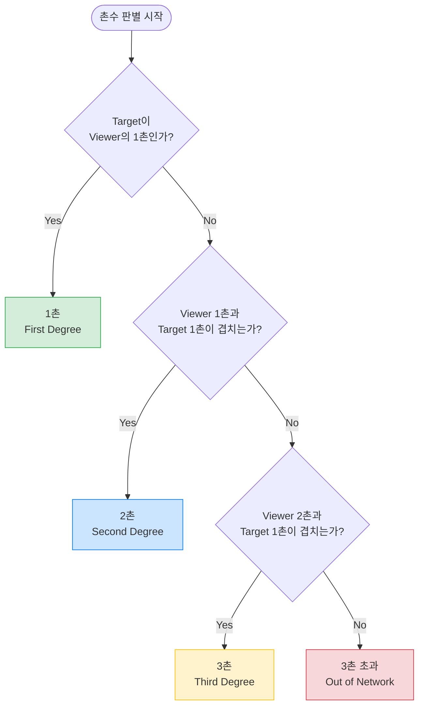
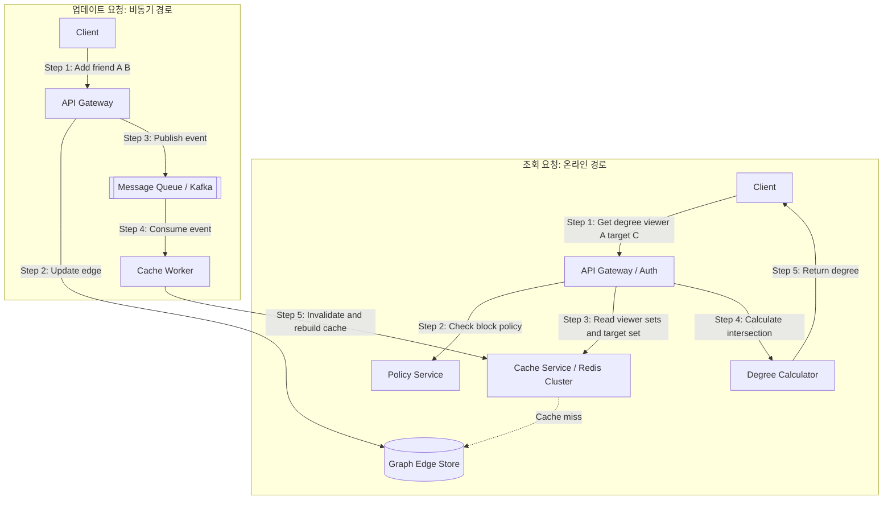

## 서론

링크드인을 열어 어떤 사람의 프로필을 볼 때, “OO님과 2촌, 함께 아는 사람 3명” 같은 표시를 자주 마주합니다. 화면 위에는 간단한 문구처럼 보이지만, 뒤에서는 수백만 사용자의 네트워크를 어떻게 탐색할지 서버가 끊임없이 고민합니다. 이 글에서는 아주 단순한 상황부터 출발해 사용자 수가 늘어날 때마다 어떤 문제가 생기는지 살펴보고, 그 문제를 어떻게 해결하는지 단계별로 설명합니다. 

## **0단계: 기본 원리부터 짚기**

사람과 사람의 연결은 점과 선으로 구성된 그래프를 떠올리면 이해가 쉽습니다. A와 B가 친구라면 A―B로 선을 하나 그립니다. A와 C 사이에 B가 중간에 있으면 C는 A에게 2촌입니다. D가 그 다음에 이어지면 D는 3촌입니다. 이처럼 “몇 단계 떨어져 있는가”가 우리가 구하고자 하는 촌수입니다. 핵심은 이 계산을 두세 명이 아니라 수천만 명에게 거의 즉시 해야 한다는 사실입니다.

## **1단계: 사용자 두 명일 때**

처음에는 사용자가 A와 B 둘뿐이라고 생각해 봅시다. 데이터베이스에는 A와 B가 연결되어 있다는 정보만 저장하면 됩니다. A가 B를 볼 때 “직접 친구인가?”를 한 줄의 SQL로 확인하면 끝입니다. 이 단계에서는 테이블 하나에 인덱스 하나면 충분합니다. 구조를 복잡하게 설계할 이유가 없습니다.

**왜 이렇게 간단할까요?** 데이터가 작기 때문입니다. RDBMS의 row lookup은 작은 규모에서는 가장 직관적이고 효과적입니다.

### **1단계 시각화 및 구조**



#### **시간복잡도**
- **1촌 여부 조회 (인덱스 사용 시)**: $O(1)$  
  (RDBMS에서 `PRIMARY KEY` 또는 `INDEX`를 통해 단 한 건의 레코드만 조회하므로 매우 빠릅니다.)

#### **테이블 예시 (RDBMS - `relationships` 테이블)**
| user_id | friend_id |
| :--- | :--- |
| A | B | 
| B | A |


## **2단계: 사용자 열 명, 2촌 등장**

사람이 열 명으로 늘어나면 상황이 달라집니다. A―B―C처럼 두 단계 거친 친구 관계가 생기기 때문입니다. A가 C의 프로필을 볼 때 서버는 A와 B가 친구인지, B와 C가 친구인지 두 사람의 친구 목록을 비교해야 합니다. SQL로 두 테이블을 JOIN해서 겹치는 친구가 있는지 확인하면 됩니다.

**여기서 떠오를 질문**: “단순한 1촌을 찾는 것과 무엇이 다르죠?” 1촌은 한 row만 확인하면 되지만, 2촌은 두 목록을 동시에 읽고 교집합을 찾는 작업입니다. 데이터 양이 조금만 늘어도 읽어야 할 범위가 넓어집니다. 이제 우리는 연결 목록을 단순한 row 집합이 아니라 각 사용자의 `adjacency list`, 즉 “이 사용자가 직접 연결된 사람 목록”으로 보기 시작해야 합니다.

### **2단계 시각화 및 구조**



#### **시간복잡도**
- **1촌 찾기**: $O(1)$ (인덱스 조회)
- **2촌 여부 확인 (SQL JOIN)**: $O(d)$ (여기서 $d$는 평균 친구 수/degree 입니다. A의 친구 B를 찾고, B의 친구 목록에서 C가 있는지 매칭해야 하므로 조회 범위가 $d$배 늘어납니다.)

#### **테이블 예시 (RDBMS - `relationships` 테이블)**
| user_id | friend_id |
| :--- | :--- |
| A | B |
| B | A |
| B | C |
| C | B |


## **3단계: 사용자 백 명, 3촌까지**

사람이 백 명이 되면 A―B―C―D처럼 세 단계 떨어진 3촌을 고려해야 합니다. SQL로는 self join을 세 번 해야 하고, 쿼리도 길어집니다. 더 큰 문제는 한 번만 하는 게 아니라는 점입니다. 사용자가 검색 결과 20명을, 추천 인맥 30명을, 피드 작성자 여러 명을 한꺼번에 보면, 매번 3단계 join을 반복하면 비효율적입니다.

**어떻게 최적화할까?** `viewer`(나) 기준으로 묶어서 계산합니다. A가 여러 사람을 볼 때 A의 1촌, 2촌 목록은 동일하므로 한 번만 불러옵니다. 그런 다음 각 `target`(B, C, D…)과 비교합니다. API도 단건(`getDegree(A,B)`)에서 batch(`batchGetDegrees(viewer, targets)`)로 바뀝니다. SQL join 대신 애플리케이션 메모리에서 집합 교집합 연산을 사용하게 됩니다.

### **3단계 시각화 및 구조**



#### **시간복잡도**
- **3촌 조회 (단순 SQL JOIN 시)**: $O(d^3)$ (JOIN 단계가 늘어날 때마다 탐색 범위가 기하급수적으로 증가합니다.)
- **메모리 상의 집합 교집합 계산 시**: $O(d^2)$ (A의 2촌 목록을 먼저 구하는 데 $O(d^2)$이 걸리고, D의 1촌 목록과의 교집합 연산은 A의 2촌 목록 크기 $d^2$과 D의 1촌 목록 크기 $d$의 비교이므로 $O(d^2)$에 수렴합니다.)

#### **테이블 예시 (애플리케이션 메모리 내 Adjacency List 데이터 표현)**
| Key (사용자 ID) | Value (1촌 목록 Set) |
| :--- | :--- |
| A | `{"B", "E"}` |
| B | `{"A", "C", "F"}` |
| C | `{"B", "D"}` |
| D | `{"C"}` |


## **4단계: 사용자 천 명, 캐시의 필요성**

사용자가 천 명쯤 되면 특정 사용자의 친구 목록을 여러 번 조회하게 됩니다. A가 로그인해서 피드를 보다가 검색을 하고 추천 인맥을 보면, 서버는 계속 `getFriends(A)`를 수행합니다. 매번 DB를 읽는 건 낭비입니다.

여기서 **Redis** 같은 인메모리 캐시가 등장합니다. A의 1촌 목록을 Redis에 set으로 저장해 두고 membership 확인을 빠르게 합니다. 2촌 여부는 두 set의 교집합으로 판단합니다. 데이터 흐름은 “캐시에 있으면 사용 → 없으면 DB에서 읽어 캐시에 채움”으로 바뀝니다. 캐시는 여전히 원본이 아니라 복사본이며, TTL과 DB fallback으로 정합성을 유지합니다.

### **4단계 시각화 및 구조**



#### **시간복잡도**
- **캐시에서 1촌 목록 조회**: $O(1)$
- **2촌 여부 확인 (두 Set의 교집합 연산)**: $O(\min(d_A, d_C))$ (Redis에서 조회한 Hash Set 두 개를 사용해 애플리케이션단에서 교집합을 연산하므로, 더 작은 크기의 Set 크기에 비례합니다.)

#### **테이블 예시 (Redis Key-Value 캐시 구조)**
| Key | Value (DataType: Set) | TTL |
| :--- | :--- | :--- |
| `user:A:friends` | `["B", "E", "F"]` | 3600 (1시간) |
| `user:B:friends` | `["A", "C", "F"]` | 3600 (1시간) |
| `user:C:friends` | `["B", "D"]` | 3600 (1시간) |


## **5단계: 사용자 십만 명, 2촌의 폭발**

사용자가 십만 명이 되면 2촌 목록이 기하급수적으로 커집니다. A의 1촌이 500명이고 각 1촌이 평균 500명과 연결되어 있다면 2촌 후보는 최대 250,000명입니다. 3촌은 그보다 더 많습니다. 따라서 모든 사용자의 2촌과 3촌을 미리 저장하는 것은 불가능합니다.

전략이 나뉩니다.

- 1촌 목록은 크기가 작으니 적극적으로 캐시합니다.
- 2촌 목록은 활동이 많은 사용자 위주로 비동기로 캐시하고, 모두에게 미리 만들지 않습니다.
- 3촌은 전체 목록을 만들지 않고, 필요할 때 `viewer`의 2촌과 `target`의 1촌 교집합을 통해 즉석에서 판단합니다.

이 시점에는 연결 변경 이벤트를 비동기로 처리하는 워커가 등장하고, 캐시는 이벤트를 수신해 필요한 부분만 무효화하거나 재계산합니다. 1촌은 즉시 정확하게 저장하지만, 2촌은 짧은 지연을 허용합니다. 이렇게 하지 않으면 친구 수락 버튼 하나가 너무 무거워집니다.

### **5단계 시각화 및 구조**



#### **시간복잡도**
- **1촌 캐시 조회 및 갱신**: $O(1)$
- **3촌 관계 조회 (Viewer 2촌과 Target 1촌 교집합)**: $O(d^2)$ (Viewer의 2촌 집합 크기는 약 $d^2$이므로, Target의 1촌 집합 $d$와의 교집합을 구할 때 최악의 경우 $O(d^2)$의 연산이 소요됩니다.)

#### **테이블 예시 (사용자 활성도에 따른 캐시 보관 전략)**
| 대상 데이터 | 캐시 대상 기준 | 동기화 방식 | TTL |
| :--- | :--- | :--- | :--- |
| **1촌 목록** | 모든 사용자 | 관계 변경 시 즉시 동기화 (Write-through) | 24시간 (또는 영구) |
| **2촌 목록** | 최근 7일 이내 로그인한 활성 사용자 | 변경 이벤트 발생 시 워커를 통해 비동기 빌드 | 1시간 |
| **3촌 목록** | 캐싱하지 않음 | 온디맨드로 Viewer 2촌 ∩ Target 1촌 계산 | - |


## **6단계: 사용자 천만 명, 저장소와 캐시의 재설계**

규모가 천만 명 수준이 되면 단순한 RDB join이나 단일 Redis 인스턴스로는 버틸 수 없습니다. 네트워크 조회 패턴은 “user_id를 주면 connected_user_id 목록을 빠르게 읽고 싶다”입니다. 이를 위해 DynamoDB나 Cassandra처럼 파티션 키와 소트 키로 구성된 key-value 또는 wide-column 저장소를 사용합니다. 특정 사용자의 adjacency list를 빠르게 읽을 수 있고 수평 확장이 가능합니다.

Redis 역시 단일 노드 대신 클러스터가 됩니다. 2촌 set이 큰 사용자는 여러 shard로 나누어 저장합니다. 또한 고정된 데이터 구조 대신 비트맵이나 Roaring Bitmap 같은 압축된 자료구조를 검토합니다. 목표는 큰 집합을 효율적으로 저장하고 교집합을 빠르게 구하는 것입니다.

### **6단계 시각화 및 구조**



#### **시간복잡도**
- **분산 캐시/저장소 단건 조회**: $O(1)$ (네트워크 홉 제외)
- **교집합 연산 (Roaring Bitmap 사용 시)**: $O(N / 64)$ (여기서 $N$은 비트맵 내 데이터 개수입니다. CPU 레벨에서 64비트 워드 단위로 빠르게 AND 연산을 수행하므로 대규모 집합 연산의 속도가 비약적으로 단축됩니다.)

#### **테이블 예시 (NoSQL - DynamoDB Adjacency List 스키마)**
| Partition Key (PK) | Sort Key (SK) | Attribute: metadata (친구 정보) |
| :--- | :--- | :--- |
| `USER#A` | `FRIEND#B` | `{"connected_at": 17823902, "status": "active"}` |
| `USER#A` | `FRIEND#E` | `{"connected_at": 17825000, "status": "active"}` |
| `USER#B` | `FRIEND#A` | `{"connected_at": 17823902, "status": "active"}` |
| `USER#B` | `FRIEND#C` | `{"connected_at": 17826120, "status": "active"}` |


## **7단계: 빠른 답변의 비결**

여기까지 따라왔다면 처음 질문으로 돌아가 봅시다. “LinkedIn은 어떻게 1촌, 2촌, 3촌을 바로 보여줄까?” 답은 단순합니다. **매번 전체 그래프를 탐색하지 않기 때문**입니다. `viewer`의 1촌/2촌 목록을 한 번만 읽어두고, `target`들의 1촌 목록을 batch로 읽어 두 집합의 교집합 여부만 판별합니다. 3촌 전체를 만들지 않습니다.

```pseudo
viewerFirst  = getFirstDegreeSet(viewerId)
viewerSecond = getSecondDegreeSet(viewerId)
targetFirstMap = batchGetFirstDegreeSets(targetIds)

for each target:
    if target in viewerFirst:
        FIRST_DEGREE
    else if viewerFirst ∩ targetFirst:
        SECOND_DEGREE
    else if viewerSecond ∩ targetFirst:
        THIRD_DEGREE
    else:
        OUT_OF_NETWORK
```

이 방식 덕분에 “3촌인가?”라는 무거운 질문을 “두 집합이 겹치나?”라는 가벼운 문제로 바꾸어 즉시 결과를 줄 수 있습니다.

### **7단계 시각화 및 구조**



#### **시간복잡도 요약**
- **1촌 판별**: $O(1)$ (Viewer 1촌 Set 내 존재 여부 조회)
- **2촌 판별**: $O(d)$ (Viewer 1촌 Set과 Target 1촌 Set의 교집합)
- **3촌 판별**: $O(d^2)$ (Viewer 2촌 Set 크기 $d^2$과 Target 1촌 Set 크기 $d$의 교집합)

#### **테이블 예시 (조회 계산을 위한 메모리 상의 변수 상태 데이터 예시)**
- **Viewer A의 1촌/2촌 Set**:
  - `viewerFirst` = `{"B", "E"}`
  - `viewerSecond` = `{"C", "F", "G"}`
- **Target C, D, X의 1촌 Set Map**:
  - `targetFirstMap` = 
    - `C`: `{"B", "D"}`
    - `D`: `{"C"}`
    - `X`: `{"Y", "Z"}`

| 조회 대상 Target | 단계별 판별 흐름                                                                                                                                                                                             | 최종 결과                       |
| :----------- | :---------------------------------------------------------------------------------------------------------------------------------------------------------------------------------------------------- | :-------------------------- |
| **C**        | 1. `viewerFirst`에 "C" 없음 (False)<br>2. `viewerFirst`(`{"B", "E"}`) ∩ `targetFirstMap["C"]`(`{"B", "D"}`) = `{"B"}` (True)                                                                             | **2촌 (Second Degree)**      |
| **D**        | 1. `viewerFirst`에 "D" 없음 (False)<br>2. `viewerFirst` ∩ `targetFirstMap["D"]`(`{"C"}`) = $\emptyset$ (False)<br>3. `viewerSecond`(`{"C", "F", "G"}`) ∩ `targetFirstMap["D"]`(`{"C"}`) = `{"C"}` (True) | **3촌 (Third Degree)**       |
| **X**        | 1. `viewerFirst`에 "X" 없음 (False)<br>2. `viewerFirst` ∩ `targetFirstMap["X"]`(`{"Y", "Z"}`) = $\emptyset$ (False)<br>3. `viewerSecond` ∩ `targetFirstMap["X"]` = $\emptyset$ (False)                   | **네트워크 밖 (Out of Network)** |


## **8단계: 현실에서 부딪히는 추가 문제**

### **슈퍼 노드(Super node)**

어떤 사용자는 수만 명과 연결된 인플루언서나 리크루터일 수 있습니다. 이런 노드를 그래프 탐색에 그대로 포함시키면 주변 2촌/3촌이 폭발합니다. 해결책은 크게 세 가지입니다.

- 큰 set은 shard로 나누거나 압축된 비트맵으로 표현해 메모리 부담을 줄입니다.
- super node에 가중치를 두어 확장 폭을 제한하거나 일부 경로를 제외합니다.
- 계산에 시간 제한을 두고 최선의 결과를 반환합니다.

### **캐시 일관성**

A와 B가 방금 친구를 끊었다면 DB에는 삭제됐지만 Redis에는 남아 있을 수 있습니다. 이런 경우 A가 B를 볼 때 잠깐 1촌으로 보일 수 있습니다. 1촌 관계는 민감하기 때문에 캐시와 DB를 더 자주 확인하고, 2촌/3촌은 몇 초 정도의 지연을 허용하는 등 관계별로 정합성 기준을 다르게 두어야 합니다.

### **개인정보와 차단**

A가 B를 차단했다면 그래프상으로 1촌, 2촌 관계가 있더라도 이 정보는 보여주지 않아야 합니다. 따라서 degree 계산 전에 항상 “A가 B를 볼 수 있는가?”를 정책 서비스에 확인합니다. 결과가 불확실하면 숨기는 쪽을 택합니다.

### **Batch API의 중요성**

검색 결과 50명에게 촌수를 붙일 때, 단건 호출을 50번 하면 `viewer`의 1촌/2촌 목록을 50번 읽게 됩니다. batch 호출로 `viewer` 데이터는 한 번만 읽고, `target` 데이터를 묶어서 가져와 비교해야 비용을 줄일 수 있습니다. API 설계가 곧 성능입니다.

## **9단계: 규모에 따른 진화 요약**

|**사용자 규모**|**접근 방법**|**문제점**|**다음 단계**|
|---|---|---|---|
|2명|단순 RDB row 조회|문제 없음|테이블 하나로 충분|
|10명|SQL JOIN으로 2촌 확인|JOIN이 복잡해짐|adjacency list 관점 도입|
|100명|self join으로 3촌|여러 대상 조회가 비효율적|batch API, 집합 교차 연산|
|1,000명|RDB + 애플리케이션 계산|같은 목록 반복 조회|Redis 1촌 캐시|
|100,000명|Redis 1촌/2촌 캐시|2촌 set 증가, 변경 반영 지연|비동기 캐시 빌더, 이벤트 기반 무효화|
|10,000,000명|Redis Cluster + Graph KV|RDB/단일 캐시 한계, 슈퍼 노드 문제|분산 KV, 샤딩, 압축 집합|

이 표를 통해 중요한 흐름을 볼 수 있습니다. **사용자가 늘수록 “DB에서 그때그때 계산하는 구조”가 “미리 준비한 adjacency set을 빠르게 비교하는 구조”로 바뀝니다.**

## **10단계: 전체 설계 그리기**

마지막으로 전체 시스템을 간단한 시퀀스로 정리해 봅니다. 사용자가 프로필을 조회하는 “온라인 경로”와 친구를 추가하거나 삭제하는 “비동기 경로”를 분리합니다.

- **온라인 경로**: 클라이언트가 프로필을 요청하면, 서비스는 정책을 확인하고 Redis에서 viewer의 1촌, 2촌 집합을 가져와 target 집합과 비교합니다. 캐시에 없으면 Graph Edge Store에서 읽어 채우고, 계산 결과를 반환합니다.
- **비동기 경로**: 사용자가 연결을 수락하거나 끊으면 Graph Edge Store에 반영하고 이벤트를 발행합니다. 워커는 이 이벤트를 소비해 관련 캐시을 무효화하거나 재계산합니다.

이 설계는 “원본은 하나, 조회는 빠르게, 무거운 계산은 뒤에서”라는 원칙을 따릅니다. 개인정보 보호나 차단 정책은 모든 계산보다 우선하며, 애매하면 숨기는 방향을 취합니다. 또한 API는 단건보다 batch를 기본으로 설계해 비용을 절감합니다.

### **전체 시스템 구조도**




## **결론**

처음에는 RDB에서 한 줄 찾으면 되던 일이, 사용자가 늘면서 점점 더 복잡해지는 과정을 따라왔습니다. 단계를 정리하면 이렇습니다.

1. 적을 때는 단순하게 시작한다.
2. 2촌이 생기면 친구 목록끼리 교집합을 찾아야 한다.
3. 데이터가 커지면 join 대신 집합 교차 연산으로 바뀌고, 같은 set을 반복해서 읽지 않기 위해 캐시를 쓴다.
4. 2촌/3촌은 데이터가 폭발하므로 일부만 미리 만들고, 나머지는 필요할 때 즉석에서 판단한다.
5. 수천만 명 규모에서는 저장소와 캐시를 분산 구조로 재설계하고, 슈퍼 노드와 개인정보 문제를 별도로 다룬다.

결국 링크드인은 사람 사이의 촌수를 매번 전체 그래프에서 찾지 않습니다. 미리 준비한 adjacency set과 빠른 집합 연산, 그리고 이벤트 기반 캐시 관리 덕분에 화면에 있는 여러 사람의 촌수를 거의 즉시 알려줄 수 있는 것입니다.
