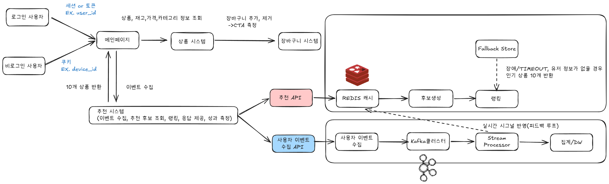
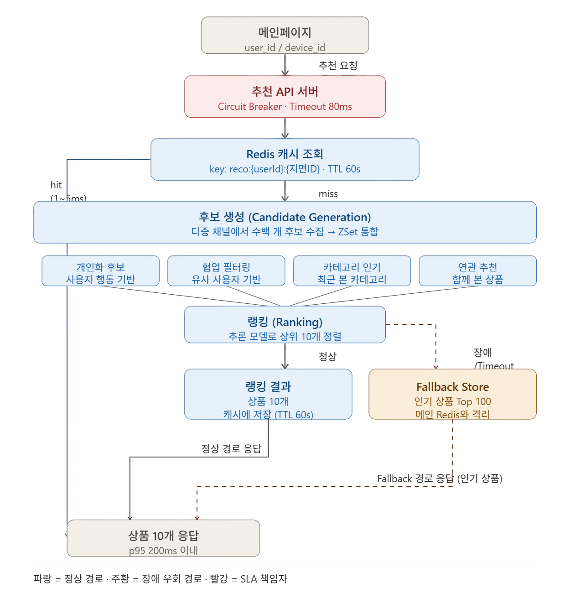
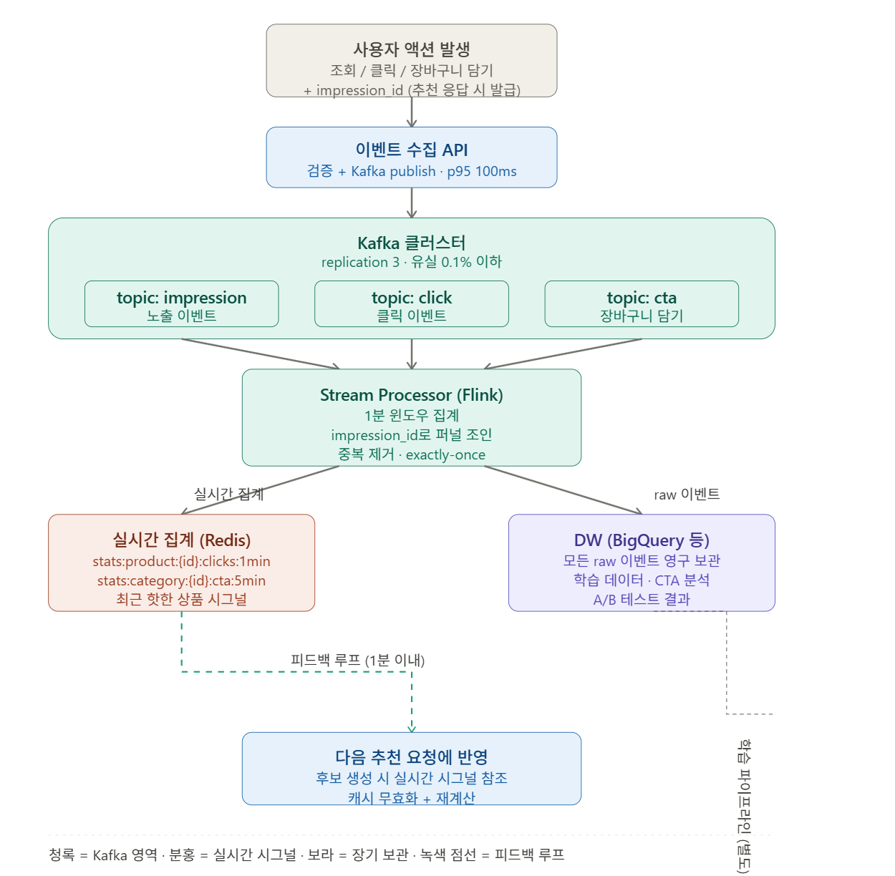

# Week 4 과제: 커머스 추천 지면 시스템 설계

- 상품 조회, 클릭, 장바구니 담기 같은 사용자 행동 이벤트가 추천 결과에 어떻게 반영되는지 설계합니다.
- 후보 상품 생성, 랭킹, 캐시, 메시지 큐, 이벤트 처리, 장애 대응 전략을 비교합니다.
- 대량 트래픽 상황에서 개인화 추천 지면을 안정적으로 제공하는 구조를 확인합니다.

---

## 1. 문제 이해 및 설계 범위 확정

### 시나리오

당신은 커머스 플랫폼의 추천시스템 조직에서 일하고 있다. 메인 페이지에 신규 추천 지면을 추가하는 업무를 맡았으며, 이 지면은 사용자가 관심을 가질 가능성이 높은 상품을 그리드 형태로 노출한다. (2 X 5)

- 추천 지면의 핵심 성과 지표는 CTA(장바구니 담기)이다.
- 사용자의 조회, 클릭, 장바구니 담기 이벤트를 수집할 수 있어야 한다.
- 수집된 이벤트는 이후 추천 후보 생성과 상품 우선순위 산정에 반영되어야 한다.
- 로그인 사용자와 비로그인 사용자를 모두 고려하되, 과제에서는 사용자 식별 및 노출 전략을 다룬다.

### 설계 범위 (In / Out of Scope)

| 포함 (In Scope) | 제외 (Out of Scope) |
| --- | --- |
| 사용자 이벤트 수집 및 처리 흐름 | 추천 모델 학습 파이프라인 |
| 추천 컴포넌트의 배치 | 추천 알고리즘의 수식/모델 구현 |
| 로그인/비로그인 사용자 식별 전략 | 결제/주문 시스템 상세 설계 |
| 추천 후보 상품 생성 흐름 | 상품 이미지/콘텐츠 제작 |
| 추천 지면에 노출되는 상품의 우선순위 산정 | 추천 지면의 UI 디자인 |
| 2 X 5 추천 지면 응답 API | 추천 지면이 플랫폼 별로 노출되는 크기 |
| 장바구니 담기(CTA) 성과 측정 | 장바구니 상품의 상세 옵션 |

### 시스템 구성 전제

- 사용자는 로그인 상태와 비로그인 상태를 모두 가질 수 있다.
- 상품, 재고, 가격, 카테고리 정보는 별도 상품 시스템에서 조회할 수 있다고 가정한다.
- 추천 모델은 별도 학습 파이프라인을 통해 주기적으로 전달된다고 가정한다.
- 추천시스템은 이벤트 수집, 추천 후보 조회, 랭킹, 응답 제공, 성과 측정을 책임진다.
- 추천 지면은 메인 페이지에서 호출되며, 한 번의 요청에 최대 10개 상품을 반환한다.
- 품절, 판매 중지, 노출 불가 상품은 없다고 가정한다.

### 기능 요구사항

- 사용자의 상품 조회, 클릭, 장바구니 담기 이벤트를 수집할 수 있어야 한다.
- 로그인/비로그인 사용자에 대한 이벤트를 연결할 수 있어야 한다.
- 수집된 이벤트는 추천 후보 생성 또는 상품 우선순위 산정에 활용될 수 있어야 한다.
- 추천 API는 메인 페이지 추천 지면에 노출할 상품 목록을 2 X 5 형태로 반환할 수 있어야 한다.
- 추천 후보가 부족하거나 추론부의 장애 상황에서도 추천 결과를 제공할 수 있어야 한다.
- 추천 결과 노출, 클릭, 장바구니 담기 이벤트를 연결해 CTA 성과를 측정할 수 있어야 한다.

### 비기능 요구사항

| 항목 | 목표 |
| --- | --- |
| 추천 API 응답 시간 | p95 200ms 이하 |
| 이벤트 수집 응답 시간 | p95 100ms 이하 |
| 추천 결과 가용성 | 월 99.9% 이상 |
| 이벤트 유실 허용 범위 | 0.1% 이하 |
| 이벤트 반영 지연 | 준실시간 이벤트는 1분 이내 반영 |
| 추천 결과 최신성 | 상품 상태 변경은 5분 이내 반영 |
| 피크 트래픽 대응 | 평시 대비 3배 트래픽 처리 가능 |
| 피크 트래픽 시간대 | 07 ~ 10시, 12 ~ 13시, 18 ~ 19시, 00 ~ 01시 |
| 중복 이벤트 처리 | 누락 이벤트 처리 |
| 장애 대응 | 추천 후보 조회 실패 시 fallback 응답 제공 |
| 데이터 정합성 | 노출, 클릭, 장바구니 이벤트를 추적 가능한 공통 key로 연결 |

### 대략적 규모 추정 (기준값 — 본인 가정으로 변경 가능)

| 항목 | 수치 |
| --- | --- |
| MAU / DAU | 약 10,000,000명 / 약 500,000명 |
| 회원 MAU / DAU | 약 6,000,000명 / 약 300,000명 |
| 비회원·미로그인 MAU / DAU | 약 4,000,000명 / 약 200,000명 |
| 일일 메인 페이지 방문 수 | 약 1,000,000회 |
| 일일 추천 API 요청 수 | 약 800,000 ~ 1,000,000건 |
| 과제 내 추천 지면당 노출 상품 수 | 10개 |
| 일일 추천 상품 노출 수 | 약 8,000,000 ~ 10,000,000건 |
| 일일 사용자 이벤트 수 | 약 10,000,000 ~ 15,000,000건 |
| 평균 클릭률(CTR) | 약 3 ~ 8% |
| 평균 장바구니 담기 전환율(CTA) | 약 0.5 ~ 2% |
| 평균 추천 API QPS | 약 10 ~ 12 QPS |
| 피크 추천 API QPS | 약 150 ~ 300 QPS |
| 피크 이벤트 수집 QPS | 약 1,000 ~ 3,000 QPS |

---

## 2. 개략적 설계안 제시 및 동의 구하기

### 핵심 흐름 (필수)

**[읽기 경로 — 추천 응답]**

1. 사용자(로그인은 `user_id`, 비로그인은 `device_id`)가 메인페이지 진입
2. 메인페이지가 추천 시스템에 추천 요청
3. 추천 시스템이 상품 10개의 ID 반환
4. 상품 시스템에서 상품명/이미지/가격 enrichment
5. 메인페이지가 2×5 그리드로 렌더링

**[쓰기 경로 — 이벤트 수집]**

1. 사용자가 추천 상품을 조회/클릭/CTA 액션
2. 메인페이지가 추천 시스템의 이벤트 수집 API 호출
3. 이벤트가 비동기 처리되어 다음 추천에 반영
4. CTA의 경우 장바구니 시스템에 실제 담기 호출이 병행

### 개략적 아키텍처 다이어그램 (필수)



---

## 3. 상세 설계





### 설계 대상 컴포넌트 사이의 우선순위

| 순위 | 컴포넌트 | 핵심 책임 | 정당화 |
| --- | --- | --- | --- |
| **P0** | Redis 캐시 | 추천 결과 캐싱 | p95 200ms SLA의 결정자 |
| **P0** | Fallback Store | 장애·cold start 대응 | 가용성 99.9% 책임자 |
| **P1** | Kafka 클러스터 | 이벤트 버퍼링·영속화 | 피크 3,000 QPS 흡수 + 유실 0.1% |
| **P1** | 추천 API 서버 | 읽기 진입점 | SLA의 최종 책임자, Circuit Breaker |
| **P2** | Stream Processor | 실시간 집계 | 1분 이내 반영의 메커니즘 |
| **P2** | 이벤트 수집 API | 쓰기 진입점 | 장애 격리 + 독립 스케일링 |
| **P3** | 후보 생성 + 랭킹 | 추천 본체 로직 | 학습 파이프라인 별도 |
| **P4** | DW | 장기 보관·학습 | 서빙 SLA에 직접 영향 없음 |

**P0 — 빠지면 시스템이 실패한다**

Redis 캐시와 Fallback Store는 SLA와 가용성을 직접 결정합니다.

- Redis가 빠지면 → 매번 추론 100~200ms → p95 200ms 위반
- Fallback이 빠지면 → 추론 장애 시 빈 화면 → 매출 즉시 0

이 둘은 **다중화·복제·물리적 격리**에 가장 많은 인프라 비용을 투자합니다.

**P1 — 핵심 경로의 진입점**

Kafka와 추천 API 서버는 읽기/쓰기 경로의 시작점입니다. 이 둘이 안정적이지 않으면 뒤단이 아무리 좋아도 의미가 없습니다.

**P2 — 준실시간 처리**

Stream Processor는 "1분 이내 반영" 요구사항을 담당합니다. 1초 안에 끝나지 않아도 되므로 P0/P1보다는 후순위지만, 추천 품질 유지에 필수입니다.

**P3 — 비즈니스 로직 본체**

후보 생성 + 랭킹은 추천의 "본체"이지만, 과제 전제상 모델 학습은 별도 파이프라인 책임이므로 인프라 설계 관점에서는 후순위입니다.

**P4 — 후방 지원**

DW는 서빙 SLA에 직접 영향이 없습니다. 분 단위 늦어도 OK. 다만 장기적 추천 품질 개선과 비즈니스 측정에는 필수입니다.

### 컴포넌트 상세 설명

**(1) 추천 API 서버 — 읽기 진입점**

- 단일 책임: "userId 받아서 상품 10개 응답"
- stateless로 설계해 피크 트래픽 시 자유롭게 scale-out
- 타임아웃 + Circuit Breaker 로직 내장 (Fallback 전환의 트리거)

**(2) Redis 캐시 — SLA의 결정자**

- 키 구조: `reco:{userId}:{지면ID}`, TTL 60초
- 값: 추천 상품 ID 10개 배열
- 캐시 hit이면 1~5ms로 응답 → p95 200ms 보장
- miss일 때만 후보 생성/랭킹 호출 (무거운 연산 우회)

**(3) 후보 생성 + 랭킹 — 메인 추천 로직**

- 후보 생성: 수백만 상품 → 수백 개 (개인화 후보, 카테고리 인기, 협업 필터링 등)
- 랭킹: 좁혀진 후보 → 추론 모델로 점수 매겨 상위 10개
- 두 단계 분리는 업계 표준 (전체 상품 추론은 비용·시간상 불가능)

**(4) Fallback Store — 가용성의 안전판**

- 매일 배치로 갱신되는 인기 상품 리스트
- 메인 경로와 **물리적으로 분리**된 인스턴스 (같이 죽으면 안 됨)
- 추론 장애, cold start, 후보 부족 시 즉시 응답

**(5) 이벤트 수집 API — 쓰기 진입점**

- DB에 쓰지 않고 Kafka에 publish만 (100ms 안에 응답)
- 추천 API와 분리해 장애 격리 + 독립 스케일링

**(6) Kafka 클러스터 — 트래픽 충격 흡수**

- 토픽: `impression`, `click`, `cta` 분리
- replication factor 3 → 이벤트 유실 0.1% 보장
- 다중 컨슈머가 같은 이벤트를 독립적으로 활용 (실시간 집계, 학습, 분석)

**(7) Stream Processor (Flink) — 실시간 가공**

- 1분 윈도우로 상품별 클릭/CTA 집계
- `impression_id`로 노출-클릭-CTA 퍼널 조인 (데이터 정합성)
- 중복 이벤트 제거 (exactly-once 보장)

**(8) 실시간 집계 (Redis) — 피드백 루프의 핵심**

- "최근 1분간 핫한 상품" 같은 시그널을 후보 생성/캐시에 즉시 반영
- 비기능 요구사항 "1분 이내 반영" 만족

**(9) DW (BigQuery 등) — 장기 보관소**

- 모든 raw 이벤트 영구 보관
- 추천 모델 학습 데이터 제공 (과제 전제: 별도 학습 파이프라인)
- CTA 성과 측정, A/B 테스트 분석, 대시보드

---

### 3-2. 시스템 장애에 대한 fallback 처리는 어떻게 할 것인가?

- 광고/추천의 노출 실패는 매출 하락과 직결된다.
- 추론 시스템의 일시적 지연 혹은 장애 시 어떤 예외 처리를 해볼 수 있을까?

추론 시스템 장애는 **매출 0**으로 직결되는 가장 critical한 시나리오다. "최선의 추천이 안 나오더라도 빈 화면은 절대 안 된다"를 보장하는 다층 방어 구조를 설계했다.

**계층적 Fallback 전략 (Cascading Fallback)**

```
1순위: 개인화 추론 결과 (베스트 — 정상 경로)
   ↓ 실패 시 (타임아웃 80ms 초과 or 5xx)
2순위: 사용자 카테고리 기반 인기 상품 (차선)
   ↓ 실패 시
3순위: 전체 인기 상품 (최후의 보루)
   ↓ 실패 시
4순위: 하드코딩된 고정 상품 리스트 (절대 실패 안 함)
```

각 단계의 추천 품질은 떨어지지만, **어느 한 단계는 반드시 응답**한다.

**Circuit Breaker 패턴 적용**

연속 실패가 임계치를 넘으면 회로를 **즉시 차단**해서 매번 타임아웃 기다리는 비용을 절약한다. 차단 상태에서는 Fallback Store로 바로 우회.

```
상태 머신:
  CLOSED (정상)  ──── 연속 5회 실패 ────→  OPEN (차단)
     ↑                                       │
     │                                       │ 30초 후
   성공 응답                                  ↓
     └────── HALF_OPEN (시험) ◄──────────────┘
                  │ 1회 성공
                  ↓ 시 CLOSED 복귀
```

**물리적 격리 원칙**

Fallback Store는 메인 Redis와 다른 인스턴스에 둔다. 더 보수적으로는 **CDN에 정적 JSON 파일**로 올려두는 것도 검토 가능 — 추천 시스템 전체가 죽어도 클라이언트가 직접 받아서 표시할 수 있다.

**Fallback Store 갱신 전략**

| 데이터 | 갱신 주기 | 키 예시 |
| --- | --- | --- |
| 전체 인기 Top 100 | 매일 새벽 3시 배치 | `fallback:popular:overall` |
| 카테고리별 Top 50 | 매일 배치 | `fallback:popular:category:{categoryId}` |
| 신규 사용자용 | 매일 배치 | `fallback:popular:new_user` |
| 인구통계 기반 | 매일 배치 | `fallback:popular:age:20s:female` |

**기대 효과**

- 추론 장애 시에도 추천 지면 매출 보호
- 가용성 99.9% 보장 (월 약 43분의 다운타임만 허용되는 빠듯한 SLA)
- 신규 사용자의 cold start 문제 해결

---

### 3-6. 후보 상품은 어떻게 반영할 것인가?

- 추천 후보는 어디에서 가져올 것인가? (개인화 후보, 카테고리 인기 상품, 전체 인기 상품, 최근 본 상품 기반 후보 등)
- 추천 후보에 대한 정렬은 어떻게 수행할 수 있을까? (정렬 주체, sorted set 등)
- 노출할 후보 상품이 부족할 때 어떤 순서로 fallback 후보를 채울 것인가?

**왜 깊이 다루는가**

추천 품질의 절반은 **후보 생성**에서 결정됩니다. 좋은 추론 모델도 후보가 빈약하면 좋은 추천을 만들 수 없습니다.

**다중 채널 후보 소스**

| 우선순위 | 소스 | 설명 |
| --- | --- | --- |
| 1 | 개인화 후보 | 사용자 행동 기반 |
| 2 | 협업 필터링 | 비슷한 사용자가 본 상품 |
| 3 | 카테고리 인기 | 최근 본 카테고리 기준 |
| 4 | 연관 추천 | "함께 본 상품" |
| 5 | 전체 인기 (Fallback) | 마지막 보충용 |

각 채널은 **독립적으로** 후보를 생성하며, 랭킹 단계에서 통합 정렬됩니다.

**정렬 전략**

- 정렬 주체: 랭킹 모델 (추론 단계)
- 자료구조: Redis **Sorted Set**
  - key: `candidates:{userId}`
  - score: 추론 모델 점수
  - member: productId
- 상위 N개 조회: `ZREVRANGE` O(log N)

**후보 부족 시 채우기 순서**

```
필요: 10개

[1] 개인화 추론: 6개 확보
       ↓ (부족분 4개)
[2] 카테고리 인기: 3개 추가 → 누적 9개
       ↓ (부족분 1개)
[3] 전체 인기: 1개 추가 → 누적 10개 ✓
       ↓ 그래도 부족하면
[4] 하드코딩 fallback 리스트
```

**다양성 보장**: productId dedup + 동일 카테고리 최대 3개 룰 적용

**캐시 hit ratio 최적화**

| 키 패턴 | TTL | 의도 |
| --- | --- | --- |
| `reco:{userId}:{지면ID}` | 60s | 동일 사용자 재방문 |
| `reco:cold_start:{age}:{gender}` | 5분 | 비로그인 그룹 공유 |
| `popular:category:{id}` | 1분 | 후보 생성 시그널 |
| `popular:overall` | 5분 | Fallback용 |

**TTL 결정 원칙**: "추천 최신성 5분 이내" 요구사항과 hit ratio의 trade-off. 개인화는 짧게, 인기 상품은 길게.

---

## 4. 설계 장점

**(1) 비기능 요구사항을 컴포넌트별로 명확히 대응**

| 요구사항 | 담당 컴포넌트 |
| --- | --- |
| 추천 API p95 200ms | Redis 캐시 + Sorted Set |
| 이벤트 수집 p95 100ms | 이벤트 API + Kafka 비동기 |
| 이벤트 유실 0.1% | Kafka replication factor 3 |
| 1분 이내 반영 | Stream Processor + 피드백 루프 |
| 가용성 99.9% | Cascading Fallback + Circuit Breaker |
| 평시 3배 트래픽 | stateless 컴포넌트 + Kafka 버퍼링 |
| CTA 성과 측정 | impression_id 공통 키 + DW |

**(2) 읽기/쓰기 경로 완전 분리**

API 서버, 데이터 저장소, 트래픽 패턴이 모두 분리되어 한쪽 장애가 다른 쪽에 전파되지 않는다. 독립 스케일링이 가능하다.

**(3) 이벤트 기반 아키텍처로 확장성 확보**

Kafka 덕분에 새로운 컨슈머(분석팀, 모델팀, 마케팅 시스템 등)를 기존 시스템 영향 없이 추가할 수 있다.

**(4) 다층 Fallback으로 매출 보호**

어떤 시나리오에서도 추천 지면이 비지 않는다.

**(5) 피드백 루프로 실시간 개인화**

방금 본 상품이 다음 추천에 반영되는 구조가 명시적으로 설계되어 있다.

---

## 5. 설계 단점

**(1) 운영 복잡도 증가**

Kafka 클러스터, Stream Processor(Flink), Redis 클러스터, DW를 모두 운영해야 한다. 각각 별도의 모니터링·장애 대응·온콜 체계가 필요하고, 인프라 비용도 상당하다.

**(2) 데이터 일관성 관리 부담**

캐시-DB, 캐시-실시간 집계, DW-운영 데이터 간 일관성을 어떻게 보장할지 추가 설계가 필요하다. "DB는 바뀌었는데 화면엔 옛날 데이터" 같은 디버깅이 일상화된다.

**(3) Cold start 한계는 여전**

Fallback Store가 cold start를 완전히 해결하지는 못한다. 결국 인기 상품 위주의 평범한 추천이라 신규 사용자의 첫 경험은 차별화되지 않는다. 가입 단계에서 관심사를 묻는 등 보완 필요.

**(4) Fallback이 매출 손실을 완전 방어하지는 못함**

Fallback Store는 "빈 화면"은 막지만, **개인화 추천 대비 CTA 전환율은 떨어진다**. 즉 fallback이 자주 발동할수록 매출이 줄어든다는 의미. fallback은 최후의 보루이지, 일상이 되어서는 안 된다.

**(5) impression_id 추적의 클라이언트 의존성**

노출-클릭-CTA를 연결하는 핵심 키인 `impression_id`가 클라이언트에서 발급/전달되는데, 모바일 앱 종료, 네트워크 단절, 광고 차단기 등으로 일부 이벤트가 유실될 수 있다. 100% 정합성은 보장 불가.

---

## 6. 마무리

### 개인적 의견 / 사례 공유 / 추가 학습

- **평균 QPS는 거짓말한다** — 피크 25배를 견디는 설계 필수
- **비기능 요구사항이 아키텍처를 결정한다** — 모든 컴포넌트는 SLA 정당화에서 출발
- **다층 방어가 가용성의 본질** — Cascading은 Fallback과 후보 부족에서 두 번 반복되는 패턴
- **읽기/쓰기 분리는 선택이 아니라 필수** — 장애 격리와 독립 스케일링의 전제

### 참고 자료

- (성과지표) [네이버 블로그 — 추천 시스템 성과 지표](https://blog.naver.com/bestmcg/222941438614)
- [AWS Programmatic advertising network](https://advertising.amazon.com/ko-kr/library/guides/ad-network#12)
- [Naver DEVIEW — 실시간 추천 시스템을 위한 Feature Store 구현기](https://deview.kr/data/deview/session/attach/%5B145%5D%EC%8B%A4%EC%8B%9C%EA%B0%84%20%EC%B6%94%EC%B2%9C%20%EC%8B%9C%EC%8A%A4%ED%85%9C%EC%9D%84%20%EC%9C%84%ED%95%9C%20Feature%20Store%20%EA%B5%AC%ED%98%84%EA%B8%B0.pdf)
- [YouTube — 추천 시스템 관련 발표](https://www.youtube.com/watch?v=r1ELaD1DiU0)
