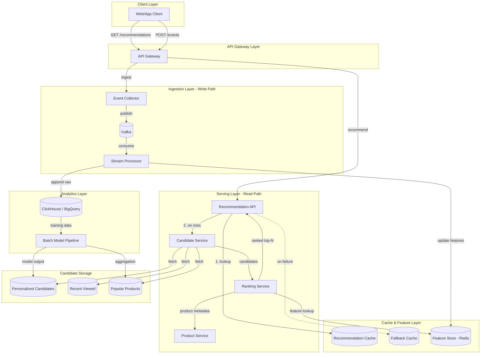
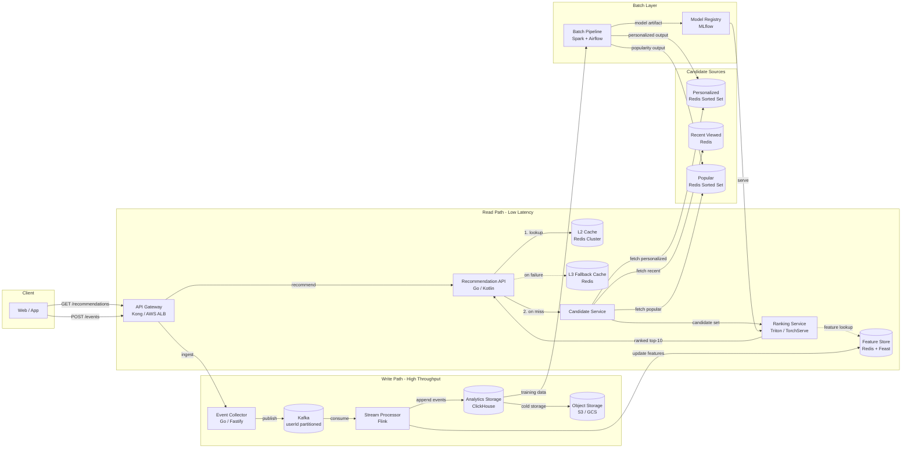

# Week 4 과제: 커머스 추천 지면 시스템 설계

- 상품 조회, 클릭, 장바구니 담기 같은 사용자 행동 이벤트가 추천 결과에 어떻게 반영되는지 설계합니다.
- 후보 상품 생성, 랭킹, 캐시, 메시지 큐, 이벤트 처리, 장애 대응 전략을 비교합니다.
- 대량 트래픽 상황에서 개인화 추천 지면을 안정적으로 제공하는 구조를 확인합니다.

---

#### ⒈ 문제 이해 및 설계 범위 확정

**시나리오**

당신은 커머스 플랫폼의 추천시스템 조직에서 일하고 있다. 메인 페이지에 신규 추천 지면을 추가하는 업무를 맡았으며, 이 지면은 사용자가 관심을 가질 가능성이 높은 상품을 그리드 형태로 노출한다. (2 X 5)

- 추천 지면의 핵심 성과 지표는 CTA(장바구니 담기)이다.
- 사용자의 조회, 클릭, 장바구니 담기 이벤트를 수집할 수 있어야 한다.
- 수집된 이벤트는 이후 추천 후보 생성과 상품 우선순위 산정에 반영되어야 한다.
- 로그인 사용자와 비로그인 사용자를 모두 고려하되, 과제에서는 사용자 식별 및 노출 전략을 다룬다.

## 설계 범위 (In / Out of Scope)

---

| 포함 (In Scope) | 제외 (Out of Scope) |
| --- | --- |
| 사용자 이벤트 수집 및 처리 흐름 | 추천 모델 학습 파이프라인 |
| 추천 컴포넌트의 배치 | 추천 알고리즘의 수식/모델 구현 |
| 로그인/비로그인 사용자 식별 전략 | 결제/주문 시스템 상세 설계 |
| 추천 후보 상품 생성 흐름 | 상품 이미지/콘텐츠 제작 |
| 추천 지면에 노출되는 상품의 우선순위 산정 | 추천 지면의 UI 디자인 |
| 2 X 5 추천 지면 응답 API | 추천 지면이 플랫폼 별로 노출되는 크기 |
| 장바구니 담기(CTA) 성과 측정 | 장바구니 상품의 상세 옵션 |


## 시스템 구성 전제

---

- 사용자는 로그인 상태와 비로그인 상태를 모두 가질 수 있다.
- 상품, 재고, 가격, 카테고리 정보는 별도 상품 시스템에서 조회할 수 있다고 가정한다.
- 추천 모델은 별도 학습 파이프라인을 통해 주기적으로 전달된다고 가정한다.
- 추천시스템은 이벤트 수집, 추천 후보 조회, 랭킹, 응답 제공, 성과 측정을 책임진다.
- 추천 지면은 메인 페이지에서 호출되며, 한 번의 요청에 최대 10개 상품을 반환한다.
- 품절, 판매 중지, 노출 불가 상품은 없다고 가정한다.

## 기능 요구사항

---

- 사용자의 상품 조회, 클릭, 장바구니 담기 이벤트를 수집할 수 있어야 한다.
- 로그인/비로그인 사용자에 대한 이벤트를 연결할 수 있어야 한다.
- 수집된 이벤트는 추천 후보 생성 또는 상품 우선순위 산정에 활용될 수 있어야 한다.
- 추천 API는 메인 페이지 추천 지면에 노출할 상품 목록을 2 X 5 형태로 반환할 수 있어야 한다.
- 추천 후보가 부족하거나 추론부의 장애 상황에서도 추천 결과를 제공할 수 있어야 한다.
- 추천 결과 노출, 클릭, 장바구니 담기 이벤트를 연결해 CTA 성과를 측정할 수 있어야 한다.


## 비기능 요구사항

---

| 항목 | 목표 |
| --- | --- |
| 추천 API 응답 시간 | p95 200ms 이하 |
| 이벤트 수집 응답 시간 | p95 100ms 이하 |
| 추천 결과 가용성 | 월 99.9% 이상 |
| 이벤트 유실 허용 범위 | 0.1% 이하 |
| 이벤트 반영 지연 | 준실시간 이벤트는 1분 이내 반영 |
| 추천 결과 최신성 | 상품 상태 변경은 5분 이내 반영 |
| 피크 트래픽 대응 | 평시 대비 3배 트래픽 처리 가능 |
| 피크 트래픽 시간대 | 07 ~ 10시, 12 ~ 13시, 18 ~ 19시, 00 ~ 01시 |
| 중복 이벤트 처리 | 누락 이벤트 처리 |
| 장애 대응 | 추천 후보 조회 실패 시 fallback 응답 제공 |
| 데이터 정합성 | 노출, 클릭, 장바구니 이벤트를 추적 가능한 공통 key로 연결 |


## 대략적 규모 추정 *(기준값 — 본인 가정으로 변경 가능)*

---

| 항목 | 수치 |
| --- | --- |
| MAU / DAU | 약 10,000,000명 / 약 500,000명 |
| 회원 MAU / DAU | 약 6,000,000명 / 약 300,000명 |
| 비회원·미로그인 MAU / DAU | 약 4,000,000명 / 약 200,000명 |
| 일일 메인 페이지 방문 수 | 약 1,000,000회 |
| 일일 추천 API 요청 수 | 약 800,000 ~ 1,000,000건 |
| 과제 내 추천 지면당 노출 상품 수 | 10개 |
| 일일 추천 상품 노출 수 | 약 8,000,000 ~ 10,000,000건 |
| 일일 사용자 이벤트 수 | 약 10,000,000 ~ 15,000,000건 |
| 평균 클릭률(CTR) | 약 3 ~ 8% |
| 평균 장바구니 담기 전환율(CTA) | 약 0.5 ~ 2% |
| 평균 추천 API QPS | 약 10 ~ 12 QPS |
| 피크 추천 API QPS | 약 150 ~ 300 QPS |
| 피크 이벤트 수집 QPS | 약 1,000 ~ 3,000 QPS |

# 2. 개략적 설계안 제시 및 동의 구하기

**목표**
메인 홈 추천 지면(2×5)을 대상으로 다음을 만족하는 시스템을 설계한다.
- 사용자 행동 이벤트(view/click/cart)를 수집
- 수집된 이벤트를 준실시간으로 추천 결과에 반영
- 추천 API를 p95 200ms 이하로 제공
- 추론 경로 장애 시에도 결과 응답 보장
- 로그인/비로그인 사용자 모두에 대한 개인화 지원

---

## 핵심 흐름

**읽기 경로 (Read Path)**

1. 클라이언트가 메인 페이지 진입 시 Recommendation API 호출
2. Recommendation Cache 조회
   - hit → 즉시 반환
   - miss → 후보 생성 단계로 진행
3. Candidate Service가 세 종류의 후보를 병렬 조회
   - 개인화 후보: 배치 모델 산출 결과
   - 최근 행동 기반 후보: 실시간 피처에서 도출
   - 인기 상품 후보: 일반 보조 + fallback 겸용
4. Ranking Service가 Feature Store에서 사용자/상품 피처를 조회해 점수 산정
5. 상위 10개 선정, `exposureId` 발급 후 응답 및 캐시 적재
6. 추론 경로 실패 시 Fallback Cache의 인기 상품 목록으로 응답

**쓰기 경로 (Write Path)**

7. 클라이언트가 노출 / 클릭 / 장바구니 이벤트를 `exposureId`와 함께 Event Collector로 전송
8. Event Collector가 Kafka에 적재
9. Stream Processor가 두 갈래로 분기 처리
   - 실시간 피처 갱신 → Feature Store
   - 원본 이벤트 적재 → Analytics Storage
10. 갱신된 피처가 다음 추천 요청부터 반영됨

---

## 개략적 아키텍처 다이어그램



---

# 3. 상세 설계

## 설계 대상 컴포넌트 우선순위

| 우선순위 | 컴포넌트 | 선정 사유 |
|---|---|---|
| 1 | Recommendation API | 메인 페이지 진입 경로상 latency-critical 지점 |
| 2 | Event Pipeline | 추천 품질·CTA 측정의 기반 데이터 흐름 |
| 3 | Cache / Feature Store | p95 200ms SLO 충족의 핵심 의존성 |
| 4 | Candidate / Ranking | 추천 품질 결정 |
| 5 | Analytics Storage | 모델 개선 및 장기 분석 기반 |

---
---

## Read Path / Write Path 분리

추천 API와 이벤트 수집은 부하 특성이 반대다. 같은 서버에서 처리하면 한쪽이 다른 쪽의 가용성을 해친다. 두 경로를 분리해 독립적으로 확장한다.

| 항목 | Read Path (추천 API) | Write Path (이벤트 수집) |
|---|---|---|
| 특성 | read-heavy | write-heavy |
| 요구사항 | low latency | high throughput |
| 처리 방식 | synchronous | asynchronous |
| 실패 영향 | 사용자 UX | 데이터 품질 |

**Read Path**: stateless 구성으로 수평 확장. 캐시 우선 조회 후 실패 시 fallback. Candidate Generation(후보 축약)과 Ranking(정밀 정렬)을 분리해 단계별 최적화.

**Write Path**: Event Collector는 Kafka 적재만 하고 즉시 응답. Feature 갱신과 Analytics 적재는 Stream Processor가 비동기로 수행.

---

## 저장소 선택

| 저장소 | 역할 | 선택 이유 |
|---|---|---|
| Redis | cache / online feature store | sub-ms latency |
| Kafka | event streaming | high throughput, ordering 보장 |
| ClickHouse / BigQuery | analytics | 대규모 집계·OLAP |
| Object Storage | 장기 이벤트 보관 | 저비용 |
| RDB | 운영 메타데이터 | strong consistency |

---

## Cache 계층 설계

3-tier 구조로 hot path 부하를 단계적으로 흡수한다.

| 계층 | 종류 | 용도 |
|---|---|---|
| L1 | in-memory (애플리케이션 로컬) | hot key 응답 |
| L2 | Redis distributed cache | 추천 결과 / feature 공유 |
| L3 | Fallback Cache | 추론 실패 시 정적 응답 |

| 캐시 | Key | TTL | 갱신 방식 |
|---|---|---|---|
| 추천 결과 | `rec:{user_key}:{page_version}` | 60s | lazy (miss 시 채움) |
| Feature | `feat:user:{user_key}`, `feat:item:{pid}` | 5~10분 | Stream Processor write-through |
| Fallback | `fallback:popular:{category}` | 5분 | 배치 워밍업 |

---

## Feature Store를 별도로 두는 이유

추천 품질은 최근 행동 반영 속도에 좌우된다. OLTP DB를 직접 조회하면 latency와 부하 양쪽에서 문제가 생긴다. Redis 기반 online feature store를 두면 Stream Processor가 갱신한 실시간 피처를 Ranking Service가 ms 단위로 조회할 수 있다.

---

## 정상 / 장애 경로

| 정상 경로 | 장애 시 대체 경로 |
|---|---|
| personalized 후보 | category popular |
| realtime ranking | cached ranking |
| feature store | static fallback |

---

## 확장 전략

- **Kafka Partitioning**: `userId` 기반 파티셔닝으로 사용자별 이벤트 순서 보장
- **Stateless 서비스**: Recommendation / Candidate / Ranking 모두 수평 확장
- **Cache-first**: hit ratio를 높여 후단 시스템 부하를 차단

---

## 아키텍처 다이어그램



---


## 3-1. 사용자 이벤트 수집은 어떻게 할 것인가?

- 사용자 이벤트는 결국 성과 지표로 연결된다.
- 노출 - 클릭 - 장바구니 담기로 이어지는 퍼널을 어떻게 연결할 수 있을까?
- 수집 데이터 상세화를 한다면 장바구니 담기 Action 전후로 예상되는 고객의 이벤트는 어떤 것이 있을까?
- 수집된 데이터는 어떤 형태로 저장할 수 있을까?
- ...


### 수집 대상

핵심 퍼널 `impression → click → add_to_cart`를 같은 `exposureId`로 묶는다.

- `impression`: IntersectionObserver로 viewport 진입 시 전송. 서버 응답 시점을 노출로 잡으면 안 본 상품까지 분모에 들어간다.
- `click`: 추천 카드 클릭
- `add_to_cart`: 추천 경유 여부 구분 위해 `exposureId` nullable

장바구니 전후로는 상세 진입, 옵션 선택, 리뷰 스크롤, 체류 시간이 따라온다. 퍼널 이탈 분석과 ranking implicit feedback에 쓴다.

### exposureId

추천 API가 응답 생성 시 UUID 발급. 페이로드에 `exposureId`와 슬롯별 `(productId, position)` 포함. 클라이언트는 후속 이벤트에 동일 ID 부착.

### 수집 흐름

`Client → Event Collector → Kafka → Stream Processor → Feature Store / Analytics`

- Event Collector는 스키마 검증과 Kafka produce만. 무거운 처리 넣으면 p95 100ms 못 맞춤
- Kafka는 `userId` 파티셔닝. impression과 click 순서 뒤집히면 퍼널이 깨진다
- Stream Processor에서 실시간 피처 갱신(1분 이내) + Analytics 원본 적재로 분기

### 저장 계층

| 저장소 | 보관 | 용도 |
|---|---|---|
| Feature Store (Redis) | 7~30일 | Ranking ms 단위 조회 |
| ClickHouse | 90일~1년 | 퍼널·CTA 분석 |
| Object Storage (S3) | 1년+ | 학습 데이터 원본 |

### 중복 / 유실 대응

- `event_id`는 UUID v7로 부여, Stream Processor에서 5분 window dedup. v7은 시간 정렬돼서 window 관리가 쉬움
- 클라이언트는 sendBeacon 전송, 실패 시 IndexedDB 버퍼링 후 재전송. 모바일 백그라운드 전환이 가장 큰 유실 원인
- Kafka는 `acks=all` + `enable.idempotence=true`

---

## 3-2. 시스템 장애에 대한 fallback 처리는 어떻게 할 것인가?

- 광고/추천의 노출 실패는 매출 하락과 직결된다.
- 추론 시스템의 일시적 지연 혹은 장애 시 어떤 예외 처리를 해볼 수 있을까?
- ...


### 어떤 장애를 가정할 것인가

Ranking Service 지연·다운, Feature Store 응답 불가, Candidate Store 일부 장애, Kafka produce 실패. 추천 응답은 어떤 경우에도 빈 결과를 내려주지 않는 게 원칙. 빈 지면은 매출 0이지만 차선 지면은 매출 일부는 살린다.

### Fallback 계층

요청이 들어왔을 때 시도 순서를 단계화한다.

| 단계 | 응답 소스 | 트리거 |
|---|---|---|
| 1 | 정상 경로 (Candidate → Ranking) | 기본 |
| 2 | 추천 결과 캐시 (Redis, TTL 60s) | Ranking timeout / 5xx |
| 3 | 카테고리 인기 상품 (Fallback Cache) | Candidate / Feature Store 장애 |
| 4 | 전체 인기 상품 정적 리스트 | Redis까지 다운 |

품질은 단계가 내려갈수록 떨어지지만 응답 자체는 끊기지 않는다.

### 장애 전파 차단

- **Timeout**: 내부 호출 50~100ms. 추천 API p95 200ms SLO를 깨지 않게
- **Circuit Breaker**: Ranking / Feature Store / Candidate에 각각 적용. 연속 실패 시 일정 시간 fallback으로 우회
- **Bulkhead**: Read Path와 Write Path thread pool 격리. 이벤트 수집 폭주가 추천 API 자원을 잠식하지 않도록

### Write Path 장애

- Event Collector가 Kafka produce에 실패하면 로컬 디스크 버퍼에 적재 후 비동기 재시도. 
- 클라이언트에는 항상 2xx 응답해 SDK 측 재전송 폭주를 막는다. 
- 단기간 Kafka 다운은 데이터 정합성에 영향 없도록 흡수.

### 복구와 관측

- Fallback 진입은 메트릭(`fallback_hit_total{tier}`)으로 카운트, 알람은 tier 3 이상부터
- Circuit Breaker open 상태는 대시보드 상시 노출
- 정상 경로 복귀 후 추천 결과 캐시 강제 무효화로 stale 응답 차단


---

## 3-3. 지면의 용도 변경에 자유로울 수 있는가?

- 현재는 그리드 지면으로 2x5 총 10개의 상품을 노출한다.
- 만일 단일 배너 지면으로 변경되거나, 노출되는 상품 수가 변경되거나, 그리드 지면 구조가 바뀐다면? (e.g 페이징) 
- ...

### 현재로서는 자유롭지 않고, placement 추상화로 해결 가능하다.

- 현재는 "10"이 여러 곳에 하드코딩되어 있는 설계다. (API 응답 스키마, Ranking top-K, Candidate 후보 수, 캐시 키, `exposureId` 단위)
- "10"을 지면(placement)이라는 추상화를 통해 데이터로 옮기면, 지면 변경이 배포 없이 가능해진다.
- 클라이언트는 `placementId`로 요청, 서버는 placement 정책에 따라 응답.

```
GET /recommendations?placementId=home_main_grid&page=0
```

| 필드 | 예시 |
|---|---|
| layout | `grid_2x5` / `banner_single` / `carousel` |
| size | 10 / 1 / 20 |
| paging | true / false |
| ranking_model | `home_v3` |
| business_rules | 다양성·MD 부스팅 정책 |

### 각 컴포넌트의 대응
- Candidate Service: `size × 10~20배` 후보 생성
- Ranking Service: top-K를 placement에서 주입
- 캐시 키: `rec:{user_key}:{placement_id}:{page}`
- `exposureId`: placement당 1회, 페이징은 `page` 메타로 분리

### 이점: 새 지면 추가 비용 감소
- size·paging·fallback 변경은 placement row 추가만으로 처리. 
- 새 layout이나 리랭킹 룰은 코드 변경 필요.

---

## 3-4. 상품 노출 레이턴시

- 광고/추천 영역은 저지연 시스템이 타 시스템에 비해 필연적이다. 
- 우리는 상품 노출하기 위해 어떤 시스템 구조를 채택할 수 있을까? (HTTP, gRPC, 캐싱...)
- ...

"p95 200ms" 예산을 컴포넌트별로 쪼개보자.

| 구간 | 예산 |
|---|---|
| 네트워크 (Client ↔ Gateway) | 50ms |
| Cache lookup (Redis) | 5ms |
| Candidate Service | 30ms |
| Feature Store 조회 | 10ms |
| Ranking 추론 | 50ms |
| Gateway·직렬화·기타 | 55ms |

### 통신 프로토콜

- 클라이언트 ↔ Gateway: HTTPS + HTTP/2. CDN edge에서 TLS 종료
- 서비스 간(내부): gRPC. Protobuf 직렬화가 JSON 대비 30~50% 빠르고, multiplexing으로 connection pool 효율 ↑
- 응답 페이로드는 필요한 필드만. 상품 메타는 클라이언트가 별도 Product API에서 lazy fetch

### 캐싱 전략
- CDN: 비로그인·인기 placement 응답
- L1 in-memory: hot key sub-ms 응답
- L2 Redis: 추천 결과 60s TTL, hit ratio 70% 이상이면 후단 호출 대부분 차단

### 추론 자체를 줄이기
- 모델 distillation으로 추론 비용 절감 (DLRM → 경량 MLP)
- Ranking을 GPU 배칭으로 처리. 단건 호출보다 throughput 5~10배
- 일부 후보는 사전 점수화(pre-ranked) 후 Redis에 적재. 실시간 추론은 top-N에만

### 지역성
- Recommendation API와 Redis를 같은 AZ에 배치. (cross-AZ 호출은 5~10ms 추가되기 때문에)
- Feature Store는 read replica를 AZ별로

---

## 3-5. 사용자 식별과 개인화 기준은 어떻게 잡을 것인가?

- 로그인 사용자는 userId로 이벤트를 연결할 수 있지만, 비로그인 사용자는 어떤 기준으로 식별할 것인가?
- userId, deviceId, sessionId, cookie 등 ...


### 식별자 종류

| 식별자        | 발급           | 용도                        |
| ---------- | ------------ | ------------------------- |
| userId     | 로그인 시        | 개인화 1차 키                  |
| deviceId   | 앱/웹 최초 진입 시  | 비로그인 사용자 식별               |
| sessionId  | 세션 시작 시      | 단일 방문 묶기                  |
| exposureId | 추천 응답 생성 시   | 노출-클릭-장바구니를 같은 응답으로 묶는 키 |

### deviceId 발급 방식
플랫폼별로 구현이 다르다.
- 앱: 앱 최초 실행 시 UUID를 생성해 키체인/keystore에 저장. 앱 재설치 전까지 유지
- 웹: 1st-party 쿠키(HttpOnly, Secure, SameSite=Lax)에 UUID를 발급. 만료 1~2년. 쿠키 삭제 시 재발급되며 이력 단절
- 쿠키 차단 환경(ITP, 시크릿 모드)에서는 sessionId까지 fallback. 이 경우 개인화는 사실상 인기 상품 후보로 수렴

### user_key 우선순위

`userId → deviceId → sessionId` 순으로 결정. 추천 요청과 이벤트 적재 모두 동일 규칙.

### 로그인 시 이력 통합

비로그인 deviceId 행동을 로그인 후 userId로 연결하지 않으면 직후 추천 품질이 cold start로 떨어진다.

- 로그인 시 `(deviceId, userId)` 매핑을 Redis에 기록
- Stream Processor가 적재 시 매핑 조회해 user_key를 userId로 정규화
- 최근 30일 윈도우만 소급. 그 이상은 비용 대비 효과 낮음

### 비로그인 사용자

- 배치 개인화 후보는 userId 기반만 생성
- deviceId 사용자는 실시간 행동 feature + 인기 상품 후보 조합으로 대응

---

## 3-6. 후보 상품은 어떻게 반영할 것인가?

- 추천 후보는 어디에서 가져올 것인가? (개인화 후보, 카테고리 인기 상품, 전체 인기 상품, 최근 본 상품 기반 후보 등)
- 추천 후보에 대한 정렬은 어떻게 수행할 수 있을까? (정렬 주체, sorted set 등)
- 노출할 후보 상품이 부족할 때 어떤 순서로 fallback 후보를 채울 것인가?
- ...

---

## 3-7. 추론 모델에 대한 A/B 테스팅을 진행한다면?

- 비교군과 대조군은 어떻게 설정할 것인가?
- 트래픽 분배를 위한 아키텍처는 어떻게 구축할 수 있을까?
- ...

---

## 3-8. 대규모 트래픽과 데이터 증가를 어떻게 처리할 것인가?

- 메인 페이지 진입 트래픽이 몰릴 때 추천 API 병목은 어디에서 발생할 수 있을까?
- 추천 요청과 이벤트 수집 요청은 같은 서버에서 처리할 것인가, 분리할 것인가?
- 플랫폼 이벤트 기간에 평시 피크 대비 수십배의 피크는 어떻게 대응할 것인가?
- 실시간 집계가 필요한 이벤트와 배치로 처리해도 되는 이벤트를 어떻게 구분할 것인가?
- 캐시 hit ratio를 높이기 위해 어떤 key와 TTL 전략을 사용할 것인가?
- ...


---

## 4. 설계 장점

- **Read/Write Path 격리**: 추천 API와 이벤트 수집을 독립 배포·확장. 이벤트 폭주가 추천 가용성을 해치지 않음
- **다층 fallback**: 정상 경로 → 추천 캐시 → 카테고리 인기 → 정적 리스트 4단계. 어떤 장애에서도 빈 지면 방지
- **stateless 서비스 + 캐시 우선**: Recommendation / Candidate / Ranking 전부 수평 확장. 피크 3배 대응이 인스턴스 추가만으로 가능
- **placement 추상화**: 지면 사이즈·페이징·layout 변경이 데이터 변경으로 처리. 신규 지면 추가 시 배포 최소화
- **online/offline Feature Store 분리**: 실시간 피처는 Redis로 ms 단위 응답, 학습용은 S3에서 point-in-time correct하게 추출. training-serving skew 방지
- **exposureId 단일 키**: 노출-클릭-장바구니가 같은 ID로 묶여 CTA 측정과 implicit feedback 학습 모두에 활용
- **identity stitching**: 비로그인 행동도 로그인 후 userId로 귀속. cold start 완화

---

## 5. 설계 단점

- **Redis 의존도 과다**: 추천 캐시, Feature Store, Fallback Cache, Candidate Store 전부 Redis. 클러스터 장애 시 단계적 fallback이 동시에 무너질 위험. 별도 클러스터로 물리 격리 필요
- **운영 복잡도**: Kafka, Flink, ClickHouse, MLflow, Redis, Triton까지 스택이 깊다. 소규모 팀에서는 운영 부담이 추천 품질 개선 시간을 잠식
- **Stream Processor 단일 장애점**: Flink 다운 시 실시간 피처 갱신 중단 → 추천 품질 즉시 저하. checkpoint와 savepoint 기반 빠른 복구 필요
- **캐시 갱신 지연**: 추천 결과 60s TTL과 "상품 상태 변경 5분 이내 반영" 요구사항 사이에 갭. 품절·판매중지 발생 시 최대 60초간 stale 결과 노출
- **identity stitching 비용**: 매핑 join이 Stream Processor에 부하. 매핑 테이블이 커질수록 lookup latency 증가
- **A/B 테스트·MLOps 미반영**: 모델 배포·실험 플랫폼이 구조에 명시되지 않음. 실제 운영에서는 추가 컴포넌트 필요
- **cold storage 활용 미정의**: S3 데이터를 학습에 어떻게 가져갈지(Iceberg? Parquet 파티셔닝?) 구체화 안 됨

---

## 6. 마무리

### 개인적 의견

추천 시스템에서 가장 어려운 건 모델이 아니라 데이터 정합성. 학습 시점과 서빙 시점의 피처가 다르면(training-serving skew) 모델 성능이 의미를 잃기 때문이다. 이를 고려해 이번 아키텍처는 Feature Store와 exposureId라는 두 개의 정합성 장치를 두고, 그 위에 모델·캐시·fallback이 얹히는 구조로 설계하게 되었다.

### 핵심 개념

- Offline Feature Store
    - 같은 피처를 두 저장소에 분리 보관
    - Online(Redis): 서빙용, ms 단위 조회
    - Offline(S3/Parquet): 학습 데이터 추출용
    - 같은 정의에서 생성돼야 training-serving skew 방지. Feast가 두 store에 동일 변환 로직 적용

- Backfill
    - 새 피처 추가 시 과거 시점 값을 소급해 채우는 작업
    - "지금 값" 그대로 넣으면 안 되고 point-in-time correctness 유지 필수
    - 예: 2024-01-01에 "지난 7일 클릭 수" 피처 추가 → 2023-12-25 샘플엔 그날 기준 7일치
    - 미래 정보 누수(data leakage) 방지가 핵심

- Protocol Buffers (protobuf)
     - Google의 바이너리 직렬화 포맷
     - JSON 대비 페이로드 30~50% ↓, 파싱 속도 ↑
     - .proto 스키마로 다국어 코드 자동 생성 → 서비스 간 계약 강제
     - gRPC 기본 직렬화. 내부 호출(Ranking ↔ Feature Store)에 적합

- 직렬화 (Serialization)
     - 메모리 객체 → 네트워크/디스크 전송용 바이트 변환
     - 추천 시스템 latency에 직접 영향: 1000개 후보 점수 응답 시 JSON 수 ms vs protobuf 1ms 이하
     - p95 200ms 예산에서 무시 못 할 비중

---

## 참고 자료

- https://www.bucketplace.com/post/2025-12-17-%EA%B0%9C%EC%9D%B8%ED%99%94-%EC%B6%94%EC%B2%9C-%EC%8B%9C%EC%8A%A4%ED%85%9C-4-feature-store/

- https://medium.com/daangn/%EC%B6%94%EC%B2%9C-%EC%8B%9C%EC%8A%A4%ED%85%9C%EC%9D%98-%EC%8B%AC%EC%9E%A5-feature-store-%EC%9D%B4%EC%95%BC%EA%B8%B0-1-75ffee8ccacd

- https://deview.kr/data/deview/session/attach/[145]%EC%8B%A4%EC%8B%9C%EA%B0%84%20%EC%B6%94%EC%B2%9C%20%EC%8B%9C%EC%8A%A4%ED%85%9C%EC%9D%84%20%EC%9C%84%ED%95%9C%20Feature%20Store%20%EA%B5%AC%ED%98%84%EA%B8%B0.pdf

- https://www.youtube.com/watch?v=r1ELaD1DiU0
