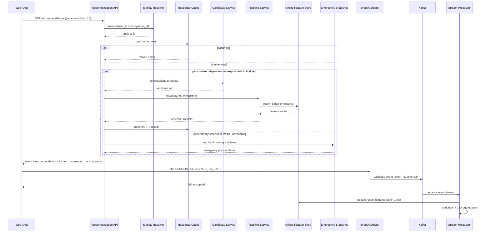
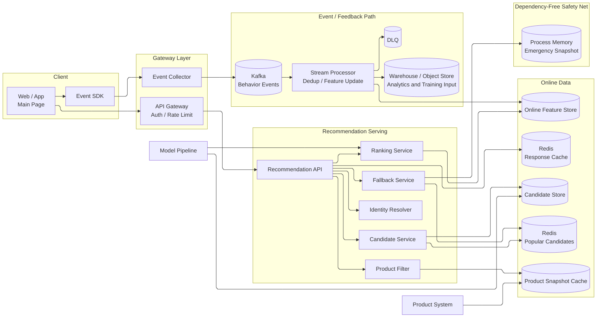
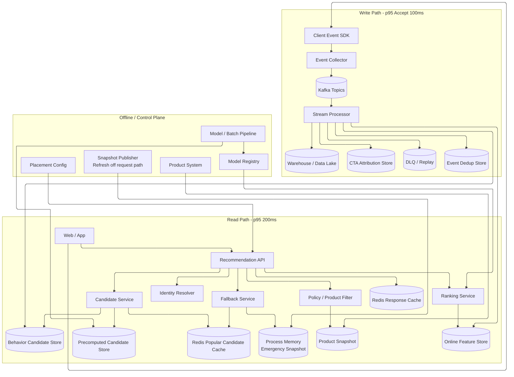

# Week 4 과제: 커머스 추천 지면 시스템 설계

## 0. 과제 개요

### 과제: 메인 페이지 개인화 상품 추천 지면 설계

#### 시나리오

커머스 플랫폼의 메인 페이지에 사용자가 관심을 가질 가능성이 높은 상품을 노출하는 신규 추천 지면을 추가한다. 지면은 기본적으로 `2 X 5` 그리드이며 한 번에 10개 상품을 보여준다.

- 추천 지면의 핵심 성과 지표는 `장바구니 담기(CTA)`이다.
- 사용자의 상품 조회, 추천 상품 노출, 클릭, 장바구니 담기 이벤트를 수집한다.
- 수집된 이벤트는 이후 추천 후보 생성과 상품 우선순위 산정에 반영한다.
- 로그인 사용자와 비로그인 사용자 모두에게 추천 결과를 제공한다.

### 시스템 구성 전제

- 상품, 가격, 재고, 판매/노출 가능 여부는 별도 `Product System`이 관리한다.
- 추천 모델 학습 및 모델 배포 파이프라인은 이미 존재하며 이번 설계의 범위 밖이다.
- 추천 시스템은 이벤트 수집, 온라인 feature 반영, 후보 조회, 랭킹, 응답, 성과 측정을 책임진다.
- 기본 과제에서는 품절, 판매 중지, 노출 불가 상품이 없다고 가정하지만, 운영 환경으로 확장할 수 있도록 상품 상태 필터를 경로에 포함한다.
- 메인 페이지의 한 추천 요청은 최대 10개 상품을 반환한다.

### 요건

- 상품 조회, 노출, 클릭, 장바구니 담기 이벤트를 유실이 적고 추적 가능한 형태로 수집한다.
- 로그인/비로그인 사용자 행동을 각각 개인화에 활용하고, 로그인 전후 행동을 정책에 따라 연결한다.
- 추천 결과를 생성할 때 개인화 후보, 행동 기반 후보, 인기 상품 후보를 조합한다.
- 추천 API 장애나 랭킹/추론 장애에도 빈 지면 대신 fallback 상품을 반환한다.
- 추천 응답으로 생성된 노출부터 클릭, 장바구니 담기까지 동일한 식별자로 연결하여 CTA를 측정한다.

#### 규모 가정

| 항목 | 수치 |
|---|---:|
| MAU / DAU | 약 10,000,000명 / 약 500,000명 |
| 회원 DAU / 비회원·미로그인 DAU | 약 300,000명 / 약 200,000명 |
| 일일 메인 페이지 방문 수 | 약 1,000,000회 |
| 일일 추천 API 요청 수 | 약 800,000 ~ 1,000,000건 |
| 추천 지면당 노출 상품 수 | 최대 10개 |
| 일일 추천 상품 노출 수 | 약 8,000,000 ~ 10,000,000건 |
| 일일 사용자 이벤트 수 | 약 10,000,000 ~ 15,000,000건 |
| 평균 CTR / CTA | 약 3 ~ 8% / 약 0.5 ~ 2% |
| 평균 / 피크 추천 API QPS | 약 10 ~ 12 QPS / 약 150 ~ 300 QPS |
| 피크 이벤트 수집 QPS | 약 1,000 ~ 3,000 QPS |

#### 시간/품질 목표

| 항목 | 목표 |
|---|---|
| 추천 API 응답 시간 | p95 200ms 이하 |
| 이벤트 수집 응답 시간 | p95 100ms 이하 |
| 추천 결과 가용성 | 월 99.9% 이상 |
| 이벤트 유실 허용 범위 | 0.1% 이하 |
| 준실시간 이벤트 반영 | 수집 후 1분 이내 온라인 feature 반영 |
| 상품 상태 최신성 | 변경 후 5분 이내 반영 |
| 피크 대응 | 평시 대비 3배 트래픽 처리 가능 |
| 데이터 정합성 | 노출, 클릭, 장바구니를 공통 key로 연결 가능 |

---

## 1. 문제 이해 및 설계 범위 확정

### 1-1. 설계 대상

이번 설계에서는 커머스 서비스를 `YJ Commerce`로 구체화한다. 메인 페이지의 신규 추천 지면 이름은 `오늘의 발견`으로 두며, 사용자가 지면에서 본 상품을 장바구니에 담을 가능성을 높이는 것이 목적이다.

추천의 목적은 단순 클릭 증가가 아니다. 클릭을 많이 받더라도 장바구니로 이어지지 않는 상품만 노출하면 핵심 목표와 어긋난다. 따라서 랭킹의 주 목표를 `add_to_cart` 확률로 두고, CTR은 진단 지표로 함께 관찰한다.

### 1-2. 설계 범위 (In / Out of Scope)

| 포함 범위 (In Scope) | 제외 범위 (Out of Scope) |
|---|---|
| 메인 페이지 추천 지면 응답 API | 추천 모델 학습 알고리즘과 GPU 학습 인프라 |
| 사용자 행동 및 추천 성과 이벤트 수집 | 결제, 주문, 배송 상세 설계 |
| 로그인/비로그인 식별과 로그인 후 연결 정책 | 회원 인증 자체의 구현 |
| 후보 상품 생성, 온라인 랭킹, 캐시 | 상품 이미지/상세 콘텐츠 제작 |
| 온라인 feature 갱신과 후보 fallback | 상품/재고 시스템 내부 구현 |
| 노출-클릭-장바구니 attribution | 전체 홈 화면 UI 디자인 |
| 장애, 부하 급증, 품질 저하 대응 | 다중 국가/다중 리전 재해복구 상세 |

### 1-3. 기능 요구사항

- 추천 API는 `placement_id`와 사용자 식별 정보를 받아 최대 10개 상품을 반환한다.
- 추천 응답마다 `recommendation_id`를 발급하고, 각 칸에는 `item_impression_id`와 `slot_index`를 부여한다.
- 클라이언트는 실제 화면에 보인 상품의 `IMPRESSION`, 클릭한 상품의 `CLICK`, 장바구니 담기의 `ADD_TO_CART` 이벤트를 전송한다.
- 로그인 사용자는 `user_id`, 비로그인 사용자는 first-party `anonymous_id`와 `session_id`를 기준으로 개인화한다.
- 사용자가 로그인하면 동의를 포함한 정책 범위에서 동일 기기의 익명 최근 행동을 로그인 프로필에 연결한다.
- 행동 이벤트는 스트림 처리로 최근 관심 카테고리, 최근 클릭 상품, 최근 장바구니 상품 등의 온라인 feature를 갱신한다.
- 추천 후보가 부족하거나 모델/feature store가 실패해도 인기 상품 기반 결과를 반환한다.
- 어떤 추천 전략과 모델 버전이 CTA를 만든 것인지 이벤트에서 구분할 수 있어야 한다.

### 1-4. 비기능 요구사항

| 항목 | 설계 목표와 판단 |
|---|---|
| API 지연 | p95 200ms를 지키기 위해 후보/feature를 온라인 저장소에서 읽고 외부 상품 시스템 동기 호출을 최소화한다 |
| 이벤트 지연 | Collector는 빠르게 수락하고 Kafka 이후 처리를 비동기화하여 p95 100ms를 목표로 한다 |
| 이벤트 유실 | 클라이언트 재시도, `event_id` 중복 제거, Kafka replication과 DLQ로 0.1% 이하를 목표로 한다 |
| 가용성 | personalized path가 실패하면 cached/stale/popular fallback으로 지면 자체는 살린다 |
| 정합성 | `recommendation_id`와 `item_impression_id`를 장바구니 이벤트까지 전달한다 |
| 확장성 | 읽기 API와 이벤트 수집/처리 시스템을 분리해 각각 독립 확장한다 |
| 개인정보 | 익명 행동과 계정 연결은 정책 및 보존 기간을 적용하고 원본 PII를 이벤트 key로 사용하지 않는다 |

### 1-5. 트래픽 해석

일일 추천 요청 1,000,000건은 하루 평균 약 12 QPS지만, 홈 진입은 특정 시간과 캠페인에 집중된다. 따라서 평균 QPS가 낮아 보인다는 이유로 동기 추론과 상품 조회를 무제한 붙이면 이벤트나 기획전 시점에 쉽게 병목이 된다. 과제 기준의 피크 `300 QPS`를 기본 용량으로 잡고, 운영상 대형 프로모션에서는 캐시 중심 degraded mode로 더 큰 순간 피크를 받아낼 수 있게 한다.

일일 이벤트 15,000,000건은 하루 평균 약 174 events/sec이다. 그러나 한 응답이 최대 10개의 노출 이벤트를 만들고 피크에는 클릭/장바구니 이벤트도 함께 몰리므로 Collector와 Kafka는 최소 `3,000 events/sec`를 정상 처리하는 것을 초기 기준으로 둔다.

### 1-6. 본인이 추가로 둔 가정

| 확인이 필요한 부분 | 이번 설계의 가정 | 이유 |
|---|---|---|
| CTA 정의 | 추천 지면에서 노출된 상품이 24시간 안에 장바구니에 담기고 `item_impression_id`가 전달되면 직접 CTA로 측정한다 | 성과 지면의 기여를 추적할 수 있는 명확한 기준이 필요하다 |
| 노출 정의 | API가 상품을 반환한 시점이 아니라 클라이언트 viewport에 진입한 시점에 `IMPRESSION`을 보낸다 | 반환되었지만 보이지 않은 상품을 노출로 세면 성과가 왜곡된다 |
| 익명 사용자 ID | first-party cookie/app device token의 무작위 `anonymous_id`를 사용하고 90일 만료 정책을 둔다 | 비로그인 개인화를 지원하되 무기한 추적을 피한다 |
| 로그인 전후 연결 | 로그인 성공 시 같은 기기의 최근 익명 feature를 로그인 feature에 forward merge하고 원본 식별 연결은 제한 보존한다 | 사용 경험의 연속성과 개인정보 통제를 함께 고려한다 |
| 후보 생성 방식 | 배치 생성 개인화 후보에 준실시간 행동 후보와 인기 후보를 섞는다 | 모델을 매 이벤트마다 다시 추론하지 않아도 최근 관심을 반영할 수 있다 |
| 랭킹 방식 | CTA 예측 점수를 우선하고, 중복/최근 장바구니/노출 피로도/상품 상태를 후처리한다 | 목표 지표와 사용자 경험을 동시에 관리한다 |
| 캐시 방식 | 인기 fallback은 넓게 캐시하고, 개인화 응답은 짧은 TTL 또는 후보 단위로 캐시한다 | 개인화 최신성과 cache hit ratio 사이 균형을 맞춘다 |
| 상품 상태 | 과제의 기본 흐름에는 이상 상품이 없으나, product snapshot을 5분 이내 갱신해 필터링 가능하게 둔다 | 실제 운영 확장 시 추천 시스템 변경을 줄인다 |

---

## 2. 개략적 설계안 제시 및 동의 구하기

### 2-1. 설계 원칙

추천 시스템은 **추천 결과를 읽는 경로**와 **행동을 수집해 다음 추천에 반영하는 경로**의 요구가 다르다.

- 읽기 경로는 사용자가 홈을 여는 순간 기다리는 경로이므로 200ms 안에 결과를 반환하고, 실패 시 즉시 fallback한다.
- 이벤트 쓰기 경로는 클릭/장바구니를 절대 홈 API의 응답 지연에 묶지 않고, Kafka를 통해 비동기로 feature와 분석 저장소에 전달한다.
- 두 경로는 `recommendation_id`, `item_impression_id`, `subject_id`, `model_version`으로 다시 연결된다.
- 백엔드 인프라 관점에서 가장 중요한 기준은 **개인화 의존성이 느려지거나 이벤트가 몰려도 홈 지면은 제한 시간 안에 항상 응답해야 한다**는 것이다.

### 2-2. 핵심 흐름

1. 사용자가 메인 페이지에 진입하면 클라이언트가 `GET /v1/recommendations?placement_id=home_discovery&limit=10`을 호출한다.
2. `Identity Resolver`는 로그인 사용자의 `user_id` 또는 비로그인의 `anonymous_id`를 `subject_id`로 결정한다.
3. `Recommendation API`는 응답 캐시를 먼저 확인하고, miss이면 `Candidate Service`에서 개인화, 최근 행동, 카테고리 인기, 전체 인기 후보를 모은다.
4. `Ranking Service`는 Online Feature Store의 최신 행동 feature와 배포된 모델을 사용해 CTA 기준으로 후보를 정렬한다.
5. `Product Filter`는 상품 snapshot으로 노출 가능 여부를 검증하고 중복/최근 장바구니 상품을 제거한 뒤 10개를 구성한다.
6. 개인화 경로가 제한 시간 안에 성공하지 않으면 `Fallback Service`가 정상 시 준비해 둔 인기 결과를 사용한다.
7. Redis, Candidate Store, Feature Store까지 사용할 수 없으면 외부 호출을 추가로 시도하지 않고 Recommendation API 프로세스 메모리의 `Emergency Snapshot`으로 10개를 반환한다.
8. API는 상품 목록과 함께 `recommendation_id`, 상품별 `item_impression_id`, `model_version`, `strategy`를 반환한다.
9. 상품이 실제 화면에 보이면 클라이언트는 `IMPRESSION` 이벤트를, 클릭/장바구니 담기 시 각각 `CLICK`, `ADD_TO_CART` 이벤트를 `Event Collector`에 전송한다.
10. `Stream Processor`는 이벤트를 중복 제거하고 온라인 feature를 1분 이내 갱신하며, 분석 저장소에는 CTA 성과 집계를 저장한다.

### 2-3. 추천 응답과 이벤트 반영 흐름



### 2-4. 개략적 아키텍처 다이어그램



### 2-5. 주요 컴포넌트 역할

| 컴포넌트 | 역할 |
|---|---|
| Recommendation API | 지면 요청의 진입점, timeout budget 관리, 결과 조립 및 응답 |
| Identity Resolver | `user_id`/`anonymous_id`를 개인화 subject로 해석하고 로그인 연결 정책 적용 |
| Candidate Service | 개인화/최근 행동/인기 후보를 읽고 합쳐 랭킹 입력 집합 생성 |
| Ranking Service | 온라인 feature와 모델 버전으로 CTA 중심 점수 산정 |
| Product Filter | 중복, 노출 정책, 상품 상태, 이미 장바구니에 담은 상품 제거 |
| Fallback Service | 부분 장애 시 인기 후보, Redis까지 장애 시 메모리의 last-known-good snapshot으로 응답 |
| Event Collector | 이벤트 검증, 빠른 수락, Kafka 발행, rate limiting |
| Stream Processor | 중복 제거, feature 갱신, attribution 집계, 비정상 이벤트 분리 |
| Online Feature Store | 최근 클릭/CTA/카테고리 선호 등 low-latency feature 조회 |

---

## 3. 상세 설계

선택 질문은 **`3-2. 시스템 장애에 대한 fallback 처리는 어떻게 할 것인가?` 한 가지**이다. 추천 품질을 높이는 기능보다, 개인화 구성 요소가 느려지거나 이벤트 수집 트래픽이 폭주할 때도 홈 추천 지면과 CTA 원본 이벤트를 지키는 구조를 가장 깊게 설명한다. 이벤트 연결과 후보 생성은 이 선택을 이해하는 데 필요한 정상 흐름으로만 다룬다.

### 3-1. 설계 대상 컴포넌트 사이의 우선순위 정하기

| 우선순위 | 컴포넌트 | 이유 |
|---:|---|---|
| 1 | Recommendation API + Emergency Snapshot | 후단 전체가 느려져도 홈 지면이 제한 시간 안에 응답하는 마지막 방어선이다 |
| 2 | Event Collector + Kafka | 추천 장애와 별개로 CTA 원본 이벤트 유실을 최소화하는 기반이다 |
| 3 | Candidate + Ranking Service | 어떤 상품을 보여주는지 결정하여 추천 품질과 CTA를 좌우한다 |
| 4 | Identity Resolver | 로그인/익명 행동을 올바른 개인화 subject에 연결한다 |
| 5 | Feature / Cache / Candidate Store | 온라인 조회 지연과 트래픽 비용을 통제한다 |

### 3-2. 상세 아키텍처



읽기 경로와 쓰기 경로는 독립적으로 확장한다. 추천 API 장애가 이벤트 수집을 멈추게 해서는 안 되고, 이벤트 처리 지연이 홈 화면의 추천 응답 시간을 늘려서도 안 된다. 특히 `Emergency Snapshot`은 Redis, 모델, Product Snapshot을 다시 호출하지 않는 요청 경로로 둔다. 정상 시간에 검증된 인기 상품 10개 이상을 각 API 인스턴스 메모리에 갱신해 두고, 장애 중에는 마지막 정상 snapshot을 읽는다. 반면 두 경로에서 생성되는 식별자는 일관되게 보존되어야 CTA 성과를 다시 결합할 수 있다.

### 3-3. 사용자 이벤트 수집과 CTA 연결

#### 이벤트 종류

API가 상품을 반환했다는 사실과 사용자가 실제로 상품을 봤다는 사실은 구분한다.

| 이벤트 | 발생 시점 | 사용 목적 |
|---|---|---|
| `RECOMMENDATION_SERVED` | 추천 API가 결과를 반환할 때 서버에서 기록 | API 성공률, fallback 비율, 응답된 상품 감사 |
| `IMPRESSION` | 상품 카드가 viewport 기준을 만족해 보였을 때 클라이언트에서 기록 | 실제 노출 분모와 CTR/CTA 계산 |
| `CLICK` | 사용자가 추천 카드/상세 이동을 클릭할 때 | 관심 feature와 CTR |
| `PRODUCT_VIEW` | 상세 페이지가 열린 뒤 유효 조회가 발생할 때 | 후보 생성과 탐색 의도 |
| `ADD_TO_CART` | 상품이 장바구니에 정상 추가된 후 | 핵심 CTA와 강한 선호 feature |

`ADD_TO_CART`가 추천 카드에서 직접 발생하지 않고 상세 페이지를 거쳐 발생하더라도, 상세 이동 시 전달한 `recommendation_id`와 `item_impression_id`를 장바구니 요청 컨텍스트까지 유지한다.

#### 공통 이벤트 스키마

```json
{
  "event_id": "01J...uuid",
  "event_type": "ADD_TO_CART",
  "occurred_at": "2026-05-27T12:34:56.789Z",
  "received_at": "server_generated",
  "placement_id": "home_discovery",
  "recommendation_id": "rec_...",
  "item_impression_id": "imp_...",
  "product_id": "prd_123",
  "slot_index": 3,
  "subject": {
    "user_id": "encrypted_or_internal_id_if_logged_in",
    "anonymous_id": "anon_...",
    "session_id": "sess_..."
  },
  "recommendation_context": {
    "strategy": "personalized_ranked",
    "model_version": "cta_ranker_20260527"
  },
  "context": {
    "platform": "app",
    "page": "home",
    "request_id": "req_..."
  }
}
```

#### 퍼널 연결 key

| Key | 생성 주체 | 용도 |
|---|---|---|
| `request_id` | API Gateway | 요청 단위 로그/tracing 및 오류 분석 |
| `recommendation_id` | Recommendation API | 추천 응답 한 번과 그 결과의 성과 연결 |
| `item_impression_id` | Recommendation API | 특정 응답의 특정 상품 노출-클릭-CTA 연결 |
| `product_id` | Product System | 상품 단위 집계 |
| `subject_id` | Identity Resolver | 개인화와 사용자 단위 실험 할당 |
| `model_version`, `strategy` | Recommendation API | 개인화/fallback 및 모델 버전별 CTA 비교 |

노출을 분모로 삼는 직접 CTA는 다음과 같이 집계할 수 있다.

```text
direct_CTA_rate =
  recommendation item의 IMPRESSION 이후 24시간 내 attribution 가능한 ADD_TO_CART 수
  / 유효 IMPRESSION 수
```

#### 수집과 중복 처리

1. Client Event SDK는 이벤트마다 UUID 기반 `event_id`를 만들고, 화면 종료 시에는 `sendBeacon` 또는 앱의 로컬 재전송 큐를 이용한다.
2. Event Collector는 필수 필드와 timestamp 범위를 확인하고, 너무 큰 payload나 허용되지 않은 이벤트를 거부한다.
3. 정상 이벤트는 Kafka에 기록된 후 `202 Accepted`를 반환한다. Kafka 전송 실패 시 제한된 재시도 후 실패 지표를 올린다.
4. 모바일 재전송 또는 consumer retry로 같은 이벤트가 여러 번 도착할 수 있으므로 Stream Processor는 `event_id` 기준 dedup store를 확인한다.
5. 처리 실패 이벤트는 DLQ에 격리하고 replay 가능하게 한다.

이 구조는 전체 파이프라인을 엄격한 exactly-once로 만들기보다, 전달은 at-least-once로 안전하게 받고 집계/feature 반영을 idempotent하게 만드는 방식이다.

#### 이벤트 저장 및 반영

| 저장소 | 데이터 | 보존/사용 목적 |
|---|---|---|
| Kafka | 원시 행동 이벤트 stream | processor 간 전달, 단기 replay |
| Online Feature Store | 최근 카테고리 클릭 수, 최근 조회/CTA 상품, 노출 피로도 | 다음 추천 요청에서 1분 이내 사용 |
| Behavior Candidate Store | 최근 클릭 카테고리/유사 상품 후보 | 준실시간 후보 보강 |
| Attribution Store | impression-click-add_to_cart 연결 결과 | 대시보드 CTA 집계 |
| Warehouse / Data Lake | 정제/원시 이력 | 장기 분석 및 별도 모델 학습 입력 |

### 3-4. 사용자 식별과 개인화 기준

#### 로그인 사용자

- 인증된 내부 `user_id`를 안정적인 `subject_id`로 사용한다.
- 계정의 장기 관심 feature와 최근 행동 feature를 함께 조회한다.
- 여러 기기에서 로그인하더라도 동일 계정의 개인화 feature를 사용할 수 있다.

#### 비로그인 사용자

- 브라우저 first-party cookie 또는 앱 설치 token으로 발급한 무작위 `anonymous_id`를 사용한다.
- 세션 단위 행동은 `session_id`, 재방문 단위 개인화는 만료가 있는 `anonymous_id`로 연결한다.
- cookie 거부, 삭제, 새 기기에서는 새 사용자처럼 시작하며 카테고리/전체 인기 fallback을 제공한다.

#### 로그인 전 행동 연결

사용자가 익명 상태로 상품을 둘러보다 로그인한 경우, 같은 기기에 있는 최근 익명 행동은 로그인 이후 추천에 유용하다. 다만 익명 ID 여러 개를 무제한 계정에 합치면 공유 기기와 개인정보 문제가 생긴다.

이번 설계에서는 다음 정책을 둔다.

- 로그인 성공 이벤트가 발생한 같은 기기의 최근 익명 feature만 `user_id` feature에 forward merge한다.
- `ADD_TO_CART`처럼 강한 신호는 반영하되, 이미 만료됐거나 다른 계정과 충돌한 익명 연결은 병합하지 않는다.
- 로그인 이후 추천 subject는 `user_id`로 전환되었다는 사실을 분석 이벤트에 남긴다.
- 원본 연결 정보는 제한된 목적과 기간에만 저장하고 삭제/동의 철회 정책을 따른다.

### 3-5. 후보 상품 생성과 우선순위 산정

한 번의 온라인 요청에서 전체 상품을 모델에 넣어 점수를 계산하지 않는다. 미리 줄여 둔 후보 집합을 여러 출처에서 가져온 뒤 online ranking으로 최종 10개를 선정한다.

#### 후보 소스

| 후보 소스 | 생성/갱신 방식 | 장점 | 장애 시 우선순위 |
|---|---|---|---:|
| 개인화 모델 후보 | 배치 또는 주기적 추론 결과를 Candidate Store에 저장 | 장기 선호 반영 | 1 |
| 최근 행동 기반 후보 | 클릭/조회/CTA stream으로 카테고리·유사상품 후보 갱신 | 방금 생긴 관심 반영 | 2 |
| 최근 본 상품 연관 후보 | 최근 조회 상품의 연관/동일 카테고리 상품 | 익명 사용자에도 유용 | 3 |
| 세그먼트/카테고리 인기 | 시간대·기기·유입별 인기 집계 | 개인화가 약한 경우 안정적 | 4 |
| 전체 인기/운영 큐레이션 | 사전 계산 후 넓게 캐시 | 최종 fallback | 5 |

#### 후보 생성과 랭킹 절차

1. `Candidate Service`는 subject당 개인화 후보 최대 200개를 가져온다.
2. 최근 행동 후보와 인기 후보를 각각 제한된 개수만 합쳐 후보 pool을 약 300~500개로 만든다.
3. `product_id` 중복을 제거하고 상품 snapshot에서 노출 불가 상품을 제외한다.
4. `Ranking Service`가 온라인 feature를 읽어 후보별 `P(add_to_cart | impression)` 중심 점수를 계산한다.
5. 이미 최근 장바구니에 담긴 상품, 지나치게 반복 노출된 상품에는 penalty를 적용한다.
6. 동일 브랜드/카테고리로만 10칸이 채워지지 않도록 간단한 다양성 제약을 적용한다.
7. 상위 10개가 부족하면 카테고리 인기, 전체 인기 순으로 채운다.

#### 랭킹 점수 개념

```text
final_score =
  predicted_add_to_cart_score
  + recent_interest_boost
  + exploration_boost
  - repeated_impression_penalty
  - already_in_cart_penalty
  - policy_penalty
```

모델의 구체적인 학습 수식은 범위 밖이지만, 서빙 시스템은 어떤 `model_version`이 어떤 상품을 노출했는지 이벤트에 남겨야 이후 CTA 결과를 비교할 수 있다.

#### 캐시 전략

| 데이터 | Cache key 예시 | TTL | 판단 |
|---|---|---:|---|
| 개인화 최종 응답 | `rec:{placement}:{subject}:{model_version}` | 30~60초 | 홈 새로고침 폭주를 흡수하되 최근 행동 반영을 너무 늦추지 않는다 |
| 개인화 후보 | `candidate:{subject}:{model_version}` | 수 시간, 새 후보 생성 시 교체 | 랭킹 전 후보 읽기 비용 절감 |
| 최근 행동 후보 | `behavior_candidate:{subject}` | 수 분 | stream update로 즉시 overwrite 가능 |
| 카테고리 인기 | `popular:{category}:{time_bucket}` | 5~10분 | fallback hit ratio가 높다 |
| 전체 인기 후보 | `popular:global:{placement}` | 5~10분 | Redis가 살아 있는 정상/부분 장애 경로의 품질 fallback |
| Emergency Snapshot | API 프로세스 메모리 | last-known-good 유지 | Redis까지 실패한 경우 외부 호출 없이 반환 |
| 상품 snapshot | `product:{product_id}` 또는 bulk snapshot | 최대 5분 | 상품 최신성 목표에 맞춘다 |

응답 캐시에 저장하는 것은 `product_id`의 정렬 목록과 추천 전략/모델 버전이지, `recommendation_id`나 `item_impression_id`가 아니다. 캐시 hit여도 사용자에게 실제로 노출되는 매 요청마다 새 식별자를 발급해야 서로 다른 홈 방문의 클릭과 CTA가 같은 노출로 잘못 합쳐지지 않는다.

개인화 결과 캐시는 `ADD_TO_CART` 같은 강한 이벤트가 도착했을 때 해당 subject의 key를 비동기로 invalidate하거나 다음 요청에서 이미 담은 상품을 필터링한다.

### 3-6. Deep Dive: 시스템 장애 fallback과 지연 목표 (템플릿 3-2)

#### 백엔드 인프라 엔지니어로서 가장 신경 쓴 지점

가장 신경 쓴 지점은 **추천 품질을 위한 후단 장애가 메인 페이지의 응답 실패로 전파되지 않게 하는 것**이다. 추천은 홈의 부가 지면이지만 노출이 사라지면 CTA 기회는 즉시 0이 되고, 반대로 개인화를 조금 포기하더라도 인기 상품 10개를 제시간에 보여주면 일부 성과와 사용자 경험은 유지된다.

이 문제는 단순히 `fallback을 둔다`고 끝나지 않는다. fallback 상품까지 Redis에서 읽게 하면 Redis 장애에서는 정상 경로와 안전망이 같이 사라진다. 그래서 정상 경로는 Redis/Feature/Ranking을 쓰되, 최종 장애 경로는 각 Recommendation API 인스턴스의 메모리에 미리 적재한 `Emergency Snapshot`만 읽도록 분리했다.

또 하나의 장애 전파는 트래픽 방향에서 온다. 추천 요청 피크는 약 300 QPS지만 이벤트 수집 피크는 약 3,000 QPS이고, 노출 이벤트는 한 지면당 최대 10개씩 생긴다. 같은 서버 pool에서 처리하면 이벤트 폭주가 홈 요청의 connection과 CPU를 점유한다. 따라서 Recommendation API와 Event Collector를 분리하고, Event Collector는 Kafka 기록까지만 동기 경계로 삼아 이벤트 소비 지연이 추천 응답에 영향을 주지 않게 했다.

개인화 추천이 실패했다고 홈의 10칸을 비우는 것은 직접적인 성과 손실로 이어진다. 따라서 API는 정교한 결과를 기다리는 시간과 반드시 반환해야 하는 시간을 분리한다.

#### 응답 시간 budget

| 구간 | 목표 budget |
|---|---:|
| Gateway, 인증 컨텍스트, 라우팅 | 10ms |
| identity 해석 | 10ms |
| response cache 조회 | 5ms |
| 후보 조회 | 30ms |
| online feature 조회 | 20ms |
| ranking | 50ms |
| 상품 필터/응답 조립 | 20ms |
| 네트워크 여유 및 tail latency budget | 55ms |
| 합계 | 200ms |

외부 `Product System`을 추천 요청마다 직접 호출하면 그 시스템의 tail latency가 추천 API SLO로 전파된다. 따라서 상품 상태는 이벤트/CDC 또는 주기 동기화로 `Product Snapshot`에 5분 이내 반영하고, 읽기 경로는 snapshot을 조회한다.

#### Fallback 계층

| 상황 | 반환 결과 | 대응 |
|---|---|---|
| 정상 + 응답 캐시 hit | 최근 개인화 최종 결과 | 가장 빠른 응답 |
| Ranking timeout / 모델 오류 | 개인화 후보의 기본 점수 정렬 또는 cached personalized result | circuit breaker와 오류 지표 기록 |
| Feature Store 장애 | 배치 개인화 후보 또는 카테고리 인기 결과 | 실시간 행동 반영 없이 반환 |
| Candidate Store 장애 | 카테고리/세그먼트 인기 cache | 후보 시스템을 우회 |
| Redis/개인화 저장소 장애 | 프로세스 메모리의 `Emergency Snapshot` | 다른 외부 저장소를 기다리지 않고 10개 즉시 반환 |
| 이벤트 처리 지연 | 추천 응답은 계속 제공, feature freshness 알람 | consumer lag 복구/replay |

#### Emergency Snapshot 운영 방식

- Snapshot Publisher는 정상 시 상품 정책을 통과한 전체 인기 상품 목록을 주기적으로 생성한다.
- Recommendation API 인스턴스는 배포/기동 및 백그라운드 refresh 때 snapshot을 메모리에 적재한다.
- refresh가 실패하면 기존 last-known-good 목록을 유지한다. 추천 요청 중에는 snapshot을 만들거나 외부 시스템을 재호출하지 않는다.
- 과제 가정상 품절/판매 중지 상품은 없으므로 stale snapshot으로도 지면 반환이 가능하다. 실제 운영에서 판매 중지 차단이 절대 조건이면 안전한 상시 노출 상품군만 emergency 목록에 넣거나 별도 push invalidation을 추가한다.
- 응답에는 `strategy = "emergency_popular"`를 남겨 정상 성공처럼 숨기지 않고 CTA 하락과 장애 시간을 함께 측정한다.

#### 오류 격리와 관측

- Ranking/Feature/Candidate 호출에는 짧은 timeout과 circuit breaker를 둔다.
- 개인화 실패는 5xx가 아니라 성공 응답의 `strategy = "fallback_popular"` 또는 `"emergency_popular"`로 반환하고 내부 지표로 분리한다.
- Kafka consumer lag가 1분 목표를 넘으면 개인화 최신성 알람을 발생시키지만, 추천 API 자체는 살아 있게 한다.
- DLQ 이벤트는 원인 수정 후 replay하되, `event_id` 중복 제거로 CTA가 두 번 집계되지 않게 한다.

### 3-7. 선택 질문을 뒷받침하는 대규모 트래픽 대응

#### 추천 API와 이벤트 수집을 분리하는 이유

| 경로 | 부하 형태 | 확장 방식 |
|---|---|---|
| Recommendation API | 짧은 시간에 홈 진입 read burst, 지연 민감 | stateless API scale-out, Redis cache, fallback |
| Event Collector | 노출 10건씩 늘어나는 write burst, 유실 민감 | stateless collector scale-out, Kafka partition 확대 |
| Stream Processor | 이벤트 종류/집계에 따라 처리량 변화 | consumer group 및 partition 단위 병렬화 |

이벤트 수집과 추천 응답을 같은 애플리케이션 pool에서 처리하면, 노출 이벤트 폭주가 추천 응답 thread/connection을 점유할 수 있다. 배포와 auto scaling 기준도 다르므로 서비스와 자원 pool을 분리한다.

#### 피크 및 프로모션 대응

1. 예상된 이벤트 기간에는 일반 인기 후보 cache와 각 API 인스턴스의 `Emergency Snapshot`을 미리 warm-up한다.
2. API instance와 Event Collector consumer capacity를 사전 증설하고 Kafka partition 처리량을 점검한다.
3. 개인화 cache key에 지나치게 세밀한 context를 포함하지 않아 hit ratio를 보전한다.
4. Ranking Service 지연이 커지면 timeout 안에서 자동으로 cached personalized 또는 popular 결과로 강등한다.
5. Stream Processor lag가 누적되면 CTA 원본 이벤트는 보존하되 중요도가 낮은 부가 집계를 늦춰 온라인 feature 갱신을 우선한다.
6. rate limiting은 비정상 반복 이벤트와 봇 요청에 적용하고, 정상 노출/CTA 수집을 무작정 버리지 않는다.

#### 모니터링 지표

| 분류 | 관찰 지표 |
|---|---|
| Serving | p50/p95/p99 latency, success rate, cache hit ratio, fallback ratio, 반환 item 수 |
| Quality | impression, CTR, direct CTA rate, 중복 노출률, 이미 담은 상품 노출률 |
| Event | collector accept/error, Kafka publish failure, consumer lag, dedup rate, DLQ count |
| Freshness | feature update delay, product snapshot age, candidate/model version age |
| Strategy | `personalized_ranked` / `fallback_popular` / `emergency_popular`별 CTA와 호출 비율 |

---

## 4. 설계 장점

- `item_impression_id`를 중심으로 실제 노출, 클릭, 장바구니를 연결하여 핵심 목표인 CTA를 비교적 명확히 측정할 수 있다.
- 추천 읽기 경로와 이벤트 처리 경로를 분리하여 이벤트 폭주가 홈 화면 지연으로 번지는 것을 줄인다.
- 배치 개인화 후보와 준실시간 행동 feature를 조합해 모델 전체를 실시간 재실행하지 않아도 1분 이내 관심 변화를 반영할 수 있다.
- Ranking/Feature 장애 시 여러 단계의 fallback을 사용하여 추천 지면을 비우지 않고 가용성 목표를 지킬 수 있다.
- Redis까지 사용할 수 없는 경우에도 프로세스 메모리 snapshot으로 응답하여 안전망을 동일 장애 도메인에 두지 않는다.
- 익명 사용자는 `anonymous_id`, 로그인 사용자는 `user_id`로 처리하고 병합 정책을 별도로 두어 개인화 범위와 개인정보 통제를 구분할 수 있다.
- `model_version`과 `strategy`를 이벤트에 남기므로 개인화와 fallback 결과의 CTA 저하를 분리해 관찰할 수 있다.

---

## 5. 설계 단점

- 이벤트 기반 attribution은 다른 지면, 검색, 광고의 영향을 완전히 분리하지 못한다. 24시간 CTA 기준은 단순하고 운영하기 쉽지만 기여도 해석에는 한계가 있다.
- 익명 ID와 로그인 행동 병합은 공유 기기, cookie 삭제, 동의 정책에 따라 개인화와 성과 분석이 불완전해질 수 있다.
- Online Feature Store, Candidate Store, Response Cache, Attribution Store를 함께 운영해야 하므로 단순 인기 추천보다 운영 복잡도가 높다.
- 짧은 개인화 cache TTL은 최신성을 높이지만 cache hit ratio를 낮출 수 있고, 긴 TTL은 방금 담은 상품이 다시 노출되는 문제를 만든다.
- fallback이 자주 동작하면 가용성 수치는 좋아 보여도 개인화 품질과 CTA는 하락할 수 있으므로 fallback 비율을 별도로 관리해야 한다.
- `Emergency Snapshot`은 가용성을 얻는 대신 최신성이 낮다. 긴 장애 동안 정책 변경이나 품절을 즉시 반영해야 하는 환경에서는 push invalidation 또는 노출 안전 상품 제한이 추가로 필요하다.
- 상품 상태를 snapshot으로 읽으면 최대 5분의 지연이 존재한다. 실제 품절/판매중지 요구가 강해지면 더 빠른 변경 이벤트와 응답 직전 검증이 필요하다.

---

## 6. 마무리

### 개인적 의견 / 추가 학습

추천 지면 시스템의 어려움은 좋은 모델 하나를 고르는 데서 끝나지 않는다. 사용자가 무엇을 실제로 봤고, 어떤 노출이 장바구니로 이어졌는지를 믿을 수 있게 수집해야 모델 개선도 성과 판단도 의미가 생긴다.

백엔드 인프라 엔지니어 입장에서 이번 설계에서 가장 지키려 한 것은 **개인화 장애나 이벤트 폭주가 홈 추천 노출 실패로 번지지 않는 것**이다. 이를 위해 serving과 event ingestion을 분리하고, 정상 경로의 Redis/Feature/Ranker가 모두 불안정해져도 요청 경로에서 추가 의존성을 기다리지 않는 `Emergency Snapshot` fallback을 두었다. 개인화 품질은 일시적으로 낮아질 수 있지만, 홈 화면의 응답과 CTA를 만들 기회 자체는 보존한다.

### 참고 자료

- 가상 면접 사례로 배우는 대규모 시스템 설계 기초
- [AWS Programmatic advertising network](https://advertising.amazon.com/ko-kr/library/guides/ad-network#12)
- [DEVIEW: 실시간 추천 시스템을 위한 Feature Store 구현기](https://deview.kr/data/deview/session/attach/[145]%EC%8B%A4%EC%8B%9C%EA%B0%84%20%EC%B6%94%EC%B2%9C%20%EC%8B%9C%EC%8A%A4%ED%85%9C%EC%9D%84%20%EC%9C%84%ED%95%9C%20Feature%20Store%20%EA%B5%AC%ED%98%84%EA%B8%B0.pdf)
- [템플릿 참고 영상](https://www.youtube.com/watch?v=r1ELaD1DiU0)
