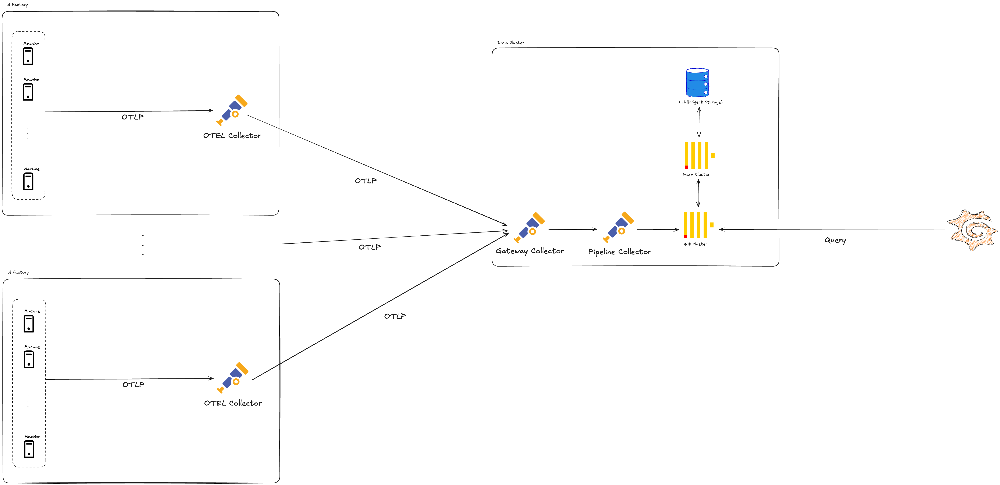

# Week 5 과제: 제조 설비 이벤트 수집 및 이상 탐지 시스템 설계

> 제조 설비에서 지속적으로 발생하는 센서 데이터와 운영 로그를 이벤트 스트림으로 수집하고, 이를 실시간으로 처리해 이상 징후를 탐지하는 시스템을 설계합니다

---

#### ⒈ 문제 이해 및 설계 범위 확정

**시나리오**

반도체 제조 라인에서는 증착 장비, 식각 장비, 검사 장비 등 다양한 설비에서 센서 데이터와 운영 로그가 지속적으로 발생한다.

본 시스템은 공정 장비를 직접 제어하거나 수율 예측 AI 모델을 학습하는 것이 아니라, 제조 설비에서 발생하는 대량의 이벤트를 안정적으로 수집하고, 이상 징후를 빠르게 탐지하며, Dashboard와 알림을 통해 문제를 확인할 수 있도록 돕는 모니터링 시스템이다.

다만, 증착 공정이 아닌 다른 주제로 하고 싶다면 주제 자체는 자유롭게 구체화해도 좋다. (이벤트 수집 및 이상 탐지 시스템이라면)

```text
- 다른 반도체 공정 모니터링
- 자동차 생산 라인 설비 모니터링
- 배터리 제조 공정 품질 모니터링
- 스마트팩토리 에너지 사용량 모니터링
- 물류 자동화 설비 이상 탐지 시스템
```
## 설계 범위 (In / Out of Scope)

---

| 포함 (In Scope) | 제외 (Out of Scope) |
| --- | --- |
| 설비 센서 데이터 수집 | 실제 장비 제어 로직 |
| 이벤트 수집 | PLC/장비 펌웨어 구현 |
| Stream Processing | 반도체 공정 물리 모델 구현 |
| 임계치 기반 이상 탐지 | 정교한 AI 모델 학습 |
| 시계열 데이터 저장 | MES/ERP 전체 구현 |
| Dashboard 조회 구조 | 실제 공정 Recipe 최적화 |
| 알림 시스템 | 완전한 보안 솔루션 |
|    데이터 유실/지연 대응    |     실제 설비 네트워크 구성       |
|        장애 복구 및 재처리            |       공정 장비 직접 제어                  |


## 시스템 구성 전제

---

- 제조 설비와 센서는 이미 존재한다고 가정한다.
- 설비 데이터는 Edge Gateway 또는 Collector를 통해 수집된다고 가정한다.
- 각 공정 장비의 사양은 매우 제한적이며, 첫 설치 이후에는 추가적인 사양의 스케일 업이 불가능하다.
- DB는 ClickHouse를 사용한다.
- Dashboard는 Grafana 또는 별도 Web UI를 사용할 수 있다.
- 알림은 사내 ERP, MES, Slack, Email, SMS, 사내 메신저 등으로 발송 가능하다고 가정한다.
- 본 시스템은 설비를 직접 제어하지 않고, 이상 탐지와 모니터링에 집중한다.

## 기능 요구사항

---

### [수집]

증착 장비 내 Chamber에서 발생하는 온도, 압력, 가스 유량, RF Power 등의 센서 데이터와 설비 운영 로그, Alarm 이벤트를 실시간으로 수집할 수 있어야 한다.

### [식별/연결]

수집된 센서 데이터는 `equipmentId`, `chamberId`, `waferId`, `lotId`, `recipeId`, `timestamp`와 함께 저장되어야 하며, 어떤 장비의 어느 Chamber에서 어떤 Wafer/Recipe 수행 중 발생한 데이터인지 식별할 수 있어야 한다.

### [이상 탐지]

실시간 수집된 데이터는 임계치 기반 조건과 이동 평균, 표준편차 기반의 통계 연산을 통해 이상 징후를 판정하는 데 활용될 수 있어야 한다.

### [저장]

센서 원본 데이터, 집계 데이터, 이상 이벤트는 조회 목적과 보관 기간에 따라 분리 저장할 수 있어야 한다.

예를 들어 최근 고해상도 센서 데이터는 시계열 저장소에 저장하고, 장기 분석용 원본 이벤트는 Object Storage 또는 Data Lake에 저장할 수 있다.

### [UI/출력]

설비 모니터링 Dashboard는 특정 Chamber를 선택했을 때 최근 1시간 동안의 주요 센서 추이 그래프와 발생한 이상 이벤트 목록을 한 화면에 시각화하여 반환할 수 있어야 한다.

### [알림]

이상 이벤트가 발생하면 심각도에 따라 엔지니어 또는 담당자에게 알림을 발송할 수 있어야 하며, 동일 이상이 반복될 경우 중복 알림을 억제할 수 있어야 한다.

### [예외 처리/장애]

센서 수집부나 스트림 처리부에 장애가 발생하거나 데이터가 지연 도착하더라도, Kafka의 offset 또는 스트림 처리 상태 복구 기능을 활용해 과거 시점부터 재처리 및 복구할 수 있어야 한다.

### [성과/연계]

이상 탐지 결과와 사후에 도착하는 Wafer 품질 검사, 즉 Metrology 데이터를 연결하여 해당 설비 이상이 실제 두께 편차, 결함 증가, 수율 저하로 이어졌는지 분석할 수 있는 기반 데이터를 제공할 수 있어야 한다.


## 비기능 요구사항

---

| 항목           | 목표                                         |
|--------------|--------------------------------------------|
| 센서 데이터 수집 지연 | 평균 1초 이내                                   |
| 이상 탐지 지연     | 평균 3초 이내                                   |
| 알림 발송 지연     | 이상 감지 후 5초 이내                              |
| 데이터 유실 허용도 | 중요 이벤트는 유실 최소화                             |
| 센서 데이터 저장 기간  | 고해상도 데이터 7~30일, 집계 데이터 1년 이상               |
| 시스템 가용성    | 설비 운영 시간 동안 지속 동작                          |
| 장애 복구    | Consumer 재시작 후 offset 기반 재처리 또는 스트림 처리 상태 복구 |
| 확장성   | 설비 및 센서 증가에 따라 수평 확장 가능                  | 
| 알림 정확도    | false positive / false negative trade-off 고려 |


## 대략적 규모 추정 *(기준값 — 본인 가정으로 변경 가능)*

---

| 항목               | 수치                  |
|------------------|---------------------|
| 대상 공장            | 반도체 Fab             |
| 대상 장비 수          | 500대                |
| 대상 Chamber 수     | 1,000개              |
| 장비당 센서 수         | 50개                 |
| 센서 데이터 발생 주기     | 1초                  |
| Dashboard 동시 사용자 | 100~500명            |
| 알림 대상 엔지니어       | 50 ~ 200명           |
| 고해상도 원본 데이터 보관   | 7~30일       |
| 집계 데이터 보관        | 1년 이상     |

# 2. 개략적 설계안 제시 및 동의 구하기

---

## 핵심 흐름 (필수)

### 수집

1. 각 장비의 머신에는 OTLP를 통해서 Factory 내에 위치한 Collector에 요청를 보낸다.
2. 각 Factor 내에 Collector는 데이터가 들어오면, 해당 데이터를 Data Cluster의 Gateway Collector로 요청을 보낸다.
3. Gateway Collector에서 데이터를 수신받고, 만약 데이터 전처리(샘플링, 필터링)이 필요한 경우에 파이프라인을 구성한다.

## 개략적 아키텍처 다이어그램 (필수)




# 3. 상세 설계

---

## 설계 대상 컴포넌트 사이의 우선순위 정하기 / 아키텍처 다이어그램 (필수)

### Tier1
- ClickHouse(Hot Tier)
- Machine

### Tier2
- Otel Collector
- Cold Tier Machine
- Object Storage


---

## 3-1. 대규모 설비 이벤트 수집 구조 설계
초당 수만 건 이상의 센서 데이터가 발생하는 상황에서, 설비 이벤트를 어떻게 안정적으로 수집할 것인가?

- Otel Collector의 장비를 스케일 아웃한다.

---

## 3-3. 데이터 저장 계층 설계
센서 원본 데이터, 집계 데이터, 이상 이벤트, 품질 데이터를 어디에 어떻게 저장할 것인가?

- 원본 센서 데이터를 모두 저장할 것인가? => Object Storage에 모두 저장한다.
- 고해상도 원본 데이터는 얼마나 오래 보관할 것인가? => Object Storage의 경우 Minio의 경우 PB단위까지 확장이 가능하므로, 공정 개선에 필요한 모든 데이터는 모두 저장한다.
- 시계열 DB는 무엇을 사용할 것인가? => Clock House
- 장기 분석을 위해 Object Storage 또는 Data Lake를 둘 것인가? => Object Storage

---

## 3-5. 장애 복구 및 재처리 구조
시스템 일부가 장애가 나도 데이터 유실 없이 복구할 수 있는가?

- OTel Collector의 WAL 사용
- 규모 더 커져, Scale Out이 불가능하면 Kafka도입

---

## 3-6. Dashboard 및 모니터링 구조

엔지니어가 실시간으로 설비 상태를 확인할 수 있도록 Dashboard를 어떻게 설계할 것인가?

- 최근 데이터와 과거 데이터 조회 경로를 분리할 것인가? => Clickhouse의 Policy를 통해서 단일 진입점을 통해서 조회한다.

---


# 4. 설계 장점

- 돈을 무제한으로 쓰면, 일정 규모이상은 큰 무리 없이 스케일 아웃이 가능
- 단순함

---

# 5. 설계 단점

- ClickHouse의 중요도가 매우 높음

---

# 6. 마무리

## 개인적 의견 / 사례 공유 / 추가 학습

- ClickHouse 열심히 공부해야되겠다.

## 참고 자료

- https://clickhouse.com/docs/integrations/s3
- https://clickhouse.com/docs/guides/developer/ttl
- https://tech.kakaopay.com/post/pallas-v2-log-platform/
- https://opentelemetry.io/docs/collector/resiliency/