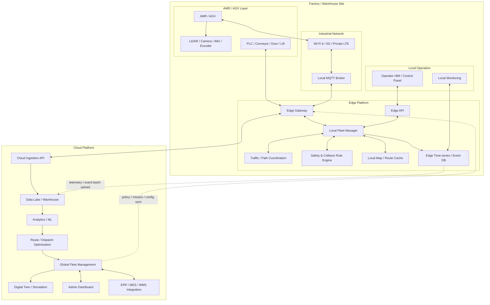
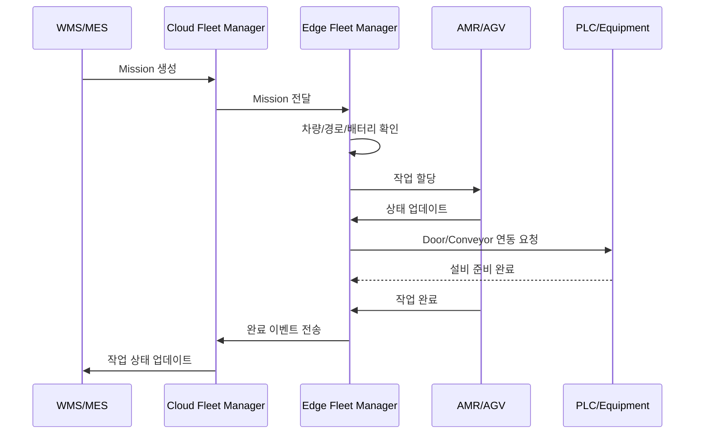

# Week 5 과제: 제조 설비 이벤트 수집 및 이상 탐지 시스템 설계

> 제조 설비에서 지속적으로 발생하는 센서 데이터와 운영 로그를 이벤트 스트림으로 수집하고, 이를 실시간으로 처리해 이상 징후를 탐지하는 시스템을 설계합니다

---

#### ⒈ 문제 이해 및 설계 범위 확정

**시나리오**

물류센터/공장 내부에서 AMR/AGV가 작업을 수행하며, 차량 상태, 위치, 배터리, 충돌/장애 이벤트가 지속적으로 발생한다. 본 시스템은 AMR/AGV를 직접 제어하거나 고도 AI 모델을 학습하는 것이 아니라, 현장 이벤트를 안정적으로 수집하고 실시간 이상 징후를 탐지하여 Dashboard와 알림으로 현장 운영을 돕는 모니터링 시스템이다.

## 설계 범위 (In / Out of Scope)

---

| 포함 (In Scope) | 제외 (Out of Scope) |
| --- | --- |
| AMR/AGV 이벤트/센서 수집 | AMR/AGV 저수준 제어 로직 |
| Edge Gateway 수집 및 버퍼링 | 제조사별 펌웨어 구현 |
| Stream Processing | 고정밀 AI 모델 학습 |
| 임계치/통계 기반 이상 탐지 | 완전한 안전 인증 시스템 |
| 시계열/이벤트 저장 | 전사 MES/ERP 전체 구현 |
| 운영 Dashboard/알림 | 실제 설비 네트워크 구축 |
| 데이터 유실/지연 대응 | 현장 네트워크 하드웨어 설계 |

## 시스템 구성 전제

---

- AMR/AGV, 센서, PLC 등 설비는 이미 존재한다고 가정한다.
- 설비 데이터는 Edge Gateway 또는 Collector를 통해 수집된다.
- Kafka Cluster는 이벤트 수집용 메시지 브로커로 사용 가능하다.
- Stream Processing 엔진은 Kafka Streams, Flink, Spark Streaming 중 하나를 선택할 수 있다.
- 시계열 데이터 저장소는 TimescaleDB, InfluxDB, Prometheus, OpenSearch 등을 사용할 수 있다.
- Dashboard는 Grafana 또는 별도 Web UI를 사용할 수 있다.
- 알림은 사내 메신저, Email, SMS, 협업 툴로 발송 가능하다.
- 설비를 직접 제어하지 않고, 이상 탐지와 모니터링에 집중한다.

## 기능 요구사항

---

### [수집]

AMR/AGV의 위치, 속도, 배터리, 상태, 장애 이벤트와 PLC/설비 연동 이벤트를 실시간으로 수집해야 한다.

### [식별/연결]

수집된 데이터는 `siteId`, `vehicleId`, `missionId`, `timestamp`와 함께 저장되어야 하며, 어떤 차량의 어떤 작업 중 발생한 이벤트인지 식별할 수 있어야 한다.

### [이상 탐지]

실시간 수집된 데이터는 임계치 기반 조건과 이동 평균, 표준편차 기반의 통계 연산을 통해 이상 징후를 판정할 수 있어야 한다.

### [저장]

실시간 이벤트와 장기 분석 데이터를 분리 저장하며, Edge에는 운영 필수 데이터, Cloud에는 이력/분석 데이터를 저장한다.

### [UI/출력]

운영 Dashboard는 특정 Site/Vehicle을 선택했을 때 최근 상태 추이와 이상 이벤트 목록을 한 화면에 제공해야 한다.

### [알림]

이상 이벤트가 발생하면 심각도에 따라 담당자에게 알림을 발송하고, 동일 이상 반복 시 중복 알림을 억제해야 한다.

### [예외 처리/장애]

Edge/Stream 처리 장애 또는 데이터 지연이 발생해도 Kafka offset과 체크포인트를 활용해 재처리할 수 있어야 한다.

### [성과/연계]

작업 완료 이력과 장애 이벤트를 연결해 병목 구간, 장애 빈도, 배터리 패턴을 분석할 수 있는 기반 데이터를 제공해야 한다.

## 비기능 요구사항

---

| 항목           | 목표                                         |
|--------------|--------------------------------------------|
| 센서 데이터 수집 지연 | 평균 1초 이내                                   |
| 이상 탐지 지연     | 평균 3초 이내                                   |
| 알림 발송 지연     | 이상 감지 후 5초 이내                              |
| 데이터 유실 허용도 | 중요 이벤트는 유실 최소화                             |
| 센서 데이터 저장 기간  | 고해상도 데이터 7~30일, 집계 데이터 1년 이상               |
| 시스템 가용성    | 현장 운영 시간 동안 지속 동작                          |
| 장애 복구    | Consumer 재시작 후 offset 기반 재처리 또는 스트림 처리 상태 복구 |
| 확장성   | Site 및 차량 증가에 따라 수평 확장 가능                  |
| 알림 정확도    | false positive / false negative trade-off 고려 |

## 대략적 규모 추정 *(기준값 — 본인 가정으로 변경 가능)*

---

| 항목               | 수치                  |
|------------------|---------------------|
| 대상 Site            | 물류센터 3개             |
| 대상 차량 수          | 300대                |
| 차량당 센서 수         | 20개                 |
| 센서 데이터 발생 주기     | 1초                  |
| 초당 센서 이벤트 수      | 약 6,000 events/sec  |
| 일일 센서 이벤트 수      | 약 5억 건              |
| 이상 이벤트 비율        | 전체 이벤트의 0.01~0.1%   |
| Dashboard 동시 사용자 | 50~200명             |
| 알림 대상 엔지니어       | 30 ~ 100명           |
| 고해상도 원본 데이터 보관   | 7~30일       |
| 집계 데이터 보관        | 1년 이상     |

# 2. 개략적 설계안 제시 및 동의 구하기
---

## 핵심 흐름 (필수)

- 실시간 제어/안전 판단은 Edge에서 수행하고, Cloud는 통합 관제와 분석을 담당한다.
- Edge Gateway가 제조사별 프로토콜을 표준 이벤트 모델로 변환하고, 로컬 버퍼링으로 장애에 대응한다.
- Cloud 장애나 네트워크 단절 시에도 Edge가 작업 큐와 이벤트 버퍼로 현장 운영을 지속한다.
- 데이터 성격에 따라 Edge(실시간 상태/이벤트)와 Cloud(이력/분석) 저장소를 분리한다.

## 개략적 아키텍처 다이어그램 (필수)



# 계층별 역할

## AMR/AGV Device Layer

- 위치 이동, 장애물 감지, 로컬 경로 추종, 배터리/작업 상태 보고
- 비상 정지 등 즉시 안전 제어 수행

## Industrial Network Layer

- AMR/AGV와 Edge 간 실시간 이벤트/명령 전달
- Wi-Fi 6, Private 5G/LTE, MQTT, gRPC 등으로 연결

## Edge Platform Layer

- Edge Gateway: 제조사별 프로토콜 수집, 표준 이벤트 모델 변환, 로컬 버퍼링
- Local Fleet Manager: 작업 할당, 차량 상태 관리, 충전 스케줄
- Traffic/Path Coordination: 교차로 제어, 구역 lock, 병목/데드락 대응
- Safety Rule Engine: 위험 구역/속도 제한, 충돌 방지, 비상 정지 전파
- Local Map/Route Cache: 지도/경로/구역 정보 캐시
- Edge DB: 실시간 상태, 이벤트, 장애 이력 저장

## Cloud Platform Layer

- Cloud Ingestion: 다중 Site 데이터 수집 진입점
- Global Fleet Management: 사이트 통합 관제, 정책/설정 배포
- Optimization/Analytics: 경로/배차 최적화, 병목/패턴 분석
- Digital Twin/Simulation: 시뮬레이션 기반 검증
- ERP/MES/WMS Integration: 상위 시스템과 연동

# 주요 Use Case 및 업무 흐름

대표 Use Case는 WMS/MES에서 생성된 물류 이송 작업을 AMR/AGV가 수행하고, 그 결과가 Cloud와 상위 시스템에 반영되는 흐름이다.

```text
1. WMS/MES에서 이송 작업 생성
2. Cloud Fleet Manager가 작업을 Mission 단위로 변환
3. Cloud가 해당 Site의 Edge로 Mission 전달
4. Edge Fleet Manager가 사용 가능한 AMR/AGV 조회
5. 차량 위치, 배터리, 적재 가능 여부, 경로 혼잡도를 기준으로 차량 선택
6. Traffic Coordinator가 경로와 구역 점유 상태 확인
7. Edge가 AMR/AGV에 작업 할당
8. AMR/AGV가 적재 지점으로 이동
9. Edge가 PLC, Door, Conveyor, Lift 등 외부 설비와 연동
10. AMR/AGV가 목적지로 이동
11. 작업 완료 후 Edge가 Mission 상태 업데이트
12. Cloud와 WMS/MES에 작업 완료 이벤트 반영
```

# 전체 데이터 흐름

## 작업 지시 흐름



## 실시간 상태 흐름

```text
AMR / AGV
  -> Edge Gateway
  -> Local Fleet Manager
  -> HMI / Local Monitoring
```

## 분석 데이터 흐름

```text
AMR / AGV
  -> Edge DB
  -> Cloud Ingestion
  -> Data Lake
  -> Analytics / ML
  -> Optimization
```

# 책임 분리

| 구분         | Edge          | Cloud         |
| ---------- | ------------- | ------------- |
| 실시간 차량 제어  | 담당            | 비권장           |
| 충돌 방지      | 담당            | 비권장           |
| 교차로 제어     | 담당            | 비권장           |
| 장애물 대응     | Device / Edge | 비권장           |
| 작업 할당      | 현장 단위 담당      | 전체 정책 담당      |
| 경로 최적화     | 단기 / 실시간      | 장기 / 분석 기반    |
| 지도 사용      | 로컬 캐시         | 원본 관리         |
| 데이터 저장     | 단기 저장         | 장기 저장         |
| 장애 대응      | 현장 즉시 대응      | 분석 / 리포트      |
| MES/WMS 연동 | 일부 가능         | 주 담당          |
| 대시보드       | 현장 운영 화면      | 통합 관제 화면      |
| ML/분석      | 경량 추론 가능      | 학습 / 분석 / 최적화 |

# 3. 상세 설계

---

## 설계 대상 컴포넌트 사이의 우선순위 정하기 / 아키텍처 다이어그램 (필수)

- 1순위: AMR/AGV 자체 안전 제어
- 2순위: Edge Safety Rule Engine
- 3순위: 현장 Operator HMI
- 4순위: Cloud 정책/분석/최적화

> 아래 질문은 선택이며 본인이 중요하다고 생각하는 1~2개를 깊게 다루는 것을 권장
>

---

## 3-1. 대규모 설비 이벤트 수집 구조 설계
초당 수만 건 이상의 센서 데이터가 발생하는 상황에서, 설비 이벤트를 어떻게 안정적으로 수집할 것인가?

- Edge Gateway / Collector는 어떤 역할을 담당하는가?
- 설비에서 Kafka까지 데이터가 들어오는 경로는 어떻게 구성할 것인가?
- 특정 장비나 Chamber에 트래픽이 몰릴 경우 어떻게 대응할 것인가?
- 데이터 유실 최소화와 낮은 지연 시간 사이에서 무엇을 우선할 것인가?

Edge Gateway는 제조사별 프로토콜을 수집해 내부 표준 이벤트 모델로 변환하고, 네트워크 단절 시 로컬 버퍼링을 수행한다. 설비 -> Edge Gateway -> 로컬 브로커(MQTT/Kafka Edge) -> 스트림 처리 -> Cloud Ingestion 순으로 구성한다. 안전 이벤트는 유실 최소화를 우선하고, 일반 센서 이벤트는 샘플링/집계를 적용한다.

---

## 3-2. 실시간 스트림 처리 및 이상 탐지 파이프라인
Kafka에 들어온 설비 이벤트를 어떻게 실시간으로 처리하고 이상 징후를 탐지할 것인가?

- Kafka Stream, Flink, Spark Streaming 중 무엇을 선택할 것인가?
- 이벤트 시간 (Event Time)과 처리 시간(Processing Time)을 어떻게 구분할 것인가?
- 장비에서 늦게 도착하는 이벤트는 어떻게 처리할 것인가?
- 이상 탐지 결과는 어디로 발행할 것인가?
- Stream Processor 장애 시 상태를 어떻게 복구할 것인가?

Edge에서 1차 임계치/룰 기반 탐지를 수행하고, Cloud에서는 이동 평균, 표준편차, 장기 패턴 기반 분석을 수행한다. Event Time 기준 워터마크를 적용해 지연 이벤트를 처리하며, 결과는 알림 토픽과 Dashboard API로 발행한다. 프로세서는 체크포인트와 Kafka offset을 기반으로 복구한다.

---

## 3-3. 데이터 저장 계층 설계
센서 원본 데이터, 집계 데이터, 이상 이벤트, 품질 데이터를 어디에 어떻게 저장할 것인가?

- 원본 센서 데이터를 모두 저장할 것인가?
- 고해상도 원본 데이터는 얼마나 오래 보관할 것인가?
- 시계열 DB는 무엇을 사용할 것인가?
    - InfluxDB
    - TimescaleDB
    - Prometheus
    - Opensearch
- 장기 분석을 위해 Object Storage 또는 Data Lake를 둘 것인가?
- Dashboard 조회용 데이터와 배치 분석용 데이터를 분리할 것인가?

실시간 상태/이벤트는 Edge Time-series DB에 저장하고, 장기 분석용 원본/집계 데이터는 Cloud Data Lake로 적재한다. 고해상도 원본은 7~30일, 집계 데이터는 1년 이상 보관한다. Dashboard 조회는 최근 데이터(Edge/Hot Storage)를 우선한다.

---

## 3-4. 알림 정확도와 중복 알림 제어

이상 이벤트가 발생했을 때 엔지니어에게 어떻게 정확하고 피로도 낮게 알릴 것인가?

- 한 번 임계치를 초과하면 바로 알림을 보낼 것인가, 연속 N회 이상 초과해야 알림을 보낼 것인가?
- 이상이 정상으로 회복되면 recovery 알림을 보낼 것인가?
- 알림 정확도와 알림 지연 사이의 trade-off는 무엇인가?

임계치 초과가 연속 N회 이상 발생했을 때 알림을 보내고, 회복 시에는 recovery 알림을 옵션으로 제공한다. 동일 장비/센서의 반복 알림은 시간 윈도우 기준으로 중복 억제하며, 심각도별 채널을 분리한다.

---

## 3-5. 장애 복구 및 재처리 구조
시스템 일부가 장애가 나도 데이터 유실 없이 복구할 수 있는가?

- Kafka Consumer 장애 시 offset 처리는 어떻게 할 것인가?
- Schema 오류, 필수 필드 누락, 파싱 실패 이벤트는 어떻게 처리할 것인가?
- 데이터 유실 방지와 중복 처리 허용 중 무엇을 우선할 것인가?
- 장애 발생 시 Dashboard와 Alert는 어떤 상태를 보여줄 것인가?

Consumer 장애 시 offset 기반 재처리로 복구하며, 스키마 오류나 필드 누락은 DLQ로 분리해 재처리한다. 장애 중에는 Dashboard에 지연 상태를 표시하고, 복구 후 반영 시점을 함께 표기한다.

---

## 3-6. Dashboard 및 모니터링 구조

엔지니어가 실시간으로 설비 상태를 확인할 수 있도록 Dashboard를 어떻게 설계할 것인가?

- 이상 이벤트와 센서 그래프를 어떻게 함께 보여줄 것인가?
- 품질 지표와 공정 조건을 어떻게 연결해 보여줄 것인가?
- Dashboard 조회 부하를 어떻게 줄일 것인가?
- 최근 데이터와 과거 데이터 조회 경로를 분리할 것인가?

Site/Vehicle별 최근 1시간 센서 그래프와 이상 이벤트 목록을 한 화면에 제공한다. 최근 데이터는 Edge/Hot Storage에서 빠르게 조회하고, 과거 데이터는 Data Lake 기반 배치 조회로 분리한다.

---

## 3-7. 공정 데이터와 품질 데이터의 지연 처리

센서 이상이 실제 품질 저하와 연결되는지 어떻게 분석할 것인가?

- 품질 데이터는 센서 데이터보다 늦게 도착할 수 있는데 어떻게 처리할 것인가?
- 실시간 이상 탐지와 사후 품질 분석을 분리할 것인가?
- 품질 측정 결과가 늦게 도착했을 때 기존 이상 이벤트와 어떻게 연결할 것인가?
- 수율 저하 원인을 분석하기 위해 원본 센서 데이터를 얼마나 보관해야 하는가?
- 실시간 알림 시스템과 배치 분석 시스템을 어떻게 분리할 것인가?

품질 데이터는 늦게 도착하므로 Cloud에서 비동기 조인으로 이상 이벤트와 연결한다. 실시간 알림은 Edge/Stream 계층에서 처리하고, 품질 상관 분석은 배치 분석으로 분리한다.

---

## 3-8. 데이터 유실, 처리 지연, 저장 비용 Trade-off

제조 설비 데이터 파이프라인에서 가장 중요한 trade-off를 어떻게 판단할 것인가?

- 모든 센서 데이터를 원본 그대로 저장할 것인가?
- 알람 이벤트와 센서 원본 이벤트의 중요도를 다루게 둘 것인가?
- 지연을 줄이기 위해 batch size를 줄이면 어떤 문제가 생기는가?
- 실시간 이상 탐지와 사후 수율 분석은 저장 정책을 다르게 가져갈 것인가?

중요 이벤트는 유실 최소화를 우선하고, 일반 센서 데이터는 집계/샘플링으로 비용을 제어한다. 우선순위 기반 큐와 동적 배치 크기로 처리량과 지연을 균형화한다.

---

## 3-9. 상태 모델 설계

Mission 상태 모델과 Vehicle 상태 모델을 분리해, 작업 진행 단계와 차량 운영 상태를 독립적으로 관리한다.

### Mission 상태 모델

```text
CREATED
  -> ASSIGNED
  -> MOVING_TO_PICKUP
  -> PICKING
  -> MOVING_TO_DROPOFF
  -> DROPPING
  -> COMPLETED
```

예외 상태: `PAUSED`, `FAILED`, `CANCELLED`, `REASSIGNED`, `WAITING_FOR_TRAFFIC_CLEARANCE`, `WAITING_FOR_DOOR_OPEN`, `LOW_BATTERY`

### Vehicle 상태 모델

```text
IDLE
ASSIGNED
MOVING
WAITING
CHARGING
ERROR
MAINTENANCE
OFFLINE
EMERGENCY_STOP
```

### Mission/Vehicle 상태 분리 효과

- Mission 진행 상태와 차량 상태를 분리해 장애 원인과 처리 방향을 명확히 구분한다.
- Mission 이력과 Vehicle 이력을 분리 저장해 운영 분석 정확도를 높인다.
- Edge는 실시간 상태 기반 제어, Cloud는 장기 분석과 정책 최적화를 담당한다.

---

# 4. 설계 장점

- 실시간 제어와 안전 판단을 Edge에 두어 지연/단절 상황에서도 현장 안전성을 유지한다.
- Offline-first 구조로 Cloud 장애 시에도 작업과 이벤트 수집을 지속할 수 있다.
- 표준 이벤트 모델로 제조사/장비 종속성을 낮춘다.
- 데이터 성격에 맞춘 저장 분리로 비용과 성능을 균형화한다.

---

# 5. 설계 단점

- Edge 인프라 운영 비용과 관리 복잡도가 증가한다.
- Edge/Cloud 이중 파이프라인으로 데이터 중복과 동기화 부담이 생긴다.
- 안전/제어 로직이 Edge에 집중되어 업데이트와 검증 부담이 크다.

---

# 6. 마무리

## 개인적 의견 / 사례 공유 / 추가 학습

- Edge-Cloud 분리 구조는 실시간성과 안정성을 동시에 만족시키는 현실적인 선택이다.
- Mission/Vehicle 상태 모델을 분리해 운영 가시성과 장애 대응력을 높일 수 있다.