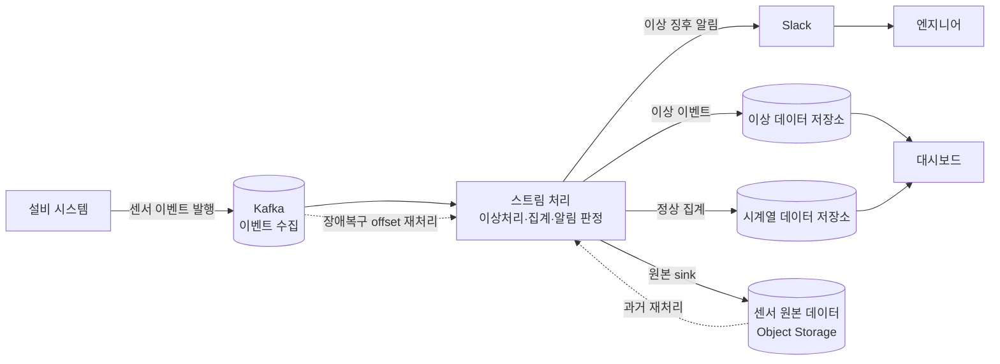
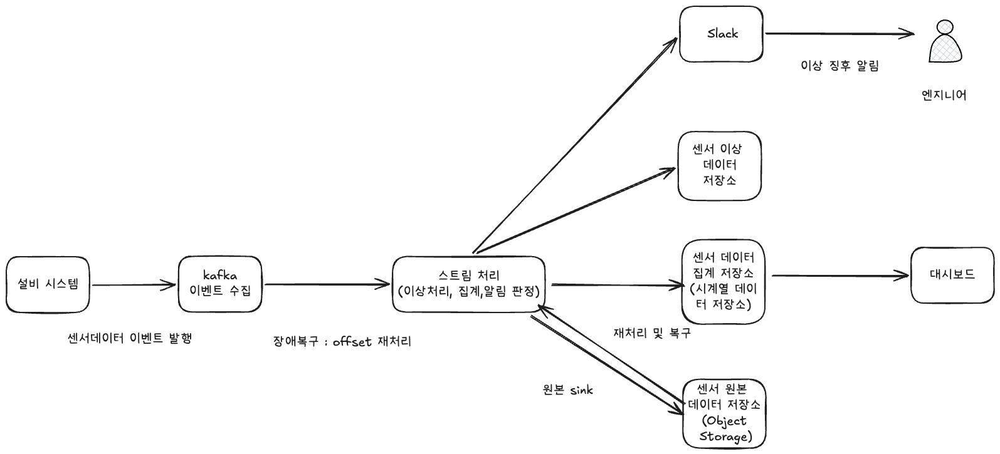
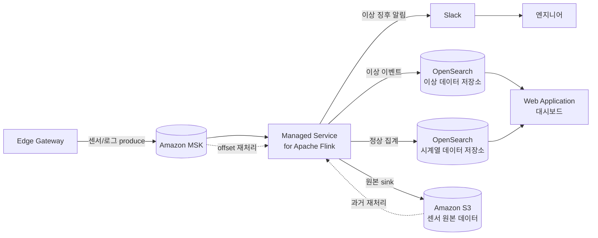
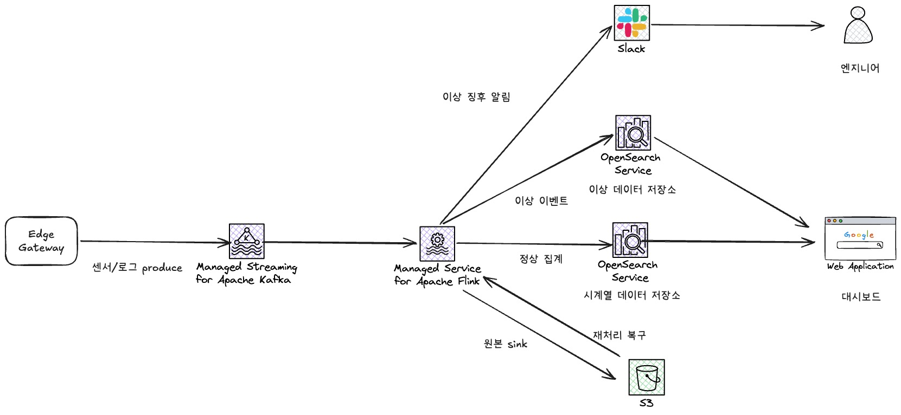
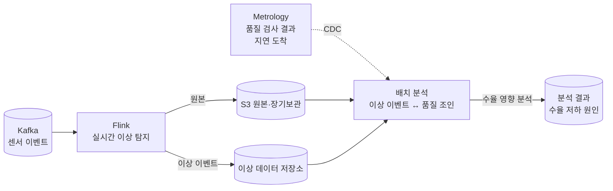

# Week4 과제: 제조 설비 이벤트 수집 및 이상 탐지 시스템 설계

> 반도체 증착 공정 설비에서 발생하는 센서 데이터·운영 로그를 이벤트 스트림으로 수집하고, 실시간으로 처리해 이상 징후를 탐지하는 모니터링 시스템 설계

---

## 1. 문제 이해 및 설계 범위

반도체 Fab의 증착 장비는 Chamber 온도·압력·가스 유량·RF Power 등의 조건이 안정적으로 유지되어야 하며, 이 조건이 흔들리면 박막 두께·균일도에 영향을 주어 결함 증가·수율 저하로 이어질 수 있다. 본 시스템은 공정을 직접 제어하거나 수율 예측 AI를 학습하는 것이 아니라, 설비에서 발생하는 대량 이벤트를 안정적으로 수집하고 이상 징후를 빠르게 탐지하여 Dashboard·알림으로 문제를 확인하도록 돕는 **모니터링 시스템**이다.

### 규모 전제

| 항목 | 수치 |
| --- | --- |
| 대상 장비 / Chamber | 500대 / 1,000개 |
| 장비당 센서 수 | 50개 |
| 초당 센서 이벤트 | 약 50,000 events/sec |
| 일일 센서 이벤트 | 약 43억 건 |
| 이상 이벤트 비율 | 전체의 0.01~0.1% |

### 핵심 비기능 요구사항

| 항목 | 목표 |
| --- | --- |
| 센서 수집 지연 | 평균 1초 이내 |
| 이상 탐지 지연 | 평균 3초 이내 |
| 알림 발송 지연 | 이상 감지 후 5초 이내 |
| 데이터 유실 | 중요 이벤트 유실 최소화 |
| 장애 복구 | Consumer 재시작 후 offset 기반 재처리 |
| 확장성 | 설비·센서 증가에 따라 수평 확장 |

---

## 2. 개략적 설계안

### 핵심 흐름

1. **수집** — 설비 센서/로그가 Edge Gateway에서 버퍼링·배치·ID 태깅(`equipmentId/chamberId/waferId/lotId/recipeId/timestamp`)을 거쳐 Kafka로 발행된다.
2. **버퍼** — Kafka가 수집부와 처리부를 분리한다. 처리부가 죽어도 데이터는 토픽에 남아있어, offset 기반 재처리로 무손실 복구가 가능하다.
3. **스트림 처리(Flink)** — 흐르는 이벤트를 즉시 처리한다. 임계치 + 이동평균/표준편차로 이상을 판정하고, event-time 윈도우 + watermark로 늦게 온 이벤트를 보정하며, 연속 N회·dedup·recovery 등 알림 판정도 여기서 수행한다.
4. **분기** — 처리 결과를 용도별로 나눈다.
   - 이상 이벤트 → 이상 데이터 저장소(OpenSearch, 빠른 조회)
   - 정상 집계 → 시계열 데이터 저장소(OpenSearch)
   - 센서 원본 → Object Storage(장기보관·재처리용)
   - 이상 징후 알림 → Slack → 엔지니어
5. **조회** — 대시보드가 시계열 저장소(센서 추이)와 이상 저장소(이상 이벤트 목록)에서 데이터를 꺼내 한 화면에 시각화한다.
6. **복구** — 최근 장애는 Kafka offset 되감기로, 오래된 구간은 Object Storage 원본 재집계로 재처리한다.

### 개략적 아키텍처 다이어그램

### 상세 아키텍처 (AWS 매니지드 구체화)

위 개략 구조를 AWS 매니지드 서비스로 1:1 매핑한다.

| 개략 컴포넌트 | 상세 (AWS) |
| --- | --- |
| Edge Gateway | 현장 수집 게이트웨이 |
| Kafka | Amazon MSK (Managed Streaming for Apache Kafka) |
| 스트림 처리 | Amazon Managed Service for Apache Flink |
| 이상 / 시계열 데이터 저장소 | Amazon OpenSearch Service |
| 센서 원본 데이터 | Amazon S3 (Object Storage) |
| 대시보드 | Web Application |
| 알림 | Slack |

   
---

## 3. 상세 설계 — 실시간 스트림 처리 및 이상 탐지 파이프라인 (3-2)

### 왜 Flink인가 (vs Kafka Streams vs Spark)

| 도구 | 처리 방식 | 특징 |
| --- | --- | --- |
| Kafka Streams | 스트림 (라이브러리) | 운영 단순, 단 Kafka 종속 + 복잡한 시간·상태 처리 한계 |
| Spark Streaming | micro-batch | 처리량 좋으나 묶음 간격만큼 지연 발생 |
| **Flink** | **true streaming** | **낮은 지연 + event-time/watermark + 상태 관리가 기본 설계** |

본 시스템은 "탐지 3초 / 알림 5초"의 빡빡한 지연, 이동평균·표준편차라는 상태 기반 연산, 늦게 도착하는 이벤트 처리가 모두 필요하다. 셋 다 Flink의 본업이므로 Flink를 선택한다.

### 이상 판정 방식 — 임계치 + 통계

Flink는 흐르는 센서값을 두 가지 방식으로 동시에 검사한다.

**① 임계치(threshold) 기반** — 고정된 기준선을 넘었는지만 본다 (예: "압력 > 3.5면 이상"). 단순·빠르지만, 정상 변동인데 선만 넘어도 알림이 울리거나, 선 안에서 비정상적으로 출렁이는 건 못 잡는 한계가 있다.

**② 통계(이동평균/표준편차) 기반** — 평소 대비 얼마나 벗어났는지를 본다.
- **이동평균(moving average)** — 최근 N분간의 평균값. 시간이 흐르며 계속 갱신된다.
- **표준편차(σ)** — 평소 값들이 평균에서 흩어진 정도(변동 폭).
- 판정 예: "현재 값이 최근 평균에서 **3σ 이상** 벗어나면 이상."

임계치가 "절대 한계 초과"를 잡는다면, 통계 기반은 "평소 패턴 대비 갑자기 튀는 이상"을 잡는다. 둘을 함께 써서 명백한 한계 초과와 미묘한 이상 패턴을 모두 커버한다.

### 알림 판정 — 연속 N회 · dedup · recovery

이상을 찾았다고 바로 알림을 보내면 알림 폭탄이 되므로, 발송 전 세 가지 규칙으로 한 번 더 거른다. 이 판정들은 "지금 몇 회 연속인지 / 이미 알림을 보냈는지 / 아직 이상 중인지" 같은 **상태를 들고 있어야** 가능해, 상태 관리에 강한 Flink가 인라인으로 처리하기에 적합하다.

- **연속 N회** — 순간적 노이즈를 거르기 위해, 1회 초과가 아닌 연속 N회(예: 3회) 초과 시에만 알림.
- **dedup (중복 억제)** — 같은 이상이 지속되는 동안 매번 보내지 않고, 처음 한 번 + 일정 시간 억제.
- **recovery (복구 알림)** — 이상이 정상으로 회복되면 "해결됨" 알림을 1회 발송.

이 세 규칙이 [알림] 요구사항의 "중복 알림 억제"를 구현한다.

### Event Time vs Processing Time

- **Event Time** — 센서에서 데이터가 실제 발생한 시각 (`timestamp` 필드)
- **Processing Time** — Flink가 데이터를 처리하는 시각

센서 → Edge 버퍼링 → 네트워크 → Kafka를 거치며 도착이 밀리므로, 집계·이상 탐지 윈도우는 **event time 기준**이어야 통계가 정확하다.

### 늦게 온 이벤트 — Watermark

event time 기준 윈도우를 닫으려면 "이 윈도우 데이터가 다 왔는지" 판단이 필요하다. 이를 위해 **워터마크**(예: 최대 지연 30초 여유를 둔 기준선)를 긋는다.

- 워터마크 마감 전 도착 → 윈도우에 포함
- 마감 직후 (allowed lateness 내) → 윈도우 결과 재집계
- 그보다 더 늦으면 → side output(별도 스트림)으로 분리해 사후 분석

워터마크 여유가 길면 정확도↑ 지연↑, 짧으면 그 반대. 이 trade-off가 false positive/negative 균형과 직결된다.

### 장애 복구 — Checkpoint + Offset

Flink는 이동평균 등 상태를 메모리에 들고 처리한다. 장애 대비를 위해 주기적으로(예: 30초마다) 상태 전체를 스냅샷으로 외부 저장소(S3)에 저장하는 **checkpoint**를 수행한다. 장애 시:

1. 마지막 checkpoint에서 상태 복원
2. Kafka offset을 그 시점으로 되감아 재개

상태 + offset이 한 세트로 복원되어 **exactly-once에 근접**한 무손실 복구가 가능하다.

---

## 3-3. 데이터 저장 계층 설계

센서 원본·집계·이상 이벤트·품질 데이터는 **조회 패턴과 보관 기간이 서로 달라**, 하나의 저장소에 모두 담지 않고 용도별로 분리한다.

### 데이터 종류별 저장 전략

| 데이터 | 저장소 | 보관 기간 | 이유 |
| --- | --- | --- | --- |
| 센서 원본 (고해상도) | OpenSearch (시계열) | 7~30일 | 최근 추이 그래프 조회용, 빠른 검색 필요 |
| 센서 원본 (장기) | Object Storage (S3) | 1년 이상 | 사후 수율 분석·재처리용, 싸게 무한 적재 |
| 집계 데이터 | OpenSearch (시계열) | 1년 이상 | 다운샘플링된 통계, 대시보드 장기 추이 |
| 이상 이벤트 | OpenSearch (이상 저장소) | 1년 이상 | 대시보드·알림이 즉시 조회, 건수 적음 |

### 원본 데이터를 모두 저장할 것인가

초당 5만 건·일 43억 건의 고해상도 원본을 비싼 검색 저장소(OpenSearch)에 계속 두는 것은 비용상 불가능하다. 따라서 **이중 적재** 전략을 쓴다.

- **최근 7~30일** 고해상도 원본 → OpenSearch (빠른 조회)
- **전체 원본** → S3에 상시 적재 (장기보관 + 재처리 소스)

OpenSearch는 보관 기간이 지나면 자동 삭제(ILM 정책)하고, 과거 데이터가 필요하면 S3에서 다시 읽어 재집계한다.

### 시계열 저장소 선택 — 왜 OpenSearch인가

| 후보 | 특징 | 본 설계 적합성 |
| --- | --- | --- |
| InfluxDB | 시계열 특화, 쓰기 성능 우수 | 텍스트 검색·로그 결합 약함 |
| TimescaleDB | PostgreSQL 기반, SQL 친숙 | 초당 5만 건 대규모 스케일아웃 부담 |
| Prometheus | 메트릭 모니터링 표준 | pull 방식·단기 보관 중심, 대량 이벤트 부적합 |
| **OpenSearch** | **시계열 + 전문 검색 + 로그 통합** | **센서값·운영 로그·이상 이벤트를 한 저장소에서 검색·시각화** |

본 시스템은 **센서 수치뿐 아니라 운영 로그·Alarm 이벤트**도 함께 다루고, 대시보드에서 "특정 Chamber의 추이 + 이상 목록"을 한 화면에 조회해야 한다. 수치 시계열과 텍스트 로그 검색을 한 저장소에서 처리할 수 있는 OpenSearch가 이 요구에 가장 잘 맞는다. (또한 AWS OpenSearch Service로 운영 부담을 줄일 수 있다.)

### 조회용 vs 분석용 분리

- **조회용(실시간)** — 대시보드는 OpenSearch만 본다. 최근 데이터라 응답이 빠르다.
- **분석용(배치)** — 수율 분석·재집계는 S3 원본을 배치로 읽는다. 대량 스캔이 실시간 조회 부하에 영향을 주지 않도록 경로를 분리한다.

---

## 3-7. 공정 데이터와 품질 데이터의 지연 처리

센서 이상이 **실제 수율 저하로 이어졌는지** 분석하려면 Wafer 품질 검사(Metrology) 데이터와 연결해야 한다. 그런데 품질 데이터는 센서 이상보다 **한참 늦게**(수십 분~수 시간 뒤, 별도 검사 장비에서) 도착한다는 근본적 시차가 있다.

### 핵심 문제 — 두 데이터의 시간 축이 다르다

- 센서 이상: 실시간 (탐지 3초)
- 품질 결과: 사후 (검사 공정을 거친 뒤)

이 둘을 같은 실시간 파이프라인에서 조인하려 하면, 품질 데이터를 기다리느라 실시간성이 무너진다. 그래서 **실시간 경로와 사후 분석 경로를 분리**한다 (람다 아키텍처 형태).

### 늦게 온 품질 데이터를 기존 이상 이벤트와 어떻게 연결하나

연결 고리는 **공통 식별자**다. 센서 이벤트에 태깅해둔 `waferId / lotId / equipmentId / chamberId / recipeId`를 품질 데이터도 들고 있으므로, 배치에서 이 키로 조인한다.

> "Wafer #A123이 통과한 3번 Chamber에서 그 시각 압력 이상이 있었다 + 같은 Wafer의 두께 편차가 기준 초과 → 해당 이상이 수율 저하로 이어졌을 가능성"

### 품질 데이터는 어떻게 수집하나 (CDC)

센서는 DB를 거치지 않는 스트림 소스라 CDC가 불필요하지만, **Metrology 품질 결과는 검사 시스템 DB(MES 등)에 저장**되는 경우가 많다. 이때는 그 DB의 변경분을 **CDC(Change Data Capture)**로 캡처해 배치/스트림으로 끌어오는 방식이 적합하다. 즉 실시간 센서 경로(직수집)와 품질 데이터 경로(CDC)는 출처 성격이 달라 수집 방식도 다르게 가져간다.

### 원본 센서 데이터 보관 기간

수율 저하 원인 분석은 품질 결과가 나온 **뒤에** 시작되므로, 그 시점에도 원본 센서 데이터가 남아있어야 한다. 품질 검사 주기와 분석 리드타임을 고려해, 고해상도 원본은 S3에 **1년 이상** 보관한다 (OpenSearch의 7~30일과 별개).

### 실시간 알림 vs 배치 분석 분리

- **실시간 알림 시스템** — "지금 이상이 났다"를 빠르게 알림 (탐지 3초 / 알림 5초). 품질 결과를 기다리지 않는다.
- **배치 분석 시스템** — "그 이상이 실제 불량으로 이어졌나"를 사후에 분석. 늦어도 되지만 정확해야 한다.

두 시스템은 목적·지연 요구·저장 정책이 다르므로 물리적으로 분리하고, S3 원본을 공통 소스로 공유한다.

---

## 4. 설계 장점

- **수집·처리 분리 (Kafka 버퍼)** — 처리부가 죽어도 데이터가 토픽에 남아 offset 재처리로 무손실 복구. 특정 장비 트래픽 폭증도 Kafka가 완충해 backpressure 흡수.
- **실시간성** — Flink의 true streaming으로 micro-batch 대비 지연이 낮아 "탐지 3초 / 알림 5초" 충족.
- **정확한 시간 처리** — event-time + watermark로 늦게 도착하는 이벤트도 발생 시각 기준으로 정확히 집계. 너무 늦은 건 side output으로 유실 없이 보관.
- **무손실 장애 복구** — checkpoint + Kafka offset이 한 세트로 묶여 exactly-once에 근접. 재시작 후 멈춘 지점부터 재개.
- **용도별 저장 분리** — 빠른 조회(OpenSearch)와 싼 장기보관(Object Storage)을 나눠 비용·성능 균형.
- **수평 확장** — 설비·센서 증가 시 Kafka 파티션과 Flink 병렬도를 늘려 대응.

## 5. 설계 단점

- **운영 복잡도** — 컴포넌트가 많아 모니터링·장애 대응 부담. (매니지드 서비스로 일부 완화)
- **지연 vs 정확도 trade-off** — watermark 여유 길이에 따라 늦은 이벤트 포착과 알림 지연이 상충. 임계치 튜닝 난이도 존재.
- **at-least-once 시 중복 가능** — 유실 최소화 우선 시 복구 과정에서 중복 처리가 생겨 다운스트림 dedup 필요.
- **상태 관리 비용** — 장비·센서가 늘수록 Flink state 크기와 checkpoint 비용 증가.
- **알림 정확도 한계** — 임계치 기반은 false positive/negative를 완전히 없앨 수 없어 연속 N회·통계 보정으로 줄이는 수준.

---

## 6. 마무리

### 학습하며 정리한 핵심 개념

- **Edge Gateway vs Collector** — Collector는 데이터를 *수집하는 기능* 자체, Edge Gateway는 그 기능이 도는 *현장 끝단(설비 옆) 장비*. Fab은 설비가 현장에 깔려 있어 Edge Gateway 표현이 적합. 둘 다 "1차 수집 후 Kafka 전송" 계층.

- **Kafka는 통로지 처리기가 아니다** — Kafka는 데이터를 가공하지 않고 버퍼링·전달만 한다. 이상 탐지·집계 같은 *판단*은 스트림 처리 엔진(Flink)의 몫.

- **Stream vs Batch** — 배치는 쌓아두고 한꺼번에, 스트림은 흐르는 중에 즉시 처리. "탐지 3초" 요구사항 때문에 스트림이 필수.

- **Flink 선택 이유** — 낮은 지연 + event-time/watermark + 상태 관리가 모두 기본 설계에 박혀 있어, micro-batch인 Spark나 Kafka 종속적인 Kafka Streams보다 적합.

- **Event Time vs Processing Time** — 발생 시각 기준으로 집계해야 도착 지연이 있어도 통계가 정확. watermark로 윈도우를 마감하고, 늦은 이벤트는 allowed lateness 내면 재집계, 그 이상이면 side output으로 분리.

- **OpenSearch Alerting의 한계** — OpenSearch에도 알림 기능(Alerting)은 있으나 폴링 방식이라 "5초 이내"에 빠듯하고 dedup/recovery 같은 상태 로직이 약하다. 따라서 *알림 판정은 Flink 인라인*, *OpenSearch는 저장·조회 전담*으로 역할을 분리.

- **이상 데이터 저장소 vs Object Storage** — 이상 데이터는 대시보드·알림이 즉시 꺼내 쓰는 *빠른 조회* 대상이라 OpenSearch, 센서 원본은 무한히 싸게 쌓는 *장기보관/재처리* 대상이라 Object Storage. 둘을 바꾸면 조회 성능과 비용 모두 손해.

- **offset 기반 장애 복구** — Kafka 데이터마다 붙은 순번이 offset. Flink가 "여기까지 처리했다"를 커밋해두면, 죽었다 살아나도 그 지점부터 다시 읽어 무손실 복구. checkpoint와 offset이 함께 복원되어 exactly-once에 근접.

- **CDC를 안 쓴 이유** — CDC(Change Data Capture)는 *DB에 저장된 데이터의 변경*을 잡아내는 기술이다. 본 시스템의 센서는 DB를 거치지 않고 이벤트를 직접 발생시키는 스트림 소스라 CDC가 필요 없다. 다만 검사 시스템 DB에 저장되는 *Metrology 품질 데이터*를 연계할 때(3-7)는 CDC가 적합하다 — 출처가 스트림이냐 DB냐에 따라 수집 방식이 갈린다.

### 개인적 의견
처음 설계를 시작할 때는 데이터를 일단 DB에 쌓아두고, 그 DB를 조회해서 이상한 값을 찾으면 되는 줄 알았다. Kafka로 센서 데이터를 받아서 저장소에 넣고, 거기서 "압력이 높은 것들"을 검색하면 끝이라고 생각했다.
그런데 요구사항을 다시 보니 **"이상 탐지 3초 이내"**가 있었다. 데이터를 저장한 다음에 조회해서 찾는 방식은, 저장하고 → 다시 읽고 → 판정하는 단계를 거치니까 이 속도를 맞추기 어려웠다. 한참 쌓인 데이터를 나중에 뒤지는 구조라 "실시간"이라고 보기도 어렵다.
결국 Kafka 혼자서는 안 되는 일이었다. Kafka는 데이터가 지나가는 통로일 뿐이라 "압력이 평소보다 튀었나?" 같은 판단은 못 한다. 그래서 흐르는 데이터를 저장하기 전에, 그 자리에서 바로 계산하고 이상을 잡아내는 Flink(스트림 처리)가 따로 필요했다. Kafka가 컨베이어 벨트라면, Flink는 그 옆에서 지나가는 데이터를 보고 이상을 판정하는 역할이라는 비유가 이해에 도움이 됐다.
또 저장과 조회는 다른 문제라는 것도 배웠다. 처음엔 데이터를 어디든 저장만 하면 대시보드에서 꺼내 보면 되는 줄 알았는데, "최근 1시간 추이를 빠르게 보여줘야 한다"는 요구를 맞추려면 그냥 쌓아두는 게 아니라 **빠르게 검색되는 저장소(OpenSearch)**가 필요했다. 반대로 오래된 원본은 굳이 비싼 검색 저장소에 둘 필요 없이 싼 곳(S3)에 보관하면 됐다. 데이터마다 쓰임새가 달라서 저장소도 나눠야 한다는 걸 처음 알았다.
정리하면, "Kafka 하나"가 아니라 "수집(Kafka) - 처리(Flink) - 저장(OpenSearch/S3)"가 각자 역할이 있고, 이걸 나눠야 시스템이 제대로 돌아간다는 걸 이번에 제대로 이해했다. 각 단계가 왜 따로 있어야 하는지 흐름으로 알게 된 게 가장 크게 배운점이다.