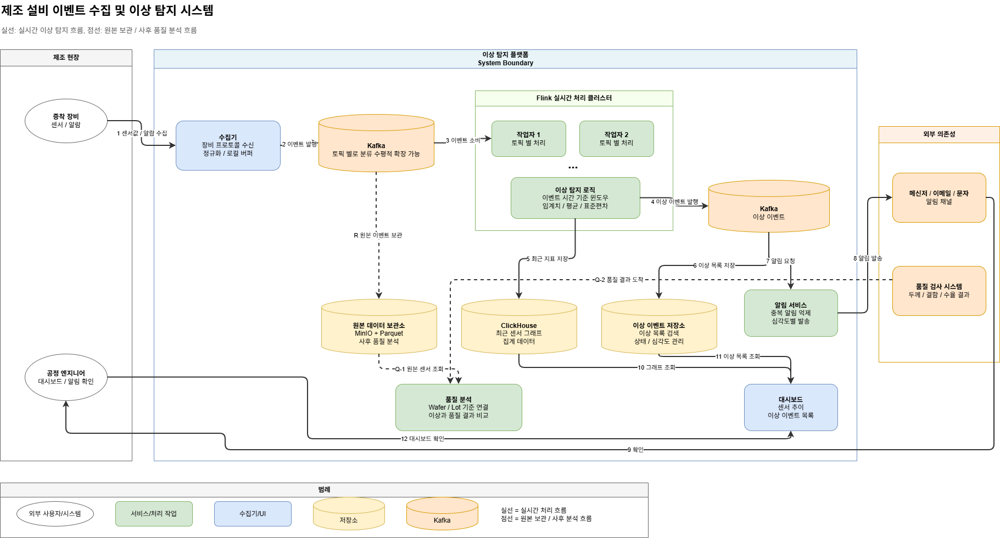

# Week 5 과제: 제조 설비 이벤트 수집 및 이상 탐지 시스템 설계

## 1. 문제 이해 및 설계 범위 확정

### 시나리오

반도체 제조 라인에서는 증착 장비, 식각 장비, 검사 장비 등 여러 설비에서 센서 데이터와 운영 로그가 지속적으로 발생한다.

이번 설계에서는 그중 증착 장비를 대상으로 한다. 증착 공정은 웨이퍼 표면에 얇은 박막을 형성하는 과정이며, Chamber 온도, 압력, 가스 유량, RF Power, 공정 시간 같은 설비 조건이 안정적으로 유지되어야 한다. 이런 값이 반복적으로 흔들리면 박막 두께나 균일도에 영향을 줄 수 있고, 이후 품질 검사에서 결함 증가나 수율 저하로 이어질 수 있다.

본 시스템은 공정 장비를 직접 제어하거나 수율 예측 AI 모델을 학습하는 시스템이 아니다. 제조 설비에서 발생하는 대량 이벤트를 안정적으로 수집하고, 실시간으로 이상 징후를 탐지하며, Dashboard와 알림을 통해 엔지니어가 빠르게 확인할 수 있도록 돕는 모니터링 시스템이다.

### 설계 범위

| 포함 (In Scope) | 제외 (Out of Scope) |
|---|---|
| 설비 센서 데이터 수집 | 실제 장비 제어 로직 |
| Kafka 기반 이벤트 수집 | PLC/장비 펌웨어 구현 |
| 실시간 Stream Processing | 반도체 공정 물리 모델 구현 |
| 임계치/통계 기반 이상 탐지 | 정교한 AI 모델 학습 |
| 최근 센서 데이터 조회 저장소 | MES/ERP 전체 구현 |
| 원본 센서 데이터 보관 | 실제 공정 Recipe 최적화 |
| Dashboard 조회 구조 | 완전한 보안 솔루션 |
| 알림 시스템 | 실제 설비 네트워크 구성 |
| 데이터 유실/지연 대응 | 공정 장비 직접 제어 |

### 시스템 구성 전제

- 제조 설비와 센서는 이미 존재한다고 가정한다.
- 설비 데이터는 수집기를 통해 수집된다고 가정한다.
- 설비는 Kafka로 직접 이벤트를 발행하지 않고, SECS/GEM 또는 OPC-UA 같은 장비 프로토콜로 데이터를 제공한다고 가정한다.
- Kafka Cluster는 이벤트 수집용 메시지 브로커로 사용 가능하다고 가정한다.
- Stream Processing 엔진은 Apache Flink를 사용한다.
- 최근 센서 데이터와 집계 데이터 조회 저장소는 ClickHouse를 사용한다.
- 원본 센서 데이터는 MinIO에 Parquet 파일로 저장한다.
- Dashboard는 Grafana 또는 별도 Web UI를 사용할 수 있다.
- 알림은 Slack, Email, SMS, 사내 메신저 등으로 발송 가능하다고 가정한다.
- 본 시스템은 설비 직접 제어가 아니라 이상 탐지와 모니터링에 집중한다.

### 기능 요구사항

#### [수집]

증착 장비 내 Chamber에서 발생하는 온도, 압력, 가스 유량, RF Power 등의 센서 데이터와 설비 운영 로그, Alarm 이벤트를 실시간으로 수집할 수 있어야 한다.

#### [식별/연결]

수집된 센서 데이터는 `equipmentId`, `chamberId`, `waferId`, `lotId`, `recipeId`, `timestamp`와 함께 저장되어야 한다. 어떤 장비의 어느 Chamber에서 어떤 Wafer/Recipe 수행 중 발생한 데이터인지 추적할 수 있어야 한다.

#### [이상 탐지]

실시간 수집된 데이터는 임계치 기반 조건과 이동 평균, 표준편차 기반의 통계 연산을 통해 이상 징후 판정에 활용될 수 있어야 한다.

#### [저장]

센서 원본 데이터, 집계 데이터, 이상 이벤트는 조회 목적과 보관 기간에 따라 분리 저장한다.

- 최근 센서 데이터와 집계 데이터: ClickHouse
- 원본 센서 데이터: MinIO + Parquet
- 이상 이벤트 상태/목록: PostgreSQL

#### [UI/출력]

Dashboard는 특정 Chamber를 선택했을 때 최근 1시간 동안의 주요 센서 추이 그래프와 발생한 이상 이벤트 목록을 한 화면에 보여줄 수 있어야 한다.

#### [알림]

이상 이벤트가 발생하면 심각도에 따라 담당 엔지니어에게 알림을 발송한다. 동일 Chamber에서 같은 유형의 이상이 반복될 경우 중복 알림을 억제한다.

#### [예외 처리/장애]

수집기나 Flink에 장애가 발생하더라도 Kafka offset과 Flink checkpoint를 활용해 마지막 처리 지점부터 재처리할 수 있어야 한다.

#### [성과/연계]

이상 탐지 결과와 사후에 도착하는 Wafer 품질 검사, 즉 Metrology 데이터를 연결하여 해당 설비 이상이 실제 두께 편차, 결함 증가, 수율 저하로 이어졌는지 분석할 수 있는 기반 데이터를 제공한다.

### 비기능 요구사항

| 항목 | 목표 |
|---|---|
| 센서 데이터 수집 지연 | 평균 1초 이내 |
| 이상 탐지 지연 | 평균 3초 이내 |
| 알림 발송 지연 | 이상 감지 후 5초 이내 |
| 데이터 유실 허용도 | 중요 이벤트는 유실 최소화 |
| 고해상도 원본 데이터 보관 | 7~30일 |
| 집계 데이터 보관 | 1년 이상 |
| 시스템 가용성 | 설비 운영 시간 동안 지속 동작 |
| 장애 복구 | Consumer 재시작 후 offset 기반 재처리 가능 |
| 확장성 | 설비 및 센서 증가에 따라 수평 확장 가능 |
| 알림 정확도 | false positive / false negative trade-off 고려 |

### 대략적 규모 추정

| 항목 | 수치 |
|---|---:|
| 대상 공장 | 단일 반도체 Fab |
| 대상 장비 수 | 500대 |
| 대상 Chamber 수 | 1,000개 |
| 장비당 센서 수 | 50개 |
| 센서 데이터 발생 주기 | 1초 |
| 초당 센서 이벤트 수 | 약 50,000 events/sec |
| 일일 센서 이벤트 수 | 약 43억 건 |
| 이상 이벤트 비율 | 전체 이벤트의 0.01~0.1% |
| Dashboard 동시 사용자 | 100~500명 |
| 알림 대상 엔지니어 | 50~200명 |
| 고해상도 원본 데이터 보관 | 7~30일 |
| 집계 데이터 보관 | 1년 이상 |

---

## 2. 개략적 설계안 제시 및 동의 구하기

### 핵심 흐름


```text
증착 장비
-> 수집기
-> Kafka
-> Flink 실시간 처리 클러스터
-> ClickHouse / 이상 이벤트 / 알림 서비스 / 대시보드

Kafka
-> 원본 데이터 보관소
-> 사후 품질 분석
```

1. 증착 장비의 Chamber에서 온도, 압력, 가스 유량, RF Power 센서 데이터가 발생한다.
2. 수집기가 SECS/GEM 또는 OPC-UA를 통해 장비 데이터를 수집한다.
3. 수집기는 장비별 원천 데이터를 공통 이벤트 스키마로 정규화한다.
4. 수집기는 정규화된 이벤트를 Kafka에 발행한다.
5. Kafka는 대량 이벤트를 topic/partition 단위로 보관하고, Flink가 이를 소비한다.
6. Flink는 Event Time 기준으로 window 집계를 수행한다.
7. Flink는 임계치, 이동 평균, 표준편차, 연속 N회 초과 조건을 이용해 이상 여부를 판단한다.
8. 최근 센서 데이터와 집계 데이터는 Dashboard 조회를 위해 ClickHouse에 저장한다.
9. 이상 징후가 감지되면 Flink는 `anomaly-events` Kafka topic에 이상 이벤트를 발행한다.
10. Alert Service는 이상 이벤트를 소비해 심각도와 중복 알림 정책에 따라 엔지니어에게 알림을 보낸다.
11. 원본 센서 이벤트는 Kafka에서 MinIO에 Parquet 파일로 저장해 7~30일 보관한다.
12. 사후에 Metrology 데이터가 도착하면 `waferId`, `lotId`, `recipeId` 기준으로 원본 센서 데이터와 연결 분석한다.

### 주요 기술 스택

| 다이어그램 컴포넌트 | 기술 선택 | 선택 이유 |
|---|---|---|
| 수집기 | SECS/GEM: Custom Collector, OPC-UA: Telegraf 또는 Custom OPC-UA Collector | 장비 프로토콜을 읽고 공통 이벤트로 정규화 |
| Kafka | Kafka Cluster | 대량 이벤트 버퍼링, partition 기반 병렬 처리, offset 기반 재처리 |
| Flink 실시간 처리 클러스터 | Apache Flink | Kafka 이벤트를 소비하고 Event Time 기준 window 처리 수행 |
| 이상 탐지 로직 | Flink Window Aggregation | 임계치, 이동 평균, 표준편차, 연속 N회 조건으로 이상 여부 판단 |
| 이상 이벤트 | Kafka Topic (`anomaly-events`) | 이상 탐지 결과를 알림, 저장, Dashboard 갱신 작업에 분배 |
| ClickHouse | ClickHouse | 최근 센서 데이터와 집계 데이터를 빠르게 조회하는 컬럼 기반 OLAP DB |
| 원본 데이터 보관소 | MinIO + Parquet | 원본 센서 이벤트를 파일 형태로 7~30일 보관 |
| 이상 이벤트 저장소 | PostgreSQL | 이상 이벤트 상태, 알림 처리 상태, 조치 이력 관리 |
| 알림 서비스 | Alert Service + Slack/Email/SMS | 심각도별 라우팅과 중복 알림 억제 |
| 대시보드 | Grafana / Web UI | 센서 추이와 이상 이벤트 목록 시각화 |
| 품질 분석 | Batch Analysis Job | 원본 센서 데이터와 Metrology 데이터를 wafer/lot 기준으로 연결 분석 |

---

## 3. 상세 설계

이번 설계에서는 3-1, 3-2, 3-3을 중심으로 다룬다. 3-4 이후 항목은 추후 상세화가 필요한 판단 지점으로 간단히 정리한다.

1. 대규모 설비 이벤트 수집 구조
2. 실시간 스트림 처리 및 이상 탐지 파이프라인
3. 데이터 저장 계층
4. 알림, 장애 복구, Dashboard, 품질 연계의 기본 판단

### 3-1. 대규모 설비 이벤트 수집 구조 설계

#### 수집기가 필요한 이유

제조 설비는 보통 Kafka로 직접 이벤트를 발행하지 않는다. 반도체 장비는 SECS/GEM, 산업 설비는 OPC-UA, Modbus, MQTT 같은 프로토콜로 데이터를 제공하는 경우가 많다.

따라서 Kafka 앞단에 수집기를 두고 장비 데이터를 읽어 공통 이벤트 포맷으로 변환한다.

```text
설비 / Chamber
-> SECS/GEM 또는 OPC-UA
-> 수집기
-> Kafka Producer
-> Kafka
```

#### 수집기 기술 선택

수집기는 장비 프로토콜에 따라 다르게 구성한다.

| 장비 프로토콜 | 수집기 기술 스택 | 판단 |
|---|---|---|
| SECS/GEM | Custom Collector + SECS/GEM SDK + Kafka Producer | 반도체 장비 이벤트, Alarm, 공정 상태를 장비 벤더 문서에 맞춰 해석해야 하므로 커스텀 구현이 적합 |
| OPC-UA | Telegraf 또는 Custom OPC-UA Collector | 단순 센서 node 구독은 Telegraf로 처리할 수 있고, wafer/lot/recipe 연결 로직이 복잡하면 커스텀 수집기로 확장 |

이번 설계에서는 반도체 장비의 SECS/GEM 이벤트 처리가 중요하므로 기본 수집기는 Custom Collector로 두고, OPC-UA 기반 센서 수집은 Telegraf를 보조적으로 사용할 수 있다고 본다.

#### 수집기 역할

| 역할 | 설명 |
|---|---|
| 장비 데이터 수집 | SECS/GEM, OPC-UA 등으로 센서값과 Alarm 수신 |
| 데이터 정규화 | 장비별 포맷을 공통 이벤트 스키마로 변환 |
| 메타데이터 추가 | `equipmentId`, `chamberId`, `waferId`, `lotId`, `recipeId` 추가 |
| 검증 | 필수 필드 누락, 타입 오류, timestamp 오류 확인 |
| 로컬 버퍼링 | Kafka 또는 네트워크 장애 시 짧은 시간 임시 보관 |
| Kafka 발행 | Kafka Producer로 이벤트 발행 |

#### 공통 이벤트 예시

```json
{
  "eventId": "DEP-007-CH-03-pressure-20260603T101521123",
  "equipmentId": "DEP-007",
  "chamberId": "CH-03",
  "waferId": "WAFER-17",
  "lotId": "LOT-20260603-001",
  "recipeId": "CVD-SIN-350C",
  "sensorType": "pressure",
  "value": 1.26,
  "unit": "Torr",
  "timestamp": "2026-06-03T10:15:21.123+09:00"
}
```

#### 이벤트 컬럼 설명

| 컬럼 | 의미 | 예시 |
|---|---|---|
| `eventId` | 이벤트 중복 처리와 추적을 위한 고유 ID | `DEP-007-CH-03-pressure-20260603T101521123` |
| `equipmentId` | 설비 ID. 어떤 장비에서 발생한 데이터인지 식별 | `DEP-007` |
| `chamberId` | 장비 안의 Chamber ID. 같은 장비에 여러 Chamber가 있을 수 있음 | `CH-03` |
| `waferId` | 개별 웨이퍼 ID. 이상 발생 시 어떤 웨이퍼가 처리 중이었는지 연결 | `WAFER-17` |
| `lotId` | 같은 제조 단위로 묶인 웨이퍼 묶음 ID. 보통 여러 wafer가 하나의 lot으로 관리됨 | `LOT-20260603-001` |
| `recipeId` | 해당 wafer/lot에 적용된 공정 조건 또는 공정 레시피 ID | `CVD-SIN-350C` |
| `sensorType` | 센서 종류 | `pressure`, `temperature`, `gas_flow`, `rf_power` |
| `value` | 센서 측정값 | `1.26` |
| `unit` | 측정 단위 | `Torr`, `C`, `sccm`, `W` |
| `timestamp` | 장비에서 센서값이 실제 발생한 시간. Flink의 Event Time 기준으로 사용 | `2026-06-03T10:15:21.123+09:00` |

`waferId`, `lotId`, `recipeId`는 실시간 이상 탐지 자체에도 유용하지만, 더 중요한 목적은 사후 품질 분석이다. 나중에 Metrology 데이터에서 특정 wafer의 두께 편차나 결함 증가가 발견되면, 같은 `waferId`, `lotId`, `recipeId` 기준으로 당시의 센서 원본 데이터와 이상 이벤트를 연결할 수 있다.

#### Kafka topic과 partition

Kafka topic은 논리적으로 다음처럼 나눈다.

| Topic | 용도 |
|---|---|
| `sensor-events` | 온도, 압력, 가스 유량, RF Power 등 센서 이벤트 |
| `alarm-events` | 장비 Alarm, 공정 중단 등 중요 이벤트 |
| `anomaly-events` | Flink가 판정한 이상 이벤트 |
| `dead-letter-events` | 파싱 실패, 필수 필드 누락, 스키마 오류 이벤트 |

`sensor-events`의 partition key는 `equipmentId + chamberId`로 둔다. 같은 Chamber의 이벤트는 같은 partition으로 들어가게 하여 Chamber 단위 순서를 유지하고, partition 수를 늘려 전체 처리량을 확장한다.

특정 장비나 Chamber에서 이벤트가 급증할 수 있으므로 수집기는 라인/장비군 단위로 분산 배치한다.

```text
Line A 장비 -> 수집기 A
Line B 장비 -> 수집기 B
Line C 장비 -> 수집기 C
```

중요 이벤트는 유실 최소화를 우선한다. Kafka Producer는 `acks=all`, retry, batch, compression을 사용해 안정성과 처리량을 함께 고려한다.

### 3-2. 실시간 스트림 처리 및 이상 탐지 파이프라인

#### Stream Processing 엔진 선택

Kafka Streams, Flink, Spark Streaming 중 Flink를 선택한다.

| 후보 | 장점 | 단점 | 판단 |
|---|---|---|---|
| Kafka Streams | Kafka와 통합이 쉽고 애플리케이션에 내장 가능 | 대규모 상태 처리와 운영 유연성은 Flink보다 제한적 | 단순 처리에는 적합 |
| Apache Flink | Event Time, Window, 상태 기반 계산, checkpoint 복구에 강함 | 학습 난이도와 운영 복잡도가 있음 | 이번 설계에 가장 적합 |
| Spark Streaming | 배치 분석과 연계가 좋음 | 초저지연 스트리밍에는 Flink보다 무겁게 느껴질 수 있음 | 사후 분석에 더 적합 |

제조 설비 데이터는 장비에서 실제 발생한 시간 기준으로 분석해야 한다. 따라서 Event Time, Window, Late Event 처리가 중요하고, Flink가 이 요구사항에 적합하다.

#### Event Time과 Processing Time

| 개념 | 의미 |
|---|---|
| Event Time | 센서 데이터가 실제 장비에서 발생한 시간 |
| Processing Time | Flink가 해당 이벤트를 처리한 시간 |

센서 이상 탐지는 실제 발생 시점 기준으로 판단해야 하므로 Event Time을 기준으로 window를 구성한다.

예를 들어 센서 이벤트가 10:15:21에 발생했지만 네트워크 지연으로 10:15:25에 도착할 수 있다. 이 경우 이상 탐지 계산에는 10:15:21을 사용한다.

#### Window 기반 이상 탐지

Flink는 `equipmentId + chamberId + sensorType` 기준으로 이벤트를 묶고, 최근 1분 또는 5분 window를 계산한다.

예시 조건은 다음과 같다.

| 방식 | 예시 |
|---|---|
| 임계치 기반 | pressure가 상한값을 초과 |
| 이동 평균 기반 | 최근 5분 평균이 기준 범위를 벗어남 |
| 표준편차 기반 | 현재 값이 평균 대비 3 sigma 이상 벗어남 |
| 연속 조건 | 1회 초과가 아니라 연속 N회 초과 시 이상으로 판단 |

한 번 튄 값만으로 바로 알림을 보내면 false positive가 많아진다. 따라서 설계에서는 연속 N회 초과 또는 일정 시간 이상 지속 조건을 함께 사용한다.

#### 지연 이벤트 처리

장비 데이터는 네트워크나 수집기 지연으로 늦게 도착할 수 있다.

Flink는 일정 수준의 지연을 허용한다.

```text
window = 1분
allowed lateness = 10초
```

허용 시간 안에 도착한 이벤트는 해당 window 계산에 반영한다. 허용 시간을 초과한 이벤트는 실시간 알림에는 반영하지 않고, 원본 보관소에 저장해 사후 분석에 사용한다.

#### 이상 탐지 결과 발행

이상 탐지 결과는 Flink가 `anomaly-events` Kafka topic에 발행한다.

```json
{
  "anomalyId": "ANOM-20260603-0001",
  "equipmentId": "DEP-007",
  "chamberId": "CH-03",
  "waferId": "WAFER-17",
  "lotId": "LOT-20260603-001",
  "recipeId": "CVD-SIN-350C",
  "sensorType": "pressure",
  "ruleType": "THRESHOLD_AND_MOVING_AVERAGE",
  "severity": "HIGH",
  "value": 1.85,
  "threshold": 1.50,
  "timestamp": "2026-06-03T10:15:21.123+09:00"
}
```

`anomaly-events` topic을 두면 Alert Service, 이상 이벤트 저장소, Dashboard 갱신 작업이 서로 독립적으로 이벤트를 소비할 수 있다.

#### Flink 장애 복구

Flink는 Kafka에서 읽은 offset과 window 계산 상태를 주기적으로 checkpoint로 저장할 수 있다. 장애가 발생하면 마지막 checkpoint 시점의 상태를 복구하고, 해당 offset부터 Kafka 이벤트를 다시 읽어 처리한다.

상세한 checkpoint 저장소 기술은 이번 다이어그램에서는 생략한다. 설계상 중요한 점은 Flink가 단순 Consumer가 아니라 window 계산 상태를 가진 stream processor이고, 장애 시 마지막 성공 지점부터 재처리할 수 있다는 것이다.

### 3-3. 데이터 저장 계층 설계

#### 저장소를 분리하는 이유

초당 약 50,000건, 하루 약 43억 건의 센서 이벤트가 발생한다. 모든 데이터를 하나의 DB에 넣고 Dashboard 조회와 장기 분석을 동시에 처리하면 비용과 성능 문제가 생긴다.

따라서 저장소를 목적별로 나눈다.

이벤트 수는 다음 전제로 계산한다.

```text
Chamber 수: 1,000개
Chamber당 센서 수: 50개
센서 데이터 발생 주기: 1초

1초 이벤트 수 = 1,000 * 50 = 50,000 events/sec
1일 이벤트 수 = 50,000 * 86,400 = 4,320,000,000 events/day
```

원본 이벤트 1건의 크기는 필드 수와 저장 포맷에 따라 달라진다. 공통 이벤트 예시 수준의 JSON은 대략 수백 bytes가 될 수 있으므로, 보수적으로 300~500 bytes/event 정도로 가정한다.

| 이벤트 1건 크기 | 하루 원본 데이터 | 7일 보관 | 30일 보관 |
|---:|---:|---:|---:|
| 300 bytes | 약 1.3 TB | 약 9.1 TB | 약 38.9 TB |
| 500 bytes | 약 2.2 TB | 약 15.1 TB | 약 64.8 TB |
| 1 KB | 약 4.3 TB | 약 30.2 TB | 약 129.6 TB |

따라서 원본 센서 이벤트를 JSON 그대로 일반 DB에 오래 저장하는 것은 부담이 크다. 이번 설계에서는 원본은 MinIO에 Parquet 형식으로 압축 저장하고, Dashboard 조회용 최근 데이터와 집계 데이터는 ClickHouse에 저장한다.

| 데이터 | 저장소 | 보관 기간 | 목적 |
|---|---|---:|---|
| 최근 센서 데이터 | ClickHouse | 7~30일 | Dashboard 그래프 조회 |
| 집계 데이터 | ClickHouse | 1년 이상 | 장기 추이 조회 |
| 원본 센서 이벤트 | MinIO + Parquet | 7~30일 | 사후 품질 분석 |
| 이상 이벤트 | PostgreSQL | 1년 이상 | 이상 목록, 처리 상태, 알림 이력 |
| 품질 검사 결과 | PostgreSQL 또는 Data Lake | 업무 기준 | Metrology 연계 분석 |

#### 원본 센서 데이터는 모두 저장할 것인가?

요구사항에 원본 센서 데이터 보관과 Metrology 연계 분석이 있으므로 원본 데이터는 저장한다.

다만 원본을 ClickHouse에 영구 보관하지 않는다. ClickHouse는 최근 조회와 집계에 사용하고, 원본 이벤트는 MinIO에 Parquet 파일로 보관한다.

```text
Kafka
-> ClickHouse
-> 최근 센서 그래프 조회

Kafka
-> MinIO + Parquet
-> 원본 이벤트 보관 / 사후 품질 분석
```

#### MinIO와 Parquet의 역할

MinIO는 DB라기보다 파일을 대량으로 저장하는 Object Storage다. AWS S3와 비슷한 역할을 하지만, 자체 인프라에 설치해서 사용할 수 있다.

Parquet은 원본 센서 이벤트를 저장할 때 사용하는 파일 형식이다. JSON을 그대로 쌓는 것보다 압축과 컬럼 단위 조회에 유리하다.

이번 설계에서는 다음처럼 저장한다.

```text
minio://sensor-data-lake/sensor-events/date=2026-06-03/equipmentId=DEP-007/part-0001.parquet
```

#### ClickHouse를 사용하는 이유

ClickHouse는 컬럼 기반 OLAP DB다. 센서 데이터처럼 append-only로 계속 들어오는 데이터를 batch insert로 빠르게 적재하고, 시간 범위 집계 쿼리를 빠르게 처리하는 데 강하다.

#### ClickHouse가 일반 RDB보다 좋은 이유

ClickHouse는 논리적으로는 일반 테이블처럼 row 형태의 데이터를 다룬다.

```text
timestamp | equipmentId | chamberId | sensorType | value
---------------------------------------------------------
10:00:00  | EQ-001      | CH-03     | pressure   | 1.26
10:00:01  | EQ-001      | CH-03     | pressure   | 1.27
10:00:02  | EQ-001      | CH-03     | pressure   | 1.31
```

하지만 디스크에 저장하는 방식은 일반 RDB와 다르다.

일반적인 row 기반 저장은 한 행의 값을 묶어서 저장한다.

```text
[10:00:00, EQ-001, CH-03, pressure, 1.26]
[10:00:01, EQ-001, CH-03, pressure, 1.27]
[10:00:02, EQ-001, CH-03, pressure, 1.31]
```

반면 ClickHouse 같은 column 기반 DB는 column별로 값을 모아서 저장한다.

```text
timestamp:   [10:00:00, 10:00:01, 10:00:02]
equipmentId: [EQ-001, EQ-001, EQ-001]
chamberId:   [CH-03, CH-03, CH-03]
sensorType:  [pressure, pressure, pressure]
value:       [1.26, 1.27, 1.31]
```

이 방식이 유리한 이유는 같은 성격의 값들이 연속으로 모이기 때문이다. 센서 데이터에서는 `equipmentId`, `chamberId`, `sensorType`, `unit`, `recipeId` 같은 값이 반복되는 경우가 많다.

예를 들어 같은 장비에서 압력 센서값이 계속 들어오면 `equipmentId`는 다음처럼 반복된다.

```text
EQ-001, EQ-001, EQ-001, EQ-001, ...
```

이런 반복값은 다음처럼 압축할 수 있다.

```text
EQ-001 * 10000
```

이런 방식을 Run-Length Encoding, RLE이라고 볼 수 있다.

`sensorType`처럼 종류가 많지 않은 문자열은 Dictionary Encoding으로 압축하기 좋다.

```text
1 = pressure
2 = temperature
3 = gas_flow
4 = rf_power

sensorType: [1, 1, 1, 1, 1]
```

문자열 `pressure`를 수백만 번 저장하는 대신 작은 숫자 `1`을 저장하는 방식이다.

`timestamp`도 센서 데이터에서는 보통 규칙적으로 증가한다.

```text
10:00:00
10:00:01
10:00:02
10:00:03
```

따라서 전체 timestamp를 매번 저장하기보다 시작값과 증가량 중심으로 압축할 수 있다. 이런 방식을 Delta Encoding이라고 볼 수 있다.

`value`도 완전히 랜덤하지 않다. 예를 들어 압력값은 보통 근처 값으로 조금씩 변한다.

```text
1.26
1.27
1.31
1.29
1.28
```

비슷한 숫자가 연속되면 압축 알고리즘이 더 잘 동작한다.

row 기반 저장은 한 행 안에 시간, 문자열, 숫자 값이 섞여 있다. 반면 column 기반 저장은 같은 타입의 값끼리 모인다.

```text
문자열 column
시간 column
숫자 column
```

같은 타입끼리 모이면 압축이 쉬워지고, 압축률이 좋아지면 저장 공간과 디스크 I/O가 줄어든다.

조회할 때도 이점이 있다. Dashboard에서 다음 쿼리를 실행한다고 가정한다.

```sql
SELECT avg(value)
FROM sensor_events
WHERE chamberId = 'CH-03'
  AND sensorType = 'pressure'
  AND timestamp >= now() - INTERVAL 1 HOUR;
```

이 쿼리에 실제로 필요한 column은 `timestamp`, `chamberId`, `sensorType`, `value` 정도다. ClickHouse는 필요한 column만 읽을 수 있지만, row 기반 DB는 row 전체를 읽는 비용이 더 커질 수 있다.

따라서 이번 설계처럼 대량 센서 데이터를 저장하고 시간 범위 집계를 자주 수행하는 경우에는 일반 RDB보다 ClickHouse가 더 적합하다.


### 3-4. 알림 정확도와 중복 알림 제어

이번 설계에서는 알림을 깊게 구현하지 않고 기본 정책만 둔다.

- 한 번 임계치를 초과했다고 바로 알림을 보내면 false positive가 많아질 수 있다.
- 따라서 연속 N회 이상 초과하거나 일정 시간 이상 지속될 때 알림을 보낸다.
- 같은 `equipmentId + chamberId + sensorType + ruleId`에서 반복되는 알림은 일정 시간 중복 억제한다.
- 이상 상태가 정상으로 회복되면 recovery 알림을 보낼 수 있지만, MVP에서는 선택 사항으로 둔다.

Trade-off는 명확하다. 즉시 알림은 빠르지만 알림 피로가 크고, 연속 조건을 두면 정확도는 올라가지만 알림이 몇 초 늦어질 수 있다.

### 3-5. 장애 복구 및 재처리 구조

장애 복구는 Kafka와 Flink의 기본 특성을 활용한다.

- Flink가 장애로 중단되면 Kafka에 남아 있는 이벤트를 마지막 offset 이후부터 다시 읽는다.
- Flink는 window 계산 상태를 checkpoint로 복구할 수 있다.
- 중복 처리가 발생할 수 있으므로 이벤트에는 `eventId`를 둔다.
- 파싱 실패, 필수 필드 누락, 스키마 오류는 `dead-letter-events` topic으로 분리한다.
- 장애 발생 시 Dashboard에는 "최근 데이터 지연" 같은 상태를 표시한다.

이번 설계에서는 exactly-once 보장까지 깊게 다루지는 않고, offset 기반 재처리와 중복 가능성 관리 정도로 범위를 잡는다.

### 3-6. Dashboard 및 모니터링 구조

Dashboard는 특정 Chamber의 현재 상태를 빠르게 확인하는 목적이다.

- `equipmentId`, `chamberId` 기준으로 장비를 선택한다.
- 최근 1시간의 온도, 압력, 가스 유량, RF Power 그래프를 보여준다.
- 같은 화면에 최근 이상 이벤트 목록을 함께 보여준다.
- 최근 데이터 조회는 ClickHouse를 사용한다.
- 원본 데이터 보관소는 Dashboard에서 직접 조회하지 않고, 사후 분석에 사용한다.

조회 부하를 줄이기 위해 Dashboard는 원본 이벤트 전체가 아니라 최근 데이터와 집계 데이터를 조회한다.

### 3-7. 공정 데이터와 품질 데이터의 지연 처리

Metrology 데이터는 센서 데이터보다 늦게 도착한다. 따라서 실시간 이상 탐지와 사후 품질 분석은 분리한다.

```text
실시간 경로:
센서 이벤트 -> Kafka -> Flink -> 이상 탐지 -> 알림

사후 분석 경로:
원본 센서 데이터 + Metrology 데이터 -> waferId/lotId/recipeId 기준 분석
```

이번 설계에서는 실시간 알림 단계에서 품질 결과까지 반영하지 않는다. 나중에 품질 검사 결과가 도착하면 `waferId`, `lotId`, `recipeId`를 기준으로 원본 센서 데이터와 연결한다.

즉, 실시간 시스템은 이상 징후를 빠르게 알리는 역할을 하고, 품질 데이터 연계는 사후 분석 영역으로 둔다.

### 3-8. 데이터 유실, 처리 지연, 저장 비용 Trade-off

이번 설계에서 가장 중요한 trade-off는 실시간성, 유실 방지, 저장 비용이다.

| 질문 | 판단 |
|---|---|
| 모든 센서 데이터를 원본 그대로 저장할 것인가? | 요구사항상 원본이 필요하므로 저장한다. 다만 MinIO + Parquet에 7~30일만 보관한다. |
| Alarm 이벤트와 센서 이벤트를 같은 중요도로 볼 것인가? | Alarm 이벤트는 유실 최소화를 더 강하게 본다. 일반 센서 이벤트는 비용과 보관 기간을 함께 고려한다. |
| 지연을 줄이기 위해 batch size를 줄일 것인가? | 너무 줄이면 Kafka/Flink/ClickHouse 쓰기 효율이 떨어진다. 평균 3초 이내 이상 탐지를 만족하는 범위에서 batch 처리한다. |
| 실시간 이상 탐지와 사후 수율 분석은 저장 정책이 같은가? | 다르다. 실시간 조회는 ClickHouse, 사후 분석용 원본은 MinIO + Parquet으로 분리한다. |

---

## 4. 설계 장점

- Kafka를 사용해 초당 수만 건의 설비 이벤트를 안정적으로 버퍼링할 수 있다.
- Kafka partition과 Flink worker를 통해 수평 확장이 가능하다.
- Flink의 Event Time window 처리로 장비에서 실제 발생한 시간 기준의 이상 탐지가 가능하다.
- ClickHouse를 사용해 최근 센서 데이터와 집계 데이터를 빠르게 조회할 수 있다.
- MinIO + Parquet으로 원본 이벤트를 별도 보관해 사후 품질 분석이 가능하다.
- 알림 중복 억제 정책을 통해 엔지니어의 알림 피로를 줄일 수 있다.

---

## 5. 설계 단점

- Kafka, Flink, ClickHouse, MinIO 등 운영해야 할 컴포넌트가 많다.
- Flink는 Event Time, Window, checkpoint 같은 개념이 있어 학습 및 운영 난이도가 있다.
- 원본 이벤트를 7~30일 저장하더라도 하루 약 43억 건 규모라 저장 비용과 압축 전략을 신경 써야 한다.
- 수집기가 장비 프로토콜을 처리해야 하므로 장비 벤더별 데이터 포맷 차이가 복잡해질 수 있다.
- 임계치/통계 기반 이상 탐지는 단순하고 설명 가능하지만, 복잡한 품질 저하 원인을 모두 잡지는 못할 수 있다.
- 알림 중복 억제 정책을 강하게 잡으면 실제 이상 알림이 늦어질 수 있다.

---

## 참고 자료

- [Samsung Semiconductor KR - 증착 공정](https://semiconductor.samsung.com/kr/support/tools-resources/dictionary/semiconductor-glossary-deposition/)
- [SK hynix - 반도체 전공정 5편, 증착 공정](https://news.skhynix.co.kr/jeonginseong-column-deposition/)
- [Lam Research Newsroom - Bevel Deposition](https://newsroom.lamresearch.com/2023-06-20-Lam-Research-Introduces-Worlds-First-Bevel-Deposition-Solution-to-Increase-Yield-in-Chip-Production)
- [Semiconductor Engineering - Fault Detection and Classification](https://semiengineering.com/new-frontiers-in-fault-detection-and-classification/)
- Kafka, Flink, ClickHouse, MinIO 공식 문서
