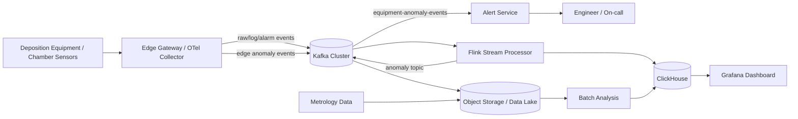
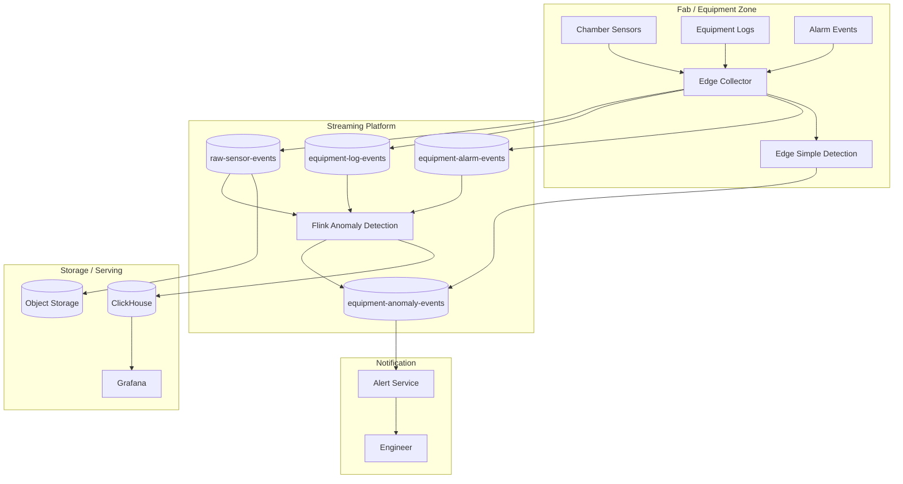

# Week 5 과제: 제조 설비 이벤트 수집 및 이상 탐지 시스템 설계

> 제조 설비에서 지속적으로 발생하는 센서 데이터와 운영 로그를 이벤트 스트림으로 수집하고, 이를 실시간으로 처리해 이상 징후를 탐지하는 시스템을 설계합니다

---

#### ⒈ 문제 이해 및 설계 범위 확정

**시나리오**

반도체 제조 라인에서는 증착 장비, 식각 장비, 검사 장비 등 다양한 설비에서 센서 데이터와 운영 로그가 지속적으로 발생한다.

본 시스템은 공정 장비를 직접 제어하거나 수율 예측 AI 모델을 학습하는 것이 아니라, 제조 설비에서 발생하는 대량의 이벤트를 안정적으로 수집하고, 이상 징후를 빠르게 탐지하며, Dashboard와 알림을 통해 문제를 확인할 수 있도록 돕는 모니터링 시스템이다.

이번 설계에서는 반도체 Fab 내 **증착 장비 Chamber 센서 이벤트 수집 및 이상 탐지 시스템**을 대상으로 한다.

증착 공정에서는 Chamber 내부의 온도, 압력, 가스 유량, RF Power 같은 값이 공정 품질에 영향을 줄 수 있다. 따라서 장비에서 발생하는 센서 데이터와 운영 로그를 실시간으로 수집하고, 기준 범위 이탈이나 통계적 이상 징후를 빠르게 탐지하는 것이 중요하다.

## 설계 범위 (In / Out of Scope)

---

| 포함 (In Scope) | 제외 (Out of Scope) |
| --- | --- |
| 설비 센서 데이터 수집 | 실제 장비 제어 로직 |
| 이벤트 수집 | PLC/장비 펌웨어 구현 |
| Stream Processing | 반도체 공정 물리 모델 구현 |
| 임계치 기반 이상 탐지 | 정교한 AI 모델 학습 |
| 시계열 데이터 저장 | MES/ERP 전체 구현 |
| Dashboard 조회 구조 | 실제 공정 Recipe 최적화 |
| 알림 시스템 | 완전한 보안 솔루션 |
| 데이터 유실/지연 대응 | 실제 설비 네트워크 구성 |
| 장애 복구 및 재처리 | 공정 장비 직접 제어 |

## 시스템 구성 전제

---

- 제조 설비와 센서는 이미 존재한다고 가정한다.
- 설비 데이터는 Edge Gateway 또는 Collector를 통해 수집된다고 가정한다.
- Kafka Cluster는 이벤트 수집용 메시지 브로커로 사용 가능하다고 가정한다.
- Stream Processing 엔진은 Flink를 선택한다.
    - 이벤트 시간 기반 window 처리, 상태 저장, checkpoint, 재처리 기능이 중요하기 때문이다.
- 최근 조회용 시계열 데이터 저장소는 ClickHouse를 사용한다.
    - 센서 데이터는 고카디널리티 시계열 데이터이고, 장비/Chamber/센서/Recipe 기준 집계 조회가 많기 때문이다.
- 장기 원본 데이터는 Object Storage 또는 Data Lake에 저장한다.
- Dashboard는 Grafana를 사용한다.
- 알림은 Slack, Email, SMS, 사내 메신저 등으로 발송 가능하다고 가정한다.
- 본 시스템은 설비를 직접 제어하지 않고, 이상 탐지와 모니터링에 집중한다.

## 기능 요구사항

---

### [수집]

증착 장비 내 Chamber에서 발생하는 온도, 압력, 가스 유량, RF Power 등의 센서 데이터와 설비 운영 로그, Alarm 이벤트를 실시간으로 수집할 수 있어야 한다.

### [식별/연결]

수집된 센서 데이터는 `equipmentId`, `chamberId`, `waferId`, `lotId`, `recipeId`, `timestamp`와 함께 저장되어야 하며, 어떤 장비의 어느 Chamber에서 어떤 Wafer/Recipe 수행 중 발생한 데이터인지 식별할 수 있어야 한다.

Recipe가 여러 step으로 구성되는 경우 `stepId`, `stepName`, `stepStartAt`, `stepEndAt`을 함께 저장해 이상이 어느 공정 단계에서 발생했는지 추적할 수 있어야 한다.

### [이상 탐지]

실시간 수집된 데이터는 임계치 기반 조건과 이동 평균, 표준편차 기반의 통계 연산을 통해 이상 징후를 판정하는 데 활용될 수 있어야 한다.

### [저장]

센서 원본 데이터, 집계 데이터, 이상 이벤트는 조회 목적과 보관 기간에 따라 분리 저장할 수 있어야 한다.

최근 고해상도 센서 데이터는 ClickHouse에 저장하고, 장기 분석용 원본 이벤트는 Object Storage 또는 Data Lake에 저장한다.

### [UI/출력]

설비 모니터링 Dashboard는 특정 Chamber를 선택했을 때 최근 1시간 동안의 주요 센서 추이 그래프와 발생한 이상 이벤트 목록을 한 화면에 시각화하여 반환할 수 있어야 한다.

### [알림]

이상 이벤트가 발생하면 심각도에 따라 엔지니어 또는 담당자에게 알림을 발송할 수 있어야 하며, 동일 이상이 반복될 경우 중복 알림을 억제할 수 있어야 한다.

### [예외 처리/장애]

센서 수집부나 스트림 처리부에 장애가 발생하거나 데이터가 지연 도착하더라도, Kafka의 offset 또는 Flink checkpoint를 활용해 과거 시점부터 재처리 및 복구할 수 있어야 한다.

### [성과/연계]

이상 탐지 결과와 사후에 도착하는 Wafer 품질 검사, 즉 Metrology 데이터를 연결하여 해당 설비 이상이 실제 두께 편차, 결함 증가, 수율 저하로 이어졌는지 분석할 수 있는 기반 데이터를 제공할 수 있어야 한다.

## 비기능 요구사항

---

| 항목 | 목표 |
| --- | --- |
| 센서 데이터 수집 지연 | 평균 1초 이내 |
| 이상 탐지 지연 | 평균 3초 이내 |
| 알림 발송 지연 | 이상 감지 후 5초 이내 |
| 데이터 유실 허용도 | 중요 이벤트는 유실 최소화 |
| 센서 데이터 저장 기간 | 고해상도 데이터 7~30일, 집계 데이터 1년 이상 |
| 시스템 가용성 | 설비 운영 시간 동안 지속 동작 |
| 장애 복구 | Consumer 재시작 후 offset 기반 재처리 또는 스트림 처리 상태 복구 |
| 확장성 | 설비 및 센서 증가에 따라 수평 확장 가능 |
| 알림 정확도 | false positive / false negative trade-off 고려 |

## 대략적 규모 추정 *(기준값 — 본인 가정으로 변경 가능)*

---

| 항목 | 수치 |
| --- | --- |
| 대상 공장 | 반도체 Fab |
| 대상 장비 수 | 500대 |
| 대상 Chamber 수 | 1,000개 |
| 장비당 센서 수 | 50개 |
| 센서 데이터 발생 주기 | 1초 |
| 초당 센서 이벤트 수 | 약 50,000 events/sec |
| 일일 센서 이벤트 수 | 약 43억 건 |
| 이상 이벤트 비율 | 전체 이벤트의 0.01~0.1% |
| Dashboard 동시 사용자 | 100~500명 |
| 알림 대상 엔지니어 | 50 ~ 200명 |
| 고해상도 원본 데이터 보관 | 7~30일 |
| 집계 데이터 보관 | 1년 이상 |

# 2. 개략적 설계안 제시 및 동의 구하기

---

## 핵심 흐름 (필수)

1. 증착 장비와 Chamber 센서는 Edge Gateway 또는 OpenTelemetry Collector로 센서 이벤트와 운영 로그를 전송한다.
2. Collector는 이벤트 스키마, 필수 식별자, timestamp를 검증하고 Kafka로 publish한다.
3. Kafka topic은 센서 원본 이벤트, 운영 로그, 장비 Alarm 이벤트를 분리한다.
4. Edge Collector는 threshold 초과, 급격한 변화, 장비 Alarm 같은 단순하고 즉시성이 중요한 이상을 1차 감지한다.
5. Flink는 Kafka 이벤트를 소비하여 event time 기준으로 window 집계와 중앙 2차 이상 탐지를 수행한다.
6. Edge와 Flink의 이상 탐지 결과는 `equipment-anomaly-events` topic으로 발행한다.
7. Alert Service는 이상 이벤트 topic을 바로 소비하고 심각도와 중복 억제 정책을 적용해 담당자에게 알림을 보낸다.
8. 원본 센서 이벤트는 장기 보관을 위해 Object Storage/Data Lake로 적재한다.
9. 최근 고해상도 센서 데이터, 집계 데이터, 이상 이벤트는 Dashboard 조회를 위해 ClickHouse에 저장한다.
10. Dashboard는 Grafana를 통해 Chamber별 최근 센서 추이, 이상 이벤트, Alarm 이력을 조회한다.
11. 사후에 도착하는 Metrology 데이터는 `lotId`, `waferId`, `recipeId`, `chamberId` 기준으로 이상 이벤트와 연결해 품질 영향 분석에 활용한다.

이때 이상 탐지와 알림 경로는 저장 경로를 기다리지 않도록 분리한다. 즉, `Edge 1차 탐지 또는 Kafka -> Flink -> anomaly topic -> Alert Service` 경로는 평균 수 초 이내 대응을 목표로 하고, ClickHouse/Object Storage 적재는 조회와 분석 목적에 맞게 batch 효율을 함께 고려한다.

## 개략적 아키텍처 다이어그램 (필수)

크게 네 가지 책임 영역으로 나눈다.

- **수집 영역**: Edge Gateway/Collector가 설비 이벤트를 받아 Kafka로 안정적으로 전달한다.
- **실시간 처리 영역**: Edge는 단순한 1차 이상 탐지를 수행하고, Flink는 window 기반 중앙 2차 이상 탐지를 담당한다. 알림용 이상 이벤트는 저장 완료를 기다리지 않고 바로 발행한다.
- **저장/조회 영역**: ClickHouse는 최근 조회와 Dashboard를 담당하고, Object Storage는 장기 원본 보관을 담당한다.
- **알림/분석 영역**: Alert Service는 실시간 대응을 담당하고, Metrology 연계는 사후 품질 분석을 담당한다.

# 3. 상세 설계

---

## 설계 대상 컴포넌트 사이의 우선순위 정하기 / 아키텍처 다이어그램 (필수)

우선순위는 데이터 유실 방지와 이상 탐지 지연 목표를 기준으로 둔다.

1. **Edge Gateway / Collector**
    - 설비 이벤트가 시스템으로 들어오는 첫 지점이다.
    - 스키마 검증, timestamp 보정, 로컬 버퍼링, Kafka 전송, 단순 1차 이상 탐지를 담당한다.
2. **Kafka Cluster**
    - 대량 이벤트의 내구성 있는 버퍼 역할을 한다.
    - 수집부, 스트림 처리부, 저장부의 장애를 느슨하게 분리한다.
3. **Flink Stream Processor**
    - 중앙 2차 이상 탐지의 핵심이다.
    - event time window, 상태 저장, checkpoint 기반 복구가 필요하다.
4. **저장 계층**
    - ClickHouse는 최근 센서 데이터와 집계 데이터 조회를 담당한다.
    - Object Storage는 장기 원본 보관과 재처리를 담당한다.
5. **Alert Service**
    - 이상 이벤트를 엔지니어에게 전달한다.
    - 중복 알림 억제와 escalation 정책을 담당한다.
6. **Dashboard**
    - 엔지니어가 Chamber 단위로 현재 상태를 확인하는 인터페이스다.
    - 실시간 조회 부하가 처리 파이프라인에 영향을 주지 않도록 저장 계층을 통해 조회한다.
7. **Metrology 연계**
    - 실시간 대응보다 후순위다.
    - 사후 품질 분석과 rule 개선에 사용한다.

> 아래 질문은 선택이며 본인이 중요하다고 생각하는 1~2개를 깊게 다루는 것을 권장
>

---

## 설계 시 다루는 주요 의문/관점

- 실시간 이상 탐지에 필요한 데이터와 장기 분석용 데이터는 같은 경로로 처리해야 하는가?
    - 실시간 알림 경로는 저장 완료를 기다리지 않고, 원본/집계/이상 이벤트는 조회 목적과 보관 기간에 따라 분리하는 것이 낫지 않은가?
        - ClickHouse에는 최근 고해상도 데이터와 집계/이상 이벤트만 두고, Object Storage/Data Lake에는 장기 원본을 보관하는 것이 적절하지 않은가?
        - 장애 복구나 rule 변경 후 backfill/replay는 실시간 이상 탐지 경로와 분리해 별도 job이나 consumer group으로 처리해야 하지 않는가?
- 네트워크 대역폭이 부족할 때 모든 raw metric을 중앙으로 보내는 방식이 현실적인가?
    - 모든 raw metric을 중앙으로 보내기보다 핵심 센서 메트릭과 Alarm 이벤트를 우선하고, 로그/trace/보조 메트릭은 집계나 지연 전송으로 낮추는 것이 낫지 않은가?
        - 실시간 이상 탐지 경로에서 핵심 메트릭을 샘플링하면 이상 징후를 놓칠 위험이 커지지 않는가?
        - Edge에서는 정상 구간의 보조 메트릭은 `min/max/avg/stddev/count`로 집계하되, critical 센서와 Alarm은 원본 그대로 유지해야 하지 않는가?
            - 평균만 집계하면 순간 spike를 놓칠 수 있으므로 `min/max/stddev/count`, `delta`, `thresholdCrossed` 같은 spike 보존 정보를 함께 보내야 하지 않는가?
            - 이상 발생 전후 구간의 raw data는 어떻게 보존하고 나중에 회수할 것인가?
                - Edge local ring buffer에 최근 raw segment를 유지하고, 이상 발생 시 전후 구간을 중앙으로 업로드해야 하지 않는가?
        - 트레이싱의 head/tail 샘플링 개념을 그대로 가져오기보다, 메트릭에서는 정상 구간 downsampling과 이상 구간 raw 보존으로 바꾸는 것이 낫지 않은가?
- 이상 탐지를 중앙 Flink에만 둘 것인가, Edge에 가까운 위치에서 1차 탐지를 수행할 것인가?
    - 중앙 Flink에만 의존하기보다 Edge 1차 탐지와 중앙 2차 탐지로 나누는 것이 지연과 단절 대응에 유리하지 않은가?
        - Edge에서는 threshold 초과, 급격한 변화, 장비 Alarm 같은 단순 rule만 처리하는 것이 적절한가?
        - 중앙 Flink에서는 window, 표준편차, 센서 간 상관, recipe 기준 rule을 처리하는 것이 적절한가?
        - Edge rule과 중앙 Flink rule의 `ruleId`, `ruleVersion`을 어떻게 관리해 탐지 결과를 재현 가능하게 만들 것인가?
- 작은 메트릭 이벤트를 자주 보내면 대역폭보다 pps와 request overhead가 먼저 병목이 되지 않는가?
    - 센서별 개별 전송보다 Chamber 단위 batch나 wide event로 묶는 것이 pps와 request overhead를 줄이는 데 낫지 않은가?
        - JSON, gRPC, OTLP 같은 직렬화 방식보다 flush 주기와 batch 크기가 지연과 처리량에 더 큰 영향을 주지 않는가?
        - 실시간 탐지 경로와 저장 경로의 batch 크기와 flush 정책을 다르게 가져가야 하지 않는가?
        - Kafka producer의 `linger.ms`, `batch.size`, `delivery.timeout.ms` 같은 설정을 실시간 탐지용과 저장용으로 다르게 가져가야 하는가?
- 모든 장비가 하나의 Gateway/Collector로 이벤트를 보내면 fan-in 병목과 단일 장애 지점이 되지 않는가?
    - 단일 Gateway보다 장비군, 공정 구역, Chamber group 단위로 Collector를 샤딩하는 것이 낫지 않은가?
        - Prometheus federation/sharding처럼 중간 계층을 두면 부하 분산과 로컬 집계에는 유리하지만, 지연과 운영 복잡도는 늘어나지 않는가?
            - 실시간 이상 탐지 경로에 중간 홉을 추가할 때 허용 가능한 지연은 어디까지인가?
    - OTLP/gRPC처럼 장기 연결을 사용하는 경우 L4 load balancer만으로 Collector 샤딩 효과가 충분한가?
        - L7/gRPC-aware load balancing이나 명시적 shard assignment가 필요한가?
    - Collector 자체가 병목이 되는지 어떻게 감지할 것인가?
        - exporter queue size, enqueue failed, refused metric, send failed 같은 Collector 내부 지표를 Dashboard/Alert에 포함해야 하는가?
- 오탐을 줄이기 위해 연속 관측이나 다중 신호 확인을 적용하면 알림 제한시간을 넘지 않는가?
    - 실제 장비는 정상인데 특정 메트릭만 잠깐 수집되지 않은 경우 공정 이상보다 수집 이상으로 분리하는 것이 낫지 않은가?
        - `stale_metric`, `collector_lag` 같은 데이터 품질 상태를 이상 이벤트와 분리해 표시해야 하는가?
    - Warning은 짧은 confirmation window를 두되, critical은 연속 관측 조건 없이 즉시 알림을 보내는 fast path가 필요하지 않은가?
        - 오탐 억제를 위한 대기 시간이 알림 발송 목표 5초 이내에 들어오는가?
        - 임계치 초과 폭이 크거나 여러 센서 이상/장비 Alarm이 함께 발생하면 warning 확인을 생략하고 severity를 올려야 하지 않는가?
- event time 기반 탐지를 신뢰하려면 장비, Edge, 중앙 처리 계층의 시간 동기화를 어떻게 다룰 것인가?
    - 시간 기준은 Active/Active로 여러 source를 동시에 섞기보다 Fab/Zone 단위 primary time source와 standby source를 두는 것이 적절한가?
        - Active/Active 시간 소스에서 clock skew가 발생하면 Edge 1차 탐지와 중앙 2차 탐지의 판단이 달라지지 않는가?
        - time source failover가 발생한 구간의 anomaly는 별도로 표시해야 하는가?
    - 장비 timestamp, Collector 수신 timestamp, 이상 감지 timestamp를 분리 저장해야 하는가?
        - `clockSourceId`, `clockOffsetMs`, `syncState` 같은 메타데이터를 이벤트에 포함해야 하는가?
        - clock skew가 임계치를 넘으면 공정 이상이 아니라 `time_sync_degraded` 또는 `timestamp_unreliable` 상태로 분리해야 하는가?
    - Flink watermark와 late event 정책은 시간 동기화 오류와 단순 지연 도착을 어떻게 구분할 것인가?
        - 여러 stream의 watermark drift가 커져 buffer 증가나 checkpoint 실패로 이어지지 않도록 어떤 제한을 둘 것인가?
- ClickHouse는 high cardinality에 강하더라도 schema와 query pattern을 어떻게 설계해야 하는가?
    - 자주 필터링하는 `equipmentId`, `chamberId`, `sensorId`, `recipeId`, `waferId`, `timestamp`는 동적 label보다 별도 컬럼으로 두는 것이 낫지 않은가?
        - 공정은 여러 recipe step으로 구성되므로 `stepId`, `stepName`, `stepStartAt`, `stepEndAt` 같은 step 단위 식별자가 필요한가?
        - ClickHouse `ORDER BY`/partition key를 시간 중심으로 둘지, Chamber/Recipe 같은 조회 차원과 함께 둘지 어떻게 정할 것인가?
    - 단일 이벤트 조회보다 recipe step funnel 관점의 통계를 별도 집계 테이블로 준비하는 것이 낫지 않은가?
        - 어느 step에서 warning/critical이 반복되는지, step별 센서 분포가 평소와 달라지는지 집계해야 하는가?
        - Chamber, Recipe, Lot, Wafer, Step 조합별 cardinality가 커질 때 어떤 집계 테이블을 미리 만들 것인가?
    - Dashboard의 최근 조회와 원인 분석용 장기 조회가 서로 다른 materialized view나 집계 테이블을 필요로 하는가?
- 네트워크 단절 상황을 quorum 합의로 해결하려 하기보다 HA/replica와 local buffer 중심으로 처리하는 것이 더 적합하지 않은가?
    - 이 시스템에서 더 우선해야 하는 것은 장애 후 복구 시간인가, 데이터 유실을 줄이는 안정성인가?
        - 장애 자체는 피할 수 없다고 보고, 평시의 수집 품질과 탐지 정확도를 더 중요한 설계 목표로 두어야 하는가?
        - 모니터링/이상 탐지 시스템에서는 빠른 자동 복구보다 잘못된 정상 표시나 데이터 유실을 피하는 것이 더 중요한가?
        - critical 알림 경로와 장기 원본 보관 경로는 복구 시간과 안정성 우선순위를 다르게 가져가야 하는가?
    - Edge buffer나 broker 저장소에 remote volume을 사용할 경우 local disk보다 지연과 장애 전파 위험이 커지지 않는가?
    - quorum 기반 구조는 first try 복구가 성공하면 RTO를 줄일 수 있지만, 네트워크 partition이나 remote volume 지연 상황에서 안정성을 떨어뜨릴 수 있지 않은가?
        - 디스크 의존성이 큰 MQ에서는 quorum 복구 속도와 replica/local disk 기반 안정성 사이의 trade-off를 어떻게 판단할 것인가?
    - Kafka를 Confluent Cloud나 MSK 같은 managed service로 사용할 때도 Edge local buffer가 필요한가?
        - Managed Kafka를 사용하면 중앙 Kafka 운영 부담은 줄지만 Edge와 중앙 Kafka 사이의 네트워크 단절 문제는 여전히 남지 않는가?
    - Kafka를 직접 운영하면 broker local disk, replica placement, rack awareness를 더 세밀하게 제어할 수 있는가?
    - 네트워크 복구 후 Edge local buffer의 누적 이벤트를 한꺼번에 replay하면 중앙 Kafka/ClickHouse/Object Storage에 replay storm이 발생하지 않는가?
        - token bucket, rate limit, priority queue, 시간순 replay를 적용해야 하는가?
        - critical anomaly와 일반 raw event의 재전송 우선순위를 다르게 둘 것인가?
        - 오래된 이벤트는 실시간 이상 탐지에는 더 이상 유효하지 않더라도 장기 보관/감사 목적에서는 버리지 말아야 하는가?
        - TTL이 지난 이벤트를 drop하지 않고 late/archive topic이나 Object Storage로 우회해야 하는가?
        - 실시간 알림 대상에서 제외된 late event도 시간/일 단위 요약 알림이나 사후 리포트에는 반영해야 하지 않는가?
    - 복구 과정에서 중복 메시지가 발생하면 단순 폐기할 것인가, idempotency key로 처리한 뒤 중복 이벤트를 별도 기록할 것인가?
        - `eventId`, `anomalyId`, `sourceSequence`, `collectorId`를 이용해 중복 저장과 중복 알림을 어떻게 막을 것인가?
        - 중복, 만료, schema 오류, 파싱 실패를 모두 같은 DLQ로 보낼 것인가, 원인별로 quarantine/archive 경로를 나눌 것인가?
- 반도체 제조 도메인 관점에서 이 시스템은 어떤 의사결정에 직접 도움을 줘야 하는가?
    - FDC처럼 장비 센서 데이터를 지속 수집해 공정 excursion을 빠르게 감지하는 것이 핵심인가?
        - SECS/GEM의 Trace Data Collection, Limits Monitoring, Alarm 이벤트를 Edge Gateway 입력으로 어떻게 해석할 것인가?
        - 실제 장비 제어나 recipe 최적화가 아니라 엔지니어 대응, 사후 품질 분석, rule 개선에 초점을 맞추는 것이 적절한가?
    - 실시간 알람은 risk factor 알람이고, 품질 관점 알람은 Metrology와 최종 데이터 파이프라인을 거친 summary 알람으로 분리하는 것이 낫지 않은가?
        - 품질 알람은 수 초 내 대응보다 minutes~hours 또는 lot/day 단위로 특정 chamber, recipe, step 조합의 품질 리스크를 알려주는 방식이 적절하지 않은가?
- 대규모 제조 환경에서 자동화할 영역과 사람이 판단해야 할 영역의 경계는 어디인가?
    - 임계치 초과 감지, 중복 알림 억제, severity 분류, summary report 생성은 자동화할 수 있는가?
    - 알람 이후 Action은 공정 전체를 차단하기보다 chamber, lot, wafer, recipe step 같은 식별 가능한 risk factor를 격리하는 수준이 적절하지 않은가?
        - 단순 알림은 낮은 신뢰도에서도 가능하지만, lot hold, 품질 release 보류, chamber 사용 제한처럼 생산과 매출에 영향을 주는 조치는 높은 confidence와 반복성, 다중 센서 근거가 있을 때만 수행해야 하지 않는가?
        - 민감도는 빠르게 가져가되, 생산 흐름을 막는 Action은 신뢰도 기준을 더 높게 두는 것이 false positive 비용을 줄이는 데 낫지 않은가?
    - 장비 정지, recipe 변경, rule 완화/강화 같은 공정 영향 결정은 엔지니어 승인 대상으로 남겨야 하는가?
    - false positive가 반복되는 rule을 자동으로 낮출 것인가, 추천만 하고 사람이 승인하게 할 것인가?
    - 비용 절감을 위해 자동화를 늘리더라도 품질/수율 영향 판단은 human-in-the-loop로 유지해야 하는가?
- 유지 보수 관점에서 이 시스템은 자유롭게 바꿀 수 있는 구조인가, 엄격하게 통제해야 하는 구조인가?
    - 장비/공정 식별자, 이벤트 스키마, timestamp 의미, anomaly event 포맷은 느슨하게 바꾸기보다 versioning과 호환성을 엄격히 관리해야 하지 않는가?
    - 이상 탐지 rule, Dashboard view, summary report는 운영 학습에 따라 비교적 자주 바꿀 수 있도록 configuration 중심으로 분리하는 것이 낫지 않은가?
    - Edge 1차 rule은 중앙 rule보다 배포 위험이 크므로 canary, rollback, ruleVersion 추적이 필요하지 않은가?
    - 유지 보수 자유도를 높이더라도 공정 판단과 품질 분석에 영향을 주는 변경은 승인 흐름을 둬야 하지 않는가?
- 표준 장비를 전제로 운영하던 Edge 환경에 성능이나 프로토콜이 다른 비표준 임시 장비가 들어오면 어떻게 제한적으로 편입할 것인가?
    - 수급, 납기, 비용 같은 비즈니스 이유로 비표준 장비 도입을 완전히 막을 수 없다면 시스템은 이를 어떻게 흡수해야 하는가?
    - 비표준 장비마다 별도 탐지 경로를 만들면 오히려 운영 부하와 유지 보수 비용이 커지지 않는가?
        - 별도 파이프라인을 만들기보다 표준 수집/저장/알림 경로는 유지하고, 장비별 capability profile과 rule 적용 범위만 다르게 두는 것이 낫지 않은가?
    - 비표준 장비를 표준 장비와 동일한 rule/severity로 즉시 판단하기보다 capability profile을 분리해야 하지 않는가?
    - 지원하지 않는 센서, 낮은 수집 주기, 부정확한 timestamp가 있으면 해당 장비의 데이터 신뢰도를 낮게 표시해야 하지 않는가?
    - 표준 스키마로 변환할 수 없는 필드는 optional extension이나 quarantine 경로로 보내고 핵심 식별자만 강제해야 하지 않는가?
    - 비표준 장비는 실시간 critical Alarm 중심으로만 편입하고, warning/품질 분석은 관찰 기간을 둔 뒤 rule을 보정해야 하지 않는가?
    - 임시 도입 장비는 영구 예외가 되지 않도록 승인 기간, 책임자, 표준화 계획을 함께 관리해야 하지 않는가?
    - capability flag가 비어 있을 때 이를 단순 미지원으로 볼 것인가, 수집 실패로 볼 것인가?
        - 빈 capability나 미확인 capability는 자동 적용하지 않고 사람 승인 후 rule 적용 범위를 열어야 하지 않는가?
        - 표준화 version/device type별로 최종 알림, summary report, quarantine 경로를 다르게 라우팅해야 하지 않는가?

---

## 3-1. 대규모 설비 이벤트 수집 구조 설계

초당 수만 건 이상의 센서 데이터가 발생하는 상황에서, 설비 이벤트를 어떻게 안정적으로 수집할 것인가?

- Edge Gateway / Collector는 설비와 중앙 Kafka 사이의 완충 지점이다.
    - 장비별 프로토콜을 공통 이벤트 포맷으로 변환한다.
    - 필수 필드인 `equipmentId`, `chamberId`, `sensorId`, `timestamp`, `value`, `unit`을 검증한다.
    - 일시적인 네트워크 장애가 있으면 로컬 디스크 버퍼에 임시 저장한다.
- 비표준 장비가 임시로 들어오는 경우 장비 capability profile을 둔다.
    - 지원 센서, 수집 주기, timestamp 신뢰도, Edge 1차 탐지 가능 여부를 장비별로 기록한다.
    - 표준 스키마의 필수 식별자는 강제하되, 표준화되지 않은 필드는 optional extension 또는 quarantine 경로로 분리한다.
    - 표준 장비와 동일한 품질로 보지 않고 Dashboard에 제한된 관측 모드임을 표시한다.
    - 단, 비표준 장비마다 별도 수집/탐지 파이프라인을 만들지는 않는다.
    - 표준 Kafka topic, 저장소, Dashboard 경로는 유지하고 capability profile에 따라 적용 가능한 rule과 신뢰도 표시만 다르게 둔다.
    - 임시 예외 장비는 승인 기간과 표준화 계획을 함께 관리해 운영 예외가 장기 고착되지 않도록 한다.
    - capability가 비어 있거나 검증되지 않은 경우에는 미지원으로 단정하지 않고 `unknown_capability`로 표시한다.
    - `deviceType`, `interfaceVersion`, `capabilityProfileVersion`에 따라 알림, summary report, quarantine 경로를 다르게 라우팅한다.
    - 미확인 capability에 기반한 rule 적용은 자동화하지 않고 엔지니어 승인 후 활성화한다.
- 설비에서 Kafka까지의 기본 경로는 `Equipment/Sensor -> Edge Collector -> Kafka`로 둔다.
    - Collector가 Kafka producer 역할을 한다.
    - Kafka topic key는 `chamberId` 또는 `equipmentId:chamberId`로 둔다.
    - 같은 Chamber의 이벤트가 같은 partition에 들어가면 window 처리와 순서 보정이 단순해진다.
- 모든 장비가 하나의 Collector로 몰리지 않도록 Collector를 계층화하거나 샤딩한다.
    - 장비군, 공정 구역, Chamber group 단위로 Edge Collector를 배치한다.
    - 각 Collector는 담당 범위의 스키마 검증, 짧은 batch, local buffering을 수행한다.
    - 상위 Collector나 Kafka ingress 계층을 둘 수 있지만, 실시간 이상 탐지 경로에서는 추가 홉이 지연을 늘리므로 최소화한다.
    - Prometheus federation/sharding은 Dashboard용 집계 메트릭에는 유용하지만, 초 단위 이벤트 이상 탐지의 주 경로로 두면 scrape 주기와 중간 집계 때문에 탐지 지연이 늘 수 있다.
- 센서 원본, 장비 로그, Alarm 이벤트는 topic을 분리한다.
    - `raw-sensor-events`
    - `equipment-log-events`
    - `equipment-alarm-events`
    - `equipment-anomaly-events`
- 트래픽이 특정 장비나 Chamber에 몰리는 경우 partition을 늘리고 key 설계를 조정한다.
    - 일반 센서 이벤트는 `chamberId` 기준으로 묶는다.
    - 특정 Chamber가 hot key가 되면 `chamberId + sensorGroup` 단위로 더 쪼갤 수 있다.
- 대역폭뿐 아니라 작은 이벤트를 너무 자주 보내면서 발생하는 pps와 request overhead도 줄인다.
    - 센서별 개별 전송 대신 Edge Collector가 Chamber 단위로 짧은 시간의 메트릭을 묶어 전송한다.
    - 예를 들어 같은 `chamberId`, 같은 timestamp 근처의 온도, 압력, 가스 유량, RF Power 값을 하나의 batch 또는 wide event로 구성한다.
    - 평균만 보내면 순간 spike를 놓칠 수 있으므로 `min/max/avg/stddev/count`, 변화량, `thresholdCrossed` flag를 함께 전송한다.
    - Kafka producer는 짧은 `linger.ms`와 compression을 사용해 메시지 수를 줄이되, Alarm이나 critical 이벤트는 즉시 flush한다.
    - 직렬화 포맷 자체보다 batch 크기와 flush 주기가 지연에 더 큰 영향을 줄 수 있으므로, 실시간 탐지용 batch와 저장용 batch를 분리한다.
- 데이터 유실 최소화와 낮은 지연 시간 사이에서는 이벤트 중요도에 따라 정책을 다르게 둔다.
    - Alarm 이벤트와 이상 이벤트는 유실 최소화를 우선한다.
    - 일반 센서 이벤트는 낮은 지연과 처리량을 우선하되, Kafka ack와 재시도를 사용한다.
    - 디버그 로그나 고빈도 상세 데이터는 부하 상황에서 sampling 또는 drop-oldest를 허용할 수 있다.
- Collector는 과도한 backpressure가 발생하면 중앙 Kafka로 무리하게 밀어 넣지 않고 로컬 버퍼와 전송률 제한을 사용한다.
    - 이때 Dashboard에는 해당 설비의 데이터 지연 상태를 표시한다.
- Collector 자체도 모니터링 대상이다.
    - exporter queue size, send failed, enqueue failed, refused metric, 마지막 전송 시각을 수집한다.
    - Collector 지표가 악화되면 장비 이상이 아니라 수집 파이프라인 이상으로 분리해 표시한다.
- Edge Collector는 네트워크 지연이나 단절에 대비해 단순 1차 이상 탐지도 수행한다.
    - threshold 초과, 급격한 변화량, 장비 Alarm 같은 즉시성이 높은 조건만 판단한다.
    - 복잡한 window 분석이나 센서 간 상관 분석은 중앙 Flink에서 수행한다.
    - Edge rule은 가볍게 유지해 수집 지연을 늘리지 않도록 한다.
    - Edge는 최근 raw 데이터를 짧은 ring buffer로 유지하고, 이상 발생 시 전후 raw segment를 중앙으로 업로드한다.

---

## 3-2. 실시간 스트림 처리 및 이상 탐지 파이프라인

Kafka에 들어온 설비 이벤트를 어떻게 실시간으로 처리하고 이상 징후를 탐지할 것인가?

- Stream Processing 엔진은 Flink를 선택한다.
    - 센서 데이터는 event time 기준 처리가 중요하다.
    - moving average, standard deviation, window aggregation처럼 상태를 가진 연산이 많다.
    - checkpoint와 savepoint 기반 복구가 가능하다.
- 이벤트 시간과 처리 시간을 구분한다.
    - `timestamp`는 장비 또는 Collector가 부여한 event time이다.
    - 처리 시간은 Flink가 이벤트를 실제로 처리한 시간이다.
    - 중앙 Flink의 window 기반 이상 탐지는 기본적으로 event time 기준으로 계산한다.
- timestamp 신뢰도를 위해 `eventTime`, `collectorReceivedAt`, `detectedAt`을 분리한다.
    - 장비/Edge clock skew가 커지면 해당 이벤트는 공정 이상이 아니라 `time_sync_degraded` 또는 `timestamp_unreliable` 상태로 표시한다.
    - time source는 Fab/Zone 단위 primary와 standby를 두고, failover 구간의 anomaly는 신뢰도 낮은 구간으로 표시한다.
- 늦게 도착하는 이벤트를 위해 watermark를 둔다.
    - 예를 들어 5~10초 정도의 allowed lateness를 허용한다.
    - 허용 범위 안의 지연 이벤트는 window 결과를 보정한다.
    - 너무 늦은 이벤트는 late event topic으로 보내고 장기 분석에는 포함한다.
- 이상 탐지는 Edge 1차 탐지와 중앙 Flink 2차 탐지로 나눈다.
    - Edge는 threshold 초과, 급격한 변화량, 장비 Alarm처럼 즉시성이 높은 조건을 빠르게 판정한다.
    - 중앙 Flink는 event time window 기반 이동 평균, 표준편차, 여러 센서 조합, recipe 기준 rule을 처리한다.
- 중앙 이상 탐지는 rule 기반으로 시작한다.
    - 센서 값이 recipe별 허용 범위를 벗어나는지 확인한다.
    - 최근 N초 이동 평균이 기준 범위를 벗어나는지 확인한다.
    - 최근 window의 표준편차가 평소보다 급격히 커지는지 확인한다.
    - 같은 Chamber에서 여러 센서 이상이 동시에 발생하면 severity를 높인다.
- Rule은 코드에 고정하기보다 versioned configuration으로 관리한다.
    - `ruleId`, `ruleVersion`, 적용 대상 recipe/chamber, 배포 시각을 이상 이벤트에 남긴다.
    - Edge 1차 rule은 canary 배포와 rollback이 가능해야 하며, 중앙 rule보다 더 보수적으로 변경한다.
- 저지연 탐지를 위해 알림용 window와 분석용 window를 분리한다.
    - critical rule은 작은 window와 낮은 batch 지연을 사용해 빠르게 판정한다.
    - trend 분석이나 품질 상관 분석은 더 큰 window와 사후 집계를 사용한다.
    - 따라서 실시간 알림은 ClickHouse 저장 완료에 의존하지 않는다.
    - 실시간 탐지 경로의 batch는 수십 ms 수준의 짧은 flush를 우선하고, 장기 저장 경로는 더 큰 batch와 압축으로 처리 효율을 높인다.
- 이상 탐지 결과는 별도 topic으로 발행한다.
    - topic: `equipment-anomaly-events`
    - 주요 필드: `anomalyId`, `equipmentId`, `chamberId`, `sensorId`, `recipeId`, `lotId`, `waferId`, `severity`, `reason`, `detectedAt`, `windowStart`, `windowEnd`
- Flink 장애 시에는 checkpoint에서 상태를 복구한다.
    - Kafka offset과 Flink state를 함께 관리한다.
    - sink는 idempotent write 또는 upsert 가능한 방식으로 구성해 중복 저장에 대비한다.

---

## 3-3. 데이터 저장 계층 설계

센서 원본 데이터, 집계 데이터, 이상 이벤트, 품질 데이터를 어디에 어떻게 저장할 것인가?

- 원본 센서 데이터는 모두 영구 DB에 장기간 저장하지 않는다.
    - 초당 50,000건, 하루 약 43억 건 규모이므로 모든 원본을 고성능 조회 DB에 오래 보관하면 비용이 커진다.
    - 최근 7~30일 고해상도 데이터만 ClickHouse에 둔다.
    - 장기 원본은 Object Storage에 압축 저장한다.
- ClickHouse에는 Dashboard와 빠른 분석에 필요한 데이터를 둔다.
    - 최근 센서 원본
    - 1분/5분/1시간 집계 데이터
    - 이상 이벤트
    - Chamber별 현재 상태 snapshot
    - Recipe step별 센서 분포와 이상 이벤트 집계
- ClickHouse schema는 주요 조회 패턴에 맞춘다.
    - 자주 필터링하는 `timestamp`, `equipmentId`, `chamberId`, `sensorId`, `recipeId`, `stepId`는 Map/label 안에만 두지 않고 별도 컬럼으로 둔다.
    - `ORDER BY`와 partition은 시간 범위 조회와 Chamber/Recipe 단위 조회를 함께 고려해 정한다.
    - 최근 Dashboard 조회, 장기 원인 분석, step funnel 통계는 필요하면 별도 집계 테이블이나 materialized view로 분리한다.
- 이벤트 스키마와 주요 식별자는 엄격하게 관리한다.
    - `equipmentId`, `chamberId`, `waferId`, `lotId`, `recipeId`, `stepId`, timestamp 의미가 바뀌면 재처리와 품질 분석이 흔들릴 수 있다.
    - 스키마 변경은 backward-compatible하게 적용하고, breaking change는 새 version으로 분리한다.
- Object Storage에는 재처리와 장기 분석을 위한 데이터를 둔다.
    - Kafka raw event를 시간 단위 partition으로 저장한다.
    - 예: `date=2026-05-31/hour=13/equipmentId=...`
    - Parquet 같은 컬럼 기반 포맷으로 저장하면 배치 분석 비용을 줄일 수 있다.
- Metrology 품질 데이터는 별도 테이블로 저장하고 `lotId`, `waferId`, `recipeId`, `chamberId`로 센서/이상 이벤트와 연결한다.
- Dashboard 조회용 데이터와 배치 분석용 데이터는 분리한다.
    - Dashboard는 ClickHouse를 조회한다.
    - 장기 원인 분석과 rule 개선은 Object Storage/Data Lake를 조회한다.

---

## 3-4. 알림 정확도와 중복 알림 제어

이상 이벤트가 발생했을 때 엔지니어에게 어떻게 정확하고 피로도 낮게 알릴 것인가?

- 한 번 임계치를 초과했다고 항상 즉시 알림을 보내지는 않는다.
    - 심각도가 낮은 센서 이상은 연속 N회 이상 초과했을 때 알림을 보낸다.
    - 장비 Alarm, 안전 관련 이벤트, 급격한 압력 이상처럼 위험도가 높은 이벤트는 즉시 알림을 보낸다.
    - 단, 오탐을 줄이기 위한 대기 시간이 알림 발송 목표를 넘지 않도록 severity별 지연 예산을 둔다.
    - 예를 들어 critical은 즉시 또는 1~2초 안에 알림을 보내고, warning은 3~5초 안에서 연속 관측 여부를 확인한다.
    - critical Alarm 경로는 긴 confirmation window, 저장 완료 대기, replay 지연, 일반 batch 정책의 영향을 받지 않는 fast path로 처리한다.
    - 임계치 초과 폭이 크거나 여러 센서 이상/장비 Alarm이 함께 발생하면 warning 확인을 생략하고 severity를 높인다.
- 공정 이상과 데이터 수집 이상을 구분한다.
    - 특정 센서 메트릭이 잠시 수집되지 않는 경우 바로 장비 이상으로 보지 않고 `stale_metric` 또는 `collector_lag` 상태로 표시한다.
    - 여러 센서가 동시에 사라지거나 Collector 지연이 함께 발생하면 수집 파이프라인 이상으로 분류한다.
    - 데이터 미수집이 장비 Alarm이나 다른 센서 이상과 함께 발생할 때만 공정 이상 가능성을 높게 본다.
- 비표준 장비는 capability profile에 맞춰 알림 기준을 제한한다.
    - 지원하지 않는 센서나 낮은 수집 주기로 인해 판정 신뢰도가 낮은 rule은 warning보다 info 또는 summary report 중심으로 처리한다.
    - 장비 자체 Alarm이나 명확한 critical 조건은 즉시 알림하되, 통계 기반 warning은 관찰 기간을 둔 뒤 보정한다.
    - capability가 `unknown`인 센서에 의존하는 알림은 critical로 자동 승격하지 않고, 데이터 품질/검증 필요 상태로 분리한다.
    - 단, 장비 표준 Alarm처럼 인터페이스 version에서 의미가 검증된 신호는 기존 critical fast path를 유지한다.
- 이상 이벤트에는 severity를 둔다.
    - `info`: Dashboard 표시 중심
    - `warning`: 담당 엔지니어 알림
    - `critical`: SMS/전화/상위 escalation 가능
- 이상 이벤트에는 confidence도 함께 둔다.
    - severity는 영향의 크기, confidence는 판단 근거의 신뢰도를 의미한다.
    - 단순 알림은 낮은 confidence에서도 가능하지만, 생산 흐름에 영향을 주는 Action은 높은 confidence일 때만 수행한다.
    - confidence는 임계치 초과 폭, 반복 발생 여부, 여러 센서의 동시 이상, 장비 Alarm 동반 여부, 데이터 품질 상태를 함께 보고 판단한다.
- 자동화 범위는 알림 분류, 라우팅, 증거 보존, 제한적인 risk 격리까지로 둔다.
    - severity 계산, confidence 계산, 중복 억제, 담당자 라우팅, summary report 생성은 시스템이 자동으로 수행한다.
    - 이상 발생 전후 raw data 보존, incident 생성, 관련 `chamberId`, `lotId`, `waferId`, `recipeId`, `stepId` 태깅은 자동화할 수 있다.
    - lot hold, 품질 release 보류, chamber 사용 제한 권고처럼 생산/매출에 영향을 주는 Action은 critical severity와 높은 confidence가 함께 있을 때만 수행한다.
    - 장비 정지, recipe 변경, rule 변경 적용은 엔지니어 확인 또는 승인 후 수행하는 것으로 둔다.
- 중복 알림 억제를 위해 dedup key를 사용한다.
    - 예: `chamberId:sensorId:ruleId`
    - 동일 key의 이상이 짧은 시간 안에 반복되면 최초 알림 이후 일정 기간은 묶어서 처리한다.
- 이상이 정상 범위로 회복되면 recovery 알림을 보낼 수 있다.
    - 단, 작은 진동으로 alert/recovery가 반복되지 않도록 hysteresis를 둔다.
    - 예: 경고 임계치보다 조금 더 안정된 범위에 들어와야 recovery로 판단한다.
- 알림 정확도와 알림 지연은 trade-off가 있다.
    - 빠르게 알리면 false positive가 늘 수 있다.
    - 연속 관측 후 알리면 false positive는 줄지만 대응이 늦어진다.
    - 따라서 critical은 속도를 우선하고 warning은 정확도를 우선한다.
    - 다만 생산을 막는 Action은 알림보다 false positive 비용이 크므로, 알림 민감도보다 더 높은 confidence 기준을 적용한다.

---

## 3-5. 장애 복구 및 재처리 구조

시스템 일부가 장애가 나도 데이터 유실 없이 복구할 수 있는가?

- Kafka Consumer 장애 시 offset은 처리 완료 이후 commit한다.
    - Flink는 checkpoint 완료 시점의 offset을 함께 저장한다.
    - 장애 후 재시작하면 마지막 checkpoint 이후부터 다시 처리한다.
- 중복 처리는 어느 정도 허용하고, 유실 방지를 더 우선한다.
    - 제조 설비 이상 탐지에서는 놓친 이상이 더 위험하다.
    - 중복 알림은 dedup key로 억제할 수 있다.
    - 중복 저장은 `eventId` 또는 `anomalyId` 기반 upsert로 줄인다.
- Schema 오류, 필수 필드 누락, 파싱 실패 이벤트는 DLQ로 보낸다.
    - topic: `sensor-events-dlq`
    - 원본 payload, 오류 사유, 수집 시각을 함께 저장한다.
    - DLQ 비율이 높아지면 Collector 또는 장비 연동 이상으로 보고 알림을 보낸다.
- TTL이 지난 이벤트는 실시간 이상 탐지에서는 제외하되 단순 폐기하지 않는다.
    - 너무 늦게 도착한 이벤트는 `late-sensor-events` 또는 Object Storage archive 경로로 보낸다.
    - 장기 품질 분석, 감사, rule 개선에는 사용할 수 있도록 원본 payload와 지연 사유를 함께 보관한다.
    - 실시간 알림을 새로 발생시키지는 않더라도, 시간/일 단위 summary alert와 사후 리포트에는 반영한다.
    - 예: 특정 Chamber에서 하루 동안 late event 기준 warning 후보가 반복되면 일일 이상 후보 리포트로 엔지니어에게 전달한다.
- 중복 메시지는 `eventId`, `sourceSequence`, `collectorId` 기준으로 idempotent 처리한다.
    - 이미 처리된 이벤트는 Dashboard/Alert에 중복 반영하지 않는다.
    - 중복 비율이 높아지면 replay, producer retry, Collector 장애의 신호로 보고 별도 지표로 관측한다.
- Kafka 장애 또는 중앙 네트워크 장애가 발생하면 Collector의 로컬 디스크 버퍼에 임시 저장한다.
    - 버퍼가 가득 차면 중요 이벤트를 우선 보존한다.
    - 일반 디버그 로그나 낮은 중요도 이벤트는 drop할 수 있다.
    - Edge buffer는 remote volume보다 local disk를 우선 사용한다.
    - remote volume은 네트워크 장애 시 함께 영향을 받을 수 있고, 짧은 쓰기 지연 변동이 수집 지연으로 이어질 수 있기 때문이다.
- 중앙 메시징/저장 계층은 단일 디스크에 의존하지 않고 replica 기반으로 구성한다.
    - Kafka broker는 각 broker의 local disk에 partition replica를 두고 장애 시 다른 replica에서 소비를 이어갈 수 있게 한다.
    - 네트워크 partition 상황을 quorum으로 무리하게 해결하기보다, 쓰기 불가 구간은 local buffer에 쌓고 복구 후 재전송하는 방식을 우선한다.
- Flink rule 변경이나 버그 수정 후에는 Kafka 또는 Object Storage의 원본 데이터를 기준으로 재처리한다.
    - 특정 시간 구간, 특정 Chamber, 특정 recipeId 단위로 재처리할 수 있어야 한다.
- Backfill/replay는 실시간 이상 탐지 경로와 분리한다.
    - `replay-sensor-events` 같은 별도 topic이나 Object Storage 원본을 사용한다.
    - 별도 consumer group, Flink/Batch job, ClickHouse staging table을 사용해 실시간 job의 지연을 늘리지 않도록 한다.
    - replay 결과는 즉시 알림을 새로 발생시키기보다 summary report, 품질 분석, rule 검증에 활용한다.
- 네트워크 복구 후 local buffer의 누적 이벤트는 한꺼번에 전송하지 않는다.
    - token bucket 또는 rate limit을 적용해 중앙 Kafka와 저장 계층의 replay storm을 방지한다.
    - critical anomaly, Alarm, 일반 raw event 순으로 재전송 우선순위를 둔다.
    - 오래된 이벤트는 실시간 알림을 새로 발생시키기보다 archive/재처리 경로에 태운다.
- 장애 발생 시 Dashboard는 단순히 빈 그래프를 보여주지 않는다.
    - 데이터 수집 지연, 마지막 수신 시각, Collector 상태를 함께 표시한다.
    - 이상 탐지 파이프라인이 지연 중이면 알림 신뢰도가 낮아졌음을 표시한다.

---

## 3-6. Dashboard 및 모니터링 구조

엔지니어가 실시간으로 설비 상태를 확인할 수 있도록 Dashboard를 어떻게 설계할 것인가?

- Dashboard의 기본 단위는 Chamber다.
    - Chamber 선택 시 최근 1시간의 온도, 압력, 가스 유량, RF Power 추이를 보여준다.
    - 같은 화면에 최근 이상 이벤트와 장비 Alarm 이력을 함께 보여준다.
- 그래프와 이상 이벤트를 시간축으로 연결한다.
    - 이상 이벤트가 발생한 시점을 센서 그래프에 marker로 표시한다.
    - 엔지니어는 이상 발생 전후의 센서 변화와 Alarm 로그를 함께 볼 수 있다.
- 조회 부하를 줄이기 위해 집계 테이블을 둔다.
    - 최근 몇 시간은 고해상도 원본을 조회한다.
    - 하루 이상 과거 구간은 1분/5분 집계 데이터를 우선 조회한다.
- Dashboard는 Kafka나 Flink를 직접 조회하지 않는다.
    - 조회는 ClickHouse를 통해 수행한다.
    - 처리 파이프라인과 사용자 조회 부하를 분리한다.
- 품질 지표와 공정 조건은 별도 view에서 연결한다.
    - 특정 lotId/waferId를 선택하면 해당 wafer가 지나간 장비, Chamber, recipe, 이상 이벤트, Metrology 결과를 함께 보여준다.
- Recipe step funnel view를 제공한다.
    - 특정 recipeId를 선택하면 step별 센서 분포, warning/critical 발생 수, 데이터 미수집 구간을 보여준다.
    - 엔지니어는 어느 step에서 이상이 반복되는지 확인하고 rule 개선이나 장비 점검 우선순위를 정할 수 있다.

---

## 3-7. 공정 데이터와 품질 데이터의 지연 처리

센서 이상이 실제 품질 저하와 연결되는지 어떻게 분석할 것인가?

- Metrology 데이터는 센서 데이터보다 늦게 도착할 수 있다.
    - 센서 이벤트는 실시간으로 들어오지만, 두께 측정이나 결함 검사 결과는 공정 이후에 도착할 수 있다.
- 실시간 이상 탐지와 사후 품질 분석은 분리한다.
    - 실시간 이상 탐지는 센서/로그/Alarm 기준으로 빠르게 판단한다.
    - 사후 품질 분석은 Metrology 데이터가 도착한 뒤 batch 또는 near-real-time으로 수행한다.
- 알림도 실시간 risk factor 알림과 품질 관점 summary 알림으로 나눈다.
    - 실시간 알림은 현재 chamber/sensor/step에서 이상 징후가 발생했다는 사실을 수 초 내에 전달한다.
    - 품질 알림은 이상 이벤트가 실제 Metrology 편차, defect 증가, 수율 저하와 연결될 가능성을 summary 형태로 전달한다.
    - 품질 알림은 최종 품질 데이터 파이프라인과 연결해 minutes~hours 또는 lot/day 단위로 생성한다.
- 품질 데이터가 도착하면 `waferId`, `lotId`, `recipeId`, `chamberId`, 시간 구간을 기준으로 기존 이상 이벤트와 연결한다.
    - 예: 특정 wafer 처리 중 Chamber 압력 이상이 있었고, 이후 두께 편차가 증가했는지 확인한다.
- 공정 step 단위로 품질 영향도 분석한다.
    - 동일 recipe의 특정 step에서 압력/RF Power warning이 반복된 wafer와 정상 wafer의 Metrology 결과를 비교한다.
    - step별 이상 빈도와 품질 편차를 연결하면 어느 공정 단계가 수율 저하와 관련 있는지 좁힐 수 있다.
- 수율 저하 원인 분석을 위해 원본 센서 데이터는 최소 30일 이상 Object Storage에 보관한다.
    - Dashboard용 고해상도 데이터는 비용 때문에 짧게 보관한다.
    - 원인 분석용 원본은 압축 저장해 더 오래 보관한다.
- 품질 분석 결과는 rule 개선에 사용한다.
    - false positive가 많은 rule은 완화한다.
    - 실제 품질 저하와 강하게 연결되는 패턴은 severity를 높인다.
    - 단, rule 변경은 자동 적용보다 엔지니어에게 추천하고 승인 후 반영하는 방식을 우선한다.
- 실시간 알림에서 제외된 late event도 사후 요약 분석에는 반영한다.
    - 시간/일 단위로 Chamber별 이상 후보, 반복된 warning, 데이터 미수집 구간을 집계한다.
    - 즉시 대응 알림은 아니지만, 다음 점검이나 rule 개선에 사용할 수 있는 summary alert 또는 리포트로 제공한다.

---

## 3-8. 데이터 유실, 처리 지연, 저장 비용 Trade-off

제조 설비 데이터 파이프라인에서 가장 중요한 trade-off를 어떻게 판단할 것인가?

- 모든 센서 데이터를 원본 그대로 빠른 조회 DB에 오래 저장하지 않는다.
    - 최근 운영 대응에는 고해상도 데이터가 필요하다.
    - 장기 분석에는 압축된 원본과 집계 데이터로 충분한 경우가 많다.
- 이벤트 중요도에 따라 보존 정책을 다르게 둔다.
    - Alarm 이벤트, 이상 이벤트, recipe 변경 이벤트는 유실 최소화가 중요하다.
    - 일반 센서 이벤트는 일부 중복이나 지연을 허용할 수 있다.
    - 디버그 로그는 부하 상황에서 sampling 가능하다.
- batch size를 줄이면 지연은 줄지만 처리 비용이 증가한다.
    - Kafka producer request 수가 늘어난다.
    - ClickHouse insert 효율이 떨어진다.
    - 작은 batch는 실시간 알림에는 유리하지만 저장 계층에는 부담이 된다.
    - 따라서 실시간 탐지용 이벤트와 저장용 이벤트는 같은 Kafka를 거치더라도 producer 설정과 sink batch 정책을 다르게 둔다.
- 센서 이벤트를 너무 잘게 쪼개면 대역폭보다 pps와 request overhead가 먼저 병목이 될 수 있다.
    - 따라서 일반 메트릭은 Chamber 단위 batch 또는 wide event로 묶어 메시지 수를 줄인다.
    - 단, critical 이상 이벤트와 장비 Alarm은 batch 대기 시간을 거치지 않고 즉시 전송한다.
- 따라서 경로를 분리한다.
    - 이상 탐지/알림 경로는 낮은 지연을 우선한다.
    - 저장 경로는 적절한 batch와 압축을 사용한다.
    - 장기 분석 경로는 비용 효율을 우선한다.
    - Dashboard는 저장 계층을 조회하므로 수 초 수준의 표시 지연을 허용하지만, 알림은 이상 이벤트 topic을 직접 소비해 더 빠르게 처리한다.
- 본 시스템은 장애를 완전히 제거하기보다 평시의 수집 품질과 탐지 신뢰도를 높이는 것을 우선한다.
    - 장애 발생 시에는 무리하게 정상처럼 동작하기보다 데이터 지연, 수집 누락, 탐지 지연 상태를 명확히 표시한다.
    - 복구 시간은 중요하지만, 잘못된 정상 표시나 원본 데이터 유실을 줄이는 안정성을 더 우선한다.
- 실시간 이상 탐지와 사후 수율 분석은 저장 정책을 다르게 가져간다.
    - 실시간 탐지는 최근 window 상태와 최신 이벤트가 중요하다.
    - 사후 분석은 전체 맥락과 장기 보관된 원본 데이터가 중요하다.

---

# 4. 설계 장점

- Kafka를 중심 버퍼로 두어 수집, 처리, 저장, 알림 컴포넌트를 분리할 수 있다.
- Edge에서 단순 1차 이상 탐지를 수행하므로 네트워크 지연이나 중앙 장애 상황에서도 critical 이상을 더 빠르게 감지할 수 있다.
- Collector를 장비군/공정 구역 단위로 샤딩해 단일 Gateway 병목과 장애 영향을 줄일 수 있다.
- Flink의 event time window와 checkpoint를 활용해 지연 도착과 장애 복구에 대응할 수 있다.
- ClickHouse를 사용해 대량 시계열 데이터의 고카디널리티 조회와 Dashboard 부하를 처리하기 좋다.
- Object Storage에 원본 이벤트를 보관하므로 rule 변경이나 장애 이후 재처리가 가능하다.
- Alert Service에서 중복 억제와 severity 정책을 분리해 알림 피로도를 줄일 수 있다.
- Metrology 데이터와 연결할 수 있어 실시간 탐지뿐 아니라 사후 품질 분석 기반도 제공한다.

---

# 5. 설계 단점

- Kafka, Flink, ClickHouse, Object Storage 등 구성 요소가 많아 운영 복잡도가 높다.
- Edge 1차 탐지 rule이 많아지면 장비군별 rule 배포와 버전 관리가 복잡해질 수 있다.
- Collector 샤딩과 batch/flush 정책을 잘못 잡으면 특정 구역의 수집 지연이나 데이터 쏠림이 발생할 수 있다.
- event time, watermark, late event 정책을 잘못 잡으면 탐지 지연이나 부정확한 집계가 발생할 수 있다.
- 고해상도 원본 데이터를 오래 보관하면 저장 비용이 빠르게 증가한다.
- 임계치 기반 탐지는 단순하고 설명 가능하지만 복잡한 공정 이상을 모두 잡기는 어렵다.
- 중복 처리 허용 구조에서는 저장/알림 단계의 idempotency 설계가 필요하다.
- Dashboard 조회와 실시간 처리의 데이터가 약간 다를 수 있어 사용자에게 데이터 지연 상태를 명확히 보여줘야 한다.
