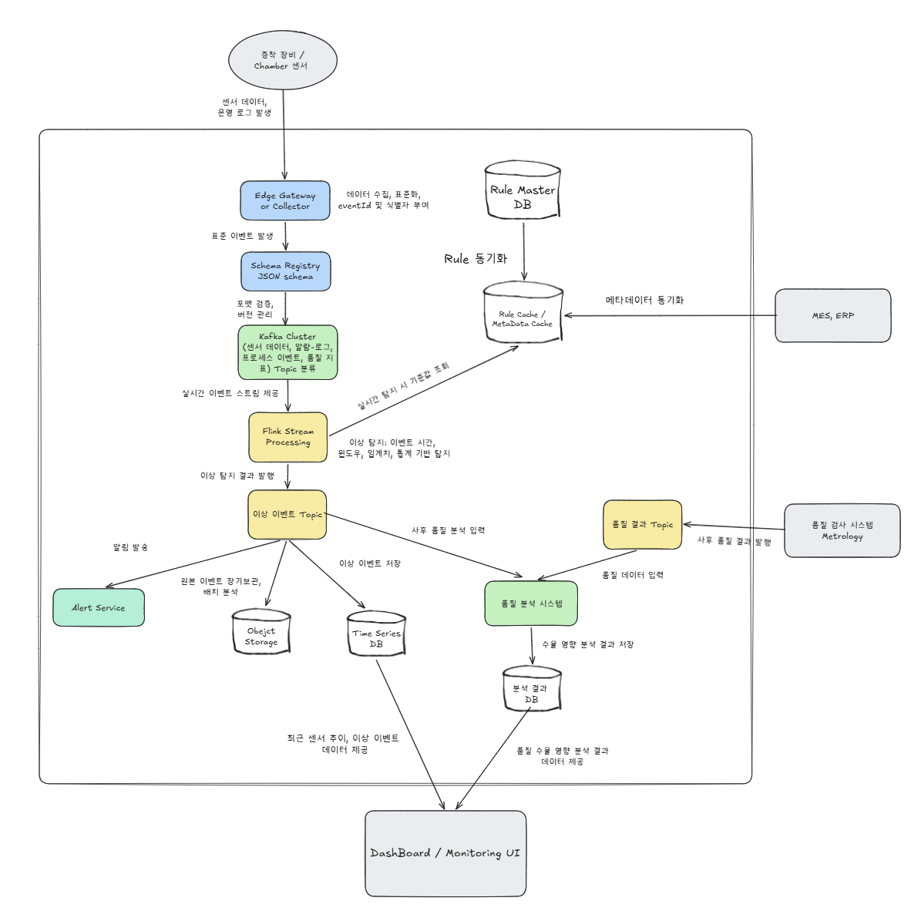

# Week 5 과제: 제조 설비 이벤트 수집 및 이상 탐지 시스템 설계

> 제조 설비에서 지속적으로 발생하는 센서 데이터와 운영 로그를 이벤트 스트림으로 수집하고, 이를 실시간으로 처리해 이상 징후를 탐지하는 시스템을 설계합니다

---

## ⒈ 문제 이해 및 설계 범위 확정

**시나리오**

과제에서는 반도체 증착 공정 모니터링 시스템인 `DepoSense`를 설계한다.

DepoSense는 반도체 제조 라인의 증착 장비에서 발생하는 센서 데이터와 운영 로그를 실시간으로 수집하고, 이상 징후를 빠르게 탐지하여 엔지니어가 문제를 확인할 수 있도록 돕는 이벤트 기반 모니터링 시스템이다.

증착 공정은 Wafer 표면에 얇은 박막을 형성하는 과정이며, Chamber 내부의 온도, 압력, 가스 유량, RF Power, 공정 시간과 같은 조건이 안정적으로 유지되어야 한다. 이러한 조건이 흔들리면 박막 두께나 균일도에 영향을 줄 수 있고, 이후 품질 검사에서 결함 증가나 수율 저하로 이어질 수 있다.

예를 들어 특정 Chamber에서 압력이 반복적으로 기준 범위를 벗어나거나, Gas Flow가 불안정하거나, RF Power가 순간적으로 흔들리는 상황이 발생할 수 있다. 이때 DepoSense는 해당 센서 데이터와 Alarm Log를 이벤트 스트림으로 수집하고, 실시간 스트림 처리 과정에서 임계치 또는 통계 기반으로 이상 징후를 탐지한다.

탐지된 이상 이벤트는 Dashboard와 Alert Service를 통해 엔지니어에게 전달된다. 엔지니어는 특정 Chamber의 최근 센서 추이, 이상 이벤트 목록, 알람 이력, 사후 품질 검사 결과와의 연관성을 확인할 수 있다.

본 시스템은 공정 장비를 직접 제어하거나 수율 예측 AI 모델을 학습하는 시스템이 아니다. 설비에서 발생하는 대량의 이벤트를 안정적으로 수집하고, 이상 징후를 빠르게 탐지하며, 이후 Metrology 품질 검사 데이터와 연결해 실제 품질 저하와의 관계를 분석할 수 있는 기반을 제공하는 모니터링 시스템이다.

## 설계 범위 (In / Out of Scope)

---

| 포함 (In Scope) | 제외 (Out of Scope) |
| --- | --- |
| 설비 센서 데이터 수집 | 실제 장비 제어 로직 |
| 이벤트 수집 | PLC/장비 펌웨어 구현 |
| Stream Processing | 반도체 공정 물리 모델 구현 |
| 임계치 기반 이상 탐지 | 정교한 AI 모델 학습 |
| 시계열 데이터 저장 | MES/ERP 전체 구현 |
| Dashboard 조회 구조 | 실제 공정 Recipe 최적화 |
| 알림 시스템 | 완전한 보안 솔루션 |
|    데이터 유실/지연 대응    |     실제 설비 네트워크 구성       |
|        장애 복구 및 재처리            |       공정 장비 직접 제어                  |


## 시스템 구성 전제

---

- 제조 설비와 센서는 이미 존재한다고 가정한다.
- 설비 데이터는 Edge Gateway 또는 Collector를 통해 수집된다고 가정한다.
- Kafka Cluster는 이벤트 수집용 메시지 브로커로 사용 가능하다고 가정한다.
- Stream Processing 엔진은 Kafka Streams, Flink, Spark Streaming 중 하나를 선택할 수 있다.
- 시계열 데이터 저장소는 TimescaleDB, InfluxDB, Prometheus, OpenSearch 등을 사용할 수 있다.
- Dashboard는 Grafana 또는 별도 Web UI를 사용할 수 있다.
- 알림은 사내 ERP, MES, Slack, Email, SMS, 사내 메신저 등으로 발송 가능하다고 가정한다.
- 본 시스템은 설비를 직접 제어하지 않고, 이상 탐지와 모니터링에 집중한다.

## 기능 요구사항

---

### [수집]

증착 장비 내 Chamber에서 발생하는 온도, 압력, 가스 유량, RF Power 등의 센서 데이터와 설비 운영 로그, Alarm 이벤트를 실시간으로 수집할 수 있어야 한다.

### [식별/연결]

수집된 센서 데이터는 `equipmentId`, `chamberId`, `waferId`, `lotId`, `recipeId`, `timestamp`와 함께 저장되어야 하며, 어떤 장비의 어느 Chamber에서 어떤 Wafer/Recipe 수행 중 발생한 데이터인지 식별할 수 있어야 한다.

### [이상 탐지]

실시간 수집된 데이터는 임계치 기반 조건과 이동 평균, 표준편차 기반의 통계 연산을 통해 이상 징후를 판정하는 데 활용될 수 있어야 한다.

### [저장]

센서 원본 데이터, 집계 데이터, 이상 이벤트는 조회 목적과 보관 기간에 따라 분리 저장할 수 있어야 한다.

예를 들어 최근 고해상도 센서 데이터는 시계열 저장소에 저장하고, 장기 분석용 원본 이벤트는 Object Storage 또는 Data Lake에 저장할 수 있다.

### [UI/출력]

설비 모니터링 Dashboard는 특정 Chamber를 선택했을 때 최근 1시간 동안의 주요 센서 추이 그래프와 발생한 이상 이벤트 목록을 한 화면에 시각화하여 반환할 수 있어야 한다.

### [알림]

이상 이벤트가 발생하면 심각도에 따라 엔지니어 또는 담당자에게 알림을 발송할 수 있어야 하며, 동일 이상이 반복될 경우 중복 알림을 억제할 수 있어야 한다.

### [예외 처리/장애]

센서 수집부나 스트림 처리부에 장애가 발생하거나 데이터가 지연 도착하더라도, Kafka의 offset 또는 스트림 처리 상태 복구 기능을 활용해 과거 시점부터 재처리 및 복구할 수 있어야 한다.

### [성과/연계]

이상 탐지 결과와 사후에 도착하는 Wafer 품질 검사, 즉 Metrology 데이터를 연결하여 해당 설비 이상이 실제 두께 편차, 결함 증가, 수율 저하로 이어졌는지 분석할 수 있는 기반 데이터를 제공할 수 있어야 한다.


## 비기능 요구사항

---

| 항목           | 목표                                         |
|--------------|--------------------------------------------|
| 센서 데이터 수집 지연 | 평균 1초 이내                                   |
| 이상 탐지 지연     | 평균 3초 이내                                   |
| 알림 발송 지연     | 이상 감지 후 5초 이내                              |
| 데이터 유실 허용도 | 중요 이벤트는 유실 최소화                             |
| 센서 데이터 저장 기간  | 고해상도 데이터 7~30일, 집계 데이터 1년 이상               |
| 시스템 가용성    | 설비 운영 시간 동안 지속 동작                          |
| 장애 복구    | Consumer 재시작 후 offset 기반 재처리 또는 스트림 처리 상태 복구 |
| 확장성   | 설비 및 센서 증가에 따라 수평 확장 가능                  | 
| 알림 정확도    | false positive / false negative trade-off 고려 |


## 대략적 규모 추정 *(기준값 — 본인 가정으로 변경 가능)*

---

| 항목               | 수치                  |
|------------------|---------------------|
| 대상 공장            | 반도체 Fab             |
| 대상 장비 수          | 500대                |
| 대상 Chamber 수     | 1,000개              |
| 장비당 센서 수         | 50개                 |
| 센서 데이터 발생 주기     | 1초                  |
| 초당 센서 이벤트 수      | 약 50,000 events/sec |
| 일일 센서 이벤트 수      | 약 43억 건             |
| 이상 이벤트 비율        | 전체 이벤트의 0.01~0.1%   |
| Dashboard 동시 사용자 | 100~500명            |
| 알림 대상 엔지니어       | 50 ~ 200명           |
| 고해상도 원본 데이터 보관   | 7~30일       |
| 집계 데이터 보관        | 1년 이상     |

# 2. 개략적 설계안 제시 및 동의 구하기


---

### 핵심 흐름

본 시스템의 전체 흐름은 설비 데이터 수집 → 이벤트 브로커 적재 → 실시간 이상 탐지 → 저장/알림/대시보드 제공 → 사후 품질 분석 연계로 구성된다.
```text
증착 장비 / Chamber 센서
→ Edge Gateway or Collector
→ Kafka Cluster
→ Stream Processing / Anomaly Detection
→ Time Series DB / Object Storage / Alert Service
→ Dashboard / Monitoring UI

```

또한 공정 이후 도착하는 품질 검사 결과는 별도의 품질 검사 시스템에서 Kafka로 발행되며, 실시간 이상 이벤트와 연결되어 사후 품질 영향 분석에 활용된다.
```text
품질 검사 시스템 / Metrology
→ Kafka Cluster
→ 품질 분석 시스템
→ Dashboard / Monitoring UI
```
---

# 3. 상세 설계



## 상세 설계 주제  

이번 상세 설계에서는 제조 설비 이벤트 수집 및 이상 탐지 시스템의 핵심 흐름을 기준으로 다음 네 가지를 중심으로 다룬다.

* 3-1. 대규모 설비 이벤트 수집 구조 설계
* 3-2. 실시간 스트림 처리 및 이상 탐지 파이프라인
* 3-7. 공정 데이터와 품질 데이터의 지연 처리
* 3-8. 데이터 유실, 처리 지연, 저장 비용 Trade-off

이 네 가지를 선택한 이유는 본 시스템의 핵심이 단순히 센서 데이터를 저장하는 것이 아니라, 대량의 설비 이벤트를 안정적으로 수집하고, 실시간으로 이상 징후를 탐지하며, 이후 품질 검사 결과와 연결해 실제 수율 저하와의 관계를 분석하는 데 있기 때문이다.

본 설계에서 사용하는 주요 기술 스택은 다음과 같이 가정한다.

| 영역                | 선택 기술                              | 선택 이유                                           |
| ----------------- | ---------------------------------- | ----------------------------------------------- |
| 이벤트 수집            | Apache Kafka                       | 대량 이벤트 수집, Topic 분리, Consumer 재처리 지원            |
| 수집 계층             | Edge Gateway / Collector           | 설비별 데이터 포맷 표준화                                  |
| Schema 관리         | Schema Registry + JSON Schema      | 이벤트 포맷 변경 관리                                    |
| Stream Processing | Apache Flink                       | Event Time, Window 연산, 상태 관리, Checkpoint 복구에 강점 |
| 이상 탐지 기준 저장       | PostgreSQL 기반 Rule Master DB       | 임계치, Recipe별 정상 범위, 이상 탐지 Rule 관리               |
| 기준값 캐시            | Flink Broadcast State 또는 Redis     | 매 이벤트마다 Rule DB 조회하는 병목 방지                      |
| 시계열 저장            | TimescaleDB                        | SQL 기반 시계열 조회, 장비/Recipe 메타데이터 연계에 유리           |
| 장기 원본 저장          | Object Storage / Data Lake         | 원본 이벤트 장기 보관 및 사후 분석                            |
| 알림                | Alert Service + Slack/Email/MES 연동 | 심각도별 알림 및 중복 알림 억제                              |
| Dashboard         | Grafana 또는 Web UI + Query API      | Chamber별 센서 추이와 이상 이벤트 시각화                      |
| 시스템 모니터링          | Prometheus + Grafana               | Kafka, Flink, Collector 상태 모니터링                 |

---

# 3-1. 대규모 설비 이벤트 수집 구조 설계

## 1. 설계 목표

증착 장비의 각 Chamber에서는 온도, 압력, 가스 유량, RF Power, Alarm Log 같은 데이터가 지속적으로 발생한다. 본 과제의 규모 추정에서는 장비 500대, Chamber 1,000개, 장비당 센서 50개, 센서 데이터 발생 주기 1초를 가정한다. 이 경우 초당 약 50,000건의 센서 이벤트가 발생한다.

이 데이터를 Stream Processor나 DB가 직접 받으면 순간 부하나 장애 상황에서 데이터 유실이 발생하기 쉽다. 따라서 본 설계에서는 Edge Gateway / Collector와 Kafka를 두어 설비 데이터 수집 계층과 실시간 처리 계층을 분리한다.

전체 수집 흐름은 다음과 같다.

```text
증착 장비 / Chamber 센서
→ Edge Gateway / Collector
→ Schema Registry 검증
→ Kafka Cluster
→ Stream Processing / Flink
```

Kafka는 설비 데이터 생산자와 처리 Consumer 사이의 완충 계층 역할을 한다. Collector는 Kafka에 이벤트를 적재하고, Flink는 Kafka에서 처리 가능한 속도로 데이터를 읽어간다.

---

## 2. Edge Gateway / Collector 역할

Edge Gateway 또는 Collector는 설비에서 발생하는 데이터를 중앙 시스템으로 보내기 전에 표준화하는 역할을 한다.

제조 설비는 장비마다 데이터 포맷, 센서 이름, timestamp 형식, 알람 코드 체계가 다를 수 있다. 예를 들어 어떤 장비는 압력 값을 `pressure`로 보내고, 다른 장비는 `chamber_press`로 보낼 수 있다. 이러한 차이를 중앙 처리 시스템이 모두 직접 처리하면 복잡도가 커진다.

Collector는 다음 역할을 담당한다.

```text
장비별 원본 데이터 수집
→ 표준 이벤트 포맷으로 변환
→ eventId 생성
→ equipmentId, chamberId, timestamp 부여
→ waferId, lotId, recipeId 매핑
→ Kafka로 발행
```

즉, Collector는 단순 전달자가 아니라 설비 데이터와 중앙 이벤트 플랫폼 사이의 표준화 계층이다.

---

## 3. 표준 이벤트 포맷

센서 이벤트는 다음과 같은 공통 필드를 가진다.

```json
{
  "eventId": "evt-20260527-000001",
  "eventType": "SENSOR",
  "equipmentId": "EQ-12",
  "chamberId": "CH-03",
  "waferId": "WF-2026-001",
  "lotId": "LOT-77",
  "recipeId": "RCP-A",
  "sensorType": "pressure",
  "value": 3.8,
  "unit": "Torr",
  "eventTime": "2026-05-27T10:00:01",
  "collectedAt": "2026-05-27T10:00:02"
}
```

| 필드          | 의미                                        |
| ----------- | ----------------------------------------- |
| eventId     | 이벤트 고유 ID                                 |
| eventType   | SENSOR, ALARM, PROCESS, QUALITY           |
| equipmentId | 장비 ID                                     |
| chamberId   | Chamber ID                                |
| waferId     | Wafer ID                                  |
| lotId       | Lot ID                                    |
| recipeId    | 공정 Recipe ID                              |
| sensorType  | pressure, temperature, gasFlow, rfPower 등 |
| value       | 센서 측정값                                    |
| unit        | 측정 단위                                     |
| eventTime   | 장비에서 이벤트가 실제 발생한 시간                       |
| collectedAt | Collector가 수집한 시간                         |

이 포맷에서 중요한 점은 `eventTime`과 `collectedAt`을 분리하는 것이다. `eventTime`은 장비에서 센서 값이 실제 발생한 시간이고, `collectedAt`은 Collector가 데이터를 수집한 시간이다. 두 시간을 분리해야 데이터가 지연 도착했을 때도 실제 발생 시간 기준으로 Window 연산을 수행할 수 있다.

---

## 4. Schema Registry 도입

센서 이벤트는 시간이 지나면서 필드가 추가되거나 변경될 수 있다. 예를 들어 처음에는 `pressure`, `temperature`만 사용하다가 이후 `plasmaStatus`, `rfVoltage` 같은 필드가 추가될 수 있다.

이때 Producer와 Consumer가 서로 다른 Schema를 사용하면 파싱 오류가 발생할 수 있다. 따라서 Kafka 기반 이벤트 시스템에서는 Schema Registry를 두어 이벤트 포맷을 관리한다.

```text
Collector
→ Schema Registry에서 Schema 확인
→ Kafka에 이벤트 발행

Flink Consumer
→ Schema Registry 기준으로 이벤트 역직렬화
→ Schema 불일치 시 DLQ로 분리
```

본 설계에서는 이해와 구현 편의성을 위해 JSON Schema를 우선 사용한다고 가정한다. 추후 성능과 Schema 호환성 관리가 더 중요해지면 Avro를 사용할 수 있다.

---

## 5. Kafka Topic 설계

Kafka Topic은 데이터 성격별로 분리한다.

| Topic             | 설명                                 |
| ----------------- | ---------------------------------- |
| sensor-data       | 고빈도 센서 데이터                         |
| alarm-log         | 장비 Alarm, Warning, Error 로그        |
| process-event     | 공정 시작, 종료, Step 변경, Run/Idle 상태 변화 |
| quality-result    | Metrology 품질 검사 결과                 |
| anomaly-event     | Stream Processing에서 생성한 이상 탐지 결과   |
| dead-letter-event | Schema 오류, 필수 필드 누락, 파싱 실패 이벤트     |

Topic을 분리하는 이유는 데이터의 발생 빈도와 중요도, Consumer가 다르기 때문이다.

`sensor-data`는 초당 대량으로 발생하고 실시간 이상 탐지와 시계열 저장에 사용된다. `alarm-log`는 발생량은 상대적으로 적지만 즉시 알림이 중요하다. `process-event`는 Wafer/Recipe 진행 상태와 센서 데이터를 연결하는 데 사용된다. `quality-result`는 공정 이후 도착하는 Metrology 데이터이며, 사후 품질 분석에 사용된다. `anomaly-event`는 Flink에서 생성한 이상 탐지 결과로 Alert Service와 Dashboard가 구독한다.

---

## 6. Partition Key 설계

본 설계에서는 `sensor-data` Topic의 기본 Partition Key를 `chamberId`로 둔다.

```text
partition key = chamberId
```

이유는 이상 탐지가 대체로 Chamber 단위로 수행되기 때문이다. 같은 Chamber에서 발생한 센서 데이터가 같은 Partition으로 들어가면 해당 Chamber 내 이벤트 순서를 유지하기 쉽다.

다만 특정 Chamber에서 데이터가 과도하게 발생하면 특정 Partition에 데이터가 몰리는 Hot Partition 문제가 발생할 수 있다. 이를 완화하기 위해 다음 보완안을 고려한다.

```text
기본안:
partition key = chamberId

보완안:
partition key = chamberId + sensorType

또는:
partition key = hash(equipmentId + chamberId + sensorType)
```

초기 설계에서는 Chamber 단위 순서 보장을 우선해 `chamberId`를 사용한다. 이후 특정 Chamber에 트래픽이 집중되는 것이 확인되면 `chamberId + sensorType` 조합으로 분산하는 전략을 고려한다.

---

## 7. Producer 안정성 설정

Collector는 Kafka Producer 역할을 수행한다. 제조 설비 데이터는 품질 분석과 이상 탐지에 활용되므로 데이터 유실을 최소화해야 한다.

Producer 설정은 다음과 같이 둔다.

| 설정                 | 선택              |
| ------------------ | --------------- |
| acks               | all             |
| retries            | 활성화             |
| enable.idempotence | true            |
| compression        | lz4 또는 snappy   |
| linger.ms          | 낮은 값으로 설정       |
| batch.size         | 처리량과 지연 사이에서 조정 |

`acks=all`은 Kafka Leader와 Replica에 데이터가 기록된 뒤 성공 응답을 받는 방식이다. 데이터 유실 가능성을 줄일 수 있지만 지연이 증가할 수 있다.

`enable.idempotence=true`는 Producer 재시도 시 중복 메시지 발생 가능성을 줄인다.

압축은 네트워크 사용량을 줄이는 데 도움이 되지만 CPU 사용량이 증가할 수 있다.

---

## 8. 장애 처리와 중복 처리

Collector 장애나 Kafka 전송 실패가 발생하면 데이터가 일시적으로 전송되지 않을 수 있다. 이때 Collector는 짧은 시간 동안 로컬 버퍼 또는 재전송 큐를 사용할 수 있다.

```text
Kafka 전송 실패
→ Collector 로컬 버퍼에 임시 저장
→ Kafka 복구 후 재전송
```

다만 재전송 과정에서 같은 이벤트가 중복으로 들어올 수 있다. 이를 방지하기 위해 각 이벤트에는 `eventId`를 부여한다.

```text
같은 eventId가 이미 처리됨
→ 중복 저장 / 중복 알림 방지
```

이 구조는 At-least-once 처리에 가깝다. 즉, 데이터 유실을 줄이는 대신 중복 가능성을 허용하고, 중복은 `eventId` 기반으로 제거한다.

---

## 9. 3-1 설계 Trade-off

### 데이터 유실 최소화 vs 낮은 지연

`acks=all`, retry, idempotent producer를 사용하면 데이터 유실 가능성을 줄일 수 있다. 하지만 Kafka 응답을 기다리는 시간이 늘어나므로 지연이 증가할 수 있다.

본 설계에서는 제조 품질 분석에 중요한 데이터를 다루므로 센서 데이터와 알람 이벤트는 낮은 지연보다 유실 최소화를 우선한다. 다만 수집 지연 목표가 평균 1초 이내이므로 `batch.size`와 `linger.ms`는 과도하게 키우지 않는다.

### 순서 보장 vs 부하 분산

`chamberId`를 Partition Key로 사용하면 같은 Chamber의 이벤트 순서를 보장하기 쉽다. 하지만 특정 Chamber에 데이터가 몰리면 Hot Partition이 발생할 수 있다.

따라서 초기에는 `chamberId`를 사용하고, 트래픽 분포를 관찰한 뒤 필요하면 `chamberId + sensorType`으로 분산한다.

### 표준화 비용 vs 처리 단순성

Collector에서 표준 이벤트 포맷으로 변환하면 초기 구현 비용은 증가한다. 하지만 Stream Processor와 저장소는 통일된 Schema를 처리하면 되므로 후속 처리 복잡도가 줄어든다.

---

## 10. 3-1 요약

3-1 설계에서는 증착 장비에서 발생하는 대량 센서 데이터를 안정적으로 Kafka까지 전달하는 구조를 설계했다.

Edge Gateway / Collector는 장비별 데이터 포맷을 표준 이벤트로 변환하고, Kafka는 대량 이벤트를 수집하는 버퍼 역할을 한다.

Topic은 데이터 성격별로 분리하고, 센서 데이터의 기본 Partition Key는 Chamber 단위 순서 보장을 위해 `chamberId`로 둔다.

Producer는 `acks=all`, retry, idempotence를 사용해 데이터 유실을 줄이고, `eventId` 기반 중복 제거를 통해 재전송이나 재처리 상황에서도 안정성을 확보한다.

---

# 3-2. 실시간 스트림 처리 및 이상 탐지 파이프라인

## 1. 설계 목표

Kafka에 수집된 설비 이벤트를 단순 저장만 하면 이상 징후를 실시간으로 감지할 수 없다. 따라서 Stream Processing 계층을 두고, Kafka Topic을 구독해 실시간으로 데이터를 전처리하고, Window 단위로 집계하며, 임계치 기반 및 통계 기반 이상 탐지를 수행한다.

본 설계에서는 Stream Processing 엔진으로 Apache Flink를 선택한다.

Flink를 선택한 이유는 다음과 같다.

* Event Time 기반 처리에 강하다.
* Window 연산을 지원한다.
* Stateful Stream Processing에 강하다.
* Checkpoint 기반 장애 복구를 지원한다.
* Kafka와 연동이 자연스럽다.

제조 설비 데이터는 실제 발생 시간과 처리 시간이 다를 수 있고, 최근 1분 평균, 5분 표준편차 같은 Window 연산이 필요하다. 또한 Stream Processor 장애 시 중간 계산 상태를 복구해야 하므로 Flink가 적합하다고 판단했다.

---

## 2. 처리 흐름

실시간 이상 탐지 흐름은 다음과 같다.

```text
Kafka sensor-data topic
→ Flink Stream Job
→ Event Time 기준 정렬
→ Chamber / Sensor / Recipe 기준 그룹화
→ Window 집계
→ Rule Cache 기준값 적용
→ 임계치 / 통계 기반 이상 탐지
→ anomaly-event topic 발행
→ Time-series DB 저장
→ Alert Service 구독
```

Flink는 Kafka에서 센서 이벤트를 읽고, `equipmentId`, `chamberId`, `sensorType`, `recipeId`를 기준으로 데이터를 그룹화한다. 이후 Event Time 기준 Window 연산을 수행하고, Rule Master DB에서 동기화된 기준값을 활용해 이상 여부를 판단한다.

---

## 3. Rule 기준값 적용

이상 탐지 기준값은 PostgreSQL 기반 Rule Master DB에서 관리한다.

Rule Master DB에는 다음과 같은 값이 저장될 수 있다.

| 기준값            | 의미                       |
| -------------- | ------------------------ |
| Upper Limit    | 센서 값이 이 값보다 크면 이상 후보     |
| Lower Limit    | 센서 값이 이 값보다 작으면 이상 후보    |
| Warning Limit  | 주의 단계 기준                 |
| Critical Limit | 심각 단계 기준                 |
| Recipe별 정상 범위  | Recipe에 따라 달라지는 정상 센서 범위 |
| 연속 초과 횟수       | N회 이상 초과 시 이상 판정         |
| 이동 평균 기준       | 최근 평균이 기준 범위를 벗어나는지 판단   |
| 표준편차 기준        | 변동성이 평소보다 큰지 판단          |

센서 이벤트가 초당 수만 건 들어오는 상황에서 Stream Processor가 매 이벤트마다 Rule Master DB를 직접 조회하면 병목이 된다. 따라서 Rule 기준값은 Flink Broadcast State 또는 Redis 기반 Rule Cache에 적재해 사용한다.

```text
Rule Master DB
→ Rule Cache / Flink Broadcast State
→ Flink Stream Job
```

Rule 기준값은 주기적으로 동기화하거나, Rule 변경 이벤트를 Kafka Topic으로 발행해 Flink가 갱신할 수 있다.

---

## 4. 이상 탐지 방식

본 설계에서는 복잡한 AI 모델을 사용하지 않고, 1차적으로 임계치 기반 탐지와 통계 기반 탐지를 조합한다.

### 1) 임계치 기반 탐지

임계치 기반 탐지는 가장 단순하고 설명 가능한 방식이다.

예를 들어 압력 센서의 정상 범위가 2.8~3.2 Torr라면, 이 범위를 벗어나는 값을 이상 후보로 판단한다.

```text
pressure > upperLimit
temperature < lowerLimit
gasFlow 목표값 대비 ±5% 이상 편차
rfPower 순간 변동폭 기준 초과
```

단, 한 번 임계치를 초과했다고 바로 알림을 보내면 오탐이 많아질 수 있다. 따라서 연속 N회 이상 초과하거나, 일정 시간 Window 평균이 기준을 벗어나는 경우 이상으로 판단한다.

### 2) 통계 기반 탐지

고정 임계치만으로는 서서히 진행되는 이상이나 변동성 증가를 감지하기 어렵다. 따라서 이동 평균과 표준편차를 활용한 통계 기반 탐지를 함께 적용한다.

예시는 다음과 같다.

```text
최근 1분 pressure 이동 평균이 Upper Limit 초과
최근 5분 rfPower 표준편차가 기준 이상
최근 5분 gasFlow가 지속적으로 감소하는 drift 감지
```

통계 기반 탐지는 특정 Chamber에서 평소보다 변동성이 커지는 경우나, 센서 값이 서서히 나빠지는 경우를 감지하는 데 유리하다.

---

## 5. Window 설계

Stream Processing에서는 최근 일정 시간 범위의 데이터를 묶어 계산하기 위해 Window 연산을 사용한다.

| Window     | 용도                    |
| ---------- | --------------------- |
| 10초 Window | 순간 급변 감지              |
| 1분 Window  | 이동 평균, 연속 초과 판단       |
| 5분 Window  | 표준편차, drift 감지        |
| 1시간 집계     | Dashboard 및 장기 분석용 집계 |

너무 짧은 Window는 노이즈에 민감해 오탐을 늘릴 수 있고, 너무 긴 Window는 이상 탐지 지연을 증가시킬 수 있다.

본 설계에서는 실시간 이상 탐지는 10초~1분 Window를 중심으로 수행하고, 추세 분석은 5분 이상의 Window를 활용한다.

---

## 6. Event Time과 지연 도착 데이터 처리

제조 설비 데이터는 실제 발생 시각과 서버에서 처리되는 시각이 다를 수 있다.

| 시간 기준           | 의미                  |
| --------------- | ------------------- |
| Event Time      | 장비에서 이벤트가 실제 발생한 시간 |
| Processing Time | Flink가 이벤트를 처리한 시간  |

본 설계에서는 이상 탐지의 정확성을 위해 Event Time 기준으로 Window를 계산한다.

데이터가 늦게 도착하는 경우를 고려해 허용 지연 시간을 둔다.

```text
30초 이내 지연 도착
→ 기존 Window에 반영

30초 초과 지연 도착
→ late-event topic으로 분리
→ 사후 분석용으로 저장
```

이를 통해 일시적인 네트워크 지연이나 Collector 지연이 있어도 실제 발생 시간 기준의 분석 정확도를 유지할 수 있다.

---

## 7. 이상 이벤트 포맷

이상 탐지 결과는 `anomaly-event` Topic에 발행한다.

```json
{
  "anomalyId": "anom-CH03-pressure-202605271000",
  "equipmentId": "EQ-12",
  "chamberId": "CH-03",
  "waferId": "WF-2026-001",
  "lotId": "LOT-77",
  "recipeId": "RCP-A",
  "sensorType": "pressure",
  "detectedValue": 3.8,
  "threshold": 3.2,
  "severity": "CRITICAL",
  "ruleType": "THRESHOLD",
  "windowStart": "2026-05-27T10:00:00",
  "windowEnd": "2026-05-27T10:01:00",
  "detectedAt": "2026-05-27T10:01:02",
  "message": "Chamber pressure exceeded upper limit for 1 minute"
}
```

`anomalyId`는 다음과 같이 결정적으로 생성한다.

```text
anomalyId =
chamberId + sensorType + ruleType + windowStart
```

이렇게 하면 장애 복구나 재처리 과정에서 같은 이상 이벤트가 다시 생성되더라도 중복 저장이나 중복 알림을 방지할 수 있다.

---

## 8. Flink Checkpoint 기반 복구

Flink는 Window 집계나 이동 평균 계산 중간 상태를 가지고 있다. 예를 들어 최근 1분 평균을 계산하려면 현재까지의 합계, 개수, Window 시작/종료 시간 같은 상태가 필요하다.

장애가 발생하면 단순히 Kafka offset만 복구해서는 부족하다. 중간 계산 상태도 함께 복구해야 한다.

따라서 본 설계에서는 Flink Checkpoint를 사용한다.

```text
Flink 상태 저장
- 마지막으로 처리한 Kafka offset
- Window 집계 상태
- 이동 평균 계산 상태
- 표준편차 계산 상태
```

장애 발생 시 Flink는 마지막 Checkpoint 상태로 복구하고, 해당 시점 이후의 Kafka offset부터 다시 처리한다.

다만 재처리 과정에서 이상 이벤트가 중복 발행될 수 있으므로, `anomalyId` 기반 idempotent 처리를 적용한다.

---

## 9. 이상 이벤트 저장 및 알림 연결

Flink에서 생성된 `anomaly-event`는 Kafka Topic으로 발행된다.

이후 처리 흐름은 다음과 같다.

```text
anomaly-event topic
→ Alert Service
→ Slack / Email / MES 알림

anomaly-event topic
→ TimescaleDB
→ Dashboard 조회

anomaly-event topic
→ Object Storage
→ 사후 분석
```

Alert Service는 심각도에 따라 알림 대상을 다르게 설정하고, 동일 이상이 반복 발생할 경우 일정 시간 동안 중복 알림을 억제한다.

예를 들어 동일 `equipmentId + chamberId + sensorType + ruleType`에 대해 5분 동안 중복 알림을 보내지 않을 수 있다. 단, WARNING에서 CRITICAL로 심각도가 상승하면 즉시 재알림한다.

---

## 10. 3-2 설계 Trade-off

### Flink 선택에 따른 장점과 단점

Flink는 Event Time, Window, 상태 관리, Checkpoint 복구에 강점이 있다. 따라서 지연 도착 데이터와 상태 기반 이상 탐지에 적합하다.

반면 Kafka Streams보다 운영 복잡도가 높고, 별도 클러스터 운영과 모니터링이 필요하다.

### 오탐과 미탐

임계치와 Window를 민감하게 설정하면 실제 이상을 빠르게 잡을 수 있지만 오탐이 증가한다. 반대로 기준을 보수적으로 설정하면 오탐은 줄지만 실제 이상을 늦게 감지할 수 있다.

따라서 임계치 기반 탐지, 연속 초과 횟수, 이동 평균, 표준편차를 조합해 false positive와 false negative 사이의 균형을 맞춘다.

### 실시간성 vs 정확성

짧은 Window를 사용하면 빠르게 탐지할 수 있지만 노이즈에 민감하다. 긴 Window를 사용하면 안정적인 판단이 가능하지만 탐지가 늦어진다.

본 설계에서는 10초~1분 Window를 실시간 탐지에 사용하고, 5분 Window는 추세 분석에 사용한다.

---

## 11. 3-2 요약

3-2 설계에서는 Kafka에 수집된 설비 이벤트를 Flink 기반으로 실시간 처리하고 이상 징후를 탐지하는 구조를 설계했다.

Flink는 Event Time 기준으로 데이터를 처리하고, Window 연산을 통해 이동 평균과 표준편차를 계산한다. Rule 기준값은 Rule Master DB에서 관리하되, Flink Broadcast State 또는 Redis Cache를 통해 빠르게 조회한다.

이상 이벤트는 `anomaly-event` Topic에 발행하고, Alert Service, Dashboard, 장기 분석 저장소가 이를 구독한다.

장애 발생 시 Flink Checkpoint를 기반으로 Kafka offset과 중간 상태를 함께 복구하며, `anomalyId`를 결정적으로 생성해 중복 이벤트를 방지한다.

---

# 3-7. 공정 데이터와 품질 데이터의 지연 처리

## 1. 설계 목표

실시간 이상 탐지 시스템은 공정 중 발생하는 센서 이상을 빠르게 감지하는 데 목적이 있다. 그러나 센서 이상이 실제 품질 저하로 이어졌는지는 공정 이후 도착하는 품질 검사 데이터, 즉 Metrology 데이터를 함께 봐야 알 수 있다.

예를 들어 특정 Chamber에서 pressure 이상이 감지되었더라도, 해당 Wafer의 박막 두께나 균일도에 실제 문제가 있었는지는 Metrology 결과가 도착한 뒤 확인할 수 있다.

따라서 본 설계에서는 실시간 이상 탐지와 사후 품질 분석을 분리하되, `waferId`, `lotId`, `recipeId`, `chamberId`를 기준으로 두 데이터를 연결할 수 있는 구조를 둔다.

---

## 2. Metrology 데이터란?

Metrology 데이터는 공정 이후 Wafer의 품질을 측정한 계측/검사 데이터이다.

증착 공정에서는 다음과 같은 값이 포함될 수 있다.

| 데이터             | 의미       |
| --------------- | -------- |
| filmThickness   | 박막 두께    |
| uniformity      | 박막 균일도   |
| defectCount     | 결함 수     |
| yieldMetric     | 수율 관련 지표 |
| measurementTime | 품질 측정 시간 |

Metrology 데이터는 실시간 센서 데이터보다 늦게 도착할 수 있다. 따라서 이를 실시간 이상 탐지와 동일한 흐름에서 즉시 Join하려고 하면 설계가 복잡해진다.

본 설계에서는 품질 데이터가 도착하면 별도 Topic으로 수집하고, 사후 분석 계층에서 이상 이벤트와 연결한다.

---

## 3. 데이터 흐름

공정 데이터와 품질 데이터의 연결 흐름은 다음과 같다.

```text
실시간 센서 데이터
→ sensor-data topic
→ Flink 이상 탐지
→ anomaly-event topic
→ TimescaleDB / Object Storage 저장

품질 검사 데이터
→ quality-result topic
→ 품질 데이터 저장
→ anomaly-event와 사후 Join
→ 품질 영향 분석
```

실시간 알림은 `anomaly-event` 발생 시점에 먼저 수행한다. 이후 Metrology 데이터가 도착하면 해당 이상 이벤트와 연결해 실제 품질 저하와 관련이 있었는지 분석한다.

---

## 4. Join Key 설계

센서 이상 이벤트와 품질 검사 데이터를 연결하기 위해 다음 식별자를 사용한다.

| Key                     | 역할                 |
| ----------------------- | ------------------ |
| waferId                 | 특정 Wafer 단위 연결     |
| lotId                   | 생산 Lot 단위 연결       |
| recipeId                | 공정 Recipe 기준 연결    |
| chamberId               | 이상이 발생한 Chamber 연결 |
| equipmentId             | 장비 기준 연결           |
| eventTime / processTime | 공정 시간 구간 연결        |

기본 연결 기준은 `waferId + recipeId + chamberId`로 둔다.

```text
anomaly-event.waferId
= quality-result.waferId

anomaly-event.recipeId
= quality-result.recipeId

anomaly-event.chamberId
= quality-result.chamberId
```

이렇게 연결하면 특정 Wafer가 어떤 Chamber에서 어떤 Recipe로 처리되는 동안 어떤 이상 이벤트가 있었고, 이후 품질 검사에서 어떤 결과가 나왔는지 추적할 수 있다.

---

## 5. 실시간 탐지와 사후 분석 분리

실시간 이상 탐지와 사후 품질 분석은 목적과 시간 요구사항이 다르다.

| 구분     | 실시간 이상 탐지           | 사후 품질 분석              |
| ------ | ------------------- | --------------------- |
| 목적     | 이상 징후 빠른 감지         | 이상과 품질 저하의 관계 분석      |
| 입력 데이터 | 센서 데이터, 알람 로그       | 이상 이벤트, Metrology 데이터 |
| 처리 시간  | 수 초 이내              | 수 분~수 시간 지연 허용        |
| 처리 방식  | Stream Processing   | Batch 또는 준실시간 분석      |
| 결과     | Alert, Dashboard 표시 | 품질 영향 분석, 개선 근거       |

따라서 본 설계에서는 실시간 이상 탐지는 Flink에서 수행하고, 품질 데이터와의 연결 분석은 별도 Batch Job 또는 분석 API에서 수행한다.

---

## 6. 저장 구조

품질 분석을 위해 원본 센서 데이터, 이상 이벤트, 품질 검사 결과를 모두 보관한다.

| 데이터           | 저장소                          | 용도                |
| ------------- | ---------------------------- | ----------------- |
| 고해상도 센서 데이터   | TimescaleDB                  | 최근 센서 추이 조회       |
| 원본 이벤트        | Object Storage / Data Lake   | 장기 분석             |
| 이상 이벤트        | TimescaleDB + Object Storage | Dashboard 및 사후 분석 |
| Metrology 데이터 | PostgreSQL 또는 Data Lake      | 품질 결과 관리          |
| Join 결과       | 분석 테이블 / Data Mart           | 수율 영향 분석          |

고해상도 센서 데이터는 7~30일 보관하고, 원본 이벤트와 집계 데이터는 장기 분석을 위해 Object Storage에 저장한다.

사후 품질 분석 결과는 별도 분석 테이블 또는 Data Mart에 저장해 Dashboard나 리포트에서 활용할 수 있다.

---

## 7. 지연 도착 처리

품질 검사 데이터는 공정 직후 바로 도착하지 않을 수 있다.

예를 들어 공정 중 10:00에 이상 이벤트가 발생했지만, 품질 측정 결과는 11:00에 도착할 수 있다.

이 경우 실시간 알림은 먼저 발생시키고, 품질 결과가 도착한 뒤 사후 분석을 수행한다.

```text
10:00 pressure 이상 감지
→ Alert 발송
→ anomaly-event 저장

11:00 Metrology 결과 도착
→ waferId 기준 anomaly-event 조회
→ 품질 저하 여부 분석
```

즉, 실시간 경고와 품질 영향 분석을 분리함으로써 실시간성을 유지하면서도 사후 원인 분석이 가능하도록 한다.

---

## 8. 분석 예시

예를 들어 다음과 같은 분석이 가능하다.

```text
CH-03에서 pressure 이상이 발생한 Wafer 그룹
vs
정상 조건에서 처리된 Wafer 그룹

두 그룹의 filmThickness 편차와 defectCount 비교
```

또는 다음과 같은 질문에 답할 수 있다.

```text
특정 Recipe 수행 중 gasFlow 이상이 발생한 Wafer의 불량률이 높았는가?
특정 Chamber에서 반복된 RF Power 이상이 uniformity 저하와 연결되었는가?
특정 장비의 Alarm 발생 이후 defectCount가 증가했는가?
```

이 분석 결과는 이후 Rule 기준값 조정, 설비 점검 우선순위 결정, 공정 조건 개선의 근거로 활용될 수 있다.

---

## 9. 3-7 설계 Trade-off

### 실시간 Join vs 사후 Join

품질 데이터를 실시간 Stream에 직접 Join하려고 하면 구조가 복잡해지고 지연 데이터 처리 문제가 커진다. 반면 사후 Join은 실시간 알림과 품질 분석을 분리해 구조가 단순해진다.

본 설계에서는 품질 데이터가 늦게 도착하는 특성을 고려해 사후 Join을 선택한다.

### 원본 데이터 보관 비용

수율 저하 원인을 분석하려면 원본 센서 데이터를 보관해야 한다. 그러나 모든 데이터를 장기간 고해상도로 저장하면 비용이 매우 커진다.

따라서 최근 데이터는 TimescaleDB에 고해상도로 저장하고, 장기 원본은 Object Storage에 보관한다.

### 식별자 정확성

`waferId`, `lotId`, `recipeId`, `chamberId` 매핑이 정확하지 않으면 센서 이상과 품질 결과를 잘못 연결할 수 있다. 따라서 Collector 단계에서 식별 정보를 정확히 붙이는 것이 중요하다.

---

## 10. 3-7 요약

3-7 설계에서는 실시간 이상 탐지 결과와 사후에 도착하는 Metrology 데이터를 연결하는 구조를 설계했다.

실시간 이상 탐지는 Flink에서 수행하고, 이상 이벤트는 `anomaly-event` Topic과 저장소에 기록한다. Metrology 데이터는 `quality-result` Topic으로 들어오며, 이후 `waferId`, `recipeId`, `chamberId`를 기준으로 이상 이벤트와 연결된다.

본 설계는 실시간 알림과 사후 품질 분석을 분리해 시스템 복잡도를 줄이면서도, 설비 이상이 실제 두께 편차, 결함 증가, 수율 저하로 이어졌는지 분석할 수 있는 기반을 제공한다.

---

# 3-8. 데이터 유실, 처리 지연, 저장 비용 Trade-off

## 1. 설계 목표

제조 설비 데이터 파이프라인에서는 데이터 유실, 처리 지연, 저장 비용을 동시에 최적화하기 어렵다.

데이터 유실을 최소화하려면 복제, 재시도, 안정적인 commit 정책을 강화해야 한다. 하지만 이는 지연과 비용을 증가시킬 수 있다.

처리 지연을 줄이려면 batch 크기를 줄이고 빠르게 처리해야 하지만, 처리량과 네트워크 효율이 떨어질 수 있다.

저장 비용을 줄이려면 데이터를 집계하거나 downsampling해야 하지만, 사후 원인 분석에 필요한 세부 데이터를 잃을 수 있다.

따라서 본 설계에서는 데이터 유형별 중요도에 따라 다른 정책을 적용한다.

---

## 2. 데이터 유형별 중요도 분리

모든 데이터를 동일한 수준으로 처리하면 비용이 과도하게 커진다. 따라서 데이터 유형별로 중요도와 처리 정책을 다르게 둔다.

| 데이터 유형         | 중요도   | 처리 정책                       |
| -------------- | ----- | --------------------------- |
| alarm-log      | 매우 높음 | 유실 최소화, 즉시 알림               |
| process-event  | 높음    | Wafer/Recipe 연결에 중요, 유실 최소화 |
| sensor-data    | 중간~높음 | 실시간 탐지에는 중요, 장기 저장은 집계/압축   |
| anomaly-event  | 매우 높음 | 중복 방지, 장기 보관                |
| quality-result | 높음    | 사후 품질 분석에 중요                |
| 시스템 모니터링 메트릭   | 중간    | Prometheus에 저장, 운영 관제용      |

알람 이벤트, 공정 이벤트, 이상 이벤트는 유실을 최소화해야 한다. 반면 고빈도 센서 원본 데이터는 최근 기간에는 고해상도로 저장하되, 장기 보관 시에는 집계 또는 압축을 적용한다.

---

## 3. 데이터 유실 최소화 vs 처리 지연

Kafka Producer에서 `acks=all`, retry, idempotence를 사용하면 데이터 유실 가능성을 줄일 수 있다.

하지만 이 경우 Kafka에 안전하게 기록되었다는 응답을 기다려야 하므로 지연이 증가할 수 있다.

```text
유실 최소화 설정
→ acks=all
→ retry 활성화
→ idempotent producer
→ 안정성 증가
→ 지연 증가 가능
```

본 설계에서는 중요 이벤트에 대해 유실 최소화를 우선한다. 특히 `alarm-log`, `process-event`, `anomaly-event`, `quality-result`는 데이터 유실 시 품질 분석과 장애 대응에 영향을 줄 수 있으므로 안정성을 우선한다.

센서 원본 데이터는 실시간 이상 탐지에 필요하므로 수집 지연 평균 1초 이내를 만족하는 범위에서 안정성을 확보한다.

---

## 4. 처리량 vs 지연

Kafka Producer의 `batch.size`와 `linger.ms`를 키우면 여러 이벤트를 묶어서 전송할 수 있어 처리량이 좋아진다.

하지만 이벤트가 batch에 모일 때까지 기다리므로 개별 이벤트 지연은 증가한다.

```text
batch.size 증가
→ 처리량 증가
→ 네트워크 효율 증가
→ 개별 이벤트 지연 증가
```

본 시스템은 이상 탐지 지연 평균 3초 이내, 알림 발송 지연 5초 이내를 목표로 하므로 batch 설정을 과도하게 키우지 않는다.

즉, 처리량과 실시간성 사이에서 균형을 잡는다.

---

## 5. 저장 비용 vs 분석 정확도

초당 50,000건의 센서 데이터를 모두 고해상도로 장기 보관하면 저장 비용이 매우 커진다.

따라서 저장 정책을 다음과 같이 분리한다.

| 데이터            | 저장 방식                        | 보관 기간 |
| -------------- | ---------------------------- | ----- |
| 최근 고해상도 센서 데이터 | TimescaleDB                  | 7~30일 |
| 1분/5분 집계 데이터   | TimescaleDB                  | 1년 이상 |
| 원본 이벤트 장기 보관   | Object Storage / Data Lake   | 장기 보관 |
| 이상 이벤트         | TimescaleDB + Object Storage | 장기 보관 |
| Metrology 데이터  | PostgreSQL 또는 Data Lake      | 장기 보관 |

최근 데이터는 Dashboard와 실시간 원인 분석에 필요하므로 고해상도로 보관한다.

오래된 데이터는 downsampling하여 1분/5분 단위 집계 데이터로 저장한다. 다만 사후 분석을 위해 원본 이벤트는 Object Storage에 압축 저장한다.

이렇게 하면 Dashboard 조회 성능과 장기 분석 가능성, 저장 비용 사이의 균형을 잡을 수 있다.

---

## 6. 오탐 vs 미탐

알림 정확도에서도 trade-off가 발생한다.

| 구분             | 의미                       |
| -------------- | ------------------------ |
| False Positive | 실제 이상이 아닌데 이상이라고 판단하는 오탐 |
| False Negative | 실제 이상인데 정상이라고 판단하는 미탐    |

임계치를 민감하게 설정하면 작은 이상도 빠르게 잡을 수 있지만 오탐이 많아진다. 반대로 기준을 보수적으로 설정하면 오탐은 줄지만 실제 이상을 놓칠 수 있다.

본 설계에서는 다음 정책을 조합한다.

```text
단일 초과값만으로 알림 발송하지 않음
연속 N회 이상 초과 시 이상 판단
최근 1분 이동 평균 기준 초과 시 알림
Warning / Critical 심각도 분리
동일 이상 5분간 중복 알림 억제
```

이를 통해 false positive와 false negative 사이의 균형을 맞춘다.

---

## 7. At-least-once 처리와 중복 이벤트

데이터 유실을 줄이기 위해 Kafka와 Flink는 At-least-once 또는 Exactly-once에 가까운 처리를 고려할 수 있다.

At-least-once는 최소 한 번은 처리하는 방식이다. 데이터 유실 가능성은 줄지만 장애 복구나 재처리 과정에서 같은 이벤트가 두 번 처리될 수 있다.

따라서 본 설계에서는 중복 가능성을 인정하고, 다음 방식으로 중복을 제어한다.

```text
센서 이벤트
→ eventId 기반 중복 제거

이상 이벤트
→ anomalyId 기반 중복 제거

알림
→ 동일 equipmentId + chamberId + sensorType + ruleType 기준 suppress
```

즉, 데이터 유실을 줄이되, 중복은 idempotent하게 처리하는 방향을 선택한다.

---

## 8. 3-8 요약

3-8 설계에서는 데이터 유실, 처리 지연, 저장 비용 사이의 trade-off를 정리했다.

본 설계는 모든 데이터를 동일하게 처리하지 않고 데이터 유형별 중요도에 따라 정책을 다르게 둔다.

알람 이벤트, 공정 이벤트, 이상 이벤트, 품질 결과는 유실 최소화를 우선한다. 센서 원본 데이터는 실시간 탐지에는 고해상도로 활용하되, 장기 보관 시에는 집계와 Object Storage를 함께 사용한다.

또한 오탐과 미탐 사이의 균형을 위해 단순 임계치 초과가 아니라 연속 초과, 이동 평균, 심각도 분리, 중복 알림 억제 정책을 함께 적용한다.

---

## 4. 설계 장점

| 장점              | 설명                                                                                                                                     |
| --------------- | -------------------------------------------------------------------------------------------------------------------------------------- |
| 대량 이벤트 수집 안정성   | Edge Gateway / Collector와 Kafka를 통해 설비 데이터 생산 계층과 처리 계층을 분리하여 초당 수만 건의 센서 이벤트를 안정적으로 수집할 수 있다.                                         |
| 데이터 유형별 처리 분리   | `sensor-data`, `alarm-log`, `process-event`, `quality-result`, `anomaly-event` Topic을 분리해 데이터 성격과 Consumer 목적에 따라 처리 흐름을 다르게 가져갈 수 있다. |
| 실시간 이상 탐지 가능    | Flink를 활용해 Event Time 기준 처리, Window 연산, 이동 평균·표준편차 기반 이상 탐지를 수행할 수 있다.                                                                 |
| 이상 탐지 기준 관리 유연성 | Rule Master DB와 Rule Cache를 통해 Upper/Lower Limit, Recipe별 정상 범위, Warning/Critical 기준 등을 코드 수정 없이 관리할 수 있다.                             |
| 조회 성능과 저장 비용 균형 | 최근 고해상도 데이터는 TimescaleDB에 저장하고, 장기 원본·이상 이벤트는 Object Storage에 보관하여 조회 성능과 저장 비용을 함께 고려했다.                                              |
| 사후 품질 분석 가능     | 이상 이벤트와 Metrology 품질 데이터를 `waferId`, `recipeId`, `chamberId` 기준으로 연결해 설비 이상이 실제 품질 저하로 이어졌는지 분석할 수 있다.                                 |
| 장애 복구 고려        | Kafka offset과 Flink Checkpoint를 활용해 Consumer 또는 Stream Processor 장애 시 재처리와 상태 복구가 가능하다.                                                |
| 제조 도메인 식별 구조 반영 | `equipmentId`, `chamberId`, `waferId`, `lotId`, `recipeId`, `eventTime`을 포함해 장비·Chamber·Wafer·Recipe 단위 추적이 가능하다.                      |

## 5. 설계 단점

| 단점                  | 설명                                                                                                           |
| ------------------- | ------------------------------------------------------------------------------------------------------------ |
| 운영 복잡도 증가           | Kafka, Schema Registry, Flink, TimescaleDB, Object Storage, Cache, Alert Service 등 컴포넌트가 많아 운영과 모니터링 부담이 크다. |
| Flink 학습·운영 비용      | Flink는 Event Time, Window, Checkpoint에 강점이 있지만 별도 클러스터 운영, Job 상태 관리, Backpressure 대응 등 학습 비용이 높다.           |
| 중복 처리 가능성           | At-least-once 처리와 장애 복구 과정에서 같은 이벤트가 다시 처리될 수 있으므로 `eventId`, `anomalyId` 기반 중복 방지 로직이 필요하다.                 |
| Hot Partition 위험    | `chamberId`를 Partition Key로 사용하면 Chamber 단위 순서 보장에는 유리하지만 특정 Chamber에 데이터가 몰릴 경우 Partition 병목이 발생할 수 있다.     |
| Rule 품질 의존성         | 임계치와 Recipe별 정상 범위가 부정확하면 오탐 또는 미탐이 발생할 수 있어 Rule 관리와 지속적인 기준값 조정이 필요하다.                                     |
| 오탐·미탐 균형 어려움        | 알림 기준을 민감하게 잡으면 오탐이 늘고, 보수적으로 잡으면 실제 이상을 놓칠 수 있어 알림 정확도와 알림 피로 사이의 균형이 필요하다.                                 |
| 장기 저장 비용 문제         | 초당 수만 건의 센서 원본 데이터를 모두 고해상도로 장기 보관하기 어렵기 때문에 Downsampling, 압축, Object Storage 분리 전략이 필요하다.                   |
| Metrology 연계 정확성 의존 | 이상 이벤트와 품질 결과를 연결하려면 `waferId`, `recipeId`, `chamberId` 등의 식별자가 정확해야 하며, 매핑 오류가 있으면 분석 신뢰도가 떨어진다.            |
| 외부 시스템 의존성          | MES/ERP, Rule Master DB, Metrology 시스템에 의존하므로 외부 시스템 장애나 지연이 탐지·조회·분석 품질에 영향을 줄 수 있다.                        |


---

## 추가 학습한 개념 정리

## 1. Hot Partition

Hot Partition은 Kafka Topic의 특정 Partition에 데이터가 과도하게 몰려 병목이 발생하는 상황을 말한다.

예를 들어 `chamberId`를 Partition Key로 설정했을 때 특정 Chamber에서 데이터가 유독 많이 발생하면, 해당 Chamber가 매핑된 Partition만 과부하될 수 있다.

```text
partition 0: 정상
partition 1: 정상
partition 2: CH-03 데이터 집중
```

이 경우 해당 Partition을 읽는 Consumer 처리 지연이 증가하고, 특정 Chamber의 이상 탐지가 늦어질 수 있다.

대응 방법은 다음과 같다.

* Partition Key를 `chamberId + sensorType`으로 조정
* Partition 수 증가
* 특정 고부하 Chamber를 별도 Topic으로 분리
* Consumer 병렬도 조정

다만 Partition Key를 너무 잘게 나누면 같은 Chamber 내 전체 이벤트 순서 보장이 약해질 수 있다. 따라서 순서 보장과 부하 분산 사이의 trade-off를 고려해야 한다.

---

## 2. Window 연산

Window 연산은 무한히 들어오는 스트림 데이터를 일정 시간 단위로 묶어서 계산하는 방식이다.

센서 데이터는 계속 들어오기 때문에 전체 데이터를 한 번에 계산할 수 없다. 따라서 최근 10초, 최근 1분, 최근 5분처럼 시간 구간을 나누어 평균, 최대값, 최소값, 표준편차 등을 계산한다.

예를 들어 다음과 같은 이상 탐지에 사용된다.

```text
최근 1분 pressure 평균이 Upper Limit 초과
최근 5분 rfPower 표준편차가 기준 이상
최근 10초 동안 gasFlow가 연속 N회 이상 기준 초과
```

Window가 짧으면 빠르게 이상을 탐지할 수 있지만 오탐이 늘 수 있다. Window가 길면 안정적인 판단이 가능하지만 탐지가 늦어질 수 있다.

---

## 3. Checkpoint 기반 복구

Checkpoint는 Stream Processor가 현재까지의 처리 상태를 주기적으로 저장해두는 복구 지점이다.

Flink는 단순히 Kafka 메시지를 읽는 것뿐 아니라 Window 집계, 이동 평균, 표준편차 같은 중간 계산 상태를 가지고 있다.

장애가 발생하면 Flink는 마지막 Checkpoint로 돌아가서 그 이후의 Kafka offset부터 다시 처리한다.

```text
10:00:00 Checkpoint 저장
10:00:10 Checkpoint 저장
10:00:15 장애 발생
→ 10:00:10 Checkpoint 상태로 복구
→ 이후 offset부터 재처리
```

Kafka offset은 메시지를 어디까지 읽었는지를 의미하고, Checkpoint는 Flink가 계산 중이던 상태까지 포함한다.

---

## 4. Kafka Offset

Kafka Offset은 Topic Partition 안에서 메시지의 위치를 나타내는 번호다.

Consumer는 메시지를 읽고 처리한 뒤 어디까지 처리했는지 offset을 commit한다.

장애가 발생하면 Consumer는 마지막으로 commit한 offset 이후부터 다시 읽어 처리할 수 있다.

```text
offset 100 처리 완료
offset 101 처리 중 장애
→ 재시작 후 offset 101부터 다시 처리
```

Offset 기반 재처리는 데이터 유실을 줄이는 데 도움이 되지만, 처리 완료 후 offset commit 전에 장애가 나면 같은 이벤트가 다시 처리될 수 있다. 따라서 중복 처리 방지가 필요하다.

---

## 5. Event Time과 Processing Time

Event Time은 이벤트가 실제 장비에서 발생한 시간이다.

Processing Time은 Stream Processor가 해당 이벤트를 처리한 시간이다.

제조 설비 데이터는 네트워크 지연이나 Collector 지연으로 늦게 도착할 수 있기 때문에, 실제 분석에는 Event Time 기준이 더 적합하다.

예를 들어 10:00:01에 발생한 센서 데이터가 10:00:10에 처리되더라도, Window 연산에서는 10:00:01 데이터로 반영되어야 한다.

---

## 6. Late Event

Late Event는 이벤트가 실제 발생 시간보다 늦게 Stream Processor에 도착한 데이터를 말한다.

예를 들어 10:00:00~10:01:00 Window가 이미 닫힌 뒤, 10:00:30에 발생한 데이터가 늦게 도착할 수 있다.

처리 방법은 다음과 같다.

* 허용 지연 시간 안에 도착하면 기존 Window에 반영
* 허용 지연 시간을 초과하면 late-event Topic으로 분리
* 사후 분석용으로 저장

---

## 7. At-least-once 처리

At-least-once는 메시지를 최소 한 번 이상 처리하는 방식이다.

장애 상황에서도 데이터 유실 가능성을 줄일 수 있지만, 같은 메시지가 두 번 처리될 수 있다.

따라서 At-least-once 구조에서는 중복 처리를 방지하기 위해 idempotent 설계가 필요하다.

예를 들어 `eventId`나 `anomalyId`를 기준으로 이미 처리한 이벤트인지 확인할 수 있다.

---

## 8. Idempotent 처리

Idempotent 처리는 같은 이벤트가 여러 번 들어와도 결과가 한 번 처리된 것과 같도록 만드는 방식이다.

예를 들어 같은 `eventId`를 가진 센서 이벤트가 두 번 들어와도 한 번만 저장한다.

또 같은 `anomalyId`를 가진 이상 이벤트가 다시 생성되어도 중복 알림을 보내지 않는다.

```text
같은 anomalyId 존재
→ 중복 저장하지 않음
→ 중복 알림 보내지 않음
```

---

## 9. Schema Registry

Schema Registry는 Kafka 이벤트의 데이터 구조를 관리하는 시스템이다.

Producer와 Consumer가 서로 다른 형식의 이벤트를 사용하면 파싱 오류가 발생할 수 있다.

Schema Registry를 사용하면 이벤트 필드 추가, 변경, 버전 관리를 체계적으로 할 수 있다.

예를 들어 처음에는 `pressure`만 있던 이벤트에 나중에 `plasmaStatus`가 추가되더라도 호환성 규칙에 따라 안전하게 변경할 수 있다.

---

## 10. Time-series DB

Time-series DB는 시간에 따라 변하는 데이터를 저장하고 조회하는 데 특화된 저장소다.

센서 데이터는 시간 순서로 계속 발생하므로 시계열 DB가 적합하다.

본 설계에서는 TimescaleDB를 선택했다. TimescaleDB는 PostgreSQL 기반이기 때문에 SQL을 활용할 수 있고, `equipmentId`, `chamberId`, `recipeId` 같은 메타데이터와 Join하기 쉽다.

다른 후보는 다음과 같다.

| 기술          | 특징                                  |
| ----------- | ----------------------------------- |
| InfluxDB    | 센서 시계열 데이터 저장에 특화                   |
| TimescaleDB | PostgreSQL 기반, SQL 및 관계형 데이터 연계에 강점 |
| Prometheus  | 시스템/서비스 메트릭 모니터링에 적합                |
| OpenSearch  | 로그, 알람, 이상 이벤트 검색에 적합               |

---

## 11. Edge Gateway / Collector

Edge Gateway 또는 Collector는 제조 설비에서 발생한 데이터를 중앙 시스템으로 보내기 전에 수집하고 표준화하는 계층이다.

설비마다 데이터 포맷, 센서 이름, timestamp 형식, 알람 코드 체계가 다를 수 있기 때문에 Collector가 이를 표준 이벤트 포맷으로 변환한다.

Collector는 다음 역할을 수행한다.

* 설비 데이터 수집
* 장비별 포맷 표준화
* eventId 생성
* equipmentId, chamberId, timestamp 부여
* Kafka로 이벤트 발행

---

## 12. Metrology

Metrology는 공정 이후 Wafer 품질을 측정하는 계측/검사 데이터를 의미한다.

증착 공정에서는 박막 두께, 균일도, defect 수, 수율 관련 지표 등이 Metrology 데이터에 해당한다.

Metrology 데이터는 센서 데이터보다 늦게 도착할 수 있다. 따라서 실시간 이상 탐지와는 분리하고, 사후 분석 단계에서 `waferId`, `lotId`, `recipeId`, `chamberId`를 기준으로 이상 이벤트와 연결한다.

---

## 13. False Positive와 False Negative

False Positive는 실제로는 이상이 아닌데 이상이라고 판단하는 오탐이다.

False Negative는 실제로는 이상인데 정상이라고 판단하는 미탐이다.

알림 기준을 민감하게 설정하면 실제 이상을 빠르게 잡을 수 있지만 오탐이 늘어난다. 반대로 기준을 보수적으로 설정하면 오탐은 줄지만 실제 이상을 놓칠 수 있다.

따라서 이상 탐지에서는 다음 정책을 조합해 균형을 맞춘다.

* 연속 N회 이상 초과 시 알림
* 이동 평균 기준 초과 시 알림
* Warning / Critical 심각도 분리
* 동일 이상 중복 알림 억제


---


## 참고 자료


- [Flink Streaming](https://spidyweb.tistory.com/605)
- [Samsung Semiconductor KR](https://semiconductor.samsung.com/kr/support/tools-resources/dictionary/semiconductor-glossary-deposition/)

- [SK hynix 반도체 전공정 5편](https://news.skhynix.co.kr/jeonginseong-column-deposition/)

- [Lam Research Newsroom](https://newsroom.lamresearch.com/2023-06-20-Lam-Research-Introduces-Worlds-First-Bevel-Deposition-Solution-to-Increase-Yield-in-Chip-Production)
- [FDC System](https://semiengineering.com/new-frontiers-in-fault-detection-and-classification/)