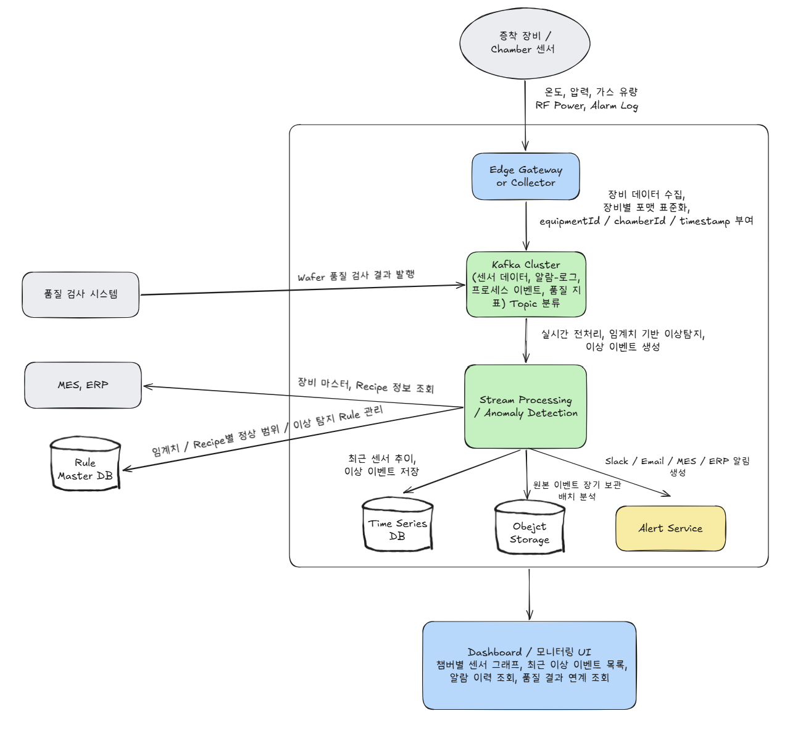
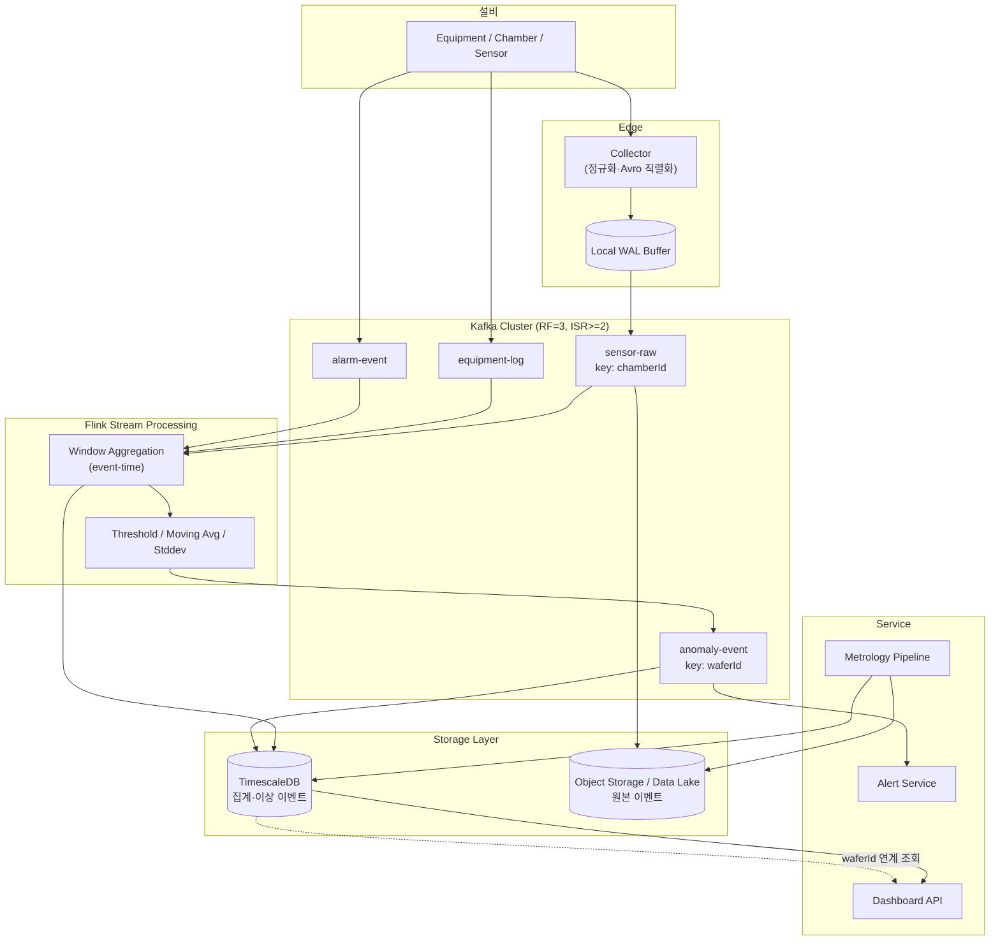
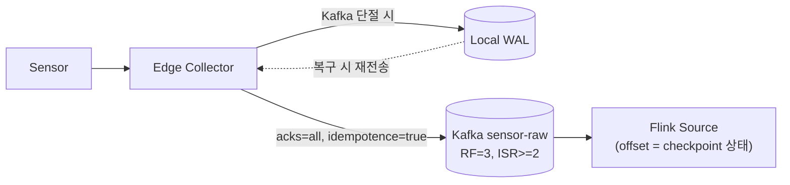
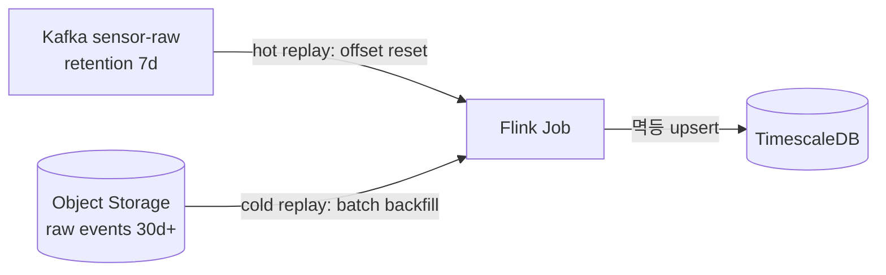
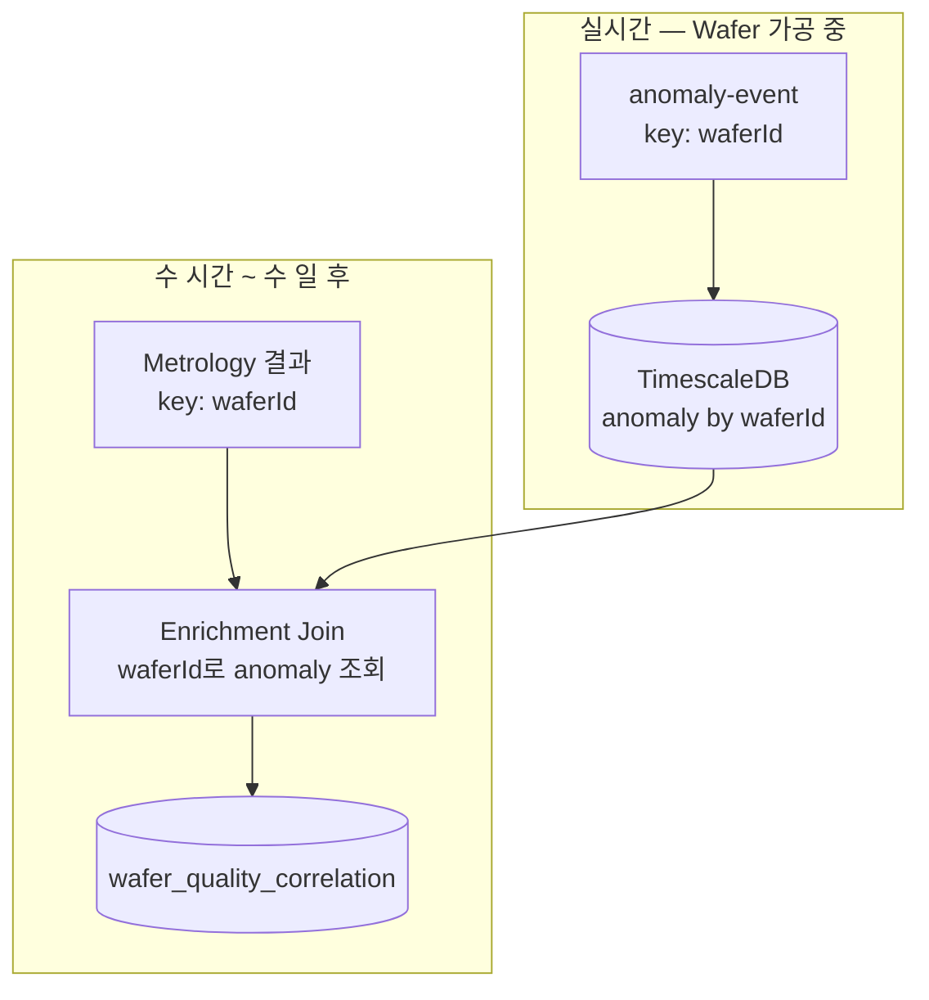
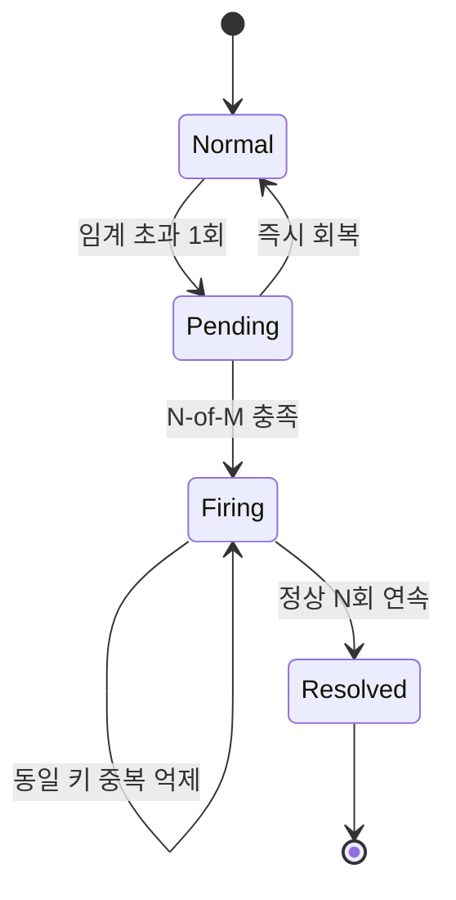
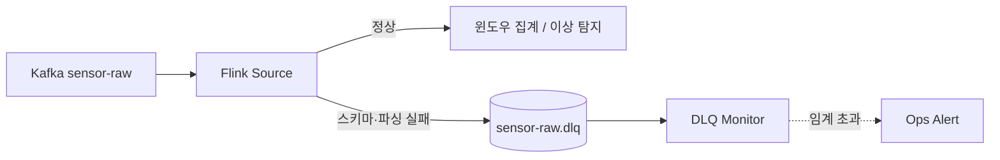

# Week 5 과제: 제조 설비 이벤트 수집 및 이상 탐지 시스템 설계

> 제조 설비에서 지속적으로 발생하는 센서 데이터와 운영 로그를 이벤트 스트림으로 수집하고, 이를 실시간으로 처리해 이상 징후를 탐지하는 시스템을 설계합니다

---

#### ⒈ 문제 이해 및 설계 범위 확정

**시나리오**

반도체 제조 라인에서는 증착 장비, 식각 장비, 검사 장비 등 다양한 설비에서 센서 데이터와 운영 로그가 지속적으로 발생한다.

본 시스템은 공정 장비를 직접 제어하거나 수율 예측 AI 모델을 학습하는 것이 아니라, 제조 설비에서 발생하는 대량의 이벤트를 안정적으로 수집하고, 이상 징후를 빠르게 탐지하며, Dashboard와 알림을 통해 문제를 확인할 수 있도록 돕는 모니터링 시스템이다.

다만, 증착 공정이 아닌 다른 주제로 하고 싶다면 주제 자체는 자유롭게 구체화해도 좋다. (이벤트 수집 및 이상 탐지 시스템이라면)

```text
- 다른 반도체 공정 모니터링
- 자동차 생산 라인 설비 모니터링
- 배터리 제조 공정 품질 모니터링
- 스마트팩토리 에너지 사용량 모니터링
- 물류 자동화 설비 이상 탐지 시스템
```
## 설계 범위 (In / Out of Scope)

---

| 포함 (In Scope) | 제외 (Out of Scope) |
| --- | --- |
| 설비 센서 데이터 수집 | 실제 장비 제어 로직 |
| 이벤트 수집 | PLC/장비 펌웨어 구현 |
| Stream Processing | 반도체 공정 물리 모델 구현 |
| 임계치 기반 이상 탐지 | 정교한 AI 모델 학습 |
| 시계열 데이터 저장 | MES/ERP 전체 구현 |
| Dashboard 조회 구조 | 실제 공정 Recipe 최적화 |
| 알림 시스템 | 완전한 보안 솔루션 |
|    데이터 유실/지연 대응    |     실제 설비 네트워크 구성       |
|        장애 복구 및 재처리            |       공정 장비 직접 제어                  |


## 시스템 구성 전제

---

- 제조 설비와 센서는 이미 존재한다고 가정한다.
- 설비 데이터는 Edge Gateway 또는 Collector를 통해 수집된다고 가정한다.
- Kafka Cluster는 이벤트 수집용 메시지 브로커로 사용 가능하다고 가정한다.
- Stream Processing 엔진은 Kafka Streams, Flink, Spark Streaming 중 하나를 선택할 수 있다.
- 시계열 데이터 저장소는 TimescaleDB, InfluxDB, Prometheus, OpenSearch 등을 사용할 수 있다.
- Dashboard는 Grafana 또는 별도 Web UI를 사용할 수 있다.
- 알림은 사내 ERP, MES, Slack, Email, SMS, 사내 메신저 등으로 발송 가능하다고 가정한다.
- 본 시스템은 설비를 직접 제어하지 않고, 이상 탐지와 모니터링에 집중한다.

## 기능 요구사항

---

### [수집]

증착 장비 내 Chamber에서 발생하는 온도, 압력, 가스 유량, RF Power 등의 센서 데이터와 설비 운영 로그, Alarm 이벤트를 실시간으로 수집할 수 있어야 한다.

### [식별/연결]

수집된 센서 데이터는 `equipmentId`, `chamberId`, `waferId`, `lotId`, `recipeId`, `timestamp`와 함께 저장되어야 하며, 어떤 장비의 어느 Chamber에서 어떤 Wafer/Recipe 수행 중 발생한 데이터인지 식별할 수 있어야 한다.

### [이상 탐지]

실시간 수집된 데이터는 임계치 기반 조건과 이동 평균, 표준편차 기반의 통계 연산을 통해 이상 징후를 판정하는 데 활용될 수 있어야 한다.

### [저장]

센서 원본 데이터, 집계 데이터, 이상 이벤트는 조회 목적과 보관 기간에 따라 분리 저장할 수 있어야 한다.

예를 들어 최근 고해상도 센서 데이터는 시계열 저장소에 저장하고, 장기 분석용 원본 이벤트는 Object Storage 또는 Data Lake에 저장할 수 있다.

### [UI/출력]

설비 모니터링 Dashboard는 특정 Chamber를 선택했을 때 최근 1시간 동안의 주요 센서 추이 그래프와 발생한 이상 이벤트 목록을 한 화면에 시각화하여 반환할 수 있어야 한다.

### [알림]

이상 이벤트가 발생하면 심각도에 따라 엔지니어 또는 담당자에게 알림을 발송할 수 있어야 하며, 동일 이상이 반복될 경우 중복 알림을 억제할 수 있어야 한다.

### [예외 처리/장애]

센서 수집부나 스트림 처리부에 장애가 발생하거나 데이터가 지연 도착하더라도, Kafka의 offset 또는 스트림 처리 상태 복구 기능을 활용해 과거 시점부터 재처리 및 복구할 수 있어야 한다.

### [성과/연계]

이상 탐지 결과와 사후에 도착하는 Wafer 품질 검사, 즉 Metrology 데이터를 연결하여 해당 설비 이상이 실제 두께 편차, 결함 증가, 수율 저하로 이어졌는지 분석할 수 있는 기반 데이터를 제공할 수 있어야 한다.


## 비기능 요구사항

---

| 항목           | 목표                                         |
|--------------|--------------------------------------------|
| 센서 데이터 수집 지연 | 평균 1초 이내                                   |
| 이상 탐지 지연     | 평균 3초 이내                                   |
| 알림 발송 지연     | 이상 감지 후 5초 이내                              |
| 데이터 유실 허용도 | 중요 이벤트는 유실 최소화                             |
| 센서 데이터 저장 기간  | 고해상도 데이터 7~30일, 집계 데이터 1년 이상               |
| 시스템 가용성    | 설비 운영 시간 동안 지속 동작                          |
| 장애 복구    | Consumer 재시작 후 offset 기반 재처리 또는 스트림 처리 상태 복구 |
| 확장성   | 설비 및 센서 증가에 따라 수평 확장 가능                  | 
| 알림 정확도    | false positive / false negative trade-off 고려 |


## 대략적 규모 추정 *(기준값 — 본인 가정으로 변경 가능)*

---

| 항목               | 수치                  |
|------------------|---------------------|
| 대상 공장            | 반도체 Fab             |
| 대상 장비 수          | 500대                |
| 대상 Chamber 수     | 1,000개              |
| 장비당 센서 수         | 50개                 |
| 센서 데이터 발생 주기     | 1초                  |
| 초당 센서 이벤트 수      | 약 50,000 events/sec |
| 일일 센서 이벤트 수      | 약 43억 건             |
| 이상 이벤트 비율        | 전체 이벤트의 0.01~0.1%   |
| Dashboard 동시 사용자 | 100~500명            |
| 알림 대상 엔지니어       | 50 ~ 200명           |
| 고해상도 원본 데이터 보관   | 7~30일       |
| 집계 데이터 보관        | 1년 이상     |

# 2. 개략적 설계안 제시 및 동의 구하기

(예시)



---

## 핵심 흐름 (필수)

1. 설비 센서가 1초 주기로 데이터 생성 (Chamber별 온도, 압력, 가스 유량, RF Power 등)
2. Edge Collector가 데이터를 수집·정규화하고, **로컬 WAL 버퍼**에 적재한 뒤 Kafka로 전송 (`acks=all`, 멱등)
3. Kafka `sensor-raw` 토픽으로 유입 (**파티션 키 = chamberId** → Chamber 단위 순서 보장)
4. Flink가 Chamber·Sensor 단위로 **event-time 기반 윈도우 집계**와 임계치/통계 기반 이상 탐지 수행
5. 이상 판정 시 `anomaly-event` 토픽으로 발행 (파티션 키 = waferId)
6. 이상 이벤트는 Alert Service로 전달되고 동시에 TimescaleDB에 적재
7. 센서 원본은 Object Storage(Data Lake), 집계 데이터는 TimescaleDB로 **분리 저장**
8. Dashboard가 TimescaleDB를 조회하여 Chamber별 센서 추이·이상 목록을 시각화
9. 후행 도착하는 Metrology(품질 검사) 데이터를 **waferId 기준으로 이상 이벤트와 연계**하여 상관 분석 기반 데이터 생성
10. 장애 발생 시 Flink checkpoint와 Kafka offset을 활용해 과거 시점부터 **재처리·복구**

---

# 3. 상세 설계

## 설계 대상 컴포넌트 사이의 우선순위 정하기 / 아키텍처 다이어그램 (필수)

### 우선순위

| 우선순위 | 컴포넌트              | 이유           |
| ---- | ----------------- | ------------ |
| 1    | Event Collection  | 모든 데이터의 시작점  |
| 2    | Kafka Cluster     | 전체 파이프라인 버퍼  |
| 3    | Stream Processing | 실시간 이상 탐지 핵심 |
| 4    | Storage Layer     | 조회 및 분석      |
| 5    | Alert Service     | 운영 대응        |
| 6    | Dashboard         | 사용자 인터페이스    |

### 아키텍처



**우선순위 근거** — 데이터 파이프라인은 **앞단의 신뢰성이 뒷단 전체를 좌우**하므로 시작점인 Event Collection을 1순위로 둔다. Kafka는 수집·처리·저장을 시간적으로 디커플링하는 버퍼이자 재처리의 원천(2순위)이고, Stream Processing은 이상 탐지라는 시스템의 핵심 기능(3순위)이다. Storage·Alert·Dashboard는 그 결과를 소비하는 계층이다.

**흐름 요약** — 센서 → Collector(로컬 버퍼) → Kafka `sensor-raw`(chamberId 키) → Flink 윈도우 집계·이상 탐지 → `anomaly-event` 발행 → Alert Service·TimescaleDB. 원본은 Object Storage로 분기되어 장기 보관 및 cold replay에 쓰이고, 후행 Metrology는 waferId를 매개로 이상 이벤트와 연계된다. 앞선 다이어그램과 달리 `equipment-log`·`alarm-event`의 소비처(Flink)와 `sensor-raw`의 이중 적재(Flink + Object Storage) 경로를 명시하여 정합성을 맞췄다.

---

## 3-1. 대규모 설비 이벤트 수집 구조 설계

초당 약 50,000건의 센서 데이터가 발생하는 상황에서 설비 이벤트를 안정적으로 수집하기 위한 구조를 설계한다.

### Edge Gateway / Collector의 역할

- 설비별 상이한 센서 프로토콜을 수집하고 공통 스키마로 **정규화**
- 이벤트를 **Avro로 직렬화**하고 Schema Registry에 스키마 등록
- **로컬 WAL 버퍼**에 적재 후 배치·압축하여 Kafka로 전송
- Kafka/네트워크 단절 시 버퍼링했다가 복구되면 **재전송**, 버퍼 포화 시 우선순위 차등 처리

### 이벤트 스키마 (Avro + Schema Registry)

50k events/sec 규모에서는 포맷 선택이 곧 대역폭·저장 비용이다. JSON은 장황하고 스키마 강제가 안 되므로 제외하고, 바이너리·스키마 진화가 가능한 **Avro + Confluent Schema Registry**를 채택한다. 호환 정책을 `BACKWARD`로 두면 센서 추가/교체 시에도 신규 Consumer가 구 데이터를 읽을 수 있어 재처리와 잘 맞는다.

```json
{
  "type": "record",
  "name": "SensorEvent",
  "namespace": "fab.telemetry",
  "fields": [
    {"name": "eventId",      "type": "string"},
    {"name": "equipmentId",  "type": "string"},
    {"name": "chamberId",    "type": "string"},
    {"name": "waferId",      "type": ["null","string"], "default": null},
    {"name": "lotId",        "type": ["null","string"], "default": null},
    {"name": "recipeId",     "type": ["null","string"], "default": null},
    {"name": "recipeStepId", "type": ["null","string"], "default": null},
    {"name": "sensorId",     "type": "string"},
    {"name": "sensorType",   "type": {"type":"enum","name":"SensorType",
                              "symbols":["TEMPERATURE","PRESSURE","GAS_FLOW","RF_POWER"]}},
    {"name": "value",        "type": "double"},
    {"name": "unit",         "type": "string"},
    {"name": "eventTime",    "type": "long"},
    {"name": "ingestTime",   "type": "long"},
    {"name": "collectorId",  "type": "string"},
    {"name": "schemaVersion","type": "int", "default": 1}
  ]
}
```

- `eventTime`(센서 생성 시각)과 `ingestTime`(Collector 수신 시각)을 분리한다. 전자는 이상 탐지·Metrology 연계의 기준이고, 후자는 수집 지연 NFR(평균 1초) 측정용이다.
- `eventId`(UUID)는 재처리 시 중복 제거의 기준 키로 사용한다.

### Kafka 토픽 & 파티션 설계

| 토픽 | 파티션 키 | 파티션 수 | RF | retention |
|---|---|---|---|---|
| `sensor-raw` | **chamberId** | 60 (성장 대비 2x 여유) | 3 | 7일 |
| `equipment-log` | equipmentId | 12 | 3 | 7일 |
| `alarm-event` | equipmentId | 12 | 3 | 14일 |
| `anomaly-event` | waferId | 24 | 3 | 14일 |

**파티션 키를 chamberId로 두는 이유** — 이상 탐지(이동평균·표준편차)는 Chamber·Sensor 단위로 **시간순 스트림**을 보아야 정확하다. Kafka는 같은 파티션 내에서만 순서를 보장하므로, 키를 chamberId로 잡으면 한 Chamber의 모든 이벤트가 같은 파티션 → 같은 Flink subtask로 순서대로 흐른다. equipmentId(500개)는 병렬성이 부족하고 chamberId+sensorId는 집계가 어려워, chamberId(1,000개)가 균형점이다.

**파티션 수 산정** — 50k events/sec × 약 150B ≈ 8MB/s로 처리량은 병목이 아니다. 따라서 파티션 수는 처리량이 아니라 **Consumer 병렬성과 키 카디널리티**로 정한다. 60개면 파티션당 약 830 events/sec, Chamber 약 16개씩 해싱되며 Flink 병렬도 최대 60을 확보한다. 단, 파티션 수를 나중에 늘리면 키→파티션 해싱이 바뀌어 일부 Chamber의 순서 보장이 깨지므로 처음부터 2배 여유를 둔다(확장성 NFR).

### 데이터 유실 최소화 vs 낮은 지연 — 무엇을 우선할 것인가



| Producer 설정 | 값 | 효과 |
|---|---|---|
| `acks` | `all` | ISR 2대 복제 확인 후 ack → 브로커 1대 손실에도 무손실 |
| `enable.idempotence` | `true` | 재시도로 인한 브로커단 중복 방지 + 순서 보존 |
| `max.in.flight.requests` | `5` | 멱등성과 함께 순서 유지하며 처리량 확보 |
| `compression.type` | `lz4` | 대역폭 절감 |

두 목표는 모두 비기능 요구사항이지만(유실 최소화 / 수집 지연 1초), **fab 데이터의 가치상 유실 최소화를 우선**한다. `acks=all`이 지연을 수 ms 늘리지만 1초 목표 대비 무시 가능한 수준이다. 다만 초고빈도 `sensor-raw`는 Collector 단의 배치·압축(소폭 `linger.ms`)으로 처리량을 확보해 지연과 균형을 맞춘다. 중요도가 높은 `alarm-event`·`anomaly-event`는 내구성을 최우선으로 두고, 버퍼 포화 시에도 보존되도록 우선순위를 차등한다.

> Kafka의 복제 기능만 믿지 않고, Edge Gateway의 로컬 버퍼를 통해 Kafka 장애나 네트워크 단절 상황에서도 재전송이 가능하도록 설계하여 데이터 유실을 최소화하였다.

### 특정 장비/Chamber 트래픽 쏠림 대응

chamberId 해싱으로 1,000개 Chamber가 60개 파티션에 분산되어 기본적으로 부하가 균등하다. 특정 Chamber가 일시적으로 폭주하더라도 Collector 단의 배치·압축이 버스트를 흡수하고, Flink의 backpressure가 상류로 전파되어 시스템이 무너지지 않는다. 장기적 부하 증가는 파티션·Flink 병렬도를 함께 키워 수평 확장한다.

---

## 3-2. 실시간 스트림 처리 및 이상 탐지 파이프라인

Kafka에 유입된 설비 이벤트를 실시간으로 처리하고 이상 징후를 탐지하는 파이프라인을 설계한다.

### Stream Processor 선택 — Flink

| 기준 | Kafka Streams | Spark Streaming | **Flink (선택)** |
|---|---|---|---|
| 처리 모델 | 앱 내장 라이브러리 | 마이크로 배치 | 진정한 스트리밍 |
| Event-time / watermark | 제한적 | 지원 | 강력 |
| 상태 관리 / 체크포인트 | RocksDB+changelog | 지원 | 강력(savepoint 리스케일) |
| 지연 | 낮음 | 상대적으로 높음(배치) | 매우 낮음 |
| 대규모 운영·병렬성 | 앱 스케일에 종속 | 양호 | 우수 |

이상 탐지의 정확도가 event-time 처리와 풍부한 상태 관리에 달려 있고, 탐지 지연 3초 NFR을 만족해야 하므로 **Flink**를 선택한다. Spark의 마이크로 배치는 지연 측면에서 불리하고, Kafka Streams는 대규모 상태·운영성에서 Flink에 미치지 못한다.

이상 탐지는 Chamber·Sensor 단위로 키잉한 뒤, 슬라이딩 윈도우에서 **임계치 조건 + 이동 평균 + 표준편차(Z-score)** 를 계산하여 판정한다. Recipe별로 정상 범위가 다르므로 임계치는 recipeId를 기준으로 동적으로 적용한다.

### Event Time vs Processing Time

윈도우와 watermark는 모두 센서가 생성한 **eventTime**을 기준으로 한다. processingTime(Flink 도착 시각)은 모니터링·지연 측정 용도로만 쓴다. 이렇게 해야 재처리 시점이 달라도 동일한 윈도우 경계와 동일한 탐지 결과가 보장된다.

### 늦게 도착하는 이벤트 처리

Edge 버퍼 복구분이나 네트워크 지연으로 이벤트가 순서를 벗어나 도착할 수 있다. **bounded out-of-orderness watermark**(예: 허용 지연 N초)와 `allowedLateness`로 늦은 이벤트를 윈도우에 반영하고, 그보다 더 늦은 이벤트는 **side output**으로 분리하여 별도 보정·적재한다.

### 이상 탐지 결과의 발행처

이상 판정 결과는 `anomaly-event` 토픽(키 = waferId)으로 발행하여 Alert Service와 TimescaleDB가 각각 구독·적재한다. Flink Kafka Sink는 트랜잭션 기반 **exactly-once**로 설정하여 재처리 시에도 중복 알림이 발생하지 않도록 한다.

### Stream Processor 장애 시 상태 복구



- **Checkpoint** — Flink가 주기적(10–30초)으로 윈도우·이동평균 등 operator state와 Kafka source offset을 durable storage(S3/HDFS)에 스냅샷한다. 장애 시 마지막 checkpoint에서 상태와 오프셋을 함께 복원해 정확히 그 지점부터 재개한다.
- **End-to-end exactly-once** — Flink Kafka Source(오프셋이 checkpoint에 포함) + Kafka Sink(트랜잭션/2PC) 조합으로 `anomaly-event`는 정확히 한 번 발행된다. TimescaleDB sink는 키 `(chamberId, sensorId, window_start)`로 `ON CONFLICT DO UPDATE` 멱등 upsert를 사용한다.
- **Savepoint** — 무중단 버전 업그레이드나 파티션·병렬도 변경(확장성 NFR) 시 수동 savepoint로 상태를 옮긴다.
- **2단 재처리(replay)** — 임계치/로직 변경 후 과거 데이터를 다시 돌릴 때, Kafka retention(7일) 이내는 offset을 되감아 **hot replay**, 그 이상은 Object Storage 원본을 읽어 **cold replay**한다. 두 경로 모두 멱등 sink 덕분에 중복 결과가 생기지 않는다.

---

이상 탐지 결과와 Metrology 연계 분석

설비 이상이 실제 두께 편차·결함·수율 저하로 이어졌는지 분석하기 위해, 이상 이벤트와 후행 도착하는 Metrology(품질 검사) 데이터를 연결한다.

핵심 난점은 **시간 비대칭**이다. 이상 이벤트는 Wafer 가공 중 실시간으로 생성되지만, Metrology 결과는 수 시간~수 일 뒤에 waferId/lotId 기준으로 도착한다. 둘을 스트림-스트림 interval join하면 수 시간~일 단위 윈도우 상태를 Flink가 들고 있어야 해서 비현실적이다.

따라서 **저장소 기반 enrichment join**을 채택한다. waferId를 시간차를 잇는 join 키로 사용한다.



1. 실시간 단계에서 이상 이벤트를 waferId·lotId·recipeId·chamberId·시간 윈도우와 함께 TimescaleDB에 적재한다.
2. Metrology는 자체 파이프라인(`metrology-result` 토픽 또는 배치)으로 waferId 기준 수집한다.
3. Metrology 도착이 트리거가 되어 해당 waferId의 가공 시간대 이상 이벤트를 조회·결합하고, 상관 레코드를 생성한다. (Flink의 temporal/lookup join으로 Metrology 스트림이 TimescaleDB를 조회하는 형태로도 구현 가능하며, 무거운 스트림 상태가 필요 없다.)

```sql
CREATE TABLE wafer_quality_correlation (
  wafer_id        TEXT,
  lot_id          TEXT,
  recipe_id       TEXT,
  equipment_id    TEXT,
  chamber_id      TEXT,
  processed_at    TIMESTAMPTZ,        -- 가공 시각
  measured_at     TIMESTAMPTZ,        -- 검사 시각(후행)
  anomaly_count   INT,
  anomaly_types   TEXT[],
  max_severity    TEXT,
  thickness_dev   DOUBLE PRECISION,   -- Metrology
  defect_count    INT,
  yield           DOUBLE PRECISION,
  PRIMARY KEY (wafer_id, recipe_id)
);
```

이 테이블로 "특정 Chamber의 RF Power 이상이 두께 편차·결함 증가·수율 저하로 이어졌는가"를 사후 분석할 수 있고, 나아가 이상 탐지 임계치 튜닝(false positive / false negative 트레이드오프)의 근거 데이터로 활용한다.


---

## 3-3. 데이터 저장 계층 설계
센서 원본 데이터, 집계 데이터, 이상 이벤트, 품질 데이터를 어디에 어떻게 저장할 것인가?

- 원본 센서 데이터를 모두 저장할 것인가?
- 고해상도 원본 데이터는 얼마나 오래 보관할 것인가?
- 시계열 DB는 무엇을 사용할 것인가?
    - InfluxDB
    - TimescaleDB
    - Prometheus
    - Opensearch
- 장기 분석을 위해 Object Storage 또는 Data Lake를 둘 것인가?
- Dashboard 조회용 데이터와 배치 분석용 데이터를 분리할 것인가?

센서 원본, 집계, 이상 이벤트, 품질 데이터를 보관 기간과 조회 목적에 따라 분리 저장한다.

### 저장 계층(tiering)

| 계층 | 저장소 | 대상 데이터 | 보관 기간 | 목적 |
|---|---|---|---|---|
| Hot | TimescaleDB | 최근 고해상도 센서, 집계, 이상 이벤트 | 7~30일 | Dashboard 저지연 조회 |
| Warm | TimescaleDB(연속 집계) | downsampling된 집계 | 1년 이상 | 추세 분석 |
| Cold | Object Storage / Data Lake (Parquet) | 센서 원본 전량 | 장기 | 배치 분석, cold replay |

- **원본 센서 데이터를 모두 저장할 것인가** — 모두 저장하되 계층을 분리한다. 원본 전량은 저비용 Object Storage에 적재하고, TimescaleDB에는 최근 고해상도만 둔다. 원본 보존은 cold replay와 사후 분석의 전제다.
- **고해상도 원본 보관 기간** — 비기능 요구사항대로 7~30일을 TimescaleDB hot 계층에 두고, 이후는 downsampling하여 집계만 1년 이상 보관, 원본은 Object Storage로 이관한다.
- **시계열 DB 선택 — TimescaleDB** — 관계형 SQL이라 waferId 기준 Metrology join(3-4)에 유리하고, continuous aggregates로 downsampling, 압축·retention 정책을 내장한다. InfluxDB는 join이 약하고, Prometheus는 pull 기반 메트릭 모니터링용이라 고카디널리티 센서 데이터에 부적합하며, OpenSearch는 로그·검색에 강점이 있어 보조로만 둔다.
- **Object Storage / Data Lake 운영** — 둔다. 원본 전량의 장기 보관, 재처리 원천, Parquet 기반 배치 분석을 담당한다.
- **조회용 vs 배치용 분리** — 분리한다. Dashboard 조회는 TimescaleDB(hot/warm)에서 저지연으로, 장기·전수 배치 분석은 Object Storage(cold)에서 수행한다.

### 적재 정합성

집계와 이상 이벤트를 TimescaleDB에 쓸 때는 멱등 upsert를 사용해 재처리 시 중복을 막고, 원본은 Object Storage에 append-only로 적재한다.


---

## 3-4. 알림 정확도와 중복 알림 제어

이상 이벤트가 발생했을 때 엔지니어에게 어떻게 정확하고 피로도 낮게 알릴 것인가?

- 한 번 임계치를 초과하면 바로 알림을 보낼 것인가, 연속 N회 이상 초과해야 알림을 보낼 것인가?
- 이상이 정상으로 회복되면 recovery 알림을 보낼 것인가?
- 알림 정확도와 알림 지연 사이의 trade-off는 무엇인가?

### 알림 상태 머신

단순 즉시 발송이 아니라 firing/resolved 상태 머신과 N-of-M 룰을 두어 노이즈와 중복을 흡수한다.



**즉시 알림 vs 연속 N회 초과 후 알림** — 기본은 **N-of-M 규칙**(예: 최근 5초 중 3회 초과)으로 단일 측정값 노이즈에 의한 false positive를 흡수한다. 다만 심각도에 따라 차등한다.

| 등급 | 조건 | 정책 |
|---|---|---|
| Warning | 임계 초과 (이동평균/Z-score) | 3-of-5 후 발송 |
| Critical | 안전·장비 손상 위험 임계 | 2-of-3 또는 즉시 |
| Equipment Alarm | 설비가 자체 raise한 `alarm-event` | 즉시 (이미 검증된 신호) |

**Recovery 알림** — 보낸다. 단 별도 noisy 이벤트가 아니라 firing → resolved 상태 전이로 통지한다. N회 연속 정상이면 자동 resolved 전환, 일정 시간 이내 미회복이면 escalation. 이래야 엔지니어가 "아직 진행 중인가?"를 의심하지 않는다.

**정확도 vs 지연 trade-off** — N을 키우면 false positive는 줄지만 지연이 늘어난다(3-of-5는 최소 3초 소요). 비기능 요구사항의 **알림 발송 5초 상한**이 곧 N 윈도우의 상한이다. 일반은 정확도 우선(N 크게), 안전 관련 Critical은 지연 우선(N 작게/즉시). 운영 후 false positive / false negative 비율은 3-6의 Metrology 상관 데이터로 측정해 임계치를 보정한다.

### 중복 억제(dedup) 메커니즘

- **Alert key** = `(chamberId, sensorId, ruleId)` — 동일 키가 firing 상태인 동안 신규 알림 억제, 횟수만 카운트
- **Grouping** — 같은 Chamber에서 여러 Sensor가 동시 이상이면 단일 alert group으로 묶어 1건만 발송
- **Escalation** — 일정 시간 미해결 시 상위 담당자로 자동 승급
- **Maintenance window** — 정비/점검 시간대는 알림 silencing

---

## 3-5. 장애 복구 및 재처리 구조

시스템 일부가 장애가 나도 데이터 유실 없이 복구할 수 있는가?

- Kafka Consumer 장애 시 offset 처리는 어떻게 할 것인가?
- Schema 오류, 필수 필드 누락, 파싱 실패 이벤트는 어떻게 처리할 것인가?
- 데이터 유실 방지와 중복 처리 허용 중 무엇을 우선할 것인가?
- 장애 발생 시 Dashboard와 Alert는 어떤 상태를 보여줄 것인가?

**Kafka Consumer 장애 시 offset 처리** — Auto-commit은 사용하지 않는다. Flink가 **Kafka source offset을 자체 checkpoint 상태에 포함**시켜, `__consumer_offsets`에 의존하지 않고 Flink state로 관리한다. 장애 후 재시작은 마지막 checkpoint의 offset과 operator state를 함께 복원해 정확히 그 지점부터 재개한다. exactly-once sink(3-2)와 결합해 결과 중복까지 막는다. 일반 Kafka Consumer를 쓴다면 처리 완료 후 manual commit이 원칙이다.

**Schema 오류·필수 필드 누락·파싱 실패** — 메인 파이프라인을 멈추지 않기 위해 **Dead Letter Queue(DLQ)** 패턴을 둔다.



- 실패 이벤트는 **원본 페이로드 + 에러 타입 + 스키마 버전 + 파티션/오프셋 메타**와 함께 `sensor-raw.dlq`로 분리 발행
- 정상 메시지는 계속 흐르므로 단일 poison pill이 전체 파이프라인을 정지시키지 못함
- Schema Registry의 BACKWARD 호환 검사로 Producer 단에서 1차 차단
- DLQ 적재량은 모니터링하고, 임계 초과 시 운영팀에 시스템 알림 발송
- 원인 수정 후 DLQ를 메인 토픽으로 다시 흘리거나 수정된 코드로 재처리

**유실 방지 vs 중복 처리 허용 — 유실 방지 우선** — fab 센서 데이터는 사라지면 복구 불가지만 중복은 멱등성으로 흡수 가능하다. 따라서 **at-least-once를 기본**으로 두되 sink를 멱등하게 설계한다.

- Producer: `acks=all` + 멱등 (3-1)
- Stream: Flink checkpoint + Kafka Sink는 transactional **exactly-once**
- TimescaleDB sink: `(chamberId, sensorId, window_start)` 키 upsert
- 알림: alert key dedup (3-4)

**장애 시 Dashboard·Alert 상태 표시** — "보이지 않는 장애"가 가장 위험하므로 운영자가 즉시 인지할 수 있도록 한다.

- **Dashboard**: 마지막 적재 시각·Consumer lag을 상시 노출. lag이 임계 초과 시 화면 상단에 "데이터 지연 중" 배너. 일부 Chamber만 단절된 경우 해당 카드에 "stale" 뱃지(N분 전 데이터). 빈 화면이나 무한 로딩으로 두지 않는다.
- **Alert**: 데이터로 검출한 이상 알림과 **별도 채널**로 시스템 메타-알림 발송 (예: "Flink Job down", "Kafka broker unreachable", "Consumer lag > N"). 데이터가 못 들어오는 동안의 **false negative 위험을 운영자가 인지**하도록 한다.
- **복구 후**: replay 진행률(현재 처리 중인 시점)을 표시. cold replay로 백필되면 retroactive anomaly가 과거 시점에 추가되므로 Dashboard에 그 표식을 남긴다.

---

## 3-7. 공정 데이터와 품질 데이터의 지연 처리

센서 이상이 실제 품질 저하와 연결되는지 어떻게 분석할 것인가?

- 품질 데이터는 센서 데이터보다 늦게 도착할 수 있는데 어떻게 처리할 것인가?
- 실시간 이상 탐지와 사후 품질 분석을 분리할 것인가?
- 품질 측정 결과가 늦게 도착했을 때 기존 이상 이벤트와 어떻게 연결할 것인가?
- 수율 저하 원인을 분석하기 위해 원본 센서 데이터를 얼마나 보관해야 하는가?
- 실시간 알림 시스템과 배치 분석 시스템을 어떻게 분리할 것인가?

---

## 3-8. 데이터 유실, 처리 지연, 저장 비용 Trade-off

제조 설비 데이터 파이프라인에서 가장 중요한 trade-off를 어떻게 판단할 것인가?

- 모든 센서 데이터를 원본 그대로 저장할 것인가?
- 알람 이벤트와 센서 원본 이벤트의 중요도를 다루게 둘 것인가?
- 지연을 줄이기 위해 batch size를 줄이면 어떤 문제가 생기는가?
- 실시간 이상 탐지와 사후 수율 분석은 저장 정책을 다르게 가져갈 것인가?


---

# 4. 설계 장점

-

---

# 5. 설계 단점

-

---

# 6. 마무리

## 개인적 의견 / 사례 공유 / 추가 학습

- MES(Manufacturing Execution System, 제조 실행 시스템): 제조 현장에서 생산 프로세스를 모니터링하고 제어하기 위해 제조에 사용되는 소프트웨어 기반 솔루션. 제조 운영 관리에서 MES는 전사적 자원 관리(ERP) 시스템과 같은 기업의 계획 및 제어 시스템과 실제 제조 운영 간의 가교 역할을 한다.
  - MES의 주요 목적: 원자재가 완제품으로 전환되는 과정을 실시간으로 추적하고 문서화하는 것. 기계, 센서, 작업자 등 다양한 소스에서 데이터를 캡처하여 생산 활동의 상태에 대한 정확한 최신 정보를 제공.
   - MES는 생산 프로세스에 대한 실시간 가시성과 제어 기능을 제공하여 이해 관계자가 운영을 모니터링하고, 병목 현상을 식별하고, 가동 중지 시간을 최소화하고, 정보에 입각한 결정을 신속하게 내릴 수 있도록 함. MES 시스템은 최적화된 생산 계획과 스케줄링을 지원해 효율적인 리소스 할당, 워크로드 밸런싱 및 정시 납품을 보장하여 수익성을 높임.
- ERP: 전사적 자원 관리 시스템. 인사, 재무, 생산, 물류, 영업 등 기업의 핵심 비즈니스 프로세스를 하나의 통합 시스템으로 관리하는 소프트웨어.


## 참고 자료

- [Samsung Semiconductor KR](https://semiconductor.samsung.com/kr/support/tools-resources/dictionary/semiconductor-glossary-deposition/)

- [SK hynix 반도체 전공정 5편](https://news.skhynix.co.kr/jeonginseong-column-deposition/)

- [Lam Research Newsroom](https://newsroom.lamresearch.com/2023-06-20-Lam-Research-Introduces-Worlds-First-Bevel-Deposition-Solution-to-Increase-Yield-in-Chip-Production)
- [FDC System](https://semiengineering.com/new-frontiers-in-fault-detection-and-classification/)
- https://www.ibm.com/kr-ko/think/topics/mes-system
- https://www.skax.co.kr/insight/trend/2946