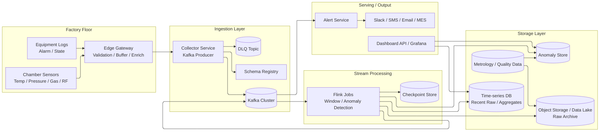

# Week 5 과제: 제조 설비 이벤트 수집 및 이상 탐지 시스템 설계

## 0. 과제 개요

### 과제: 반도체 제조 설비 이벤트 수집 및 이상 탐지 시스템 설계

#### 시나리오

반도체 제조 라인에서는 증착 장비, 식각 장비, 검사 장비 등 다양한 설비에서 센서 데이터와 운영 로그가 지속적으로 발생한다.

본 시스템은 공정 장비를 직접 제어하거나 수율 예측 AI 모델을 학습하는 것이 아니라, 제조 설비에서 발생하는 대량의 이벤트를 안정적으로 수집하고, 이상 징후를 빠르게 탐지하며, Dashboard와 알림을 통해 문제를 확인할 수 있도록 돕는 모니터링 시스템이다.

### 시스템 구성 전제

- 제조 설비와 센서는 이미 존재한다.
- 설비 데이터는 Edge Gateway 또는 Collector를 통해 수집된다.
- Kafka Cluster는 이벤트 수집용 메시지 브로커로 사용 가능하다.
- Stream Processing 엔진은 Flink를 사용한다고 가정한다.
- 최근 고해상도 센서 데이터와 집계 데이터는 시계열 저장소에 저장한다.
- 장기 원본 이벤트와 사후 품질 분석용 데이터는 Object Storage/Data Lake에 저장한다.
- Dashboard는 Grafana 또는 별도 Web UI로 제공한다.
- 알림은 사내 메신저, SMS, Email, MES/ERP 연동으로 발송 가능하다.
- 본 시스템은 설비를 직접 제어하지 않고 이상 탐지와 모니터링에 집중한다.

### 요건

- Chamber에서 발생하는 센서 데이터와 장비 운영 로그, Alarm 이벤트를 실시간으로 수집한다.
- 이벤트에는 `equipmentId`, `chamberId`, `waferId`, `lotId`, `recipeId`, `timestamp`가 포함되어야 한다.
- 임계치 기반 조건, 이동 평균, 표준편차 기반 통계 연산으로 이상 징후를 탐지한다.
- 센서 원본 데이터, 집계 데이터, 이상 이벤트, 품질 데이터를 목적과 보관 기간에 따라 분리 저장한다.
- Dashboard는 특정 Chamber의 최근 1시간 센서 추이와 이상 이벤트 목록을 함께 보여준다.
- 이상 이벤트 발생 시 심각도에 따라 알림을 발송하고, 반복 알림은 억제한다.
- Collector, Kafka Consumer, Stream Processor 장애 후에도 offset과 checkpoint를 기반으로 재처리할 수 있어야 한다.
- 이상 탐지 결과와 사후 도착하는 Metrology 데이터를 연결해 실제 품질 영향 분석의 기반을 제공한다.

#### 규모 가정

| 항목 | 수치 |
|---|---:|
| 대상 공장 | 반도체 Fab 1개 |
| 대상 장비 수 | 500대 |
| 대상 Chamber 수 | 1,000개 |
| 장비당 센서 수 | 50개 |
| 센서 데이터 발생 주기 | 1초 |
| 초당 센서 이벤트 수 | 약 50,000 events/sec |
| 일일 센서 이벤트 수 | 약 43억 건 |
| 이상 이벤트 비율 | 전체 이벤트의 0.01~0.1% |
| Dashboard 동시 사용자 | 100~500명 |
| 알림 대상 엔지니어 | 50~200명 |
| 고해상도 원본 데이터 보관 | 7~30일 |
| 집계 데이터 보관 | 1년 이상 |

#### 시간/품질 목표

| 항목 | 목표 |
|---|---|
| 센서 데이터 수집 지연 | 평균 1초 이내 |
| 이상 탐지 지연 | 평균 3초 이내 |
| 알림 발송 지연 | 이상 감지 후 5초 이내 |
| 중요 이벤트 유실 | 최소화 |
| 고해상도 센서 데이터 보관 | 7~30일 |
| 집계 데이터 보관 | 1년 이상 |
| 장애 복구 | offset/checkpoint 기반 재처리 |
| 확장성 | 설비/센서 증가에 따라 수평 확장 |
| 알림 정확도 | false positive / false negative trade-off 관리 |

---

## 1. 문제 이해 및 설계 범위 확정

### 1-1. 설계 대상

이번 설계의 대상은 INFICON의 실제 FDC 솔루션인 `FabGuard`를 참고한 반도체 공정 장비 모니터링 시스템이다. FabGuard는 공정 장비에서 계속 발생하는 센서 데이터를 모아 이상 징후를 빠르게 발견하는 솔루션이다.

여기서 `Chamber`는 웨이퍼가 실제로 처리되는 장비 내부 공간이다. 예를 들어 증착 공정에서는 Chamber 안에서 온도, 압력, 가스 유량, RF Power 같은 값이 계속 변한다. 이 값들이 정상 범위를 벗어나면 불량 웨이퍼가 생기거나 장비 이상으로 이어질 수 있다.

다만 이 문서에서는 INFICON FabGuard 제품 전체를 그대로 구현하는 것이 아니라, 과제 범위에 맞춰 FabGuard가 다루는 FDC 문제를 Kafka/Flink 기반 이벤트 파이프라인으로 단순화해 설계한다.

따라서 여기서 다루는 설계 범위는 장비를 직접 조작하는 제어 시스템이 아니다. valve를 닫거나 recipe를 수정하는 제어 명령은 내리지 않는다. 대신 다음과 같은 질문에 답할 수 있게 데이터를 수집하고 분석한다.

- 어느 Chamber에서 문제가 발생했는가?
- 어떤 wafer와 lot을 처리하던 중이었는가?
- 압력, RF Power, 가스 유량 중 어떤 값이 정상 범위를 벗어났는가?
- 이후 도착한 품질 검사 결과와 이 이상 이벤트가 관련이 있는가?

정리하면, 이 문서에서 설계하는 범위는 FabGuard의 FDC 문제의식 중에서도 **관측, 탐지, 알림, 사후 분석을 위한 데이터 파이프라인**에 집중한다.

### 1-2. 설계 범위 (In / Out of Scope)

이번 설계는 "장비 데이터를 어떻게 안정적으로 모으고, 장애 후에도 다시 처리할 수 있는가"에 집중한다. 반대로 실제 공정 장비를 어떻게 움직일지, 어떤 물리 모델로 공정을 최적화할지는 다루지 않는다.

| 포함 범위 (In Scope) | 제외 범위 (Out of Scope) |
|---|---|
| Edge Gateway/Collector 기반 센서 이벤트 수집 | PLC/장비 펌웨어 구현 |
| Kafka 기반 이벤트 버퍼링과 파티셔닝 | 실제 설비 네트워크 물리 구성 |
| Flink 기반 실시간 이상 탐지 | 정교한 AI 모델 학습 |
| 임계치/이동 평균/표준편차 기반 탐지 | 반도체 공정 물리 모델 구현 |
| 시계열 저장소와 Data Lake 분리 | MES/ERP 전체 구현 |
| Dashboard 조회 구조 | Recipe 최적화 |
| 알림 발송과 중복 억제 | 장비 직접 제어 |
| 장애 복구, 재처리, DLQ | 완전한 보안 솔루션 |
| Metrology 데이터와 이상 이벤트 연결 | 수율 예측 모델 학습 |

### 1-3. 기능 요구사항

이 시스템은 운영자가 "지금 어떤 장비가 위험한지"와 "장애 후 어떤 데이터부터 다시 처리해야 하는지"를 알 수 있어야 한다. 이를 위해 다음 기능이 필요하다.

- Chamber에서 발생하는 센서 이벤트, 장비 운영 로그, Alarm 이벤트를 실시간으로 수집한다.
- 각 이벤트에는 `equipmentId`, `chamberId`, `waferId`, `lotId`, `recipeId`, `timestamp`를 포함해 어떤 공정 상황에서 발생한 데이터인지 식별할 수 있게 한다.
- Edge Gateway는 일시적인 네트워크 단절 시 데이터를 로컬 버퍼에 저장하고, 연결이 복구되면 다시 전송한다.
- Kafka는 대량 이벤트를 버퍼링하고, 이벤트 종류와 처리 목적에 따라 topic을 분리한다.
- Flink는 Kafka에서 이벤트를 읽어 이동 평균, 표준편차, 임계치 조건으로 이상 징후를 판단한다.
- 이상 이벤트는 별도 topic과 저장소에 기록하고, Alert Service가 이를 구독해 담당자에게 알림을 보낸다.
- Dashboard는 최근 1시간 센서 그래프와 이상 이벤트 목록을 함께 보여준다.
- 사후에 품질 검사 데이터가 도착하면 기존 이상 이벤트와 `waferId`, `lotId`, `recipeId`, 시간 범위로 연결한다.

### 1-4. 비기능 요구사항

기능이 동작하는 것만으로는 충분하지 않다. 제조 설비 데이터는 계속 들어오기 때문에 지연, 유실, 장애 복구 기준이 명확해야 한다.

| 항목 | 설계 목표와 판단 |
|---|---|
| 수집 지연 | Edge에서 Kafka publish까지 평균 1초 이내를 목표로 한다 |
| 탐지 지연 | Kafka 입력부터 이상 이벤트 발행까지 평균 3초 이내를 목표로 한다 |
| 알림 지연 | 이상 이벤트 발행 후 5초 이내 담당자에게 전달한다 |
| 유실 최소화 | 중요 Alarm/이상 이벤트는 유실보다 중복을 허용한다 |
| 저장 비용 | 고해상도 원본, downsample 집계, 장기 원본 archive를 분리한다 |
| 재처리 | Kafka offset, Flink checkpoint/savepoint, idempotent sink를 사용한다 |
| 장애 격리 | Dashboard 조회 장애가 수집/탐지를 막지 않아야 한다 |
| 확장성 | 장비/Chamber 기준 partitioning으로 수평 확장한다 |

### 1-5. 트래픽 해석

이 시스템에서 가장 먼저 봐야 할 숫자는 센서 이벤트 수다. Chamber 1,000개가 각각 센서 50개를 1초마다 보낸다면 평균 `50,000 events/sec`가 들어온다.

이벤트 하나가 메타데이터 포함 평균 300~500 bytes라고 보면 원시 센서 데이터만으로도 하루 수 TB까지 커질 수 있다. 모든 데이터를 같은 저장소에 같은 해상도로 오래 보관하면 저장 비용과 조회 비용이 빠르게 커진다.

따라서 이번 설계는 데이터를 중요도와 사용 목적에 따라 나눈다.

- `sensor_raw`: 실시간 탐지와 단기 디버깅용 고해상도 원본
- `sensor_aggregate`: Dashboard와 장기 추세 조회용 downsample 집계
- `alarm_event`: 장비 자체 Alarm과 사람이 봐야 하는 중요 이벤트
- `anomaly_event`: 스트림 처리로 생성된 이상 탐지 결과
- `quality_metrology`: 사후 품질 측정 결과

### 1-6. 본인이 추가로 둔 가정

템플릿에 없는 세부 조건은 다음과 같이 가정했다. 이 가정들은 이후 아키텍처의 파티셔닝, 재처리, 저장 정책을 결정하는 기준이 된다.

| 확인이 필요한 부분 | 이번 설계의 가정 | 이유 |
|---|---|---|
| 수집 단위 | 센서별 이벤트가 아니라 Edge Gateway가 Chamber 단위로 1초 묶음 payload를 보낼 수 있다 | 네트워크와 Kafka message overhead를 줄이기 위함이다 |
| 파티션 키 | `factoryId + chamberId` | 한 Chamber의 센서 이벤트 순서를 보존하고 stateful anomaly detection을 단순화한다 |
| 처리 보장 | at-least-once + idempotent sink | exactly-once 전체 보장은 비용이 크고, 제조 모니터링은 유실보다 중복 제거가 낫다 |
| 중요한 이벤트 | Alarm, Anomaly, 품질 연결 이벤트는 별도 topic으로 분리하고 보존 기간을 길게 둔다 | 일반 센서와 동일하게 다루면 중요 이벤트가 대량 raw traffic에 묻힐 수 있다 |
| 지연 이벤트 | event time watermark와 allowed lateness를 둔다 | 장비/네트워크 지연으로 늦게 도착한 데이터를 무조건 버리면 탐지와 사후 분석이 왜곡된다 |
| 저장 정책 | 최근 7~30일 고해상도, 1년 이상 집계, 장기 원본은 압축 archive | 실시간 운영과 사후 분석의 요구가 다르다 |
| 알림 정책 | 단일 spike가 아니라 연속 N회 또는 window 조건으로 경보를 발행한다 | false positive로 엔지니어 피로도를 높이지 않기 위함이다 |

---

## 2. 개략적 설계안 제시 및 동의 구하기

### 2-1. 설계 원칙

제조 설비 이벤트 시스템에서 가장 조심해야 할 지점은 **수집 경로가 흔들릴 때 어디까지 데이터가 보존되고, 어디서부터 재처리할 수 있는지 명확해야 한다**는 것이다.

- 설비 데이터는 일단 Edge Gateway에서 받아 Kafka까지 안정적으로 넣는 것이 1차 목표다.
- 실시간 이상 탐지는 Kafka 이후의 consumer이므로 장애 시 offset/checkpoint 기준으로 다시 처리할 수 있어야 한다.
- Dashboard와 알림은 중요하지만, 조회나 알림 장애가 수집 pipeline을 막으면 안 된다.
- 모든 원본 센서 데이터를 영원히 고해상도로 저장하는 대신, 단기 고해상도/장기 집계/장기 archive를 분리한다.

### 2-2. 핵심 흐름

1. Chamber 센서와 장비 로그가 Edge Gateway로 들어온다.
2. Edge Gateway는 schema validation, timestamp 보정, chamber 단위 micro-batch, 로컬 디스크 버퍼링을 수행한다.
3. Collector는 Edge Gateway로부터 이벤트를 받아 Kafka topic에 publish한다.
4. Kafka는 `factoryId + chamberId` 기준으로 partitioning해 Chamber 단위 이벤트 순서를 최대한 보존한다.
5. Flink Job은 Kafka에서 이벤트를 읽고 event time window로 이동 평균, 표준편차, 임계치 조건을 계산한다.
6. 이상 징후가 발견되면 `anomaly-events` topic에 발행하고, Alert Service와 Anomaly Store가 이를 구독한다.
7. 센서 원본은 단기 시계열 저장소와 장기 Object Storage에 저장된다.
8. Downsampled aggregate는 Dashboard 조회용으로 저장된다.
9. Metrology 데이터가 나중에 도착하면 `waferId`, `lotId`, `recipeId`, 시간 범위로 이상 이벤트와 연결한다.
10. Collector/Flink/Sink 장애가 발생하면 Kafka offset과 Flink checkpoint를 이용해 재처리한다.

### 2-3. 아키텍처 다이어그램




### 2-4. 주요 컴포넌트 역할

| 컴포넌트 | 역할 |
|---|---|
| Edge Gateway | 장비 근처에서 데이터 수집, 보정, schema validation, 로컬 버퍼링 |
| Collector Service | Edge로부터 데이터를 받아 Kafka에 안정적으로 publish |
| Kafka Cluster | 대량 이벤트 버퍼, consumer 장애 시 재처리 기준 |
| Schema Registry | 이벤트 schema 버전 관리와 호환성 검증 |
| Flink Job | event time 기반 window 집계와 이상 탐지 |
| Checkpoint Store | Flink 상태와 offset 복구 지점 저장 |
| Time-series DB | 최근 raw와 집계 데이터의 빠른 Dashboard 조회 |
| Object Storage | 장기 원본 archive와 사후 분석 |
| Anomaly Store | 이상 이벤트 상세, 상태, ack, recovery 저장 |
| Alert Service | 심각도별 라우팅, dedup, escalation |
| Dashboard API | Chamber별 그래프와 이상 이벤트 timeline 조회 |

---

## 3. 상세 설계

선택 질문은 템플릿 기준 **`3-5. 장애 복구 및 재처리 구조` 한 가지**이다. 제조 설비 이벤트 파이프라인은 초당 5만 건 이상을 받는 시스템이기 때문에, "평상시 잘 받는다"보다 "장애 후 데이터가 어디에 남아 있고, 어느 offset부터 재처리할 수 있는가"를 자신 있게 설명할 수 있어야 한다.

### 3-1. 장애 복구 및 재처리 구조

#### 백엔드 인프라 엔지니어로서 가장 신경 쓴 지점

가장 신경 쓴 지점은 **Kafka에 들어오기 전과 후의 복구 기준을 명확히 나누는 것**이다.

Kafka에 들어간 이벤트는 offset을 기준으로 다시 읽을 수 있다. 하지만 Edge Gateway에서 Kafka로 들어가기 전에 유실된 데이터는 Kafka offset으로 복구할 수 없다. 그래서 수집 경로에서 가장 중요한 안전망은 Kafka 자체가 아니라 **Edge Gateway의 로컬 디스크 버퍼와 sequence number**다.

또 하나는 유실을 피하려고 무조건 동기 처리만 늘리면 1초 수집 지연과 3초 탐지 지연을 깨뜨린다는 점이다. 따라서 중요 이벤트는 유실 최소화를 우선하고, 일반 센서 raw는 짧은 batch와 at-least-once를 사용하며, sink에서 idempotent하게 중복을 제거한다. 즉, 이 설계는 **중복은 허용하되 유실은 최소화**하는 쪽을 선택한다.

#### 장애 지점별 복구

| 장애 지점 | 데이터가 남아 있는 곳 | 복구 방식 | 중복 처리 |
|---|---|---|---|
| Edge -> Collector 네트워크 단절 | Edge local disk buffer | 연결 복구 후 sequence 순서대로 재전송 | `eventId` dedup |
| Collector 장애 | Edge buffer / retry queue | 다른 Collector로 failover, retry | Kafka key + eventId |
| Kafka broker 장애 | Kafka replica | ISR 기반 leader 전환 | producer idempotence |
| Flink Job 장애 | Kafka topic + Flink checkpoint | 마지막 checkpoint에서 state와 offset 복구 | sink idempotency |
| TSDB sink 장애 | Kafka/Flink checkpoint | sink 복구 후 checkpoint 이전부터 재처리 | `(eventId, sensorName)` upsert |
| Anomaly Store 장애 | anomaly topic | consumer offset 미커밋 후 재처리 | `anomalyId` unique key |
| Alert Service 장애 | anomaly topic / Alert outbox | 복구 후 미발송 알림 처리 | alert dedup key |
| Schema 오류 | DLQ topic | schema 수정 후 replay | 원본 eventId 유지 |

#### Offset commit 원칙

Flink는 Kafka source offset과 operator state를 checkpoint에 함께 저장한다. sink 저장이 성공하기 전에 checkpoint를 완료하면 안 된다. 장애 후에는 마지막 성공 checkpoint 이후 이벤트를 다시 처리한다.

이때 같은 이벤트가 sink에 두 번 들어갈 수 있으므로 저장소는 다음 key를 기준으로 idempotent하게 동작해야 한다.

```text
sensor raw idempotency key =
  eventId

aggregate idempotency key =
  chamberId + sensorName + windowStart + windowEnd + aggregateType

anomaly idempotency key =
  chamberId + anomalyRuleId + windowStart + waferId

alert dedup key =
  chamberId + anomalyRuleId + severity + activeWindow
```

#### DLQ와 replay

필수 필드 누락, schema 버전 불일치, 파싱 실패 이벤트는 바로 버리지 않고 DLQ로 보낸다.

DLQ 이벤트에는 다음 정보를 남긴다.

| 필드 | 목적 |
|---|---|
| original payload | 원본 복구 |
| schema version | 어떤 schema에서 실패했는지 확인 |
| error reason | replay 가능 여부 판단 |
| receivedAt | 지연/장애 시점 확인 |
| source gateway | 특정 Edge 장애 추적 |

replay는 별도 도구에서 수행한다. 운영자가 schema 수정 또는 mapping rule을 적용한 뒤 DLQ topic에서 원본 `eventId`를 유지한 채 정상 topic으로 다시 넣는다. 원본 `eventId`를 유지해야 downstream dedup이 가능하다.

#### 장애 중 Dashboard와 Alert 상태

장애가 났을 때 Dashboard가 조용히 오래된 데이터를 보여주면 더 위험하다. 따라서 데이터 freshness를 화면과 알림에 명시한다.

| 상황 | Dashboard 표시 | Alert 처리 |
|---|---|---|
| Collector 지연 | 해당 Chamber `data delayed` 표시 | 수집 지연 알림 |
| Flink consumer lag 증가 | 이상 탐지 지연 banner 표시 | 탐지 pipeline 경고 |
| TSDB sink 장애 | 최근 그래프 stale 표시, anomaly topic 상태 별도 표시 | sink 장애 알림 |
| Alert Service 장애 | 알림 발송 실패 상태 표시 | outbox 재시도 |

---

## 4. 설계 장점

- Edge Gateway 로컬 버퍼를 두어 Kafka 이전 구간의 유실 위험을 줄인다.
- Kafka offset과 Flink checkpoint를 복구 기준으로 삼아 장애 후 재처리가 가능하다.
- `eventId`, window key, `anomalyId` 기반 idempotent sink로 at-least-once 처리의 중복 문제를 제어한다.
- DLQ와 replay 절차를 두어 schema 오류나 파싱 실패 이벤트를 바로 버리지 않는다.
- Dashboard에 freshness와 pipeline lag를 표시해 조용한 데이터 지연을 숨기지 않는다.

---

## 5. 설계 단점

- Edge Gateway 로컬 버퍼와 sequence 관리가 필요해 공장 현장 장비 쪽 운영 복잡도가 증가한다.
- Flink는 event time과 checkpoint 처리에 강하지만 Kafka Streams보다 운영 난이도가 높다.
- at-least-once + idempotent sink 방식은 exactly-once처럼 보이게 만들 수 있지만, 모든 sink가 upsert/dedup을 잘 지원해야 한다.
- Kafka에 들어오기 전 Edge buffer까지 장애가 발생하면 완전 복구가 어렵기 때문에 gateway 자체의 디스크/전원 안정성이 중요하다.
- DLQ replay는 운영자가 schema 수정과 재처리 범위를 판단해야 하므로 운영 절차가 필요하다.
