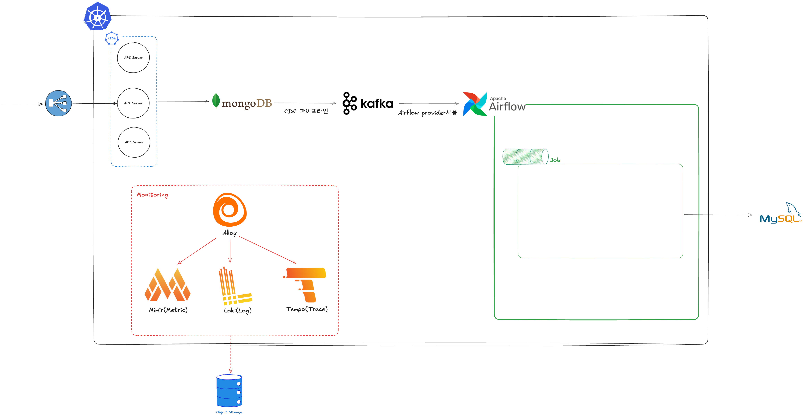

# Week 6 과제: 공모주 청약 시스템 설계

- 청약 마감일, 수백만 명이 동시에 증거금을 납입하는 상황에서 데이터 정합성을 어떻게 보장할지 설계합니다.
- 증거금 차감, 청약 수량 배정, 초과 신청분 환불처럼 여러 단계에 걸친 금융 처리 흐름에서 트랜잭션, 락, 멱등성, Outbox Pattern, 이벤트 기반 후처리, 장애 복구 전략을 비교합니다.
- 한정된 공급(주식 수량)에 폭발적 수요(동시 청약)가 몰리는 상황에서, 실시간성보다 정확성이 중요한 금융 도메인의 아키텍처 선택이 어떻게 달라지는지 정리합니다.
- (선택 실습) 트랜잭션 보장 흐름 일부를 구현합니다.

---

## ⒈ 문제 이해 및 설계 범위 확정

### 시나리오

당신은 국내 증권사의 백엔드 엔지니어로, 공모주 청약 시스템을 담당하고 있다.

**공모주 청약이란?**
기업이 주식 시장에 처음 상장할 때(IPO), 일반 투자자가 공개된 가격으로 주식을 미리 신청하는 절차다. 투자자는 원하는 수량만큼 주식을 신청하고, 신청 수량에 비례하는 증거금(보증금)을 미리 납입한다. 청약 마감 후 실제 배정 수량이 결정되며, 배정받지 못한 수량의 증거금은 환불된다.

```
예시: A기업 공모주 청약
- 청약 기간: 3일 (마지막 날 오후 4시 마감)
- 공모 주식 수량: 1,000만 주
- 청약 단가: 주당 50,000원
- 청약 경쟁률: 최종 500:1 (실제 신청량 = 공급의 500배)
```

사용자가 청약 버튼을 누르면 다음이 순차적으로 일어나야 한다.

```
1. 청약 요청 접수 (중복 청약 방지, 청약 자격 검증)
2. 증거금 차감 (계좌 잔액에서 납입 금액 차감)
3. 청약 내역 기록
4. 청약 마감 후 → 배정 수량 계산
5. 배정된 수량만큼 주식 지급
6. 미배정 증거금 환불
7. 청약 결과 알림 발송
```

예를 들어 이런 상황이 발생할 수 있다.

```
- 청약 마감 직전 수십만 명이 동시에 버튼을 누르면?
- 증거금은 차감됐는데 청약 내역 기록 전에 서버가 죽으면?
- 네트워크 오류로 청약 요청이 두 번 들어오면?
- 환불 처리 중 외부 은행 API가 다운되면?
- 배정 계산 도중 일부 사용자 데이터가 누락되면?
```

본 시스템은 이러한 상황에서도 증거금이 정확히 한 번만 차감되고,
배정과 환불이 한 명도 빠짐없이 정확하게 처리되도록 설계한다.

그 외 시나리오는 자유롭게 구체화해도 좋다.

```
- 채권 청약 시스템
- 리츠(부동산 공모) 청약 시스템
- 크라우드펀딩 플랫폼 선착순 투자
- 토큰증권(STO) 공모 시스템
```

---

## 설계 범위 (In / Out of Scope)

| 포함 (In Scope) | 제외 (Out of Scope) |
| --- | --- |
| 청약 요청 처리 흐름 전체 | 주식 시장 상장 심사 프로세스 |
| 증거금 차감 / 환불 정합성 | 주가 산정 및 공모가 결정 |
| 중복 청약 방지 (멱등성) | AML / 이상거래 탐지 모델 |
| 동시 청약 요청 락 전략 | KYC / 투자자 적합성 심사 |
| 배정 수량 계산 및 결과 저장 | 증권사 HTS / MTS UI 구현 |
| Outbox Pattern 기반 이벤트 발행 | 완전한 보안 솔루션 |
| 이벤트 기반 후처리 (알림, 정산) | 실제 코어뱅킹 연동 구현 |
| 청약 마감 후 대량 환불 처리 | 세금 / 수수료 계산 시스템 |
| 장애 복구 및 보상 트랜잭션 | 주식 계좌 개설 프로세스 |
| 피크 트래픽 대응 전략 | 타 증권사 연동 시스템 |

---

## 시스템 구성 전제

- 투자자는 이미 계좌 개설 및 본인인증이 완료된 상태라고 가정한다.
- 투자자의 증거금 계좌 잔액은 내부 DB에 저장되어 있다고 가정한다.
- 외부 은행 API(환불 송금용)는 별도 시스템으로 존재하며, 응답 지연 및 실패가 발생할 수 있다.
- 알림 서비스(푸시, SMS, 이메일)는 별도 마이크로서비스로 분리되어 있다.
- 메시지 브로커(Kafka 등)는 사용 가능하다고 가정한다.
- 배정 계산은 청약 마감 후 배치로 수행된다고 가정한다.
- 본 시스템은 청약 정합성, 멱등성, 피크 트래픽 처리, 장애 복구를 책임진다.

---

## 기능 요구사항

- 투자자의 청약 요청을 접수하고 증거금을 차감할 수 있어야 한다.
- 동일한 청약 요청이 중복으로 들어와도 한 번만 처리되어야 한다 (멱등성).
- 한 투자자가 동일 공모주에 중복 청약하는 것을 방지해야 한다.
- 증거금 차감과 청약 내역 기록은 원자적으로 처리되어야 한다.
- 청약 마감 후 배정 수량을 계산하고 결과를 저장할 수 있어야 한다.
- 미배정 증거금은 전액 환불되어야 하며 누락이 없어야 한다.
- 외부 시스템(알림, 은행 환불 API) 장애가 청약 핵심 처리를 실패시켜서는 안 된다.
- 청약 상태(접수 중 / 마감 / 배정 완료 / 환불 완료)를 투자자가 확인할 수 있어야 한다.
- 청약 마감 직전 트래픽 폭발 상황에서도 시스템이 안정적으로 동작해야 한다.

---

## 비기능 요구사항

| 항목 | 목표 |
| --- | --- |
| 청약 접수 응답 시간 | p95 1초 이내 |
| 증거금 정합성 | 이중 차감 / 환불 누락 발생 불가 |
| 멱등성 보장 | 동일 요청 N회 재시도 시 결과 동일 |
| 피크 트래픽 처리 | 마감 직전 평시 대비 50배 트래픽 처리 |
| 외부 API 타임아웃 대응 | 초과 시 비동기 처리 전환 |
| 환불 처리 완료 시간 | 배정 확정 후 24시간 이내 전원 완료 |
| 이벤트 유실 허용 범위 | 청약 / 환불 이벤트 유실 불가 |
| 장애 복구 | 서버 재시작 후 미완료 처리 자동 재개 |
| 시스템 가용성 | 청약 기간 중 월 99.99% 이상 |
| 청약 내역 보관 | 5년 이상 (금융 규제 기준) |

---

## 대략적 규모 추정 *(기준값 — 본인 가정으로 변경 가능)*

| 항목 | 수치 |
| --- | --- |
| 공모주 청약 참여 투자자 수 | 약 3,000,000명 (인기 종목 기준) |
| 청약 기간 | 3일 (마지막 날 트래픽 집중) |
| 마감 직전 1시간 청약 요청 비율 | 전체의 약 40% (약 1,200,000건) |
| 피크 QPS | 약 3,000 ~ 10,000 TPS |
| 평시 QPS | 약 100 ~ 300 TPS |
| 청약 1건당 처리 단계 수 | 약 4단계 (검증 → 차감 → 기록 → 이벤트) |
| 마감 후 환불 대상 건수 | 약 2,500,000건 (경쟁률 500:1 기준) |
| 환불 처리 목표 시간 | 24시간 이내 전원 완료 |
| 외부 은행 API 처리 한계 | 초당 약 500건 |
| 거래 내역 데이터 보관 기간 | 5년 이상 |
| 피크 시간대 | 청약 마감일 오후 3시 ~ 4시 |

---

# 2. 개략적 설계안 제시 및 동의 구하기

---

## 핵심 흐름 (필수)

1. 유저가 API 서버에 공모주 청약 API를 보낸다.
2. API서버는 몽고DB 내에 청약 신청 내역을 저장한다.
3. CDC 파이프라인을 통해서 데이터 변화가 감지되면 Kafka 이벤트를 생성한다
4. 특정 시간 혹은 주기적으로 Kafka토픽을 Airflow에서 받은 뒤에 데이터 파이프라인을 실행한다.
5. 데이터 파이프라인이 완료되면, MySQL 내에 데이터를 저장한다.
6. 사용자는 MySQL에서 데이터를 조회하여, 청약결과를 확인한다.

## 개략적 아키텍처 다이어그램 (필수)



---

# 3. 상세 설계

---

## 설계 대상 컴포넌트 사이의 우선순위 정하기 / 아키텍처 다이어그램 (필수)

### 우선순위
1. API SERVER MongoDB, MYSQL
2. Kafka, Airflow
3. 모니터링 컴포넌트

---

## 3-1. 피크 트래픽을 어떻게 처리할 것인가?

청약 마감 직전 1시간, 수백만 명이 동시에 청약 버튼을 누른다. 평시 대비 50배의 트래픽이 순간적으로 몰리는 상황에서 시스템을 어떻게 안정적으로 운영할 것인가?

- API Server의 경우 KEDA 기반으로 스케일 아웃이 가능하도록 구성
- Mongo DB의 경우 사전에 파티셔닝을 통해서, 스케일 아웃이 가능하도록 구성 진행
- 만약 일시적으로 장애가 발생하거나 혹은 재시작이 필요한 경우 클라이언트 측에서 검증 로직 및 커넥션 기반의 graceful shutdown 구성

---

## 3-6. 장애 복구 및 미완료 처리

서버 재시작, DB 장애, Kafka 장애 등으로 처리 도중 멈춘 청약/환불 건은 어떻게 복구할 것인가?

- 여러번 실행해도 동일한 결과가 나올 수 있도록 멱등성을 보장하는 로직을 개발
- 검증 로직을 별도로 구성해서, 만약 중복된 데이터가 있는 경우에는 출금이 불가능 하도록 로직 개발
- 최악의 경우에는 Trace, Log 분석을 통해서, 데이터 복구가 가능하도록 WAL구성

---

## 3-8. 청약 내역 저장 및 대용량 조회

수백만 건의 청약 내역은 규제상 5년 이상 보관해야 하며, 동시에 투자자가 실시간으로 자신의 청약 현황을 조회할 수 있어야 한다.

- 청약 내역 테이블의 핵심 스키마는 어떻게 설계할 것인가?
- 쓰기(청약 접수)와 읽기(현황 조회) 부하를 어떻게 분리할 것인가?
    - ex) CQRS, 읽기 복제본(Read Replica)
- 청약 마감 후 수백만 건을 한꺼번에 집계할 때 DB 부하는 어떻게 줄일 것인가?
- 5년치 장기 보관 데이터는 어떻게 아카이빙할 것인가?
    - ex) Cold Storage, 파티셔닝 전략

---

# 4. 설계 장점

- Airflow 내에서 데이터 파이프라인을 유동적으로 조절해서, 

---

# 5. 설계 단점

- 

---

# 6. 마무리

## 개인적 의견 / 사례 공유 / 추가 학습

- 아  내 주식 올라라

## 참고 자료

- [카카오 공모주 청약 시스템 장애 사례 (2021)](https://www.kakaocorp.com)
- [Martin Fowler - Saga Pattern](https://martinfowler.com/articles/patterns-of-distributed-systems/saga.html)
- [Outbox Pattern - microservices.io](https://microservices.io/patterns/data/transactional-outbox.html)
- [Idempotency Keys for APIs - Stripe Engineering Blog](https://stripe.com/blog/idempotency)
- [토스 기술 블로그 - 대규모 트래픽 처리](https://toss.tech)