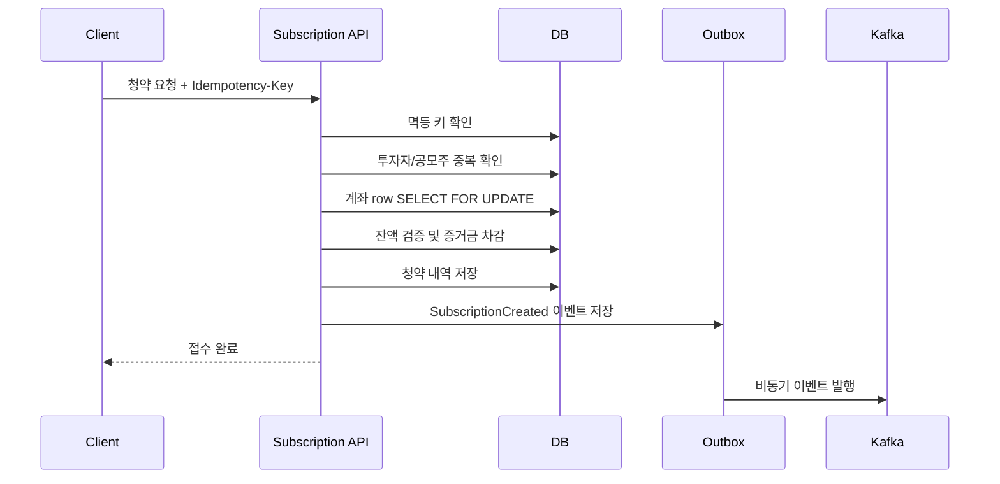
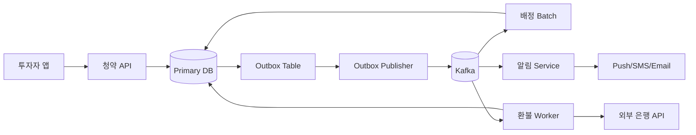

# week6

---

# **Week 6 과제: 공모주 청약 시스템 설계**

- 청약 마감일, 수백만 명이 동시에 증거금을 납입하는 상황에서 데이터 정합성을 어떻게 보장할지 설계합니다.
- 증거금 차감, 청약 수량 배정, 초과 신청분 환불처럼 여러 단계에 걸친 금융 처리 흐름에서 트랜잭션, 락, 멱등성, Outbox Pattern, 이벤트 기반 후처리, 장애 복구 전략을 비교합니다.
- 한정된 공급(주식 수량)에 폭발적 수요(동시 청약)가 몰리는 상황에서, 실시간성보다 정확성이 중요한 금융 도메인의 아키텍처 선택이 어떻게 달라지는지 정리합니다.
- (선택 실습) 트랜잭션 보장 흐름 일부를 구현합니다.

## **⒈ 문제 이해 및 설계 범위 확정**

**시나리오**

당신은 국내 증권사의 백엔드 엔지니어로, 공모주 청약 시스템을 담당하고 있다.

**공모주 청약이란?** 기업이 주식 시장에 처음 상장할 때(IPO), 일반 투자자가 공개된 가격으로 주식을 미리 신청하는 절차다. 투자자는 원하는 수량만큼 주식을 신청하고, 신청 수량에 비례하는 증거금(보증금)을 미리 납입한다. 청약 마감 후 실제 배정 수량이 결정되며, 배정받지 못한 수량의 증거금은 환불된다.

`예시: A기업 공모주 청약
- 청약 기간: 3일 (마지막 날 오후 4시 마감)
- 공모 주식 수량: 1,000만 주
- 청약 단가: 주당 50,000원
- 청약 경쟁률: 최종 500:1 (실제 신청량 = 공급의 500배)`

사용자가 청약 버튼을 누르면 다음이 순차적으로 일어나야 한다.

`1. 청약 요청 접수 (중복 청약 방지, 청약 자격 검증)
2. 증거금 차감 (계좌 잔액에서 납입 금액 차감)
3. 청약 내역 기록
4. 청약 마감 후 → 배정 수량 계산
5. 배정된 수량만큼 주식 지급
6. 미배정 증거금 환불
7. 청약 결과 알림 발송`

예를 들어 이런 상황이 발생할 수 있다.

- `청약 마감 직전 수십만 명이 동시에 버튼을 누르면?
- 증거금은 차감됐는데 청약 내역 기록 전에 서버가 죽으면?
- 네트워크 오류로 청약 요청이 두 번 들어오면?
- 환불 처리 중 외부 은행 API가 다운되면?
- 배정 계산 도중 일부 사용자 데이터가 누락되면?`

본 시스템은 이러한 상황에서도 증거금이 정확히 한 번만 차감되고, 배정과 환불이 한 명도 빠짐없이 정확하게 처리되도록 설계한다.

그 외 시나리오는 자유롭게 구체화해도 좋다.

- `채권 청약 시스템
- 리츠(부동산 공모) 청약 시스템
- 크라우드펀딩 플랫폼 선착순 투자
- 토큰증권(STO) 공모 시스템`

## **설계 범위 (In / Out of Scope)**

**포함 (In Scope)제외 (Out of Scope)**청약 요청 처리 흐름 전체주식 시장 상장 심사 프로세스증거금 차감 / 환불 정합성주가 산정 및 공모가 결정중복 청약 방지 (멱등성)AML / 이상거래 탐지 모델동시 청약 요청 락 전략KYC / 투자자 적합성 심사배정 수량 계산 및 결과 저장증권사 HTS / MTS UI 구현Outbox Pattern 기반 이벤트 발행완전한 보안 솔루션이벤트 기반 후처리 (알림, 정산)실제 코어뱅킹 연동 구현청약 마감 후 대량 환불 처리세금 / 수수료 계산 시스템장애 복구 및 보상 트랜잭션주식 계좌 개설 프로세스피크 트래픽 대응 전략타 증권사 연동 시스템

## **시스템 구성 전제**

- 투자자는 이미 계좌 개설 및 본인인증이 완료된 상태라고 가정한다.
- 투자자의 증거금 계좌 잔액은 내부 DB에 저장되어 있다고 가정한다.
- 외부 은행 API(환불 송금용)는 별도 시스템으로 존재하며, 응답 지연 및 실패가 발생할 수 있다.
- 알림 서비스(푸시, SMS, 이메일)는 별도 마이크로서비스로 분리되어 있다.
- 메시지 브로커(Kafka 등)는 사용 가능하다고 가정한다.
- 배정 계산은 청약 마감 후 배치로 수행된다고 가정한다.
- 본 시스템은 청약 정합성, 멱등성, 피크 트래픽 처리, 장애 복구를 책임진다.

## **기능 요구사항**

- 투자자의 청약 요청을 접수하고 증거금을 차감할 수 있어야 한다.
- 동일한 청약 요청이 중복으로 들어와도 한 번만 처리되어야 한다 (멱등성).
- 한 투자자가 동일 공모주에 중복 청약하는 것을 방지해야 한다.
- 증거금 차감과 청약 내역 기록은 원자적으로 처리되어야 한다.
- 청약 마감 후 배정 수량을 계산하고 결과를 저장할 수 있어야 한다.
- 미배정 증거금은 전액 환불되어야 하며 누락이 없어야 한다.
- 외부 시스템(알림, 은행 환불 API) 장애가 청약 핵심 처리를 실패시켜서는 안 된다.
- 청약 상태(접수 중 / 마감 / 배정 완료 / 환불 완료)를 투자자가 확인할 수 있어야 한다.
- 청약 마감 직전 트래픽 폭발 상황에서도 시스템이 안정적으로 동작해야 한다.

## **비기능 요구사항**

**항목목표**청약 접수 응답 시간p95 1초 이내증거금 정합성이중 차감 / 환불 누락 발생 불가멱등성 보장동일 요청 N회 재시도 시 결과 동일피크 트래픽 처리마감 직전 평시 대비 50배 트래픽 처리외부 API 타임아웃 대응초과 시 비동기 처리 전환환불 처리 완료 시간배정 확정 후 24시간 이내 전원 완료이벤트 유실 허용 범위청약 / 환불 이벤트 유실 불가장애 복구서버 재시작 후 미완료 처리 자동 재개시스템 가용성청약 기간 중 월 99.99% 이상청약 내역 보관5년 이상 (금융 규제 기준)

## **대략적 규모 추정 *(기준값 — 본인 가정으로 변경 가능)***

**항목수치**공모주 청약 참여 투자자 수약 3,000,000명 (인기 종목 기준)청약 기간3일 (마지막 날 트래픽 집중)마감 직전 1시간 청약 요청 비율전체의 약 40% (약 1,200,000건)피크 QPS약 3,000 ~ 10,000 TPS평시 QPS약 100 ~ 300 TPS청약 1건당 처리 단계 수약 4단계 (검증 → 차감 → 기록 → 이벤트)마감 후 환불 대상 건수약 2,500,000건 (경쟁률 500:1 기준)환불 처리 목표 시간24시간 이내 전원 완료외부 은행 API 처리 한계초당 약 500건거래 내역 데이터 보관 기간5년 이상피크 시간대청약 마감일 오후 3시 ~ 4시

# **2. 개략적 설계안 제시 및 동의 구하기**

## **핵심 흐름 (필수)**



## **개략적 아키텍처 다이어그램 (필수)**



# **3. 상세 설계**


## **3-2. 증거금 동시성 제어는 어떻게 할 것인가?**

같은 투자자가 여러 기기에서 동시에 청약을 시도하거나, 동일 계좌에 여러 요청이 동시에 들어오면 잔액이 음수가 되거나 중복 차감이 발생할 수 있다.

- Pessimistic Lock(SELECT FOR UPDATE)과 Optimistic Lock(version 필드) 중 무엇을 선택할 것인가? 피크 트래픽 상황에서의 trade-off는?
- Redis 기반 분산 락을 사용한다면 어떤 문제가 생길 수 있는가?
    - ex) Redis 장애 시 락이 해제되지 않으면?
- 락 획득 대기 시간이 길어질 때 사용자에게 어떤 응답을 줄 것인가?
- 계좌 잔액 부족 검증은 어느 시점에 수행할 것인가?

---

이 시스템에서 가장 치명적인 사고가 다음과 같음

```objectivec
잔액이 n백만원인데 동시에 두 요청이 들어와서 각각 n백만원 씩 차감됨
```

→ 이중 차감 or 음수 잔액 생김

- 그렇기 때문에 다음과 같이 대처
    - 계좌 잔액 차감은 Pessimistic Lock을 사용
        - 락은 계좌 row에만 걸고 트랜잭션 범위는 최대한 짧게 유지 / 락을 잡은 상태에서는 외부 은행 API 호출, kafka 발행, 알림 발송 같은 느린 작업을 수행 X
            
            ```objectivec
            트랜잭션 시작
            1. account row SELECT FOR UPDATE
            2. 잔액 >= 증거금인지 검증
            3. account.balance 차감
            4. ledger_entries에 차감 이력 기록
            5. subscriptions에 청약 내역 저장
            6. outbox_events에 이벤트 저장
            트랜잭션 커밋
            ```
            
        - **Optimistic Lock**은 충돌이 적은 환경에서는 좋지만 청약 마감 직전처럼 같은 계좌/사용자의 중복 요청이 몰릴 수 있는 상황에서는 재시도 비용과 사용자 혼란 가중 ⇒ *그래서 증거금 차감 구간은 짧고 강한 Pessimistic Lock으로 선택*
    - 동일 계좌 row에 SELECT FOR UPDATE를 걸고 잔액 검증과 차감을 하나의 트랜지션 안에서 수행
- **Redis의 분산 락**
    - 보조 수단으로 사용할 순 있지만 증거금 차감의 최종 정합성 보장 수단으로는 사용 X
    - 잘못 구현하면 동시에 두 요청이 임계 구역에 진입 가능 ⇒ 따라서 최종 방어선은 DB row lock과 unique constraint로 둠
- **락 대기 시간**
    - 락 획득 대기 시간이 짧으면 일정 시간 대기 후 처리
    - 예를 들어 1~2초 안에 락을 얻으면 정상 처리하고 초과하면 202 Accepted 또는 409/429 계열 응답으로 반환
- **잔액 부족 검증 시점**
    - 잔액 부족 검증은 반드시 계좌 row lock을 획득한 이후 동일 트랜잭션 안에서 수행
    - 락 전에 조회한 잔액은 동시에 다른 요청이 차감할 수 있으므로 최종 판단에 사용 X

## **3-3. 중복 청약을 어떻게 방지할 것인가?**

동일 투자자가 같은 공모주에 두 번 청약하거나, 네트워크 오류로 동일 요청이 두 번 들어오는 경우를 막아야 한다. 두 가지는 성격이 다른 문제다.

- **비즈니스 규칙 중복** (같은 공모주에 두 번 청약 시도) vs **기술적 중복** (동일 요청 재전송)을 어떻게 구분하고 각각 다르게 처리할 것인가?
- 멱등 키(Idempotency Key)는 누가 생성하고 어디에 저장할 것인가?
- DB의 UNIQUE constraint와 애플리케이션 레벨 멱등성 처리를 어떻게 조합할 것인가?
- 처리 중인 요청이 있을 때 동일 키의 후속 요청이 들어오면 어떻게 응답할 것인가?

---

- **기술적 중복**
    - 같은 요청이 재시도된 경우 Idempotency-Key로 막음
        
        ```objectivec
        - Idempotency-Key는 클라이언트가 요청마다 생성해서 헤더로 전달
        - 서버는 idempotency_keys 테이블에 key, investor_id, request_hash, status, response_snapshot, created_at을 저장
        ```
        
- **비즈니스 중복**
    - 같은 투자자가 같은 공모주에 또 청약한 경우
        - investor_id + ipo_id unique constraint로 막음

## **3-4. Outbox Pattern으로 이벤트를 어떻게 안전하게 발행할 것인가?**

증거금 차감은 성공했는데 Kafka 이벤트 발행 전에 서버가 죽으면, 이후 배정/환불/알림 처리가 누락될 수 있다. 반대로 이벤트는 발행됐는데 DB 저장이 실패하면 유령 이벤트가 생긴다.

- Outbox 테이블은 어떤 구조로 설계할 것인가?
- 증거금 차감과 Outbox 이벤트 삽입을 어떻게 단일 트랜잭션으로 묶을 것인가?
- Outbox → Kafka 발행 방식으로 Polling과 CDC(Debezium) 중 무엇을 선택할 것인가? 각각의 trade-off는?
- 발행 실패 시 재시도 정책은? 영구 실패로 판정하는 기준은?
- 청약 마감 직전 Outbox 이벤트가 수백만 건 쌓일 때 처리 지연은 어떻게 대응할 것인가?

---

- 증거금 차감, 청약 내역 저장, Outbox 이벤트 저장을 같은 DB 트랜잭션으로 묶음
    - 이후 outbox publisher가 pending 이벤트를 kafka로 발행
    - 발행 성공 시 published로 변경하고 실패 시 재시도
        
        ```objectivec
        outbox_events
        - id
        - aggregate_type
        - aggregate_id
        - event_type
        - payload
        - status
        - retry_count
        - next_retry_at
        - created_at
        - published_at
        ```
        
- **재시도 정책**
    - kafka 발행 실패 시 retry_count를 증가시키고 exponential backoff로 재시도
    - 일정 횟수 이상 실패하거나 payload 요류처럼 재시도해도 성공 가능성이 낮은 경우 FAILED 상태로 전환하고 운영 알림 보냄
- **수백만 건 쌓일 때**
    - outbox publisher는 여러 인스턴스로 수평 확장
    - Kafka partition key는 ipo_id 또는 subscription_id를 사용하되, 특정 ipo_id에 이벤트가 몰릴 수 있으므로 필요하면 subscription_id 기반으로 분산

# **4. 설계 장점**

- 돈 처리 정합성이 강하고 중복 요청과 이벤트 유실에 안전, 외부 시스템 장애를 핵심 청약 처리와 분리할 수 있음

# **5. 설계 단점**

- DB 트랜잭션과 락에 의존해서 피크 시간대 DB 병목 생길 수 있음
- outbox / 재시도 / Recovery Worker 등 운영복잡도 증가