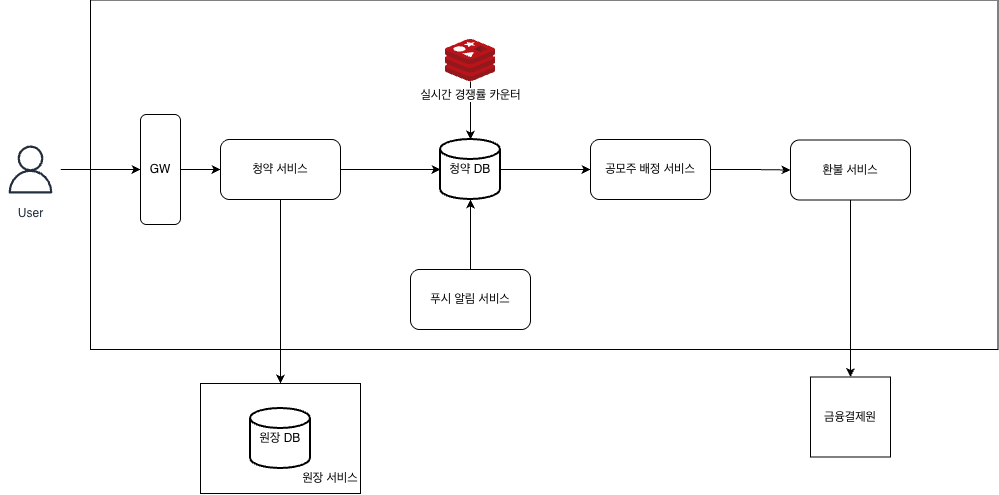

# Week 6 과제: 공모주 청약 시스템 설계

---

## ⒈ 문제 이해 및 설계 범위 확정

### 시나리오

당신은 국내 증권사의 백엔드 엔지니어로, 공모주 청약 시스템을 담당하고 있다.

**공모주 청약이란?**
기업이 주식 시장에 처음 상장할 때(IPO), 일반 투자자가 공개된 가격으로 주식을 미리 신청하는 절차다. 투자자는 원하는 수량만큼 주식을 신청하고, 신청 수량에 비례하는 증거금(보증금)을 미리 납입한다. 청약 마감 후 실제 배정 수량이 결정되며, 배정받지 못한 수량의 증거금은 환불된다.

```
KBank 공모주 청약 사례
- 청약 기간: 영업일 기준 2일 (마지막 날 오후 4시 마감)
- 공모 주식 수량: 6,000만 주
- 청약 단가: 주당 8,300원
- 청약 경쟁률: 최종 134.6 대 1
```

사용자가 청약 버튼을 누르면 다음이 순차적으로 일어나야 한다.

```
1. 청약 요청 접수 (중복 청약 방지, 청약 자격 검증)
2. 증거금 차감 (계좌 잔액에서 납입 금액 차감)
3. 청약 내역 기록
4. 청약 마감 후 → 배정 수량 계산
5. 배정된 수량만큼 주식 지급
6. 미배정 증거금 환불(환불은 타행계좌도 가능하다.)
7. 청약 결과 알림 발송
```

예를 들어 이런 상황이 발생할 수 있다.

```
- 청약 마감 직전 수십만 명이 동시에 버튼을 누르면?
- 증거금은 차감됐는데 청약 내역 기록 전에 서버가 죽으면?
- 네트워크 오류로 청약 요청이 두 번 들어오면?
- 환불 처리 중 외부 은행 API가 다운되면? 외부 은행 API 속도 
- 배정 계산 도중 일부 사용자 데이터가 누락되면?
```

본 시스템은 이러한 상황에서도 증거금이 정확히 한 번만 차감되고,
배정과 환불이 한 명도 빠짐없이 정확하게 처리되도록 설계한다.

---

## 설계 범위 (In / Out of Scope)

| 포함 (In Scope) | 제외 (Out of Scope) |
| --- | --- |
| 청약 요청 처리 흐름 전체 | 주식 시장 상장 심사 프로세스 |
| 증거금 차감 / 환불 정합성 | 주가 산정 및 공모가 결정 |
| 중복 청약 방지 (멱등성) | AML / 이상거래 탐지 모델 |
| 동시 청약 요청 락 전략 | KYC / 투자자 적합성 심사 |
| 배정 수량 계산 및 결과 저장 | 증권사 HTS / MTS UI 구현 |
| Outbox Pattern 기반 이벤트 발행 | 완전한 보안 솔루션 |
| 이벤트 기반 후처리 (알림, 정산) | 실제 코어뱅킹 연동 구현 |
| 청약 마감 후 대량 환불 처리 | 세금 / 수수료 계산 시스템 |
| 장애 복구 및 보상 트랜잭션 | 주식 계좌 개설 프로세스 |
| 피크 트래픽 대응 전략 | 타 증권사 연동 시스템 |

---

## 시스템 구성 전제

- 투자자는 이미 계좌 개설 및 본인인증이 완료된 상태라고 가정한다.
- 투자자의 증거금 계좌 잔액은 내부 DB에 저장되어 있다고 가정한다.
- 외부 은행 API(환불 송금용)는 별도 시스템으로 존재하며, 응답 지연 및 실패가 발생할 수 있다. (타행 계좌 환불이 가능하다고 가정)
- 알림 서비스(푸시, SMS, 이메일)는 별도 마이크로서비스로 분리되어 있다.
- 메시지 브로커(Kafka 등)는 사용 가능하다고 가정한다.
- 배정 계산은 청약 마감 후 배치로 수행된다고 가정한다.
- 본 시스템은 청약 정합성, 멱등성, 피크 트래픽 처리, 장애 복구를 책임진다.
- 데드라인의 기준은 DB에 청약 정보가 저장되는 시간이다.

---

## 기능 요구사항

- 투자자의 청약 요청을 접수하고 증거금을 차감할 수 있어야 한다.
- 동일한 청약 요청이 중복으로 들어와도 한 번만 처리되어야 한다 (멱등성).
- 한 투자자가 동일 공모주에 중복 청약하는 것을 방지해야 한다.
- 증거금 차감과 청약 내역 기록은 원자적으로 처리되어야 한다.
- 청약 마감 후 배정 수량을 계산하고 결과를 저장할 수 있어야 한다.
- 미배정 증거금은 전액 환불되어야 하며 누락이 없어야 한다.
- 외부 시스템(알림, 은행 환불 API) 장애가 청약 핵심 처리를 실패시켜서는 안 된다.
- 청약 상태(접수 중 / 마감 / 배정 완료 / 환불 완료)를 투자자가 확인할 수 있어야 한다.
- 청약 마감 직전 트래픽 폭발 상황에서도 시스템이 안정적으로 동작해야 한다.

---

## 비기능 요구사항

| 항목 | 목표 |
| --- | --- |
| 청약 접수 응답 시간 | p95 1초 이내 |
| 증거금 정합성 | 이중 차감 / 환불 누락 발생 불가 |
| 멱등성 보장 | 동일 요청 N회 재시도 시 결과 동일 |
| 피크 트래픽 처리 | 마감 직전 평시 대비 50배 트래픽 처리 |
| 외부 API 타임아웃 대응 | 초과 시 비동기 처리 전환 |
| 환불 처리 완료 시간 | 청약 마감일 다음날 오전 중으로 모두 환불 |
| 이벤트 유실 허용 범위 | 청약 / 환불 이벤트 유실 불가 |
| 장애 복구 | 서버 재시작 후 미완료 처리 자동 재개 |
| 시스템 가용성 | 청약 기간 중 월 99.99% 이상 |
| 청약 내역 보관 | 5년 이상 (금융 규제 기준) |

---

## 대략적 규모 추정

| 항목 | 수치 |
| --- | --- |
| 총 청약 건수 | 836,599건 |
| 청약 기간 | 영업일 기준 2일 |
| 마감 직전 1시간 청약 요청 비율 | 전체의 약 40% (약 334,640건) |
| 피크 QPS - write | 수만 TPS 가정 |
| 피크 QPS - read | 수만 TPS 가정 |
| 평시 QPS | 약 100 ~ 300 TPS |
| 청약 1건당 처리 단계 수 | 약 4단계 (검증 → 차감 → 기록 → 이벤트) |
| 마감 후 환불 대상 건수 | 83만 6,599건 (비례/균등 배정 특성상 청약자 전원이 환불 대상) |
| 환불 처리 목표 시간 | 청약 마감일 다음날 오전 중 |
| 외부 은행 API 처리 한계 | 초당 약 500건 |
| 거래 내역 데이터 보관 기간 | 5년 이상 |
| 피크 시간대 | 마감 전 1~2분 |

---


# 2. 개략적 설계안 제시 및 동의 구하기

---

## 개략적 아키텍처 다이어그램



## 핵심 흐름

- 청약 접수 흐름: 청약 접수 요청 -> 청약 서비스 -> 청약 DB에 청약 정보 등록 -> 원장에서 증거금 검증/차감 -> 접수 성공 화면 띄우기

- 청약 마감 후 흐름: 공모주 배정 -> 환불 처리 -> 푸시 알림

- 개별 흐름: 실시간 경쟁률 조회, 푸시 알림

---

# 3. 상세 설계

---

## 3-1. 동기 vs 비동기

### 접수 확정은 동기로

유저의 접수 요청이 들어왔을 때, 접수 성공/실패 여부를 빠르게 확정 짓고 알려주는 것이 중요하다.
따라서 [요청 접수 -> 청약 정보 등록 -> 증거금 검증/차감 -> 접수 성공 화면] 까지의 흐름은 동기 처리가 적합하다고 판단했다.

비동기 처리를 하게 될 경우 유저 입장에서 "접수에 성공했다는 화면은 봤는데, 마감 후에 확인해보니 잔액 부족으로 실패처리 되었다." 같은 상황이 발생한다.

나머지 배치 작업, 환불 작업, 푸시 알림 등등의 작업은 비동기로 처리한다.

### 동기 처리로 수만 TPS를 버틸 수 있을까?

- 원장 DB api: 증거금 검증/차감
    - 증권사의 원장 DB는 보통 성능이 매우 좋은 IMDB라고 한다. 원장 DB가 병목이 되지는 않을 것이라고 가정했다.

- 청약 DB: 멱등키, 청약 정보, outbox 이벤트 저장
    - 직접 구축한다고 가정했다. 청약 내역을 기록하는 연산은 요청당 하나의 행을 추가하게 된다. 샤딩을 하더라도 한 요청이 하나의 DB에만 접근하기 때문에 샤딩하기 좋다. `investor_id`를 기준으로 샤딩해서 부하를 최대한 분산한다.

- 대기 큐 도입: 지연 없이 동기 처리가 불가능할 정도라면 대기 큐를 도입하여 Throttling 할 수 있다.

### 샤딩의 부작용 — 크로스샤드 집계 비용

`investor_id` 샤딩은 청약 쓰기에는 효율적이지만, **공모주 단위 집계(경쟁률 등)**는 모든 샤드를 훑어야 한다. 실시간 경쟁률 조회는 별도 집계(예: Redis 카운터, 읽기 전용 집계 뷰)를 두지 않으면 비싸진다.

---

## 3-2. SAGA vs 2PC

"증거금 검증/차감"과 "청약 등록" 연산은 원자적으로 처리해야한다. 하지만 두 연산은 서로 다른 DB에서 이루어진다. 분산 트랜잭션이 필요하다.

### SAGA를 선택한 이유

다른 대안인 2PC는 양쪽 DB의 커넥션을 네트워크 왕복이 끝날 때까지 동시에 잡는다. 트래픽이 높은 상황에서는 커넥션 풀이 고갈될 수 있다고 한다.

### 흐름

- 순서는 `청약 등록 -> 증거금 차감`: 재청약 차단을 증거금 차감 전에 할 수 있다. 보상 처리로 환불을 하는 것 보다 청약 등록을 실패로 업데이트 하는 것이 더 가볍다.

1. 청약 DB의 subscription 테이블에 PENDING인 행을 insert (여기서 UNIQUE(investor_id, ipo_id) 로 재청약 차단)

2. 원장 DB에서 증거금 검증/차감 (멱등키 기준 idempotent — 같은 키 재요청 시 재차감 금지)

3. 청약 DB의 subscription 테이블의 해당 row를 `PENDING` → `CONFIRMED`로 업데이트

- 2번에서 실패한 경우(잔액 부족): `PENDING`을 `FAILED` 처리한 후 잔액 부족 띄우기

- 3번에서 실패한 경우: 증거금은 차감됐는데 `PENDING`인 상태이다. **정합성 배치**를 통해 보정한다.

### 중간에 청약 서비스가 다운 되는 경우 (3번에서 실패한 경우)

```
시각   청약 서비스                      청약 DB              원장 DB
──────────────────────────────────────────────────────────────────────
t1    1. INSERT `PENDING` ───────────→  subscription
                                       (`PENDING`) 커밋 ✅
t2    2. 검증/차감 호출 ──────────────────────────────────→ ledger_txn
                                                        (idem=aaa) 커밋 ✅
                                                        💰 돈 빠져나감
t3    3. UPDATE → CONFIRMED 하려는 순간
        청약 서비스 다운  (또는 청약 DB 일시 장애, 또는 응답 유실)
──────────────────────────────────────────────────────────────────────
결과:  청약 DB = PENDING (확정 안 됨)
       원장 DB = 차감 완료 (커밋됨)        ← 불일치

```

#### Forward Recovery로 해결

rollback을 하는 것이 아니라 청약을 확정하여 해결한다. 유저는 청약을 원했고, 증거금은 이미 차감된 상황이다. 환불해서 없던 일로 만드는 것보다는 청약을 확정하는 것이 더 적절하다고 판단했다.

진실의 원천 = 원장 DB
"돈이 빠졌는가?"를 원장 api에 `idem_key`로 조회. 정합성 배치는 이걸 기준으로 판단한다.

```
정합성 배치 로직

주기적으로 (예: 1분마다)
  청약 DB에서 `status=PENDING AND created_at < now - 5분` 인 행을 스캔
  // 5분: 정상 처리 중인 in-flight 요청과 구분하는 안전 마진

  각 `PENDING` 청약마다:
    원장 api에 `idem_key` 로 차감 기록 조회
    ┌─ 차감 기록 있음  → 돈은 빠졌다 → 앞으로 밀기
    │     `UPDATE subscription PENDING → CONFIRMED`  (멱등: 이미 CONFIRMED면 no-op)
    │
    └─ 차감 기록 없음  → 아직 돈 안 빠짐 → 차감 재시도 (멱등)
          ├─ 성공      → `CONFIRMED`
          └─ 잔액부족  → `FAILED` (돈 안 움직였으니 보상 불필요)
```

### SAGA 패턴의 단점

SAGA + 정합성 배치 구조는 **강한 일관성을 포기**한 구조이다. 위의 상황처럼 "돈은 빠졌지만 아직 `PENDING`"인 구간이 존재할 수 있다. 이를 보정하는 정합성 배치는 주기(예: 1분) + 안전 마진(5분)만큼 늦게 동작한다. 그 사이 사용자는 증거금은 차감되었지만 청약은 확정되지 않은 상태를 보게된다. 2PC였다면 발생하지 않는 상황이다.


---

## 3-2. 중복 청약을 어떻게 방지할 것인가?

공모주 청약에는 **여러 유저가 경쟁하는 공유 재고(hot resource)**가 없다. 선착순 한정수량 판매라면 모두가 같은 재고 행을 깎으려 경쟁하므로 락이나 원자적 차감이 필요하다. 그러나 청약은 신청 수량에 제한이 없다.

존재하는 동시성은 *유저 간* 경쟁이 아니라 **자기 요청과의 충돌**(동일 요청 재전송, 동일 `(investor_id, ipo_id)` 동시 시도)이다. 이 부분은 **UNIQUE 제약으로 직렬화**하여 해결할 수 있다.

### 네트워크 오류로 동일 요청이 두 번 들어오는 경우

요청 헤더에 멱등키를 담아서 보낸다. 멱등키는 청약 폼과 대응된다.
`INSERT idempotency(key=aaa, status=PROCESSING) -- UNIQUE(key)`

네트워크 오류로 인한 재전송, 유저가 실수로 두 번 클릭 -> 동일한 멱등키 -> `status`를 보고 상황에 맞게 응답.

### 동일 투자자가 같은 공모주에 다시 청약하는 경우

`INSERT subscription(investor_id, ipo_id, ...)   -- UNIQUE(investor_id, ipo_id)`
- 두 번 째 청약시도 -> 동일한 (investor_id, ipo_id) ->  "이미 청약을 신청하셨습니다."

```
참고: UNIQUE 인덱스가 걸려 있으면, 동일 키로 동시에 두 INSERT가 들어와도 DB 엔진이 인덱스 레벨에서 직렬화해준다.

1. INSERT idempotency(key=aaa, status=PROCESSING)
     ├─ UNIQUE 위반?  → 이미 있는 키 → 그 행 조회
     │       ├─ COMPLETED → 저장된 결과 그대로 반환 (재전송·연타: 성공 화면)
     │       └─ PROCESSING → 409 "처리 중" (or 잠깐 대기)
     └─ 성공 → 내가 처음 → 계속
2. INSERT subscription(investor_id, ipo_id, ...)   -- UNIQUE(investor_id, ipo_id)
     └─ UNIQUE 위반? → 진짜 재청약 → "이미 청약하셨습니다" 에러
3. idempotency 행을 COMPLETED + 결과 저장
4. COMMIT
```

---

## 3-3. 테이블 스키마 (idempotency / subscription / outbox)

세 테이블 모두 **청약 DB**에 위치하며, `investor_id` 기준으로 샤딩된다. 한 청약 요청이 하나의 샤드에서 끝나도록 설계해, 분산 트랜잭션 없이 같은 샤드 안에서 TX1/TX2를 짧게 커밋한다.

### idempotency — "이 요청을 처리한 적 있나?"

요청 단위의 **처리 결과를 캐싱**해, 재전송·연타가 들어와도 같은 응답을 돌려주기 위한 테이블이다.

| 칼럼 | 타입 | 설명 |
| --- | --- | --- |
| `idempotency_key` | VARCHAR (PK / **UNIQUE**) | 클라이언트가 헤더로 보낸 멱등키. 청약 폼과 1:1 대응. 기술적 중복(재전송)을 인덱스 레벨에서 직렬화 |
| `status` | VARCHAR | `PROCESSING` → `COMPLETED` / `FAILED`. 요청의 처리 상태 |
| `response_body` | JSON | `COMPLETED`일 때 저장해 둔 응답 본문. 재전송 시 그대로 반환 |
| `http_status` | SMALLINT | 저장된 응답 코드 (200 / 409 / 422 등) |
| `created_at` | TIMESTAMP | 최초 접수 시각 |
| `updated_at` | TIMESTAMP | 상태 전이 시각 |
| `expires_at` | TIMESTAMP | TTL. 일정 기간 후 정리(공모 종료 + N일) |

### subscription — "이 청약은 확정됐나?" (saga 상태의 원천)

비즈니스 상태(saga)를 담는 **진실의 원천**. 정합성 배치가 스캔하는 대상이다.

| 칼럼 | 타입 | 설명 |
| --- | --- | --- |
| `subscription_id` | BIGINT (PK) | 청약 식별자 |
| `investor_id` | BIGINT | 투자자. **샤드 키** |
| `ipo_id` | BIGINT | 공모주 |
| `quantity` | INT | 청약 수량 |
| `deposit_amount` | DECIMAL | 증거금 (= 수량 × 청약 단가) |
| `status` | VARCHAR | `PENDING` → `CONFIRMED` / `FAILED`. saga 비즈니스 상태 |
| `idem_key` | VARCHAR | 원장 차감 호출에 사용한 멱등키. **정합성 배치가 원장 `ledger_txn`을 조회할 때 이 키를 사용** |
| `created_at` | TIMESTAMP | 접수 시각. 배치의 in-flight 구분(`now - 5분`)에 사용 |
| `updated_at` | TIMESTAMP | 상태 전이 시각 |

> 제약: `UNIQUE(investor_id, ipo_id)` → 한 투자자가 같은 공모주에 두 번 청약하는 비즈니스 중복 차단.

### outbox — 발행 이벤트

DB 커밋과 이벤트 발행의 원자성을 보장하는 중간 테이블이다. **subscription 확정과 같은 트랜잭션(TX2)에서 INSERT**한다. "DB는 됐는데 이벤트 유실" / "이벤트는 갔는데 DB 롤백"을 막는다.

| 칼럼 | 타입 | 설명 |
| --- | --- | --- |
| `outbox_id` | BIGINT (PK, auto-inc) | 발행 순서 보장에도 사용 |
| `aggregate_type` | VARCHAR | `Subscription`, `Refund` 등 |
| `aggregate_id` | BIGINT | 연관 엔티티 id (예: `subscription_id`) |
| `event_type` | VARCHAR | `SubscriptionConfirmed`, `RefundSucceeded` 등 |
| `payload` | JSON | 발행할 이벤트 본문 (소비자가 받을 데이터) |
| `status` | VARCHAR | `NEW` → `SENT`. 릴레이(폴링 워커/배치)가 발행 후 `SENT`로 표시 |
| `created_at` | TIMESTAMP | 생성 시각 |
| `published_at` | TIMESTAMP | 발행 완료 시각 (nullable) |


---

## 3-4. 이벤트를 어떻게 안전하게 발행할 것인가?

푸시 알림 서비스는 이벤트 기반의 비동기 처리 방식을 사용한다.
청약 접수완료 / 공모주 배정완료 / 환불완료 같은 이벤트를 발행해야한다. 이 때 DB 커밋과 이벤트 발행의 원자성을 보장하기 위해 Outbox Pattern을 사용했다.

### Outbox Pattern

"DB 변경"과 "이벤트 발행 의도"를 한 트랜잭션으로 묶는다. 이벤트를 같은 청약 DB의 outbox 테이블에 INSERT하고(= subscription 확정과 같은 TX2, 같은 커밋), 별도의 릴레이(폴링 워커/배치)가 outbox를 읽어 목적지로 전달한다.

```
-- TX1 (청약 DB, 짧게!) ─ 진입 가드
BEGIN
  INSERT idempotency(key='aaa', status='PROCESSING');   -- UNIQUE(key): 기술적 중복(재전송)
  INSERT subscription(investor_id, ipo_id, status='PENDING');  -- UNIQUE(investor_id, ipo_id): 비즈니스 중복(재청약)
COMMIT     ← 여기서 끊는다

──────────────────────────────────────────────
원장 서비스 호출: 원장 DB 증거금 차감 (idem_key=aaa, 멱등)
──────────────────────────────────────────────

-- TX2 (청약 DB, 짧게!) ─ 확정 (= Q2)
BEGIN
  UPDATE subscription PENDING → CONFIRMED;
  UPDATE idempotency → COMPLETED (결과 저장);
  INSERT outbox(SubscriptionConfirmed);
COMMIT
```

- 이벤트 저장이 원자적으로 묶이므로 **유실/유령 이벤트가 원천적으로 불가능**하다.
- 읽기에 실패해도 outbox에 행이 남아 있으니 재시도하면 된다.

---

## 3-5. Kafka를 선택하지 않은 이유: 실시간성과 fan-out 따져보기

처음에는 Kafka 도입을 고려했지만, Kafka를 쓰지 않는 것이 더 좋을 것 같다는 생각이 들었다.

Kafka는 **같은 라이브 스트림을, 서로 독립적으로, 동시에 구독하는 소비자가 여럿**일 때 효율적이다.

하지만 현재 상황은 다음과 같다.

### 1. 실시간성이 중요하지 않은 consumer

| 소비자 | 언제 도나 | 정체 |
| --- | --- | --- |
| 배정 서비스 | 마감 후 1회 배치 | subscription 테이블을 **직접 스캔** (이벤트 구독이 아님) |
| 환불 서비스 | 배정 후 배치 | 배정 산출물을 받는 **다음 단계** |
| 접수완료 푸시 | 청약 기간 중 | 라이브 소비자지만, **동기 응답으로 "접수 완료"를 이미 보여주므로** 푸시 알림은 살짝 늦어도 됨 |
| 실시간 경쟁률 | 청약 기간 중 | **카운터(Redis INCR)**, 스트림 구독이 아님 |

- 초 단위 실시간이 반드시 필요한 소비자가 없다. 

- 푸시 알림은 조금 늦어도 되기 때문에 **수 초~수십 초 주기 Polling 워커**로 보내면 된다.

- 배정·환불은 마감 후 배치라 새벽에 테이블을 직접 읽으면 된다. 

### 2. Kafka가 풀어주는 fan-out 문제가 없음

- 배정 → 환불은 **순차 파이프라인**(환불은 배정 결과에 의존)이다. 하나의 이벤트가 동시에 여러 갈래로 퍼지는 fan-out이 아니라 한 줄로 이어지는 체인이기 때문에 DB로도 충분하다.

- 청약 기간 중 라이브 소비자는 **푸시 알림 하나뿐**이다(경쟁률은 카운터).


### 결론: Kafka 없이 outbox + 폴링/배치

- **outbox 테이블은 유지** — Kafka와 무관하게 원자성(유실·유령 이벤트 방지) 때문에 필요하다.
- **배정 / 환불** → 마감 후 단일 배치가 테이블을 직접 읽어 순차 처리.
- **접수완료 푸시** → outbox를 수 초~수십 초 주기로 읽는 폴링 워커가 발송. 워커를 여러 개 띄워도 안전하도록 `SELECT ... FOR UPDATE SKIP LOCKED`로 행을 집어가고, 처리 후 `SENT`로 마킹. 푸시 서비스는 `event_id`로 멱등 처리(at-least-once 대비).
- **실시간 경쟁률** → 확정 시 Redis 카운터 `INCRBY`, 조회는 `GET`(O(1)). 진실의 원천은 DB라 캐시 유실 시 풀스캔으로 재구성.
- Kafka는 **라이브 독립 소비자가 늘거나 이 이벤트를 여러 서비스가 재사용하는 플랫폼으로 키울 때** 도입을 재검토한다.

---

## 3-5. 마감 후 대량 환불을 어떻게 처리할 것인가?

공모주 배정을 마친 후 미배정 증거금을 환불해야한다. 외부 은행 API는 초당 500건밖에 처리하지 못한다. 환불 대상은 약 **83만 6,599건**, 목표는 **마감 다음날 오전 중 전건 완료**다.

### 환불 대상 추출 — 배정 배치의 산출물

배정 배치가 끝나면 청약별 `배정 수량`이 정해진다. 환불액 = `deposit_amount - (배정 수량 × 청약 단가)`. 이 값이 0보다 큰 청약을 모아 **refund 테이블**에 행으로 적재한다(아래 상태 칼럼 포함). 이 적재 자체도 멱등이어야 해서 `subscription_id`당 환불 행은 하나만 생성한다.

### 처리 방식: 대량 파일 뱅킹을 1순위로

| 방식 | 처리량 | 특징 |
| --- | --- | --- |
| 건당 API | 초당 500건 → 83만 건 ≈ **28분+** | 실시간이지만 rate limit이 병목. 부분 실패 추적 필요 |
| 대량 파일 뱅킹 (금결원 배치망) | 수십만 건을 한 파일로 | 건당보다 압도적으로 효율적. 정해진 시간대에 일괄 송부 |
| 1:1 펌뱅킹망 | 전용선 | 대형사·정산 트래픽에 사용 |

83만 건을 정해진 시간 안에 넘기려면 **대량 파일 뱅킹(펌뱅킹 배치)**이 1순위다. 새벽 배치망에 환불 파일을 통째로 넘기고, 결과 파일로 건별 성공/실패를 회수한다.

### 건당 API를 써야 한다면 — 병목 제어

- **Rate limiter**로 초당 500건을 넘지 않게 throttle.
- **backpressure**: 외부 API가 느려지면 워커는 대기.
- 환불은 **마감 다음날 오전까지**라는 여유가 있으므로, 속도보다 정확도가 우선이다.

### 부분 실패 추적·재처리

환불 작업에서는 누락과 이중 송금을 막아야한다.

- **refund 테이블에 상태 칼럼**: `REQUESTED → SENT → SUCCESS / FAILED`.
- **멱등키**(은행 거래 고유번호)를 붙여 같은 환불을 두 번 보내지 않는다. 외부 API도 이 키로 멱등 처리.
- `FAILED`는 **지수 백오프로 재시도**, 일정 횟수 초과분은 **DLQ(또는 수동 처리 큐)**로 격리해 운영자가 확인.
- 외부 은행이 통째로 다운되어도 refund 상태가 `SENT` 직전에 남으니, 복구 후 **남은 건만 재개**할 수 있다.

### 환불 완료 알림

환불이 `SUCCESS`로 전이될 때 **outbox에 `RefundSucceeded` 이벤트**를 적재한다. DB polling, 푸시 알림 서비스가 푸시/SMS/이메일을 발송. 알림 서비스 장애가 환불 자체를 막지 않도록 이벤트 기반으로 분리한다.