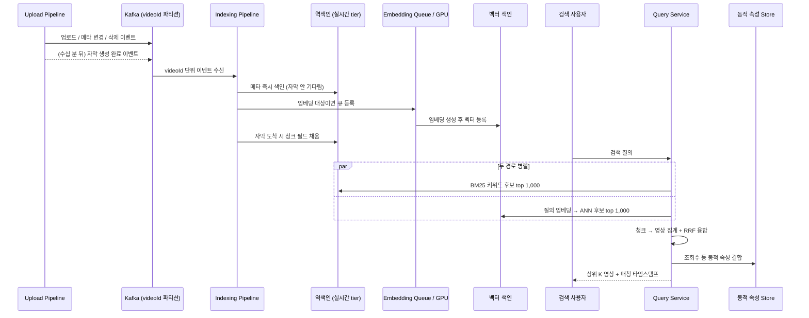
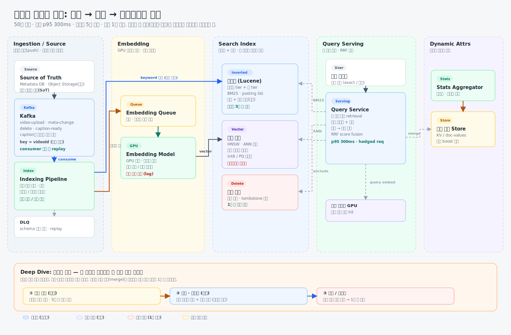
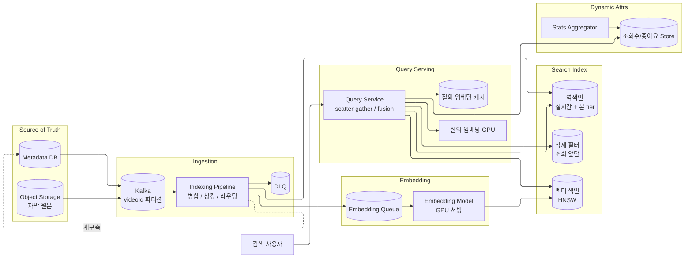

# Week 7 과제: 동영상 플랫폼 검색 시스템 설계 (수집 → 색인 → 하이브리드 검색)

## 0. 과제 개요

### 과제: 동영상 플랫폼 검색 시스템 설계

#### 시나리오

동영상 플랫폼에는 분당 수백 시간 분량의 영상이 업로드되고, 매초 수만 건의 검색 질의가 들어온다. 수십억 영상 중 관련 영상을 수백 ms 안에 찾아 반환해야 한다.

이 시스템은 서로 성격이 다른 두 종류의 질의를 모두 처리해야 한다.

- 정확히 일치해야 하는 질의: "침착맨", "뉴진스 Hype Boy". 채널명과 노래 제목은 한 글자도 틀리면 안 된다.
- 내용을 묘사하는 질의: "고양이가 박스에 뛰어드는 영상". 정답 영상 제목은 "우리집 냥이 일상 브이로그"인데, 질의의 어떤 단어도 제목에 없다.

영상은 본문이 없는 매체다. 검색에 쓸 데이터를 영상에서 뽑아내는 것부터가 설계의 일부이고, 한 가지 매칭 방식으로는 위 두 질의 유형을 모두 만족시킬 수 없다.

#### 시스템 구성 전제

- 영상 업로드/트랜스코딩 파이프라인은 이미 존재하며, 업로드 완료·메타데이터 변경·삭제 이벤트가 Kafka로 발행된다.
- 영상에서 텍스트를 추출하는 시스템(STT 자막, 프레임 캡셔닝 등)은 이미 존재한다. 추출 결과는 업로드 후 수 분~수십 분 지연되어 이벤트로 도착한다.
- 원본 메타데이터/자막의 source of truth는 별도 DB와 Object Storage에 있고, 검색 색인은 파생 데이터다.
- 역색인 엔진은 Lucene 계열(Elasticsearch/OpenSearch)을 사용할 수 있다.
- 벡터 색인은 HNSW, IVF 등 ANN 기반 엔진을 사용할 수 있다.
- 임베딩 모델은 자체 서빙(GPU)하며, 처리량 한계와 호출 비용이 있다.
- 조회수·좋아요 등 통계 값은 별도 집계 시스템이 산출하며, 검색 시스템은 이를 구독해 반영한다.
- 본 시스템은 후보 검색(retrieval)과 단순 fusion까지 다루며, 그 이후 정밀 랭킹은 다루지 않는다.

#### 규모 가정

| 항목 | 수치 |
|---|---:|
| 색인 대상 영상 수 | 50억 건 |
| 신규 업로드 | 분당 500시간 ≈ 일 400만 건 |
| 메타데이터 크기 | 영상당 평균 2KB |
| 자막 크기 | 영상당 평균 15KB (10분 기준) |
| 전체 자막 텍스트 | 약 75TB |
| 자막 청크 수 | 영상당 20개 → 전체 1,000억 청크 |
| 영상 단위 임베딩 | 50억 × 768d float32 ≈ 15TB |
| 청크 단위 임베딩(전부) | 1,000억 × 3KB ≈ 300TB |
| 신규 임베딩 생성 | 일 400만 영상 → 초당 약 50건 (청크면 ×20) |
| 검색 QPS | 평균 50,000 / 피크 200,000 |
| 질의당 후보 수 | 경로별 top 1,000 |
| 동적 속성 갱신 | 조회수 이벤트 초당 수십만 건 |

#### 시간/품질 목표

| 항목 | 목표 |
|---|---|
| 검색 응답 지연 | p95 300ms 이내 (end-to-end) |
| 후보 검색 지연 | 키워드/의미 경로 각각 p95 50ms 이내 |
| 업로드 → 검색 노출 | 메타데이터 기준 5분 이내 |
| 삭제/비공개 → 결과 제외 | 1분 이내 |
| 동적 속성 반영 | 수 분 이내 (정밀 실시간 불요) |
| 색인 가용성 | 갱신/재구축 중 무중단 서빙 |
| 확장성 | 영상 수 증가에 따라 샤드 수평 확장 |
| 데이터 정합성 | 색인은 파생 데이터, source of truth 기준 전체 재구축 가능 |

---

## 1. 문제 이해 및 설계 범위 확정

### 1-1. 설계 대상

이번 설계의 대상은 유튜브 같은 동영상 플랫폼의 검색 시스템이다. 사용자가 검색창에 입력하는 질의를 받아 관련 영상 목록을 상위 K개 반환하는 것이 목적이다.

핵심은 검색 품질 모델을 고도화하는 것이 아니라, **검색 인프라**를 설계하는 것이다. 즉 안정적으로 수집하고, 낮은 지연으로 후보를 찾고, 색인을 최신 상태로 유지하는 부분에 집중한다.

이 검색이 어려운 이유는 두 가지다. 첫째, 영상은 본문이 없어서 무엇을 색인할지부터 정해야 한다. 둘째, "침착맨"처럼 정확히 일치해야 하는 질의와 "고양이가 박스에 뛰어드는 영상"처럼 내용을 묘사하는 질의는 매칭 원리가 다르다. 전자는 단어가 그대로 색인에 있어야 하고, 후자는 단어가 하나도 겹치지 않아도 의미가 통해야 한다.

따라서 이 시스템은 단어 단위로 정확히 매칭하는 키워드 검색(역색인)과 의미 단위로 가깝게 매칭하는 시맨틱 검색(벡터)을 함께 두고, 두 결과를 하나로 합치는 하이브리드 검색 구조를 가진다.

한 가지 짚어 둘 점은 일반적인 웹 검색(Google)과의 차이다. 이 차이가 이 설계에서 크롤러가 사라지는 이유를 설명해 준다.

#### 웹 검색은 어떻게 동작하는가

구글 같은 웹 검색은 크게 세 단계로 움직인다. 크롤링으로 페이지를 발견하고, 색인에 정리해 담고, 질의가 오면 색인을 랭킹해 보여준다.

첫 단계인 웹 크롤링은 Googlebot 같은 자동화된 봇이 인터넷을 끊임없이 돌아다니며 페이지를 긁어오는 과정이다. 대략 다음 순서로 돈다.

1. 이미 아는 URL 목록(seed page)에서 출발한다.
2. 이 URL들을 크롤 큐(URL frontier)에 넣는다.
3. DNS로 도메인을 IP로 변환한다.
4. 페이지 콘텐츠를 내려받는다.
5. HTML을 파싱해 링크를 추출한다.
6. 중복 URL을 걸러낸다.
7. 새로 찾은 URL을 다시 크롤 큐에 넣는다.
8. 이 과정을 수십억 페이지에 걸쳐 반복한다.

이렇게 발견한 페이지의 텍스트, 제목, 링크 등을 분석해 검색 색인에 저장한다(색인). 거대한 도서관 카탈로그를 만드는 것과 같다. 사용자가 검색하면 구글은 인터넷을 실시간으로 훑는 게 아니라 이 색인을 조회하고, 관련성·콘텐츠 품질·외부 링크·신선도·맥락 신호 같은 수백 개의 신호로 순위를 매겨 보여준다(랭킹). 그래서 결과가 밀리초 안에 나온다.

#### 동영상 플랫폼은 무엇이 다른가

핵심 차이는 **콘텐츠를 누가 갖고 있느냐**다. 웹 검색은 콘텐츠가 남의 서버에 흩어져 있어, 봇이 직접 돌아다니며 발견하고 긁어와야(pull) 한다. 무엇이 어디에 새로 생겼는지 아무도 알려주지 않으니 크롤링·URL frontier·DNS·링크 추출이 검색의 출발점이 된다.

반면 동영상 플랫폼은 자사 콘텐츠를 이미 보유한다. 영상이 업로드·변경·삭제되는 순간 그 사실을 시스템이 정확히 알고, 이벤트로 발행한다(push). 그래서 페이지를 발견하는 크롤링 단계 자체가 통째로 사라지고, 그 자리를 업로드 이벤트 수집이 대신한다.

| 구분 | 웹 검색 (Google) | 동영상 플랫폼 검색 (이번 설계) |
|---|---|---|
| 발견 방식 | 크롤링 (pull) | 이벤트 수집 (push) |
| 출발점 | seed URL → URL frontier | Kafka 이벤트 스트림 |
| 콘텐츠 소유 | 외부 웹, 소유하지 않음 | 자사 보유, source of truth 존재 |
| 신선도 한계 | 봇이 다시 방문해야 갱신 인지 | 변경 즉시 이벤트로 인지 |
| 색인 대상 | 페이지 HTML 텍스트 | 메타데이터 + 자막 청크 + 임베딩 |
| 이번 설계 범위 | 크롤링~랭킹 전부 | 수집~후보 검색·융합 (정밀 랭킹 제외) |

색인하고(역색인), 빠르게 조회하고(retrieval), 최신 상태로 유지한다는 큰 골격은 웹 검색과 같다. 그러나 이 설계의 출발점은 URL frontier가 아니라 Kafka 이벤트 스트림이고, 크롤러는 등장하지 않는다. 또 랭킹 신호 고도화(PageRank류 외부 링크 분석 등)는 과제 범위 밖이라, 본 설계는 후보 검색과 단순 융합까지만 다룬다.

### 1-2. 설계 범위 (In / Out of Scope)

이번 설계는 "영상 데이터를 어떻게 두 색인으로 안정적으로 유지하고, 어긋난 두 색인 위에서 어떻게 빠르게 검색하는가"에 집중한다. 반대로 추출 모델 자체나 정밀 랭킹은 다루지 않는다.

| 포함 범위 (In Scope) | 제외 범위 (Out of Scope) |
|---|---|
| 영상에서 색인용 데이터 선택 (메타/자막/프레임) | 추출 모델(STT, 캡셔닝) 구현·학습 |
| 메타데이터·추출 데이터 수집 파이프라인 | 영상 업로드/트랜스코딩 파이프라인 |
| 색인 단위 설계 (영상 vs 청크) | 임베딩 모델 학습 |
| 키워드 색인 구축 및 샤딩 | 정밀 재랭킹 (LTR, cross-encoder) |
| 임베딩 생성 및 벡터 색인 | 검색 품질 평가 (nDCG, 평가셋) |
| 두 경로 결과의 융합 (하이브리드) | 개인화 / 추천 |
| 업로드 즉시 노출 (실시간 색인) | 자동완성, 오타 교정 |
| 조회수 등 동적 속성 갱신 | 어뷰징/저작권/제한 콘텐츠 필터 |
| 삭제/비공개 색인 반영 | 광고 시스템 |
| 쿼리 서빙 (분산 조회, 결과 병합) | |
| 장애 복구 및 색인 재구축 | |

### 1-3. 기능 요구사항

이 시스템은 "방금 올린 영상이 바로 검색되는가"와 "삭제한 영상이 곧바로 사라지는가"에 답할 수 있어야 한다. 이를 위해 다음 기능이 필요하다.

- 영상 업로드·변경·삭제 이벤트와 늦게 도착하는 자막 생성 이벤트를 수신해 색인한다.
- 키워드 매칭용 역색인과 의미 검색용 벡터 색인을 함께 유지한다.
- 키워드 후보와 의미 기반 후보를 하나의 결과로 융합한다.
- 업로드 후 수 분 내 검색 노출, 삭제 후 1분 내 결과 제외를 보장한다.
- 조회수·좋아요 변경을 전체 재색인 없이 검색에 반영한다.
- 상위 K개 영상 목록을 매칭 구간 타임스탬프와 함께 p95 300ms 내 반환한다.

### 1-4. 비기능 요구사항

검색이 되는 것만으로는 부족하다. 색인이 두 개라는 사실 때문에 둘의 정합성, 신선도, 재구축 기준이 명확해야 한다.

| 항목 | 설계 목표와 판단 |
|---|---|
| 응답 지연 | end-to-end p95 300ms. 두 경로를 병렬 실행하고 가장 느린 샤드(tail)를 hedging으로 제어한다 |
| 후보 지연 | 키워드/의미 각각 p95 50ms. 벡터 경로는 질의 임베딩 캐시와 ANN 탐색 범위로 통제한다 |
| 노출 신선도 | 메타데이터 기준 5분. 자막을 기다리지 않고 메타만으로 먼저 노출한다 |
| 삭제 신선도 | 1분. 색인 정리(merge)에 의존하지 않고 조회 앞단 삭제 필터로 즉시 제외한다 |
| 두 색인 정합성 | 역색인엔 있는데 벡터엔 아직 없는 상태를 허용하되, 그 사실을 검색 동작에 명시한다 |
| 동적 속성 | 텍스트 색인과 분리. 조회수는 외부 저장소에서 랭킹 시점에 결합한다 |
| 정합성/복구 | 색인은 파생 데이터. source of truth와 Kafka offset으로 전체 재구축 가능 |
| 확장성 | videoId 해시 샤딩으로 수평 확장 |

### 1-5. 데이터 해석

가장 먼저 봐야 할 숫자는 청크 수다. 영상 50억 건을 영상당 자막 20청크로 쪼개면 전체 1,000억 청크가 된다. 이걸 전부 임베딩하면 약 300TB에 GPU 비용도 같이 폭발한다. 반면 영상 단위로 하나씩만 임베딩하면 15TB로 줄지만, 10분 자막을 벡터 하나에 뭉치면 여러 주제가 평균돼 "고양이가 박스에 뛰어드는 영상" 같은 장면 묘사 질의에 잡히지 않는다.

따라서 이번 설계는 데이터를 중요도에 따라 나눈다.

- 메타데이터(제목·설명·태그): 50억 영상 전부, 키워드+벡터 모두 색인. 작고 신선도 SLA가 가장 빡빡하다.
- 자막 청크: 키워드는 전부 색인하되, 벡터 임베딩은 전부 하지 않고 조회수 상위 + 신규 영상만 우선한다.
- 롱테일 영상(조회수 거의 없음, 전체의 대부분): 자막 벡터 없이 키워드 경로로만 커버한다.

질의도 두 유형으로 나뉜다. exact형("아이유 밤편지")은 키워드 경로가 정답을 갖고 있고, 묘사형("잠 안 올 때 듣는 잔잔한 노래")은 의미 경로가 정답을 갖고 있다. 융합은 둘 중 어느 쪽이 정답을 가졌는지 모른다는 전제에서 출발한다.

### 1-6. 본인이 추가로 둔 가정

템플릿에 없는 세부 조건은 다음과 같이 가정했다. 이 가정들이 이후 색인 단위, 정합성, 신선도 정책을 결정하는 기준이 된다.

| 확인이 필요한 부분 | 이번 설계의 가정 | 이유 |
|---|---|---|
| 색인 단위 | 메타는 영상 단위, 자막은 청크 단위. 두 색인 모두 청크를 같은 단위로 쓴다 | 묘사형 질의는 장면 단위로 맞아야 잡힌다 |
| 청크 기준 | 화제 전환 + 고정 길이(약 30초) 하이브리드, 청크 간 약간 overlap | 문장 중간이 잘려 의미가 깨지는 걸 줄인다 |
| 파티션 키 | `videoId` 해시 | 같은 영상의 모든 이벤트(메타·자막·삭제)를 한 파티션에 모아 순서를 보존한다 |
| 임베딩 커버리지 | 메타 전부 + 자막은 조회수 상위/신규만. 롱테일은 키워드 only | 1,000억 청크 전부 임베딩은 비용이 비현실적이다 |
| 두 색인 불일치 | 역색인 등록을 먼저, 벡터는 뒤따른다. 그 사이 키워드 only로 노출 | 임베딩 GPU 지연 때문에 동시 등록은 불가능하다 |
| 융합 방식 | 점수 직접 합산이 아니라 RRF(순위 기반 융합) | BM25와 코사인 유사도는 스케일이 달라 그냥 더할 수 없다 |
| 동적 속성 | 텍스트 색인과 분리, 랭킹 시점 결합 | 조회수 변경마다 재색인하면 색인이 통계 갱신만 하다 끝난다 |
| 삭제 처리 | tombstone + 조회 앞단 삭제 필터(빠른 집합) | merge를 기다리면 1분 SLA를 못 지킨다 |

---

## 2. 개략적 설계안 제시 및 동의 구하기

### 2-1. 설계 원칙

동영상 검색 인프라에서 가장 조심해야 할 지점은 **색인이 두 개이고, 둘은 항상 어긋나 있는 게 기본값**이라는 것이다.

- 텍스트 색인 등록은 ms 단위인데 임베딩 생성은 GPU 처리량에 묶여 수십 초가 걸린다. 따라서 "두 색인이 완벽히 일치한 상태"를 노린 설계는 현실에서 깨진다. 대신 불일치를 허용하되 검색 동작이 그 사실을 안전하게 다루도록 만든다.
- 검색 속도와 색인 갱신 속도는 충돌한다. 빠른 검색을 위해 꽉 눌러 담은 색인은 한 건 끼워 넣기에 불리하다. 그래서 작고 빠른 실시간 tier와 크고 최적화된 본 tier를 분리한다.
- 동적 속성(조회수)과 텍스트는 변하는 속도가 완전히 다르다. 둘을 한 문서에 묶으면 색인이 통계 갱신만 하다 끝난다. 분리한다.
- 색인은 파생 데이터다. 깨지면 source of truth에서 다시 만든다. 색인 자체를 원본처럼 지키려 하지 않는다.

### 2-2. 핵심 흐름

1. 업로드/변경/삭제 이벤트가 Kafka로 들어온다. 자막 생성 완료 이벤트는 수십 분 뒤 같은 `videoId`로 도착한다.
2. Indexing Pipeline은 `videoId` 기준으로 이벤트를 모아, 메타데이터가 도착하면 자막을 기다리지 않고 먼저 색인한다.
3. 키워드 경로는 역색인(실시간 tier)에 즉시 등록한다. 벡터 경로는 임베딩 큐로 보내 GPU 처리 후 벡터 색인에 등록한다.
4. 자막이 도착하면 청크로 쪼개 역색인에 자막 필드를 채우고, 임베딩 대상(조회수 상위/신규)이면 청크 벡터를 생성한다.
5. 질의가 들어오면 Query Service가 두 경로를 병렬로 띄운다. 키워드 경로는 BM25, 의미 경로는 질의를 임베딩해 ANN 탐색한다.
6. 두 경로의 청크 후보를 영상 단위로 집계하고, RRF로 융합한 뒤 상위 K개 영상을 만든다.
7. 조회수 등 동적 속성은 텍스트 색인이 아니라 별도 저장소에서 랭킹 시점에 결합한다.
8. 삭제/비공개 영상은 조회 앞단의 삭제 필터로 즉시 제외하고, 색인 본체는 나중에 merge로 정리한다.
9. 색인이 손상되면 Kafka offset과 source of truth(DB/Object Storage)에서 해당 샤드를 재구축한다.

### 2-3. 수집과 검색 흐름



### 2-4. 개략적 아키텍처 다이어그램





### 2-5. 주요 컴포넌트 역할

| 컴포넌트 | 역할 |
|---|---|
| Kafka | `videoId` 파티션으로 영상별 이벤트 순서 보존, consumer 장애 시 replay 기준 |
| Indexing Pipeline | 메타·자막 병합, 청킹, 키워드/임베딩 경로 라우팅 |
| 역색인 | BM25 키워드 매칭. 실시간 tier(신규)와 본 tier(전체) 분리 |
| Embedding Queue / GPU | 임베딩 대상 청크를 GPU 처리량에 맞춰 비동기 생성 |
| 벡터 색인 | HNSW 기반 ANN 의미 검색 |
| 삭제 필터 | merge 전에도 삭제/비공개 영상을 조회 앞단에서 즉시 제외 |
| 동적 속성 Store | 조회수·좋아요를 텍스트 색인과 분리 저장, 랭킹 시 결합 |
| Query Service | 두 경로 병렬 조회, 청크→영상 집계, RRF 융합, tail latency 제어 |

---

## 3. 상세 설계

선택 질문은 **`3-5. 업로드 즉시 노출: 실시간 색인 구조` 한 가지**를 중심으로 하되, 이와 떼어 놓을 수 없는 `3-1. 수집(늦게 오는 자막 합치기)`과 `3-6. 동적 속성·삭제`를 함께 다룬다. 동영상 검색 인프라에서 가장 어려운 지점은 검색 품질이 아니라, **상태가 계속 변하고 두 색인이 항상 어긋나 있는 색인을, 무중단으로 최신 상태로 유지하는 것**이기 때문이다.

### 3-1. 백엔드 인프라 엔지니어로서 가장 신경 쓴 지점

가장 신경 쓴 지점은 **"한 영상의 데이터가 한 번에 오지 않는다"는 사실을 색인 노출 SLA와 어떻게 화해시키는가**다.

메타데이터는 업로드 즉시 도착하지만 자막은 STT를 거쳐 수십 분 뒤에 온다. 임베딩은 거기서 또 GPU 처리량에 묶인다. 즉 한 영상에 대해 (1) 메타 키워드 색인, (2) 메타 벡터 색인, (3) 자막 키워드 색인, (4) 자막 벡터 색인이 서로 다른 시점에 완성된다. 이 네 상태가 동시에 맞춰지길 기다리면 "5분 내 노출" SLA가 깨진다.

그래서 이 설계는 **완성도를 기다리지 않고 단계적으로 노출**하는 쪽을 선택한다. 메타가 오면 그것만으로 먼저 검색에 노출하고, 자막과 벡터는 준비되는 대로 같은 문서를 갱신한다. 검색 결과는 "지금 이 영상이 어느 단계까지 색인됐는지"를 알고 동작한다.

### 3-2. 색인 단위와 두 색인 구조

검색의 문서 단위는 두 종류로 나눈다.

| 데이터 | 색인 단위 | 키워드(역색인) | 의미(벡터) |
|---|---|---|---|
| 제목·설명·태그 | 영상 단위 | 영상 문서의 필드 | 영상당 벡터 1개 (전부) |
| 자막 | 청크 단위(약 30초) | 영상 문서의 자막 청크 필드 | 청크당 벡터 1개 (선별) |

자막을 청크로 쪼개는 이유는 명확하다. 10분 자막을 벡터 하나로 뭉치면 여러 주제가 평균돼 장면 묘사 질의에 안 잡힌다. 그렇다고 전부 청크 임베딩하면 1,000억 건(300TB)이다. 그래서 **키워드 색인은 전 청크, 벡터 색인은 선별 청크**로 비대칭을 둔다.

- 청크 기준: 화제 전환 지점 + 고정 길이(약 30초) 하이브리드로 자르고, 청크 간 약간 overlap을 둬 경계에서 의미가 잘리는 걸 줄인다.
- 매칭 가중치: 제목/태그 매칭은 자막 청크 매칭보다 가중치를 높게 둔다. exact형 질의가 자막의 우연한 단어 매칭에 밀리지 않게 하기 위함이다.
- 장면 점프: 각 청크에 `startTime`, `endTime`을 색인해, 결과에 "그 장면으로 점프" 타임스탬프를 함께 반환한다.

### 3-3. 실시간 색인 구조: 두 tier 분리

빠른 검색을 위해 꽉 눌러 담은 색인은 한 건씩 끼워 넣기에 불리하다. 그래서 색인을 두 tier로 나눈다.

| tier | 대상 | 특성 | 갱신 방식 |
|---|---|---|---|
| 실시간 tier | 최근 N시간 업로드 | 작음, 메모리 상주, 잦은 갱신 | 새 segment를 계속 추가, 짧은 refresh 주기 |
| 본 tier | 전체 50억 | 큼, 최적화된 구조 | 백그라운드 merge로 큰 segment 통합 |

- 질의는 두 tier를 항상 함께 조회하고 결과를 병합한다. 영상은 일정 시간이 지나면 실시간 tier에서 본 tier로 넘어가는데, 이때 `videoId` 기준 dedup으로 중복 노출을 막는다.
- 새 문서는 작은 segment로 계속 추가되고 백그라운드에서 큰 segment로 merge된다. merge는 I/O를 많이 쓰므로 검색 지연에 영향을 준다. 따라서 merge는 우선순위를 낮춰 돌리고, 실시간 tier는 segment 수를 제한해 조회 fan-out을 통제한다.
- 임베딩이 수십 초 걸리는 동안 영상을 놀려 두지 않는다. **메타 키워드 색인은 즉시**, 벡터는 뒤따라 붙인다. 그 사이 영상은 키워드 경로로만 검색된다.

### 3-4. 두 색인의 불일치를 다루는 법

핵심 결정은 **불일치를 막지 않고 허용하되, 검색이 그 사실을 알고 동작하게** 만드는 것이다.

- 역색인엔 등록됐지만 벡터엔 아직 없는 영상이 정상적으로 존재한다. 이 영상은 의미 경로 후보로는 안 잡히지만 키워드 경로로는 잡힌다. 즉 묘사형 질의에서만 일시적으로 누락될 수 있다.
- 색인 파이프라인은 영상별로 `keyword_indexed`, `vector_indexed` 상태 플래그를 둔다. 모니터링은 두 플래그의 lag을 추적해 임베딩 큐가 밀리는지 본다.
- 임베딩 큐가 유입 속도를 못 따라가면, 신규·조회수 상위 영상의 임베딩을 우선 처리하고 롱테일은 키워드 only로 남긴다. 비기능 목표인 "임베딩 생성이 유입 속도를 따라갈 것"은 전 영상이 아니라 선별 대상 기준으로 만족시킨다.

### 3-5. 동적 속성 갱신과 삭제 처리

#### 동적 속성 (조회수·좋아요)

텍스트는 거의 안 변하는데 조회수는 초당 수십만 건씩 변한다. 변할 때마다 재색인하면 색인 시스템이 통계 갱신만 하다 끝난다. 그래서 **텍스트 색인과 동적 속성을 분리**한다.

- 조회수·좋아요는 별도 KV/doc-values 형태 저장소에 두고, Stats Aggregator가 구독해 수 분 주기로 갱신한다.
- 결합 시점은 두 가지다. 결과에 표시만 할 때는 후보를 다 고른 뒤 붙인다. 순위에 반영할 때는 후보를 고르는 시점에 필요하므로, 인기도 점수를 색인 내 정렬 가능한 필드(doc-values)로 함께 들고 있다가 retrieval 단계에서 가벼운 boost로 쓴다.
- 정밀 실시간이 아니어도 되므로(목표: 수 분), 초당 수십만 이벤트는 집계 단계에서 묶어 반영한다.

#### 삭제 / 비공개

삭제는 보통 그 자리에서 지우지 않고 "삭제됨" 표시(tombstone)만 했다가 나중에 merge로 정리한다. 문제는 정리 전까지 비공개 영상이 검색에 남는다는 점이고, 1분 SLA를 merge에 맡길 수는 없다.

- 삭제/비공개 이벤트가 오면 `videoId`를 **조회 앞단 삭제 필터**(빠른 집합, 예: 최근 삭제 ID set/블룸 필터)에 즉시 등록한다.
- 모든 질의 결과는 이 필터를 통과시켜, 색인 본체에 아직 남아 있어도 결과에서 제외한다. 이러면 색인 merge와 무관하게 1분 내 제외가 보장된다.
- 색인 본체의 tombstone은 백그라운드 merge가 실제로 정리하고, 정리되면 삭제 필터에서도 해당 ID를 비운다.

### 3-6. 쿼리 서빙과 융합

#### 지연 예산 배분 (p95 300ms)

| 단계 | 예산 |
|---|---:|
| 질의 분석 + 임베딩 생성 | ~40ms (캐시 hit 시 ~1ms) |
| 키워드 retrieval (scatter-gather) | ~50ms |
| 의미 retrieval (ANN, scatter-gather) | ~50ms |
| 청크→영상 집계 + RRF 융합 | ~30ms |
| 동적 속성 결합 + 결과 구성 | ~30ms |
| 여유 (네트워크/직렬화/tail) | 나머지 |

- 질의 임베딩 GPU 호출이 의미 경로의 병목이다. 인기 질의는 **질의 임베딩 캐시**로 GPU 호출 자체를 건너뛴다.
- 색인이 수십 샤드로 나뉘어 한 질의가 두 경로 × 수십 샤드로 흩어진다. 가장 느린 샤드가 전체 지연을 결정하므로(tail latency), **hedged request**(일정 시간 내 응답 없는 샤드에 복제 요청)로 완화한다.
- 인기 질의(컴백·사건 직후 폭증)는 결과 캐시로 받는다. 단, 동적 속성과 삭제 필터는 캐시 뒤에서 다시 적용해 stale을 줄인다.

#### Score Fusion

BM25 점수와 코사인 유사도는 스케일이 전혀 다르다. 그냥 더하면 한쪽이 압도한다. 그래서 **RRF(Reciprocal Rank Fusion)**를 쓴다. 각 경로에서의 순위만으로 융합하므로 점수 스케일에 영향받지 않는다.

```text
RRF_score(video) =
  Σ over 경로 p:  1 / (k + rank_p(video))     # k는 상수 (예: 60)
```

- 청크 단위로 검색하면 같은 영상의 청크 여러 개가 후보로 돌아온다. 영상 단위로 집계할 때는 **그 영상의 최고 점수 청크**를 대표로 잡고(max-pooling), 매칭 타임스탬프는 그 청크의 구간을 쓴다.
- 질의 유형에 따라 가중을 바꾼다. exact형(채널명·곡명)으로 판단되면 키워드 경로 가중을 높여, "아이유 밤편지"에서 비슷한 발라드 영상이 정답을 밀어내지 못하게 한다. 반대로 키워드 후보가 빈약한 묘사형 질의는 의미 경로 비중을 높인다.
- 한쪽 경로가 장애면 다른 경로 결과만으로 응답한다(graceful degradation). 의미 경로가 죽으면 키워드 결과만, 키워드 경로가 죽으면 의미 결과만 반환하고, 결과에 부분 결과임을 표시한다.

### 3-7. 샤딩과 장애 복구

- 샤딩 키는 `videoId` 해시다. 업로드 시각 기반은 신규 영상에 쓰기가 몰리는 hotspot을 만들고, 인기도 tier 기반은 조회수가 변할 때 재배치가 필요하다. videoId 해시는 쓰기·조회를 고르게 분산한다.
- 벡터 색인은 HNSW를 쓴다. IVF보다 메모리를 더 쓰지만 재현율 대비 지연이 안정적이다. 단 메모리 상주 요구가 크므로, 선별 임베딩으로 벡터 수 자체를 줄이고 양자화(float32 → int8/PQ)로 저장량을 1/4~1/30로 낮춘다.
- 색인은 파생 데이터다. 샤드가 손상되면 **source of truth(Metadata DB + Object Storage 자막)에서 해당 샤드만 재구축**한다. Kafka offset replay로 재구축 이후 도착한 변경분을 따라잡는다.
- 재구축 중에도 무중단 서빙을 위해, 재구축은 새 샤드 replica에서 수행하고 완성되면 교체한다.

---

## 4. 설계 장점

- 메타·자막·임베딩의 도착 시점이 달라도 단계적 노출로 5분 노출 SLA를 지킨다. 완성을 기다리지 않는다.
- 키워드는 전 청크, 벡터는 선별 청크의 비대칭 색인으로 300TB 임베딩 비용을 현실적인 수준으로 낮춘다.
- 두 색인의 불일치를 막는 대신 허용하고, 상태 플래그로 추적해 묘사형 질의의 일시 누락만 감수한다.
- 삭제를 조회 앞단 필터로 처리해, 느린 merge와 무관하게 1분 제외 SLA를 보장한다.
- 동적 속성을 텍스트 색인과 분리해 초당 수십만 조회수 갱신이 색인을 마비시키지 않는다.
- RRF 융합으로 스케일이 다른 두 점수를 안전하게 합치고, 질의 유형별 가중으로 exact/묘사 질의를 모두 만족시킨다.
- 색인을 파생 데이터로 두어 손상 시 source of truth에서 샤드 단위 재구축이 가능하다.

---

## 5. 설계 단점

- 단계적 노출은 "방금 올린 영상이 묘사형 검색에는 아직 안 잡히는" 일시적 불일치를 만든다. 사용자에겐 부분적으로 "검색이 덜 된" 상태로 보일 수 있다.
- 두 tier + 삭제 필터 + 동적 속성 분리로 조회 경로 구성 요소가 늘어, 운영·모니터링 복잡도가 높다.
- 선별 임베딩은 롱테일 영상의 시맨틱 검색 커버리지를 포기한 결과다. 조회수 낮은 영상은 묘사형 질의에서 구조적으로 불리하다.
- HNSW는 메모리 상주 요구가 커서, 벡터 수가 늘면 양자화에도 불구하고 비용이 빠르게 증가한다.
- RRF는 스케일 문제는 해결하지만 순위 정보만 쓰기 때문에, 점수 차이가 큰 "확실한 1등"과 "근소한 1등"을 같게 취급한다. 정밀 랭킹은 범위 밖이라 이 손실은 후단 재랭킹에 맡긴다.
- 질의 임베딩 캐시·hedged request로 tail을 줄여도, GPU 임베딩이 캐시 miss로 몰리는 신규 묘사형 질의 폭증 시에는 의미 경로가 여전히 병목이 될 수 있다.
